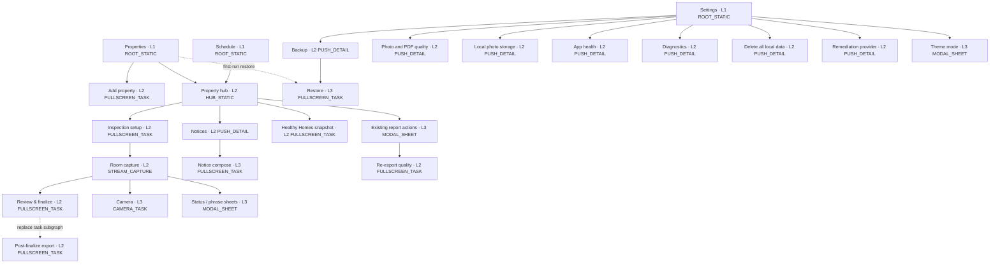
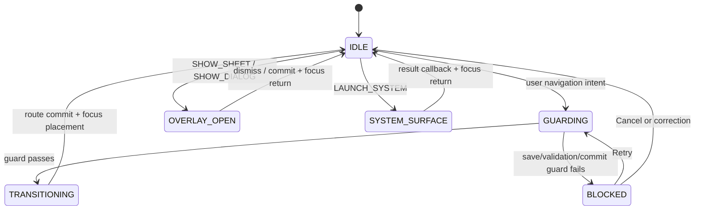

# Design System Truth Source — MyInspection Field Ledger

## Overview

MyInspection is a **field instrument, not an office dashboard**. Its primary user is a New Zealand landlord or property operator walking through a home with one hand occupied, variable light, intermittent connectivity, and limited time. The interface is calm, exact, and trustworthy enough to support evidence that is later printed or reviewed in a dispute.

Implementation coverage is indexed in [`docs/UI-UX-ELEMENTS.md`](../docs/UI-UX-ELEMENTS.md). This file remains the only normative source for tokens, component states, behaviour, accessibility, and motion; the index must never override it.

The visual direction is **Field Ledger**: the clarity of a paper inspection sheet combined with the immediacy of a camera viewfinder. Cool mineral surfaces, deep fern green, measured amber, compact metadata, and firm rectangular controls make the app feel durable without becoming industrial or severe.

The signature device is the **evidence rail**. Inspection item cards carry a narrow leading rail whose segments encode status, photo, and note completeness. The same visual grammar appears in room progress and the camera capture sequence. It is functional navigation, never decoration, and must always pair color with an icon or label.

This document describes the target production UI for `T2-CAPTURE-UI` and later UI cards. The current `skeleton` package is a disposable end-to-end proof and is not a visual precedent.

## Experience principles

1. **Resume before recall.** The app remembers the active property, inspection, room, item expansion, and list position. Returning to field work must not require reconstructing context from memory.
2. **Evidence before decoration.** The decision-driving facts are current status, missing evidence, prior evidence, and save state. They outrank branding, illustration, and generic dashboard metrics.
3. **One physical action at a time.** Each capture surface has one dominant next action. Secondary detail is progressively disclosed after `Needs attention` or an explicit request.
4. **Local is the normal state.** Offline is not an error banner. Only an operation that genuinely needs a provider or network explains that dependency at the point of use.
5. **Reversible until evidence is sealed.** Draft edits, inserted phrases, and temporary captures are easy to undo. Finalize, contact clearing, and local-byte removal use explicit review and confirmation.

## Information architecture

Compact phones use three labelled top-level destinations: **Properties**, **Schedule**, and **Settings**. `Properties` is the start destination. There is no Dashboard tab, Reports tab, navigation drawer, or hamburger menu.

### Page contract metadata

Every navigable surface declares one record. Undeclared routes fail navigation-contract tests.

```json
{
  "pageId": "PROPERTY_HUB",
  "route": "properties/{propertyId}",
  "level": 2,
  "pageType": "HUB_STATIC",
  "shell": "FieldLedgerAppShell",
  "parentPageId": "PROPERTIES_ROOT",
  "ownerTask": "T2-CAPTURE-UI",
  "topAppBar": "HUB",
  "bottomNav": "VISIBLE",
  "restorePolicy": "RESTORE_STACK_AND_SCROLL",
  "entryFocusKey": "page:property-hub:title"
}
```

```kotlin
enum class PageType {
    ROOT_STATIC,
    HUB_STATIC,
    PUSH_DETAIL,
    STREAM_CAPTURE,
    FULLSCREEN_TASK,
    CAMERA_TASK,
    MODAL_SHEET,
    ALERT_DIALOG,
    MODAL_DIALOG,
    SYSTEM_SURFACE
}

enum class NavigationOperation { PUSH, POP, REPLACE, RESET, SHOW_SHEET, SHOW_DIALOG, LAUNCH_SYSTEM }
enum class BottomNavVisibility { VISIBLE, HIDDEN }
```

### Global sitemap



### Page inventory

| Level | `pageId` | Route | Page type | Parent | Bottom nav | Owner |
| ---: | --- | --- | --- | --- | --- | --- |
| 1 | `PROPERTIES_ROOT` | `properties` | `ROOT_STATIC` | — | Visible | `T2-CAPTURE-UI` |
| 1 | `SCHEDULE_ROOT` | `schedule` | `ROOT_STATIC` | — | Visible | `T4-SCHEDULE` |
| 1 | `SETTINGS_ROOT` | `settings` | `ROOT_STATIC` | — | Visible | Shared settings shell |
| 2 | `PROPERTY_CREATE` | `properties/new` | `FULLSCREEN_TASK` | `PROPERTIES_ROOT` | Hidden | `T2-CAPTURE-UI` |
| 2 | `PROPERTY_HUB` | `properties/{propertyId}` | `HUB_STATIC` | `PROPERTIES_ROOT` | Visible | `T2-CAPTURE-UI` |
| 2 | `INSPECTION_SETUP` | `properties/{propertyId}/inspection/new` | `FULLSCREEN_TASK` | `PROPERTY_HUB` | Hidden | `T2-CAPTURE-UI` |
| 2 | `INSPECTION_CAPTURE` | `inspections/{inspectionId}/capture` | `STREAM_CAPTURE` | `PROPERTY_HUB` | Hidden | `T2-CAPTURE-UI` |
| 2 | `INSPECTION_REVIEW` | `inspections/{inspectionId}/review` | `FULLSCREEN_TASK` | `INSPECTION_CAPTURE` | Hidden | `T2-CAPTURE-UI` / `T3-FINALIZE` |
| 2 | `REPORT_EXPORT` | `inspections/{inspectionId}/export` | `FULLSCREEN_TASK` | `PROPERTY_HUB` | Hidden | `T3-PDF-RENDERER` |
| 2 | `REPORT_REEXPORT` | `inspections/{inspectionId}/re-export` | `FULLSCREEN_TASK` | `PROPERTY_HUB` | Hidden | `T3-PDF-RENDERER` |
| 2 | `NOTICE_CENTER` | `properties/{propertyId}/notices` | `PUSH_DETAIL` | `PROPERTY_HUB` | Hidden | `T4-NOTICES` |
| 3 | `NOTICE_COMPOSE` | `inspections/{inspectionId}/notice/new` | `FULLSCREEN_TASK` | `NOTICE_CENTER` | Hidden | `T4-NOTICES` |
| 2 | `HHC_CAPTURE` | `properties/{propertyId}/healthy-homes` | `FULLSCREEN_TASK` | `PROPERTY_HUB` | Hidden | `T6-HHC` |
| 2 | `BACKUP_SETTINGS` | `settings/backup` | `PUSH_DETAIL` | `SETTINGS_ROOT` | Hidden | `T5-BACKUP-IO` |
| 3 | `RESTORE_TASK` | `settings/backup/restore` | `FULLSCREEN_TASK` | `BACKUP_SETTINGS` | Hidden | `T5-BACKUP-IO` |
| 2 | `QUALITY_SETTINGS` | `settings/quality` | `PUSH_DETAIL` | `SETTINGS_ROOT` | Hidden | `T2-PHOTO-QUALITY-PROFILES` / `T3-PDF-RENDERER` |
| 2 | `LOCAL_MEDIA_SETTINGS` | `settings/local-media` | `PUSH_DETAIL` | `SETTINGS_ROOT` | Hidden | `T5-LOCAL-MEDIA-RETENTION` |
| 2 | `HEALTH_STATUS` | `settings/health` | `PUSH_DETAIL` | `SETTINGS_ROOT` | Hidden | `T7-LOCAL-HEALTH-RELEASE` |
| 2 | `DIAGNOSTIC_EXPORT` | `settings/diagnostics` | `PUSH_DETAIL` | `SETTINGS_ROOT` | Hidden | `T5-DIAGNOSTIC-EXPORT` |
| 2 | `LOCAL_DATA_ERASURE` | `settings/delete-all-data` | `FULLSCREEN_TASK` | `SETTINGS_ROOT` | Hidden | `T5-LOCAL-DATA-ERASURE` |
| 2 | `REMEDIATION_SETTINGS` | `settings/remediation` | `PUSH_DETAIL` | `SETTINGS_ROOT` | Hidden | `T7-REMEDIATION` |
| 3 | `CAMERA_CAPTURE` | `inspections/{inspectionId}/camera/{targetType}/{targetId}` | `CAMERA_TASK` | `INSPECTION_CAPTURE` | Hidden | `T2-CAPTURE-UI` |
| 3 | `CAMERA_REVIEW` | `inspections/{inspectionId}/camera-review/{tempAssetId}` | `CAMERA_TASK` | `CAMERA_CAPTURE` | Hidden | `T2-CAPTURE-UI` |

The page inventory is exhaustive for route-backed surfaces. The overlay/system-surface registry below is exhaustive for non-route surfaces.

Existing finalized inspections do not open an in-app report viewer. Selecting one opens `REPORT_ACTION_SHEET`, which exposes Open PDF through the system viewer, Share, and Export another quality. This preserves the explicit v1 exclusion of a read-only history/report viewer.

### Page type contract

| Page type | Container | Navigation model | Persistent state | Exit rule |
| --- | --- | --- | --- | --- |
| `ROOT_STATIC` | `FieldLedgerAppShell` | Top-level tab root | Restore scroll/filter per tab | Back exits app |
| `HUB_STATIC` | `FieldLedgerAppShell` | Push inside Properties stack | Restore property, scroll, expanded summary | Back Pops to Properties root |
| `PUSH_DETAIL` | `FieldLedgerDetailScaffold` | Push from parent | Restore scroll and selected row | Back Pops to parent |
| `STREAM_CAPTURE` | `InspectionCaptureScaffold` | Focused task inside Properties stack | Persist draft + route/room/item/scroll/focus | Save barrier then Pop to Property hub |
| `FULLSCREEN_TASK` | `FieldLedgerTaskScaffold` | Task subgraph | Persist step and task payload | Complete Replaces parent state; Cancel follows dirty-state table |
| `CAMERA_TASK` | `CameraCaptureScaffold` | Edge-to-edge task subgraph | Persist temp asset ID only | Use Photo Pops to Capture; discard returns Preview; Close Pops to Capture |
| `MODAL_SHEET` | `FieldLedgerModalSheet` | Overlay, not back-stack destination | Persist committed selection only | Dismiss matrix controls Back/drag/scrim/Close |
| `ALERT_DIALOG` | `FieldLedgerAlertDialog` | Blocking overlay | No route state | Cancel returns trigger; Confirm executes one named command |
| `MODAL_DIALOG` | Component-owned full-screen dialog | Overlay, not back-stack destination | Persist selected asset and viewport state | Close returns to the exact source control |
| `SYSTEM_SURFACE` | Android-owned | External activity/dialog | Persist launch request ID | Result callback returns to stored focus key |

The property hub is the operational home for one property. Its primary card is `Continue inspection` when a draft exists and `Start inspection` otherwise. Due date, last finalized inspection, last verified backup, notices, and compliance blockers remain supporting facts on the same page.

App launch never enters Capture or Camera automatically. A draft appears through `Continue inspection`. Notification deep links construct the minimal declared parent stack and never land on a generic page. A deep link with an unknown entity ID resets to the owning top-level root, shows one persistent `Content unavailable` banner with Retry, and focuses that banner.

### Core screen composition contract

These rules remove page-level interpretation from implementation. Cards group one decision or one evidence unit; they are not decorative wrappers around every row.

| Screen | First viewport priority | Main content | Persistent action | Empty / exceptional state |
| --- | --- | --- | --- | --- |
| `PROPERTIES_ROOT` | `Properties` heading, then an active draft when one exists | Non-clickable `property-summary-card` surfaces sorted active draft → due date → address; each shows address, property type, next-inspection fact, last finalized date, and one result action | `Add property` remains visible without overflow | `No properties yet` explains that a property is required before an inspection and exposes `Add property`; its route and owner task must be declared before this state can ship |
| `PROPERTY_CREATE` | `Add property` heading and address | One scrolling form in decision order: address → occupancy → boarding-house status | Bottom CTA is `Save property` | Validation stays inline; Cancel returns to the originating Add property action without creating a partial property |
| `PROPERTY_HUB` | Address, compliance block if present, then exactly one `Start inspection` or `Continue inspection` hero | One compact facts group for due inspection, last finalized inspection, last verified backup, and notice status; history is a dated list, not dashboard metrics | `Continue inspection` or `Start inspection` | Missing tenancy or baseline is explained beside the affected inspection type; no generic empty illustration |
| `INSPECTION_SETUP` | Inspection type and date/time | One scrolling form in decision order: type → tenancy/baseline → date/time → template; conditional fields appear directly after their cause | Bottom CTA uses `Start inspection` and remains above IME/system insets | Core compliance failures show the entered value and valid correction inline; an unavailable tenancy-creation path is a blocking task-graph gap, never a fake selector value |
| `INSPECTION_CAPTURE` | Property/room identity, exact missing evidence, room navigation | Room panorama, safe bulk action, then the item stream | Dock shows only `Next room`, `Review {N} missing items`, or `Review inspection` | Save, permission, media, and restoration failures preserve the current room/item and expose one recovery action |
| `INSPECTION_REVIEW` | Decision fact: `{complete} of {total} items complete` | Missing state groups by room; each row names item, exact missing evidence, and `Fix`; when complete, show evidence totals and the permanence handoff | `Review {N} missing items` until complete; then `Finish inspection` | No disabled `Finish inspection` button and no undifferentiated error list; selecting a row returns to and focuses the exact control |

Property cards never combine a clickable card surface with nested buttons. The surface is structural; one labelled full-width `Open property` action owns navigation. Search/filter stays absent until the active property count exceeds eight, avoiding permanent chrome for a small self-use list.

Setup never exposes raw IDs, enum names, or an empty dropdown. Dates use the device locale with the full month name at widths `≥320dp` and abbreviated month name below `320dp`; timestamps and UUIDs are never user-facing. A conditional section keeps its prior valid value while temporarily hidden; core validation alone determines whether that value is submitted.

## Navigation bars and containers

### Top app bar contract

All app-bar titles are start-aligned. v1 has no centered-title variant, Home icon, hamburger icon, or persistent Save action. Autosave state is rendered by `SaveStateIndicator`; it is never represented as a toolbar button.

| Page type | Bar | Leading action | Title | Trailing actions | Primary action placement |
| --- | --- | --- | --- | --- | --- |
| `ROOT_STATIC` | `FieldLedgerTopAppBar` | None | Destination label | Maximum two contextual actions | In content or bottom dock |
| `HUB_STATIC` | `FieldLedgerTopAppBar` | Back | Property short address | One direct action plus overflow | Primary property card |
| `PUSH_DETAIL` | `FieldLedgerTopAppBar` | Back | Page label | One direct action plus overflow | In content |
| `STREAM_CAPTURE` | `FieldLedgerTopAppBar` | Back, accessible label `Save and exit` | Current room | Overflow only | `CaptureActionDock` |
| `FULLSCREEN_TASK` | `FieldLedgerTaskTopAppBar` | Cancel | Task label | None | `FieldLedgerBottomActionDock` |
| `CAMERA_TASK` | No app bar | Overlay Close | None | Flash only during preview | Camera control region |
| `MODAL_SHEET` | Sheet header | Close | Sheet label | None | Sheet content or fixed footer |
| `ALERT_DIALOG` | No app bar | None | Start-aligned dialog title | None | Dialog action row |
| `MODAL_DIALOG` | Dialog header | Close | Content label | Contextual action only | Dialog content |
| `SYSTEM_SURFACE` | Android-owned | Android-owned | Provider/picker label | Android-owned | Android-owned |

Toolbar commands follow these fixed rules:

1. Back performs one `POP` after the page exit guard succeeds.
2. Cancel performs `SHOW_DIALOG(DISCARD_CHANGES)` when the task is dirty; otherwise it performs one `POP`.
3. Overflow exists only when two or more secondary commands exist.
4. A destructive command never appears as the direct trailing action. It lives in overflow and requires `FieldLedgerAlertDialog` confirmation.
5. A bar exposes no more than two trailing icons. Every icon has a visible tooltip and an accessibility label using verb + object.

### Bottom navigation and independent stacks

The app owns exactly three independent stacks. Switching destinations never pushes a tab onto another tab's stack.

```kotlin
enum class TopLevelDestination(val rootPageId: PageId) {
    PROPERTIES(PageId.PROPERTIES_ROOT),
    SCHEDULE(PageId.SCHEDULE_ROOT),
    SETTINGS(PageId.SETTINGS_ROOT)
}

data class AppNavigationState(
    val selectedDestination: TopLevelDestination,
    val propertiesStack: List<RouteEntry>,
    val scheduleStack: List<RouteEntry>,
    val settingsStack: List<RouteEntry>,
    val overlay: OverlayEntry?,
    val pendingSystemRequest: SystemRequest?
)
```

| Event | Deterministic result |
| --- | --- |
| Select inactive destination | Save current stack and page state; restore selected destination's last stack and focus |
| Select active destination at its root | Keep route; scroll primary container to top; focus page heading |
| Select active `Properties` while `PROPERTY_HUB` is top | Pop to `PROPERTIES_ROOT`; retain property list filter and scroll |
| Select active destination on any deeper route | Pop to that destination's root |
| System Back at a root | Exit app; never reveal a previously selected tab |
| Process recreation | Restore selected destination and all three stacks; remove invalid entries from the first invalid entry onward |

Bottom navigation is visible only on `ROOT_STATIC` and `HUB_STATIC`. It is hidden before the transition into every other page type and restored after the Pop transition completes. Every destination always displays icon and label. `Schedule` renders a count badge `1`–`99+` for due properties; `Settings` renders an unlabelled error dot only for an actionable local-health state (including failed/revoked backup), never for informational diagnostics; `Properties` has no badge.

### Container and inset contract

| Container | Edge behavior | Scroll owner | Fixed regions | Inset owner |
| --- | --- | --- | --- | --- |
| `FieldLedgerAppShell` | Opaque status/navigation surfaces | Page content | Top app bar + bottom navigation | Shell consumes system bars once |
| `FieldLedgerDetailScaffold` | Opaque status bar | Page content | Top app bar | Scaffold consumes system bars once |
| `FieldLedgerTaskScaffold` | Opaque status bar | Task content | Task bar + bottom action dock | Scaffold consumes top/bottom once |
| `InspectionCaptureScaffold` | Opaque status bar | Room/item list | Top bar + room strip + capture dock | Scaffold consumes top/bottom once |
| `CameraCaptureScaffold` | Edge-to-edge | None | Close/flash/shutter overlays | Controls pad against safe drawing insets |
| `FieldLedgerModalSheet` | Edge-to-edge overlay | Sheet body | Handle + header; optional footer | Sheet consumes bottom/IME once |

Nested content never consumes the same system inset. When the IME opens, the focused field remains at least `16dp` above the IME and the bottom action dock translates above it. Touch targets remain at least `48dp × 48dp`.

### Transition contract

| Operation | Enter | Exit | Duration/easing |
| --- | --- | --- | --- |
| `PUSH` | New page `+16dp → 0`, alpha `.92 → 1` | Old page `0 → -8dp`, alpha `1 → .96` | `200ms`, emphasized decelerate |
| `POP` | Parent `-8dp → 0`, alpha `.96 → 1` | Current page `0 → +16dp`, alpha `1 → .92` | `150ms`, emphasized accelerate |
| Top-level switch | Crossfade only | Crossfade only | `100ms`, linear-out-slow-in |
| `SHOW_SHEET` | Bottom edge → resting position | Resting position → bottom edge | `250ms` enter / `150ms` exit |
| `SHOW_DIALOG` | Scale `.96 → 1`, fade in | Scale `1 → .98`, fade out | `180ms` enter / `120ms` exit |
| Camera enter/exit | Fade | Fade | `150ms` |

With Reduce Motion enabled, every route, sheet, and dialog uses a `100ms` crossfade with zero translation and zero scale. Navigation state commits once at transition start; repeated activation of the same trigger is ignored until transition completion.

## Trigger-to-route mapping



Only `IDLE` accepts a new navigation intent. `TRANSITIONING`, overlay commit, and system-launch preparation reject duplicate activation. A guard failure never mutates the back stack.

### Core routes

| Trigger source | Preconditions / guard | Navigation action | Target | Transition | Exit and focus return |
| --- | --- | --- | --- | --- | --- |
| `Add property` | Always | `PUSH` | `PROPERTY_CREATE` | Push | Cancel → originating Add property action |
| `Open property` | Property exists | `PUSH` | `PROPERTY_HUB(propertyId)` | Push | Pop → source Open property button |
| `Start inspection` | No active draft | `PUSH` | `INSPECTION_SETUP(propertyId)` | Push | Cancel → property primary card |
| `Continue inspection` | Active draft exists | `PUSH` | `INSPECTION_CAPTURE(inspectionId)` | Push | Save barrier, then Pop → Continue card |
| Schedule due-property card | Property exists | Select Properties; replace its stack with `PROPERTIES_ROOT → PROPERTY_HUB(propertyId)`; then `PUSH` | Existing draft → `INSPECTION_CAPTURE`; no draft → `INSPECTION_SETUP` | Top-level crossfade, stack commit, then Push | Pop → target `PROPERTY_HUB`, then Properties root |
| Setup `Start inspection` | Required fields valid | `REPLACE` setup entry | `INSPECTION_CAPTURE(inspectionId)` | Push visual | Save and exit → property primary card |
| Room segment | Target room exists | No route; persist current room then select | Same `INSPECTION_CAPTURE` instance | `150ms` content crossfade | Focus selected room heading |
| `Take photo` | Camera permission granted and target requires evidence | `PUSH` | `CAMERA_CAPTURE(targetType,targetId)` | Camera fade | Close → original Take photo button |
| Camera shutter | Camera state `PREVIEW_READY` | `PUSH` | `CAMERA_REVIEW(tempAssetId)` | Camera fade | Retake → shutter; Use photo → evidence thumbnail |
| `Review N missing items` | Missing count `N > 0` | `PUSH` | `INSPECTION_REVIEW(inspectionId)` | Push | Select gap → Pop capture and focus exact item status group |
| `Review inspection` | Missing count `0`; latest revision durably saved | `PUSH` | `INSPECTION_REVIEW(inspectionId)` | Push | Back → editable capture at Review inspection action |
| Review `Finish inspection` | Current page is `INSPECTION_REVIEW`; missing count `0`; state `READY` | `SHOW_DIALOG` | `FINALIZE_CONFIRMATION` | Dialog | Cancel → Finish inspection button; confirm → finalize progress heading |
| Finalize succeeds | Finalized record and immutable evidence seal committed | Replace capture task subgraph | `REPORT_EXPORT(inspectionId)` | Push visual | Close → `PROPERTY_HUB`, focus finalized inspection row |
| Finalized inspection row | Finalized PDF metadata exists | `SHOW_SHEET` | `REPORT_ACTION_SHEET` | Sheet | Dismiss → source report row |
| Report action `Open PDF` | PDF exists or render succeeds | `LAUNCH_SYSTEM` | `PDF_VIEWER` | System | Return → Open PDF action |
| Report action `Share` | Share URI granted | `LAUNCH_SYSTEM` | `SHARE_SHEET` | System | Return → Share action |
| Report action `Export another quality` | Inspection finalized | Dismiss sheet, then `PUSH` from `PROPERTY_HUB` | `REPORT_REEXPORT(inspectionId)` | Push | Pop → source finalized inspection row |

`T2-CAPTURE-UI` emits the single-use `InspectionFinalized(inspectionId)` event. `T3-PDF-RENDERER` consumes it and performs the declared task-subgraph replacement. Recomposition never re-emits or re-consumes the event.

### Supporting routes and overlays

| Trigger source | Action | Target | Close rule | Focus return |
| --- | --- | --- | --- | --- |
| Property hub `Notices` | `PUSH` | `NOTICE_CENTER(propertyId)` | Back Pop | Notices card |
| Notice center `New notice` | If one selected eligible inspection belongs to this property, `PUSH`; otherwise keep the stack unchanged, show `Choose an inspection`, and focus the required inspection selector | `NOTICE_COMPOSE(inspectionId)` | Dirty-state guard after Push; a deleted or ineligible selection returns to the selector without creating a notice | New notice button, or inspection selector on guard failure |
| Property hub `Healthy Homes` | `PUSH` | `HHC_CAPTURE(propertyId)` | Dirty-state guard | Healthy Homes card |
| First-run `Restore encrypted backup` | Select Settings; reset its stack to `SETTINGS_ROOT → BACKUP_SETTINGS → RESTORE_TASK`; then `LAUNCH_SYSTEM` | `BACKUP_FILE_PICKER` | Cancel restores `PROPERTIES_ROOT` first-run state; successful restore relaunches | Restore encrypted backup action |
| Settings `Backup` | `PUSH` | `BACKUP_SETTINGS` | Back Pop | Backup row |
| Backup `Choose destination` | `LAUNCH_SYSTEM` | `DOCUMENT_TREE_PICKER` | System result | Choose destination row |
| Backup `Restore` | `PUSH`, then `LAUNCH_SYSTEM` | `RESTORE_TASK`, then `BACKUP_FILE_PICKER` | Cancel Pop; committing blocks Back | Restore row |
| Settings `Photo and PDF quality` | `PUSH` | `QUALITY_SETTINGS` | Back Pop | Quality row |
| Settings `Local photo storage` | `PUSH` | `LOCAL_MEDIA_SETTINGS` | Back Pop | Local storage row |
| Settings `App health` | `PUSH` | `HEALTH_STATUS` | Back Pop | App health row |
| Settings `Diagnostics` | `PUSH` | `DIAGNOSTIC_EXPORT` | Back Pop | Diagnostics row |
| Settings `Delete all local data` | `PUSH` | `LOCAL_DATA_ERASURE` | Cancel Pop; erasing blocks Back | Delete all local data row |
| Settings `Remediation provider` | `PUSH` | `REMEDIATION_SETTINGS` | Back Pop | Remediation row |
| Theme setting row | `SHOW_SHEET` | `THEME_MODE_SHEET` | Commit on selection, then dismiss | Theme row |
| Status field | `SHOW_SHEET` | `STATUS_SHEET(itemId)` | Commit on selection, then dismiss | Status field |
| `Insert phrase` | `SHOW_SHEET` | `PHRASE_SHEET(fieldId)` | Insert on selection, then dismiss with Undo snackbar | Text field at insertion point |
| Evidence source action | `SHOW_SHEET` | `MEDIA_SOURCE_SHEET(targetId)` | Dismiss after source choice or Close | Originating evidence source action |
| Evidence tile `Open preview` | `SHOW_DIALOG` | `MEDIA_PREVIEW(assetId)` | Close dialog | Originating evidence tile |
| Dirty task Cancel/Back | `SHOW_DIALOG` | `DISCARD_CHANGES` | Cancel keeps task; Discard exits | Original Cancel/Back action |
| Camera review Back | `SHOW_DIALOG` | `DISCARD_CAPTURE` | Keep returns to review; Discard returns to shutter | Camera review Keep action |
| Contact clear action | `SHOW_DIALOG` | `CLEAR_CONTACT_CONFIRMATION` | Cancel keeps data; confirm runs one clear command | Clear contact info action |
| Local media removal action | `SHOW_DIALOG` | `REMOVE_LOCAL_MEDIA_CONFIRMATION` | Cancel keeps bytes; confirm runs one removal command | Remove local photos action |
| Evidence `Import` | `LAUNCH_SYSTEM` | `MEDIA_IMPORT_PICKER` | System result | Source Import action |
| Date/time field | `LAUNCH_SYSTEM` | `DATE_TIME_PICKER(fieldId)` | System result | Originating date/time field |
| Diagnostics `Save report` | `LAUNCH_SYSTEM` | `DIAGNOSTIC_SAVE_DOCUMENT` | System result | Save report action |
| Diagnostics `Share report` | `LAUNCH_SYSTEM` | `DIAGNOSTIC_SHARE_SHEET` | System result | Share report action |
| Permission-gated action | `LAUNCH_SYSTEM` | `PERMISSION_DIALOG(capability)` | System result | Original triggering action |
| Denied-permission `Open settings` | `LAUNCH_SYSTEM` | `ANDROID_APP_SETTINGS` | System return | Original recovery panel |

### Overlay and system-surface registry

| Target | Page type | Parent / launch context | Owner | Restoration policy | Entry focus key |
| --- | --- | --- | --- | --- | --- |
| `DISCARD_CHANGES` | `ALERT_DIALOG` | Dirty `FULLSCREEN_TASK` | Owning task | Cancel restores triggering Back/Cancel action | `dialog:discard-changes:cancel` |
| `FINALIZE_CONFIRMATION` | `ALERT_DIALOG` | `INSPECTION_REVIEW` | `T3-FINALIZE` | Cancel restores Finish inspection; confirm focuses progress heading | `dialog:finalize:cancel` |
| `REPORT_ACTION_SHEET` | `MODAL_SHEET` | Finalized row in `PROPERTY_HUB` | `T3-PDF-RENDERER` | Dismiss restores finalized row | `sheet:report-actions:title` |
| `THEME_MODE_SHEET` | `MODAL_SHEET` | Theme row in `SETTINGS_ROOT` | Shared settings shell | Selection/dismiss restores Theme row | `sheet:theme-mode:title` |
| `STATUS_SHEET(itemId)` | `MODAL_SHEET` | Status field in `INSPECTION_CAPTURE` | `T2-CAPTURE-UI` | Selection/dismiss restores exact item status field | `sheet:status:{itemId}:title` |
| `PHRASE_SHEET(fieldId)` | `MODAL_SHEET` | Note field in `INSPECTION_CAPTURE` | `T2-CAPTURE-UI` | Insert/dismiss restores field insertion point | `sheet:phrase:{fieldId}:title` |
| `MEDIA_SOURCE_SHEET(targetId)` | `MODAL_SHEET` | Evidence source action | `T2-CAPTURE-UI` | Choice/dismiss restores originating evidence action | `sheet:media-source:{targetId}:title` |
| `MEDIA_PREVIEW(assetId)` | `MODAL_DIALOG` | Evidence tile in history/capture | `T2-CAPTURE-UI` | Close restores originating evidence tile and viewport | `dialog:media-preview:{assetId}:title` |
| `DISCARD_CAPTURE` | `ALERT_DIALOG` | `CAMERA_REVIEW` | `T2-CAPTURE-UI` | Keep restores camera review; discard focuses shutter | `dialog:discard-capture:keep` |
| `CLEAR_CONTACT_CONFIRMATION` | `ALERT_DIALOG` | Clear contact info action | `T5-RETENTION` | Cancel restores clear action; confirm focuses progress | `dialog:clear-contact:cancel` |
| `REMOVE_LOCAL_MEDIA_CONFIRMATION` | `ALERT_DIALOG` | Local media removal action | `T5-LOCAL-MEDIA-RETENTION` | Cancel restores removal action; confirm focuses progress | `dialog:remove-local-media:cancel` |
| `DOCUMENT_TREE_PICKER` | `SYSTEM_SURFACE` | `BACKUP_SETTINGS` destination row | `T5-BACKUP-IO` | Result restores Choose destination row | `system:document-tree-picker` |
| `BACKUP_FILE_PICKER` | `SYSTEM_SURFACE` | `RESTORE_TASK` package step | `T5-BACKUP-IO` | Result restores package field | `system:backup-file-picker` |
| `PDF_VIEWER` | `SYSTEM_SURFACE` | `REPORT_ACTION_SHEET` Open PDF | `T3-PDF-RENDERER` | Return restores Open PDF action | `system:pdf-viewer` |
| `SHARE_SHEET` | `SYSTEM_SURFACE` | `REPORT_ACTION_SHEET` Share | `T3-PDF-RENDERER` | Return restores Share action | `system:share-sheet` |
| `MEDIA_IMPORT_PICKER` | `SYSTEM_SURFACE` | Evidence Import action | `T2-CAPTURE-UI` | Result restores originating evidence slot | `system:media-import-picker` |
| `DATE_TIME_PICKER(fieldId)` | `SYSTEM_SURFACE` | Date/time field | Owning task | Result restores originating date/time field | `system:date-time-picker:{fieldId}` |
| `DIAGNOSTIC_SAVE_DOCUMENT` | `SYSTEM_SURFACE` | Diagnostics Save report | `T5-DIAGNOSTIC-EXPORT` | Result restores Save report action and selected range | `system:diagnostic-save` |
| `DIAGNOSTIC_SHARE_SHEET` | `SYSTEM_SURFACE` | Diagnostics Share report | `T5-DIAGNOSTIC-EXPORT` | Return restores Share report action and selected range | `system:diagnostic-share` |
| `PERMISSION_DIALOG(capability)` | `SYSTEM_SURFACE` | Exact permission-gated action | Owning task | Result resumes once or restores trigger with fallback | `system:permission:{capability}` |
| `ANDROID_APP_SETTINGS` | `SYSTEM_SURFACE` | Permission recovery panel | Owning task | Return restores original recovery panel | `system:app-settings` |

### Overlay dismissal and interception

| Overlay or state | Scrim tap | Swipe down | System Back | Explicit action |
| --- | --- | --- | --- | --- |
| Choice/action sheet | Dismiss | Dismiss | Dismiss | Close dismisses; selection commits then dismisses |
| Phrase sheet | Dismiss | Dismiss | Dismiss | Selection inserts, dismisses, and exposes Undo |
| Destructive confirmation | No effect | Not applicable | Equivalent to Cancel | Confirm executes exactly one named command |
| Finalize confirmation | No effect | Not applicable | Equivalent to Cancel before commit | Confirm enters non-dismissible `COMMITTING` |
| Camera with uncommitted photo | No effect | Not applicable | Show `DISCARD_CAPTURE` dialog | Discard deletes temp bytes; Keep returns to review |
| Restore while `COMMITTING` | No effect | Not applicable | Block and announce `Restore in progress` | Completion or failure changes state |

Exit guards are evaluated in this order: `COMMITTING` block → temporary camera bytes → unsaved task payload → autosave barrier → route operation. Capture uses the autosave barrier and never shows a generic unsaved-changes dialog. If the save barrier fails, navigation is cancelled, the save error banner receives focus, and Retry is the primary action.

Permission flow is fixed: action → in-app rationale when required → system permission dialog → granted continues the original action once; denied returns to the triggering page with `Open settings` and a non-camera fallback when one exists. The app never relaunches a denied system dialog automatically.

## Navigation feedback and focus lifecycle

### Interaction state contract

| State/event | Visual response | Input policy | Haptic |
| --- | --- | --- | --- |
| `PRESSED` | State layer reaches `12%` opacity within `100ms`; content does not move | Accept one pointer/keyboard activation | None for navigation |
| `LOADING` | Preserve label; add trailing progress after `300ms` | Block duplicate activation; keep Back unless state is `COMMITTING` | None |
| `DISABLED` | Disabled semantic colors; no elevation; adjacent text states the unmet requirement | Remove click action; keep readable and discoverable | None |
| Route committed | Selected destination or source state updates at transition start | Ignore repeated source activation until completion | None |
| Evidence saved | Save indicator becomes `Saved`; evidence thumbnail appears | Re-enable source action | Light confirmation |
| Finalize succeeds | Success summary replaces progress | Actions re-enable | Confirmation |
| Blocked/destructive confirmation | Warning color and explicit cause | One command per activation | Warning once |

Loading never replaces a button label with only a spinner. Disabled primary actions are not used for recoverable validation: the active action states the next correction, such as `Review 3 missing items`.

### Focus fallback matrix

Focus moves only after layout and transition completion. The destination lookup order is exact: stored semantic focus key → route heading → first enabled primary action → first enabled control → scroll container heading.

| Event | Focus destination | Announcement |
| --- | --- | --- |
| Push / deep-link entry | Destination H1 heading | Page title once |
| Pop | Original trigger semantic key | None unless context changed |
| Top-level switch | Restored last focused key; root heading when absent | Destination label once |
| Active destination reselect | Root heading after scroll-to-top | Destination label once |
| Sheet/dialog opens | Sheet/dialog heading; destructive dialog then focuses Cancel | Overlay title once |
| Sheet/dialog closes | Original trigger; nearest enabled sibling if trigger was removed | Committed selection when changed |
| Camera Use photo | New evidence thumbnail | `Photo added` |
| Missing-item jump | Exact item's status group heading | Room, item, and missing requirement |
| Dynamic insertion/removal | Inserted item heading; otherwise next sibling, previous sibling, then container heading | One concise change message |
| Save failure blocks exit | Save error banner, then Retry action | Error and retained-page state |

Focus keys use domain identity, never list index: `page:<page-id>:<entity-id>:<part>`. Hidden, disabled, or deleted targets are invalid and trigger the ordered fallback.

## Primary inspection journey

1. **Property hub:** continue an existing draft or start a new inspection.
2. **Setup:** choose type, tenancy/baseline, date, and template; inline compliance errors sit beside the field that must change.
3. **Room capture:** select room, take required panorama, rate items, and add evidence. The bottom dock offers only the next room or review action.
4. **Review:** group missing evidence by room. An incomplete primary action reads `Review N missing items` and jumps to the first gap; it does not appear inert or rely on a disabled button.
5. **Finalize:** once complete, show a concise permanence confirmation naming the inspection, property, and effect: original evidence becomes read-only and later changes are Supplements.
6. **Export:** generate landlord and tenant PDFs, show progress per audience, then expose `Open PDF`, `Share`, and `Export another quality` without losing the finalized summary.

### End-to-end experience contract

#### First run

First run is a useful empty state, not an onboarding carousel. The first viewport contains:

1. `Add your first property` as the only primary action.
2. One sentence: `No account. Inspection data stays on this device.`
3. A secondary `Restore encrypted backup` action for an existing user.

Do not ask for camera, microphone, notification, storage-provider, or backup permissions during launch. Request each permission at the action that needs it and keep a usable fallback: camera → Import, microphone → keyboard, notifications → in-app Schedule, provider access → local data remains unchanged.

Property creation asks only for the fields needed to begin: address, rental/owner-occupied, and boarding-house status. Tenancy details are requested only when the selected inspection type requires them. Backup setup is recommended after the first finalized inspection, not placed between first launch and first capture.

#### Pre-inspection readiness

Setup ends with an inline `Ready to inspect` summary rather than another route. It restates property, type, tenancy/baseline, local date/time, template, and any non-blocking warning. `Start inspection` is the only primary action. Camera permission remains just-in-time on the first photo action; a permission request never appears before the user understands why it is needed.

#### Routine fast path

Routine uses an anomaly-first rhythm without weakening evidence rules:

1. Capture the room panorama.
2. Review visible item names and mark exceptions `Needs attention`.
3. Use `Mark {N} remaining items OK` for the still-unrated eligible items.
4. Complete photo/note evidence only for exceptions required by core.

The app never copies a previous status into the current inspection and never bulk-rates suppressed, already rated, or ineligible items. The bulk action remains reversible until the room save barrier succeeds. Ingoing, Exit, and Annual flows use the same components but may omit the Routine shortcut when their template requires explicit per-item decisions.

#### Ready-to-leave checkpoint

Completion and finalization are distinct. When core completeness reaches zero missing items and the latest revision is durably saved, Review displays a calm `Ready to leave the property` checkpoint with exactly these facts:

- `All required evidence captured`
- `Saved on this device`
- `{N} items need attention` or `No items need attention`

This checkpoint must not claim `Backed up`, `Report ready`, or `Notice sent`. Those states belong to later verified operations. `Finish inspection` then opens the permanence confirmation; Back still returns to editable Capture.

#### Post-finalize handoff

After finalize, keep the finalized summary visible while landlord and tenant reports generate independently. The default Medium quality is shown inline; `Change quality` is secondary and does not force a four-option decision every time. Each audience card owns `Generating`, `Ready`, and `Failed` states with one recovery action.

The product uses four non-interchangeable completion labels:

| Label | Evidence required |
| --- | --- |
| `Saved on this device` | Draft write completed |
| `Inspection finalized` | Immutable snapshot and hash committed |
| `Report ready` | PDF closed and reopened successfully |
| `Encrypted backup verified` | Destination archive reopened, decrypted, and manifest/assets verified |

No screen promotes a weaker state using the wording or icon of a stronger state.

### Offline and data-protection experience

Offline is the ordinary field state, not a persistent banner. The shell does not show a global `Offline` warning because Properties, Schedule, capture, history, finalize, and local reports continue to work. Connectivity appears only beside the action that needs an external provider.

| Capability | Offline presentation | Core-flow effect |
| --- | --- | --- |
| Local inspection, history, rules, finalize, PDF | No network copy or network spinner | Fully available |
| Voice without an installed offline recognizer | `Voice unavailable offline` beside the microphone; keyboard remains visible | No block |
| Local/USB backup | Normal backup phases while the selected volume is available | No block on inspection |
| Cloud SAF backup/restore | `Backup provider unavailable` with `Try again` or `Choose another folder` | Only that operation stops |
| Offline remediation seed match | Show local suggestion and label `On-device` | No block |
| Remote remediation | `Remote suggestions unavailable offline`; keep `Use on-device suggestions` | No block on finalize/report |

The app never waits for a connectivity probe before showing local data. It does not auto-open Wi-Fi settings, repeatedly toast connection loss, or imply that local work is unsaved because a cloud provider is unavailable.

#### Backup setup and health

Setup explains three facts before choosing a folder: `Backups are encrypted`, `There is no password recovery`, and `A local or USB folder works without internet`. It recommends, but does not require, a second independent copy. The user can paste from a password manager, Show/Hide, confirm the phrase, and choose the destination without exposing the phrase again.

Backup health has two permanent rows:

1. `Last verified backup` — absolute date/time, format/scope, effective data coverage, inspection/photo counts, and destination display name.
2. `Latest attempt` — current phase or exact failure and its recovery action.

One failed attempt never erases or visually downgrades a previous verified receipt.

Format v1 offers both `All app data` and `This property` backup scopes.

| Package | Export disclosure | Recoverable verified receipt | Restore preflight and result |
| --- | --- | --- | --- |
| v1 `full` | `Includes all app data and media` | Yes, only after reopen/decrypt/manifest verification | Accepted after full validation; show `All app data`; action `Replace all data on this device` |
| v1 `property` | `Compatibility export: database contains all properties; only media for this property is included. This file is not property-isolated and cannot be restored.` | No; completion reads `Compatibility export created — not restorable` | Reject after manifest inspection, before replacement confirmation; action `Choose another backup` |
| v2 `full` after its frozen-format version review | `Includes all app data and media` | Yes, only after full verification | Accepted after full validation; show `All app data`; action `Replace all data on this device` |
| v2 `property` after its frozen-format version review | `Contains only {property}; restoring replaces current app data with this property` | Yes, only after row-set, logical-reference, media, and manifest completeness verification | Accepted after isolated-snapshot validation; show `This property`; action `Replace current data with this property`; when other data exists, recommend `Back up all current data first` |
| Unknown scope, future format, or unsupported schema | `This backup version or scope is not supported` | No | Reject before replacement confirmation; action `Choose another backup` |

Until the v2 frozen-format version review ships, v2 rows are reserved behavior, not an available export choice. No UI may describe v1 `property` as isolated, verified for recovery, suitable for property delivery, or restorable.

| State | Required message | Primary action |
| --- | --- | --- |
| `NOT_CONFIGURED` | `Encrypted backup not set up. Data is only on this device.` | Set up backup |
| `READY` | Destination + last verified time or `No verified backup yet` | Back up now |
| `RUNNING` | Announced phase `Preparing → Encrypting → Writing → Verifying`; retain prior receipt | None |
| `VERIFIED` | `Encrypted backup verified` + absolute time and counts | Back up now |
| `PROVIDER_UNAVAILABLE` | `Backup folder is unavailable offline`; local data unchanged | Try again |
| `AUTHORIZATION_REVOKED` | `Backup folder access was removed`; existing files unchanged | Choose folder again |
| `NEEDS_UNLOCK` | `Unlock this device to continue automatic backup` | Dismiss |
| `NEEDS_PASSPHRASE` | `Enter your backup password again`; previous backup remains valid | Verify password |
| `LOW_STORAGE` | Required additional space and which side is full | Manage storage |
| `FAILED` | Specific, non-secret reason; prior receipt retained | Try again |

Progress shown for more than 300ms is announced politely at phase changes, not on every byte. A running backup can leave the screen and continues safely; duplicate starts are rejected. Notifications use generic copy and never include an address, tenant name, photo, folder URI, or object name.

#### Restore as a guarded task

Restore is full-screen and sequential: choose package → enter password → inspect and verify into staging → review scope-specific preflight → confirm replacement → commit/relaunch. Preflight always shows backup date, exact format and scope, effective data coverage, property/inspection/photo counts, required free space, and whether the selected provider must remain connected. A v1 `property`, unknown scope, future format, or unsupported schema stops at the rejection copy in the matrix and never reaches replacement confirmation.

For accepted full packages, the destructive action reads `Replace all data on this device`. For an accepted v2 `property`, it reads `Replace current data with this property` and explains that every other current property and setting will be removed. Neither action ever reads `Continue`. It stays unavailable until the applicable verification, completeness, compatibility, and space checks pass; the adjacent explanation names the unmet condition. Confirmation requires typing `RESTORE`. Cancel and any failure leave current data untouched. Before a full replacement offer `Back up current data first`; before a property replacement with other current data offer `Back up all current data first`.

Wrong password, corrupt package, unsupported version, insufficient space, provider disconnect, and interrupted verification each have distinct copy and one safe next action. After a process restart, the restore journal resolves first; the UI reports either `Current data restored safely` or `Backup restored`, never exposes a half-restored home screen.

#### Diagnostics and support export

Diagnostics is a quiet Settings page, not an admin console. Its first sentence is `Diagnostic information stays on this device until you export it.` It shows the retention rule (`Up to 90 days or 20,000 events`) and the last local integrity-check result without exposing operation IDs in the normal viewport.

The export panel has three fixed range choices: `Last 7 days` (default), `30 days`, and `90 days`. Before enabling `Export diagnostic report`, it shows two plain-language lists:

- **Included:** app/database versions, Android API/device model, local integrity result, aggregate record counts, and sanitized operation outcomes/reason codes.
- **Never included:** property addresses, tenant details, notes/transcriptions, photos/audio, file or folder locations, backup names, passwords, keys, tokens, or the main database.

Export launches the system save/share surface only after explicit activation. `Preparing report` may be announced after 300ms; cancel or failure returns to the same range and focus, names one recovery action, and leaves no shareable partial. Success reads `Diagnostic report ready to share` and reminds the user that a copy will leave MyInspection. There is no sign-in, upload, live support session, SQL console, repair button, or evidence-edit action.

#### App health and full local-data erasure

`App health` is a derived, local-only summary. It shows only actionable states produced by authoritative receipts/events: backup older than seven days, three consecutive backup failures, integrity failure, restore rollback, previous-crash recovery, or slow startup. Each row names when it occurred and exposes exactly one owning recovery action. Healthy/informational history remains in Diagnostics; no charts, remote status, upload switch, device identity, or green vanity dashboard are added.

`Delete all local data` is visually separated at the end of Settings under `Danger zone`. It first shows the exact app-owned categories that will be removed, the last verified backup fact, and `Encrypted backups you saved outside MyInspection will not be deleted.` The recommended secondary action is `Back up current data`; the destructive action remains disabled until the user types `ERASE`. Before execution, Back/Cancel returns focus to the Settings row. During `ERASING` and `VERIFYING`, Back, gesture dismissal, duplicate activation, and app navigation are blocked with one polite announcement. Completion restarts into first-run; any unverified category produces `Data removal incomplete` with one retry action and never renders old business content.

#### Sensitive surfaces and sharing

Password entry, restore preflight, tenant-contact detail, and full-screen tenant-belongings photos are protected from screenshots/recents. Ordinary property lists and capture remain usable for legitimate screenshots; security is not presented as a global guarantee.

`Open PDF`, `Share`, and `Copy notice` always name the boundary: `A copy will leave MyInspection and may be stored by another app.` Sharing uses a scoped, temporary read grant. Success means the chooser/file handoff opened—not that a notice was sent or that another app stored the file.

## Colors

### Contrast threshold contract

Contrast uses WCAG relative luminance for sRGB. For each 8-bit channel, first set `c_srgb = channel / 255`; then set `c = c_srgb / 12.92` when `c_srgb <= 0.04045`, otherwise `c = ((c_srgb + 0.055) / 1.055) ^ 2.4`. Calculate `L = 0.2126R + 0.7152G + 0.0722B`, then `(Llighter + 0.05) / (Ldarker + 0.05)`. Ratios are rounded to two decimals for reports; CI compares the unrounded value.

| Usage | Size definition | Minimum | Level |
| --- | --- | ---: | --- |
| Normal text | `<24sp` regular or `<18.66sp` bold | `4.50:1` | WCAG AA |
| Normal text, enhanced target | Same as above | `7.00:1` | WCAG AAA |
| Large text | `≥24sp` regular or `≥18.66sp` bold | `3.00:1` | WCAG AA |
| Large text, enhanced target | Same as above | `4.50:1` | WCAG AAA |
| Essential icon, focus ring, input/card boundary, evidence segment | Any size | `3.00:1` against adjacent surface | WCAG non-text AA |
| Decorative divider | Carries no state, grouping, or focus meaning | No WCAG threshold; metadata sets `essential=false` | Exempt |

### Dark token contrast map

The following bindings are immutable. A foreground token is not used on a background token absent from this table.

| Foreground token | Hex | Required background token | Hex | Ratio | Result |
| --- | --- | --- | --- | ---: | --- |
| `dark.on-primary` | `#003730` | `dark.primary` | `#94D7CA` | `8.07:1` | AAA text |
| `dark.on-primary-container` | `#C9ECE5` | `dark.primary-container` | `#0B5D52` | `6.15:1` | AA text |
| `dark.on-secondary` | `#233E49` | `dark.secondary` | `#B8CBD4` | `6.75:1` | AA text |
| `dark.on-secondary-container` | `#D9EAF1` | `dark.secondary-container` | `#314E59` | `7.18:1` | AAA text |
| `dark.on-tertiary` | `#4A3300` | `dark.tertiary` | `#F1BD68` | `6.92:1` | AA text |
| `dark.on-tertiary-container` | `#FFDEA8` | `dark.tertiary-container` | `#5E4100` | `7.29:1` | AAA text |
| `dark.on-surface` | `#E0E8E4` | `dark.surface` | `#0F1513` | `14.80:1` | AAA text |
| `dark.on-surface` | `#E0E8E4` | `dark.surface-container-low` | `#151D1A` | `13.77:1` | AAA text |
| `dark.on-surface` | `#E0E8E4` | `dark.surface-container` | `#1C2622` | `12.47:1` | AAA text |
| `dark.on-surface` | `#E0E8E4` | `dark.surface-container-high` | `#26312D` | `10.79:1` | AAA text |
| `dark.on-surface-variant` | `#BEC9C3` | `dark.surface` | `#0F1513` | `10.85:1` | AAA text |
| `dark.outline` | `#89968F` | `dark.surface` | `#0F1513` | `6.00:1` | AA non-text |
| `dark.outline-variant` | `#3F4B46` | `dark.surface` | `#0F1513` | `2.03:1` | Decorative only |
| `dark.primary` | `#94D7CA` | `dark.surface-container` | `#1C2622` | `9.51:1` | AA evidence segment |
| `dark.tertiary` | `#F1BD68` | `dark.surface-container` | `#1C2622` | `9.05:1` | AA evidence segment |
| `dark.error` | `#FFB4AB` | `dark.surface-container` | `#1C2622` | `9.16:1` | AA evidence segment |
| `dark.outline` | `#89968F` | `dark.surface-container` | `#1C2622` | `5.06:1` | AA evidence/boundary |
| `dark.outline` | `#89968F` | `dark.surface-container-low` | `#151D1A` | `5.58:1` | AA card boundary |
| `dark.on-error` | `#690005` | `dark.error` | `#FFB4AB` | `7.72:1` | AAA text |
| `dark.on-error-container` | `#FFDAD5` | `dark.error-container` | `#93000A` | `7.23:1` | AAA text |
| `dark.on-privacy` | `#35205A` | `dark.privacy` | `#D1BCFF` | `8.20:1` | AAA text |
| `dark.on-privacy-container` | `#EADDFF` | `dark.privacy-container` | `#48306D` | `8.49:1` | AAA text |
| `dark.primary` focus ring | `#94D7CA` | `dark.surface` | `#0F1513` | `11.29:1` | AA non-text |
| `dark.primary` | `#94D7CA` | `dark.on-primary` | `#003730` | `8.07:1` | AA non-text icon |

`dark.outline-variant` is restricted to decorative separators. Inputs, cards, evidence segments, selected states, and focus indicators use `dark.outline`, a semantic container, or the focus token.

### Visual physics contract

- `#000000` is forbidden for app backgrounds, surfaces, cards, sheets, and dialogs. It is permitted only as the camera scrim source token at `64%` opacity over live preview.
- `#FFFFFF` is forbidden for dark-mode app backgrounds, surfaces, and body text. It is permitted for camera controls over the camera scrim and for existing light-theme `on-*` roles already present in the approved palette.
- Dark broad-surface semantic containers use the fixed values in `dark-colors`; runtime HSL transformation is forbidden. Future broad-surface dark tokens are generated from the approved hue with HSL saturation reduced by exactly `15` percentage points, then frozen as a hex token and contrast-tested.
- Brand anchors `primary`, `tertiary`, and `privacy` are never algorithmically desaturated at runtime. The fixed dark roles above are their only dark mappings.
- Dark elevation is tonal, not shadow-led. Surface luminance is strictly increasing: level 0 `surface #0F1513` (`L=0.00685`) → level 1 `surface-container-low #151D1A` (`L=0.01113`) → level 2 `surface-container #1C2622` (`L=0.01749`) → level 3 `surface-container-high #26312D` (`L=0.02798`). Components never skip more than one level inside another surface.
- Level 0 is the screen, level 1 is a grouped region or bottom dock, level 2 is an active card, and level 3 is a selected/raised non-modal region. Sheets and dialogs use level 3 plus the standard modal scrim. Shadows do not communicate hierarchy in dark mode.

### CI contrast gate metadata

Every rendered foreground/background pair for text, icons, focus indicators, essential boundaries, and evidence segments has one metadata entry. New rendered pairs without exact-pair metadata fail the build.

```json
{
  "schemaVersion": 2,
  "namespaceResolution": {
    "light.<role>": "frontmatter.colors.<role>",
    "dark.<role>": "frontmatter.dark-colors.<role>",
    "camera.scrim": "frontmatter.interaction.cameraScrim",
    "camera.on-scrim": "frontmatter.interaction.onCameraScrim",
    "camera.scrim-over-white": "alphaCompositeSrgb(camera.scrim, 0.64, #FFFFFF)"
  },
  "pureColorAllowlist": [
    "light.on-primary", "light.on-secondary", "light.on-tertiary",
    "light.surface-container-low", "light.on-error", "light.on-privacy",
    "camera.scrim", "camera.on-scrim"
  ],
  "bindings": [
    {"foreground":"light.on-primary","value":"#FFFFFF","background":"light.primary","backgroundValue":"#0B5D52","usage":"text","minRatio":4.5,"essential":true},
    {"foreground":"light.on-primary-container","value":"#073B35","background":"light.primary-container","backgroundValue":"#C9ECE5","usage":"text","minRatio":4.5,"essential":true},
    {"foreground":"light.on-secondary","value":"#FFFFFF","background":"light.secondary","backgroundValue":"#3E5B67","usage":"text","minRatio":4.5,"essential":true},
    {"foreground":"light.on-secondary-container","value":"#183842","background":"light.secondary-container","backgroundValue":"#D9EAF1","usage":"text","minRatio":4.5,"essential":true},
    {"foreground":"light.on-tertiary","value":"#FFFFFF","background":"light.tertiary","backgroundValue":"#8B5C00","usage":"text","minRatio":4.5,"essential":true},
    {"foreground":"light.on-tertiary-container","value":"#352000","background":"light.tertiary-container","backgroundValue":"#FFDEA8","usage":"text","minRatio":4.5,"essential":true},
    {"foreground":"light.on-surface","value":"#17201D","background":"light.surface","backgroundValue":"#F7F9F7","usage":"text","minRatio":4.5,"essential":true},
    {"foreground":"light.on-surface","value":"#17201D","background":"light.surface-container-low","backgroundValue":"#FFFFFF","usage":"text","minRatio":4.5,"essential":true},
    {"foreground":"light.on-surface","value":"#17201D","background":"light.surface-container","backgroundValue":"#EEF2EF","usage":"text","minRatio":4.5,"essential":true},
    {"foreground":"light.on-surface","value":"#17201D","background":"light.surface-container-high","backgroundValue":"#E2E8E4","usage":"text","minRatio":4.5,"essential":true},
    {"foreground":"light.on-surface-variant","value":"#44504B","background":"light.surface","backgroundValue":"#F7F9F7","usage":"text","minRatio":4.5,"essential":true},
    {"foreground":"light.outline","value":"#6F7C76","background":"light.surface","backgroundValue":"#F7F9F7","usage":"boundary","minRatio":3.0,"essential":true},
    {"foreground":"light.outline-variant","value":"#C3CCC7","background":"light.surface","backgroundValue":"#F7F9F7","usage":"decorative","minRatio":0.0,"essential":false},
    {"foreground":"light.on-error","value":"#FFFFFF","background":"light.error","backgroundValue":"#B3261E","usage":"text","minRatio":4.5,"essential":true},
    {"foreground":"light.on-error-container","value":"#410002","background":"light.error-container","backgroundValue":"#FFDAD5","usage":"text","minRatio":4.5,"essential":true},
    {"foreground":"light.on-privacy","value":"#FFFFFF","background":"light.privacy","backgroundValue":"#60458E","usage":"text","minRatio":4.5,"essential":true},
    {"foreground":"light.on-privacy-container","value":"#241047","background":"light.privacy-container","backgroundValue":"#EADDFF","usage":"text","minRatio":4.5,"essential":true},
    {"foreground":"light.primary","value":"#0B5D52","background":"light.surface","backgroundValue":"#F7F9F7","usage":"focus","minRatio":3.0,"essential":true},
    {"foreground":"light.primary","value":"#0B5D52","background":"light.on-primary","backgroundValue":"#FFFFFF","usage":"icon","minRatio":3.0,"essential":true},
    {"foreground":"light.primary","value":"#0B5D52","background":"light.surface-container","backgroundValue":"#EEF2EF","usage":"evidence-segment","minRatio":3.0,"essential":true},
    {"foreground":"light.tertiary","value":"#8B5C00","background":"light.surface-container","backgroundValue":"#EEF2EF","usage":"evidence-segment","minRatio":3.0,"essential":true},
    {"foreground":"light.error","value":"#B3261E","background":"light.surface-container","backgroundValue":"#EEF2EF","usage":"evidence-segment","minRatio":3.0,"essential":true},
    {"foreground":"light.outline","value":"#6F7C76","background":"light.surface-container","backgroundValue":"#EEF2EF","usage":"evidence-boundary","minRatio":3.0,"essential":true},
    {"foreground":"light.outline","value":"#6F7C76","background":"light.surface-container-low","backgroundValue":"#FFFFFF","usage":"card-boundary","minRatio":3.0,"essential":true},
    {"foreground":"dark.on-primary","value":"#003730","background":"dark.primary","backgroundValue":"#94D7CA","usage":"text","minRatio":4.5,"essential":true},
    {"foreground":"dark.on-primary-container","value":"#C9ECE5","background":"dark.primary-container","backgroundValue":"#0B5D52","usage":"text","minRatio":4.5,"essential":true},
    {"foreground":"dark.on-secondary","value":"#233E49","background":"dark.secondary","backgroundValue":"#B8CBD4","usage":"text","minRatio":4.5,"essential":true},
    {"foreground":"dark.on-secondary-container","value":"#D9EAF1","background":"dark.secondary-container","backgroundValue":"#314E59","usage":"text","minRatio":4.5,"essential":true},
    {"foreground":"dark.on-tertiary","value":"#4A3300","background":"dark.tertiary","backgroundValue":"#F1BD68","usage":"text","minRatio":4.5,"essential":true},
    {"foreground":"dark.on-tertiary-container","value":"#FFDEA8","background":"dark.tertiary-container","backgroundValue":"#5E4100","usage":"text","minRatio":4.5,"essential":true},
    {"foreground":"dark.on-surface","value":"#E0E8E4","background":"dark.surface","backgroundValue":"#0F1513","usage":"text","minRatio":4.5,"essential":true},
    {"foreground":"dark.on-surface","value":"#E0E8E4","background":"dark.surface-container-low","backgroundValue":"#151D1A","usage":"text","minRatio":4.5,"essential":true},
    {"foreground":"dark.on-surface","value":"#E0E8E4","background":"dark.surface-container","backgroundValue":"#1C2622","usage":"text","minRatio":4.5,"essential":true},
    {"foreground":"dark.on-surface","value":"#E0E8E4","background":"dark.surface-container-high","backgroundValue":"#26312D","usage":"text","minRatio":4.5,"essential":true},
    {"foreground":"dark.on-surface-variant","value":"#BEC9C3","background":"dark.surface","backgroundValue":"#0F1513","usage":"text","minRatio":4.5,"essential":true},
    {"foreground":"dark.outline","value":"#89968F","background":"dark.surface","backgroundValue":"#0F1513","usage":"boundary","minRatio":3.0,"essential":true},
    {"foreground":"dark.outline-variant","value":"#3F4B46","background":"dark.surface","backgroundValue":"#0F1513","usage":"decorative","minRatio":0.0,"essential":false},
    {"foreground":"dark.on-error","value":"#690005","background":"dark.error","backgroundValue":"#FFB4AB","usage":"text","minRatio":4.5,"essential":true},
    {"foreground":"dark.on-error-container","value":"#FFDAD5","background":"dark.error-container","backgroundValue":"#93000A","usage":"text","minRatio":4.5,"essential":true},
    {"foreground":"dark.on-privacy","value":"#35205A","background":"dark.privacy","backgroundValue":"#D1BCFF","usage":"text","minRatio":4.5,"essential":true},
    {"foreground":"dark.on-privacy-container","value":"#EADDFF","background":"dark.privacy-container","backgroundValue":"#48306D","usage":"text","minRatio":4.5,"essential":true},
    {"foreground":"dark.primary","value":"#94D7CA","background":"dark.surface","backgroundValue":"#0F1513","usage":"focus","minRatio":3.0,"essential":true},
    {"foreground":"dark.primary","value":"#94D7CA","background":"dark.on-primary","backgroundValue":"#003730","usage":"icon","minRatio":3.0,"essential":true},
    {"foreground":"dark.primary","value":"#94D7CA","background":"dark.surface-container","backgroundValue":"#1C2622","usage":"evidence-segment","minRatio":3.0,"essential":true},
    {"foreground":"dark.tertiary","value":"#F1BD68","background":"dark.surface-container","backgroundValue":"#1C2622","usage":"evidence-segment","minRatio":3.0,"essential":true},
    {"foreground":"dark.error","value":"#FFB4AB","background":"dark.surface-container","backgroundValue":"#1C2622","usage":"evidence-segment","minRatio":3.0,"essential":true},
    {"foreground":"dark.outline","value":"#89968F","background":"dark.surface-container","backgroundValue":"#1C2622","usage":"evidence-boundary","minRatio":3.0,"essential":true},
    {"foreground":"dark.outline","value":"#89968F","background":"dark.surface-container-low","backgroundValue":"#151D1A","usage":"card-boundary","minRatio":3.0,"essential":true},
    {"foreground":"camera.on-scrim","value":"#FFFFFF","background":"camera.scrim-over-white","backgroundValue":"#5C5C5C","usage":"text-icon","minRatio":4.5,"essential":true}
  ]
}
```

Build gate pseudocode:

```text
for binding in metadata.bindings:
  require binding.foreground and binding.background resolve through namespaceResolution
  require binding.value == resolvedValue(binding.foreground)
  require validHex(binding.value)
  require binding.backgroundValue == resolvedValueOrComposite(binding.background)
  ratio = wcagContrast(binding.value, binding.backgroundValue)
  if ratio + 0.0001 < binding.minRatio: BUILD_FAIL(CONTRAST_RATIO)
  if binding.essential && binding.usage == "decorative": BUILD_FAIL(INVALID_CLASSIFICATION)

for token in resolvedDesignTokensAndCameraTokens:
  if token.value in ["#000000", "#FFFFFF"] && !pureColorAllowlist.contains(token.name):
      BUILD_FAIL(PURE_COLOR_USE)

for pair in renderedForegroundBackgroundPairs:
  if metadata.bindings lacks exact (pair.foreground, pair.background): BUILD_FAIL(MISSING_METADATA)
```

The palette is light-first for daylight legibility. Large fields of pure white are avoided; the cool stone background reduces glare while keeping dark text crisp.

- **Primary — fern ink (`#0B5D52`):** main actions, completed progress, selected controls, and camera alignment guidance. Use it sparingly enough that it still signals commitment.
- **Secondary — survey slate (`#3E5B67`):** navigation and structural controls only; it never replaces the primary action color.
- **Tertiary — site amber (`#8B5C00`):** incomplete evidence, attention states, and the persistent missing-items strip. Amber means “resolve before completion,” not generic emphasis.
- **Error — ledger red (`#B3261E`):** legal/compliance blocks, destructive actions, and significant defects. Never use it for ordinary validation hints.
- **Privacy — archive violet (`#60458E`):** tenant-property privacy flags and report-exclusion controls. Keeping privacy distinct from defects prevents semantic confusion.
- **Surfaces:** use `surface` for the screen, `surface-container-low` for grouped regions, `surface-container` for active item cards, and `surface-container-high` for selected or raised states. Decorative separators use `outline-variant`; essential card boundaries and focus use `outline`.

Status must never rely on color alone. Pair every status with a label and stable symbol: check for OK, exclamation for attention, cross/octagon for blocked, dash for not applicable, and shield for privacy.

All light foreground/container pairs above are verified at WCAG AA; the lowest ratio is `on-tertiary` on `tertiary` at 5.79:1. The dark palette is a separately designed tonal mapping, not an inversion; its primary semantic pairs are all at least 6.15:1. Capture follows the system light/dark preference. Camera controls use white over a `64%` black sRGB scrim; the worst case is a white preview composited to `#5C5C5C`, which gives `6.69:1` contrast. Dynamic wallpaper color is disabled because it would change evidence semantics between devices.

## Typography

Use Android system families only: `sans-serif` for readable prose and controls, and `sans-serif-condensed` for room labels, counts, timestamps, and evidence metadata. This avoids a bundled-font dependency while giving field data a compact, instrument-like voice.

- **Headlines:** bold, sentence case, and brief. A room name or next action is readable in one glance.
- **Body:** never below 16px for primary instructions. Use 14px only for supporting metadata that is not needed to complete the current step.
- **Labels:** buttons remain sentence case. Condensed labels use the declared tracking token; sentences never use all caps.
- **Data:** counts such as `3 photos` or `8 of 12 complete` use `data-lg` when they are the screen’s decision-driving fact.
- **Compose mapping:** treat token `px` values as density-independent `sp` for text and `dp` for spacing, size, and radius. Respect the user’s font scale; do not clamp text or hide overflow that contains a requirement, date, or status.

## Layout

Design portrait-first for a compact Android handset. Tablet and landscape optimisation are outside the current UI card, but content must remain structurally responsive rather than depending on fixed screen coordinates.

- Use a `16dp` screen gutter and a strict `4dp` base rhythm.
- Keep primary controls at least `48dp` high; primary actions and status choices are `56dp` high.
- Put the current room, missing-evidence strip, and room progress near the top. Put the next physical action in a bottom dock within thumb reach.
- Use one dominant vertical list. Horizontal scrolling is reserved for room navigation and chronological history, where direction has meaning.
- Item cards reveal detail progressively: name and current status first; note, phrase, voice, photo, and history controls only when relevant.
- Leave enough bottom inset for system navigation and enough space above the action dock that the final card is not obscured.
- Apply system-bar and gesture insets to app bars, camera controls, sheets, and the bottom dock. The last list item must scroll fully above the dock.
- Compact width (`<600dp`) and medium width (`600–839dp`) are single-pane in v1. Expanded width constrains prose and forms to a `720dp` column. Reading order remains room then items at every width.

Core capture shape:

```text
┌────────────────────────────┐
│ Kitchen          8/12 done │
│ 2 photos · 1 note missing  │  ← persistent amber strip when incomplete
├────────────────────────────┤
│ ▌Bench top                 │
│ ▌ Previous: OK · 3 mo ago │  ← evidence rail + optional history
│ ▌ [ OK ] [ Needs attention]│
│ ▌ Photo · Phrase · Voice   │
├────────────────────────────┤
│ ▌Sink and taps             │
│ ▌ ...                      │
└────────────────────────────┘
│        Next room →          │  ← bottom action dock
└────────────────────────────┘
```

The camera screen is the exception to the surface layout: the live preview fills the screen, with only capture-critical controls over it. Room panoramas may default to the history overlay; item photos do not. The overlay control, privacy flag, and shutter stay in the lower reach zone.

## Elevation & Depth

Use **tonal layers and rails**, not floating-card shadows, to express hierarchy. The app will often be used in bright conditions where subtle shadows disappear.

- Screen background → grouped room surface → active item card is the normal three-layer stack.
- Cards use a 1px `outline` edge only when adjacent tones do not separate clearly; `outline-variant` remains decorative-only.
- Dialogs and bottom sheets use standard Material 3 modal elevation because they represent a true modal layer.
- Pressed state is a darker tonal container plus immediate haptic feedback where Android conventions allow it. Do not animate cards upward.

## Shapes

Shapes are **sturdy and measured**: `8dp` for controls, `12dp` for cards, and `16dp` only for large sheets. Avoid pill-shaped containers except compact tags such as privacy or source labels.

The evidence rail and progress segments are square-ended. This deliberate contrast with softly rounded cards makes completion state read like a checklist rather than decoration. Camera shutters remain circular because that form is a learned platform convention.

## Components

### Component naming standard

Names encode role, domain, and API type. Visual appearance, screen coordinates, and implementation accidents never enter a component name.

| Artifact | Format | Rule | Valid example | Invalid example |
| --- | --- | --- | --- | --- |
| Design component ID / token path | `kebab-case` | Stable public ID; role before variant | `inspection-item-card`, `color.surface.dark` | `green-card`, `newCard2` |
| Public Composable | `PascalCase` | Noun phrase; generic DS primitives use `FieldLedger` prefix | `FieldLedgerTopAppBar`, `InspectionItemCard` | `CustomCard`, `BuildItem` |
| Kotlin file | `<PrimaryComposable>.kt` | Exactly matches the file's primary public Composable | `InspectionItemCard.kt` | `Cards.kt` |
| State model | `<Component>State` | Represents renderable state only | `InspectionItemCardState` | `CardData` |
| Visual variant enum | `<Component>Variant` | Represents a finite visual axis | `FeedbackBannerVariant` | `BannerType` |
| Event callback | `on<Action>` | Verb names the committed user intent | `onTakePhoto`, `onDismiss` | `callback`, `handleClick` |
| Boolean | `is/has/can` prefix | Positive proposition | `isReadOnly`, `hasMissingEvidence` | `disabledFlag`, `noPhoto` |
| Slot parameter | Noun or `<region>Content` | Names rendered region | `headline`, `supportingContent` | `customThing` |
| Preview | `<Component>_<Variant>_Preview` | One named state per preview | `InspectionItemCard_Attention_Preview` | `Preview1` |
| Test tag | `<component-id>:<entity-id>:<part>` | Stable domain ID; never list index or localized copy | `inspection-item-card:item-42:take-photo` | `card-3:button` |

`Custom`, `Base`, `Common`, `General`, `My`, `Widget`, `View`, `Thing`, numeric suffixes, colors, and screen coordinates are prohibited as differentiators. `Button2`, `BlueChip`, and `LeftCard` fail the naming gate.

Generic system primitives and containers use the `FieldLedger` namespace. Domain components use the domain noun without the prefix.

| Design ID | Compose API | File | State / variant type |
| --- | --- | --- | --- |
| `app-shell` | `FieldLedgerAppShell` | `FieldLedgerAppShell.kt` | `FieldLedgerAppShellState` |
| `detail-scaffold` | `FieldLedgerDetailScaffold` | `FieldLedgerDetailScaffold.kt` | `FieldLedgerDetailScaffoldState` |
| `task-scaffold` | `FieldLedgerTaskScaffold` | `FieldLedgerTaskScaffold.kt` | `FieldLedgerTaskScaffoldState` |
| `modal-sheet` | `FieldLedgerModalSheet` | `FieldLedgerModalSheet.kt` | `FieldLedgerModalSheetState` |
| `alert-dialog` | `FieldLedgerAlertDialog` | `FieldLedgerAlertDialog.kt` | `FieldLedgerAlertDialogVariant` |
| `top-app-bar` | `FieldLedgerTopAppBar` | `FieldLedgerTopAppBar.kt` | `FieldLedgerTopAppBarVariant` |
| `navigation-bar` | `FieldLedgerNavigationBar` | `FieldLedgerNavigationBar.kt` | `FieldLedgerNavigationBarState` |
| `bottom-action-dock` | `FieldLedgerBottomActionDock` | `FieldLedgerBottomActionDock.kt` | `FieldLedgerBottomActionDockState` |
| `inspection-capture-scaffold` | `InspectionCaptureScaffold` | `InspectionCaptureScaffold.kt` | `InspectionCaptureScaffoldState` |
| `camera-capture-scaffold` | `CameraCaptureScaffold` | `CameraCaptureScaffold.kt` | `CameraCaptureScaffoldState` |
| `inspection-item-card` | `InspectionItemCard` | `InspectionItemCard.kt` | `InspectionItemCardState`, `InspectionItemCardVariant` |
| `evidence-rail` | `EvidenceRail` | `EvidenceRail.kt` | `EvidenceRailState` |
| `room-progress-strip` | `RoomProgressStrip` | `RoomProgressStrip.kt` | `RoomProgressStripState` |

One file exposes one primary public component. Private anatomy stays in the same file until it is reused by two public components; at that point it receives its own contract and file. Route functions use `<PageId>Route`, screen content uses `<PageId>Screen`, and navigation commands use verb-first names such as `openInspection`, `closeSheet`, and `returnToProperty`.

### Component contract schema

Every reusable component exposes the following metadata. An implementation that omits a required field is incomplete.

```json
{
  "name": "inspection-item-card",
  "codeName": "InspectionItemCard",
  "fileName": "InspectionItemCard.kt",
  "stateType": "InspectionItemCardState",
  "variantType": "InspectionItemCardVariant",
  "composeBase": "Surface",
  "anatomy": ["evidenceRail", "title", "history", "statusChoices", "evidenceActions"],
  "variants": ["DEFAULT", "ATTENTION", "READ_ONLY"],
  "semanticStates": ["UNRATED", "OK", "ATTENTION", "NOT_APPLICABLE", "BLOCKED"],
  "interactionStates": ["ENABLED", "PRESSED", "FOCUSED", "BUSY", "DISABLED"],
  "focusKey": "inspection-item:{inspectionId}:{roomInstanceId}:{stableId}",
  "semanticsRole": "group",
  "liveRegion": "none",
  "minTouchTargetDp": 48,
  "testTagPattern": "inspection-item-card:{stableId}:{part}"
}
```

State axes remain orthogonal. Rendering resolves in this order:

```text
semantic base token
→ selected variant
→ BLOCKED/ERROR override
→ DISABLED opacity
→ PRESSED/FOCUSED state layer
→ external 3dp focus ring
```

`BUSY` rejects duplicate activation, keeps the label width stable, and replaces the leading icon with an `18dp` progress indicator. `DISABLED` is used only when the adjacent copy names the unmet prerequisite. `PRESSED` and `FOCUSED` never replace semantic color.

### Navigation and structure component matrix

| Component | Anatomy | Variants / states | Deterministic behaviour | Semantics and focus | Compose base |
| --- | --- | --- | --- | --- | --- |
| `app-shell` | top app bar, content, bottom navigation, overlay host | `ROOT / HUB / TRANSITIONING / RESTORED` | Exactly one root destination owns each back stack; overlays never replace saved route state | Root content is the traversal start; restore returns to its saved focus key | `Scaffold` |
| `detail-scaffold` | top app bar, content, feedback host | `READY / LOADING / ERROR` | Bottom navigation stays hidden; loading preserves readable local content; error owns one recovery action | Back names the parent; error focus moves only after a failed action | `Scaffold` |
| `task-scaffold` | task app bar, content, bottom action dock, feedback host | `CLEAN / DIRTY / COMMITTING / ERROR` | Dirty state survives recreation; committing rejects duplicate actions and disables Back only when replacement is unsafe | Heading precedes task fields; first invalid field receives focus after submit | `Scaffold` |
| `inspection-capture-scaffold` | app bar, missing strip, room strip, item list, capture dock | `READY / SAVING / SAVE_FAILED / RESTORED` | Room changes cross a save barrier; failure retains edits and exposes Retry; restore returns to the exact item | Current room is announced once; stable room/item focus keys survive list changes | `Scaffold` |
| `camera-capture-scaffold` | live preview, top controls, overlay, shutter, review bar | `OPENING / PREVIEW_READY / CAPTURING / REVIEW / COMMITTING / ERROR` | Preview is edge-to-edge; capture and commit are single-flight; error keeps Import or Retake available | Controls follow visual order; preview is not an unlabeled focus stop | `Box` |
| `modal-sheet` | drag handle, header, content, optional footer | `OPENING / OPEN / COMMITTING / CLOSING` | One declared result closes the sheet; committing rejects duplicate actions; swipe and Close share cancellation output | `paneTitle` names the task; close restores the trigger focus key | `ModalBottomSheet` |
| `alert-dialog` | title, concrete consequence, cancel, confirm | `OPEN / CONFIRMING / ERROR / CLOSED` | Scrim never dismisses; Cancel owns initial focus; error retains the dialog and exact recovery | `paneTitle` equals title; completion or cancel restores the trigger | `AlertDialog` |
| `navigation-bar` | 3 destinations, icon, label, active indicator | `PROPERTIES / SCHEDULE / SETTINGS`; `ACTIVE / INACTIVE / DISABLED` | Exactly three labelled destinations; hidden on setup, capture, review, and camera routes | Role `tablist`; selected destination exposes `selected=true`; Pop restores its prior focus key | `NavigationBar` |
| `navigation-destination` | icon, label, active indicator, 48dp target | `INACTIVE / ACTIVE / PRESSED / FOCUSED / DISABLED` | Activation switches to one existing root stack and never creates duplicate destinations | Role `tab`; label and selected state are exposed together | `NavigationBarItem` |
| `top-app-bar` | Back, title, up to 2 actions, overflow | `DEFAULT / SCROLLED` | More than 2 actions move into overflow; destructive actions remain separated from routine actions | Title has heading semantics; Back label is `Back to {parent}` | `TopAppBar` |
| `room-progress-strip` | Previous, labelled room segments, next | `READY / SCROLLING / FOCUSED` | Current room is centered; previous/next controls exist whenever another room exists | Role `tablist`; each room announces `{label}, {complete}/{total}, current|not current` | `LazyRow` + buttons |
| `room-progress-segment` | Room label, completion count, state mark | `INCOMPLETE / COMPLETE / CURRENT / BLOCKED` | Tap changes room after a save barrier; swipe is never the only control | Role `tab`; stable focus key uses `roomInstanceId` | `FilterChip` |
| `missing-evidence-strip` | icon, exact count copy, jump action | `HIDDEN / VISIBLE / FOCUSED` | Hidden only when `missingTotal=0`; first gap resolves by room order → item sort → `STATUS, PHOTO, NOTE` | One button node; focus moves to the missing control | `Surface` |
| `bottom-action-dock` | primary action, optional progress summary | `NEXT_ROOM / REVIEW_MISSING / FINALIZE_READY / BUSY` | State derives only from core completeness; list reserves dock height plus system inset | One primary button; Busy announces once and rejects duplicate activation | `Surface` |
| `divider` | one-pixel semantic separator | `VISIBLE` | Uses outline-variant and never substitutes for spacing or a labelled section boundary | Decorative and hidden from accessibility services | `HorizontalDivider` |
| `property-summary-card` | address, due/status facts, supporting count, explicit `Open property` child action | `DEFAULT / DUE / BLOCKED` | Structural card never handles click; only the child action opens the property; blocked state names the prerequisite and never hides readable history | Card is a labelled group; address is a heading; child has role `button` and label `Open property` | `Surface` + `Button` |

### Evidence and input component matrix

| Component | Anatomy | Variants / states | Deterministic behaviour | Semantics and focus | Compose base |
| --- | --- | --- | --- | --- | --- |
| `button-primary` | text label, optional leading icon, progress replacement | `ENABLED / PRESSED / FOCUSED / BUSY / DISABLED` | One primary action per decision region; Busy is single-flight and keeps bounds stable | Role `button`; label is verb-object; progress announces the action once | `Button` |
| `button-secondary` | text label, optional leading icon | `ENABLED / PRESSED / FOCUSED / BUSY / DISABLED` | Used for reversible alternatives; Busy rejects duplicate activation without becoming the visual primary | Role `button`; label states the distinct alternative outcome | `FilledTonalButton` |
| `button-destructive` | consequence verb, optional progress | `ENABLED / PRESSED / FOCUSED / BUSY / DISABLED` | Enabled only after impact preview and required confirmation; Busy cannot be cancelled when rollback is unsafe | Role `button`; label names the object affected and never uses generic `OK` | `Button` |
| `icon-button` | 24dp symbol, opaque 48dp target, tooltip | `STANDARD / TONAL / CAMERA`; `ENABLED / PRESSED / FOCUSED / SELECTED / DISABLED` | Icon and tooltip use the same declared action; target never shrinks to visible glyph bounds | Role `button`; accessible name is mandatory and selected state is explicit | `IconButton` |
| `inspection-item-card` | 6dp rail, title, prior evidence, status choices, note/photo actions | `DEFAULT / ATTENTION / READ_ONLY`; `COLLAPSED / EXPANDED / SAVE_FAILED`; machine `COLLAPSED / EXPANDED / FOCUSED / SAVE_FAILED` | `OK` remains compact; `ATTENTION` expands evidence controls; defects never auto-collapse or auto-advance | Card is a group; title is focus anchor; collapse returns focus to title | `Surface` |
| `evidence-rail` | `STATUS / PHOTO / NOTE` in fixed order | `COMPLETE / MISSING_REQUIRED / BLOCKED / OPTIONAL / NOT_APPLICABLE`; machine `READY / UPDATING` | Width `6dp`; gap `2dp`; state comes from core completeness only | Entire rail merges to one description; child segments are hidden from TalkBack | Custom `Layout` |
| `status-choice` | icon, label, selected indicator | `OK / ATTENTION / CRITICAL / NOT_APPLICABLE`; interaction state axis; machine `UNSELECTED / SELECTED / PRESSED / FOCUSED / DISABLED` | Two equal-width primary choices show `OK` and `Needs attention`; detailed states open a visible sheet | Parent uses `selectableGroup`; each choice is a `radioButton` | `Surface` + `selectable` |
| `input-field` | persistent label, value, helper/error, trailing action | `EMPTY / FOCUSED / FILLED / ERROR / DISABLED` | Validation runs on blur or submit; error remains below field until corrected | Error is polite live region; keyboard type comes from field metadata | `OutlinedTextField` |
| `phrase-sheet` | pane title, category filter, phrase rows, close | `OPENING / OPEN / FILTERED / EMPTY / CLOSING` | Selecting a phrase inserts immediately and exposes Undo; swipe-dismiss and Close have identical output | `paneTitle="Suggested phrases"`; close returns to trigger | `ModalBottomSheet` |
| `photo-evidence-tile` | 4:3 image/placeholder, requirement, source/time, privacy, action | `EMPTY_OPTIONAL / EMPTY_REQUIRED / TEMPORARY / PRESENT / PRIVACY / ARCHIVED / FAILED` | Required empty names reason; temporary never appears as persisted evidence; archived exposes Restore | One node announces item, state, source, time, privacy; action is separate | `Surface` |
| `privacy-chip` | shield, `Contains tenant belongings` label | `OFF / ON / PRESSED / FOCUSED / DISABLED` | This classifies the photo; `ON` uses privacy token and is excluded from both reports by default | Role `switch`; announces `Tenant belongings: marked, excluded from reports by default` or `not marked` | `FilterChip` |
| `privacy-action` | shield, explicit privacy verb, current classification | `OFF / ON / PRESSED / FOCUSED / DISABLED` | Uses privacy tokens; toggles only the selected asset and never changes report inclusion silently | Role `button`; label names mark/unmark outcome and resulting report default | `FilledTonalButton` |

### Feedback and decision component matrix

| Component | Anatomy | Variants / states | Deterministic behaviour | Semantics and focus | Compose base |
| --- | --- | --- | --- | --- | --- |
| `save-status` | state icon, label, optional Retry | `CLEAN / DIRTY / SAVING / SAVED / FAILED / RECOVERED` | `SAVING` appears after 300ms; `SAVED` is quiet; `FAILED` persists | Only Failed and Recovered use polite live region | `Row` |
| `feedback-banner` | icon, title, body, recovery, optional dismiss | `INFO / SUCCESS / WARNING / ERROR / BLOCKING`; machine `VISIBLE / ACTION_BUSY / DISMISSED` | Error and Blocking persist; every Error has exactly one primary recovery action | Polite live region; Blocking action focuses invalid field | `Surface` |
| `compliance-block` | rule, entered value, valid range/time, correction | `BLOCKED / CORRECTING / CLEARED` | Cannot dismiss; removed only after core returns Pass | Heading + polite live region; action focuses exact field | `Surface` |
| `undo-snackbar` | result text, Undo | `VISIBLE / ACTION_BUSY / DISMISSED` | Only reversible non-blocking actions; timeout `5000ms`; second action commits and replaces first | Undo is labelled; save failure never uses snackbar | `Snackbar` |
| `confirmation-dialog` | title, concrete consequence, cancel, confirm | `FINALIZE / DISCARD_TEMP_PHOTO / CLEAR_CONTACT / REMOVE_LOCAL_MEDIA`; lifecycle axis; machine `OPEN / CONFIRMING / ERROR / CLOSED` | Default focus Cancel; destructive confirm uses error; Finalize uses primary; background tap never dismisses | `paneTitle` equals title; close returns to trigger | `AlertDialog` |
| `focus-indicator` | 3dp ring, 2dp external offset | `HIDDEN / VISIBLE` | Uses primary; never changes component bounds | Visual only; platform accessibility focus remains authoritative | Modifier |

### Camera component matrix

| Component | Anatomy | Variants / states | Deterministic behaviour | Semantics and focus | Compose base |
| --- | --- | --- | --- | --- | --- |
| `camera-control` | 24dp icon, opaque 48dp target | `FLASH / OVERLAY / CLOSE / IMPORT`; `OFF / ON / PRESSED / FOCUSED / DISABLED` | Uses 64% black scrim and white icon on every frame | Label describes action and current state | `IconButton` |
| `camera-shutter` | outer 72dp circle, inner state mark | `READY / PRESSED / CAPTURING / DISABLED` | One activation per capture; Capturing blocks repeated taps without changing bounds | Role `button`; label `Take photo`; state announced once | Custom `Button` |
| `camera-overlay-control` | thumbnail, on/off, opacity | `UNAVAILABLE / OFF / ON`; machine `UNAVAILABLE / OFF / ON / ADJUSTING / DISABLED` | Panorama default `ON` at 30%; item photo default `OFF`; overlay never enters output bytes | Switch state plus `Historical photo overlay, 30 percent` | `Switch` + slider |
| `camera-review-bar` | Retake, privacy, Use photo | `READY / COMMITTING / ERROR` | Use photo is primary; commit error retains temp and exposes Retry | Entry focuses preview heading; success focuses new evidence tile | `Surface` |

### Structure, list, and discovery component matrix

| Component | Anatomy | Variants / states | Deterministic behaviour | Semantics and focus | Compose base |
| --- | --- | --- | --- | --- | --- |
| `section-header` | heading, optional count/action, divider | `STANDARD / DATE / DANGER`; collapsed/expanded where allowed; machine `DEFAULT / ACTION_AVAILABLE / COLLAPSED / EXPANDED` | Groups one related region; Danger appears only at the end of Settings and never collapses | Heading semantics; action follows heading in focus order | `Row` |
| `result-list-row` | title, supporting facts, status, one trailing affordance | `PROPERTY / HISTORY / SCHEDULE / NOTICE`; default/selected/unavailable; machine `DEFAULT / PRESSED / FOCUSED / SELECTED / UNAVAILABLE` | The whole row performs one navigation intent; never contains a second nested button | Role `button`; label includes destination and critical state | `ListItem` |
| `settings-row` | icon, label, optional summary/current value, trailing affordance | `NAVIGATION / VALUE / TOGGLE / DANGER`; machine `DEFAULT / PRESSED / FOCUSED / BUSY / DISABLED` | Navigation rows open one declared route; toggle rows use the whole row and switch as one target | One merged node except independent help action; value is announced after label | `ListItem` |
| `metadata-row` | optional icon, label/value or source/time | `ICON_TEXT / LABEL_VALUE / SOURCE_TIME`; neutral/warning/error; machine `DEFAULT / WARNING / ERROR` | Supports a decision but never owns the only action or encodes state by color alone | Merged sentence; decorative icon hidden | `Row` |
| `overflow-menu` | anchored menu, labelled items, optional separator | closed/open/item focused/action busy | Opens only when at least two secondary commands exist; destructive items are last and visually separated | Trigger announces `More options`; focus enters first enabled item and returns to trigger | `DropdownMenu` |
| `tooltip` | short action label | hidden/visible | Every icon-only toolbar/camera action exposes the same verb-object label as accessibility text | Not a separate TalkBack stop; never carries required instructions | `PlainTooltip` |
| `state-badge` | short count/dot/status/source marker | `COUNT / DOT / STATUS / SOURCE`; semantic states; machine `NEUTRAL / DUE / ATTENTION / BLOCKED / PRIVATE / VERIFIED` | Counts clamp visually to `99+` but announce the full count; dots require an owning row label | Merged into owner; never the sole state channel | `Badge` |

Search is conditional chrome: `search-field` appears only when a collection has more than eight active records or a page contract explicitly needs a query. Filters persist per top-level stack, expose `Clear filters`, and never hide the only recovery action.

### Form and selection component matrix

| Component | Anatomy | Variants / states | Deterministic behaviour | Semantics and focus | Compose base |
| --- | --- | --- | --- | --- | --- |
| `search-field` | search icon, query, clear, optional result count | collapsed/focused/query/no results; machine `COLLAPSED / FOCUSED / QUERY / NO_RESULTS / DISABLED` | Debounce affects filtering only, not visible typing; Clear restores the unfiltered list and heading | Role `search`; results count is a polite announcement after the query settles | `SearchBar` |
| `filter-chip-group` | visible labelled chips, optional Clear | ready/filtered/focused/disabled | Multi-select only when filters are independent; single-select uses selected semantics | Group label names what is filtered; each chip announces selected state | `LazyRow` + `FilterChip` |
| `switch-row` | title, consequence/summary, switch | off/on/focused/disabled; machine `OFF / ON / PRESSED / FOCUSED / DISABLED` | Entire row toggles once; use only for immediate reversible preferences, never a destructive action | Role `switch`; label includes current state and consequence | `ListItem` + `Switch` |
| `checkbox-row` | checkbox, full label, optional helper | unchecked/checked/indeterminate/error; machine `UNCHECKED / CHECKED / INDETERMINATE / FOCUSED / DISABLED` | Used for independent acknowledgements or inclusion choices; label tap changes only this value | Role `checkbox`; error is linked to the group summary | `Checkbox` |
| `radio-group` | group label, options, helper/error | selected/unselected/error/disabled | Used for one choice from a short vertical set; no option is preselected when a conscious decision is required | `selectableGroup`; each option is a radio button | `Column` |
| `segmented-control` | 2–4 visible choices | selected/unselected/focused/disabled | Used for compact, frequent, mutually exclusive choices such as 7/30/90 days or quality; labels never truncate | Single-choice group; arrow-key order follows visual order | `SingleChoiceSegmentedButtonRow` |
| `choice-field` | persistent label, selected value, menu affordance, helper/error | empty/open/selected/error/disabled | Reserved for longer infrequent enumerations; status and destructive choices never use it | Announces label, current value, expanded state, and error | `ExposedDropdownMenuBox` |
| `date-time-field` | persistent label, localized value, picker icon, helper/error | empty/selected/focused/error; machine `EMPTY / SELECTED / FOCUSED / ERROR / DISABLED` | Read-only text launches the Android/Material picker; stores UTC while showing locale-correct time | Role `button`, not editable text; return focus restores to the field | Read-only `OutlinedTextField` |
| `secure-input-field` | persistent label, obscured value, Show/Hide, helper/error | `PASSPHRASE / API_KEY`; hidden/revealed/verified/error; machine `EMPTY / HIDDEN / REVEALED / ERROR / VERIFIED / DISABLED` | Paste is allowed; reveal is explicit and resets when the app backgrounds; value never appears in logs, recents, or summaries | Announces visibility and validation only, never reads the secret aloud automatically | `OutlinedTextField` |
| `confirmation-input` | instruction, exact token, input, match state | `RESTORE / ERASE / CLEAR`; empty/mismatch/matched; machine `EMPTY / MISMATCH / MATCHED / DISABLED` | Case-sensitive exact match enables the adjacent action; paste may be allowed but cannot bypass preflight | Error explains mismatch without repeating sensitive data | `OutlinedTextField` |
| `slider-field` | label, current value, min/max, slider | ready/adjusting/focused/disabled | Used only when intermediate values matter, currently camera overlay opacity; every value is also editable through accessibility actions | Announces label and percentage; increase/decrease actions are exposed | `Slider` |
| `validation-summary` | heading, count, ordered error links | hidden/invalid/focused/cleared | Appears after submit when two or more fields fail; field errors remain inline; selecting a row focuses the exact field | Assertive only for blocked submit; first error receives focus once | `Surface` |

Controls never silently reset a valid hidden value. Disabled controls are exceptional: adjacent text must name the prerequisite and the preferred correction. At 200% font size, segmented choices may wrap into a vertical radio group rather than truncate.

### State, progress, and recovery component matrix

| Component | Anatomy | Variants / states | Deterministic behaviour | Semantics and focus | Compose base |
| --- | --- | --- | --- | --- | --- |
| `empty-state-panel` | heading, factual explanation, optional one primary action | `FIRST_RUN / NO_CONTENT / NO_RESULTS / NO_HISTORY`; machine `VISIBLE / ACTION_BUSY` | Uses no decorative illustration; no-results preserves query/filter and exposes Clear; no-history never invents sample evidence | Heading first; action follows explanation | `Column` |
| `loading-indicator` | indicator, optional stable label/percentage | indeterminate/determinate/inline; machine `HIDDEN / DELAYED / VISIBLE / COMPLETE` | Delayed until 300ms; never replaces already-readable local content; determinate mode uses authoritative progress only | Announces start and completion once, plus meaningful phase changes | Progress indicator |
| `task-progress-card` | task heading, current phase, progress, prior safe state, cancel/retry where legal | `BACKUP / RESTORE / EXPORT / ERASE / MEDIA_RECOVERY`; lifecycle states; machine `PREPARING / RUNNING / VERIFYING / SUCCEEDED / FAILED / CANCELLED` | Phase names come from the operation contract; duplicate activation reuses the operation; irreversible phases remove Cancel | Polite phase announcements; focus stays on heading unless a failure action appears | `Surface` |
| `recovery-panel` | cause, effect boundary, one primary recovery, optional safe fallback | `PERMISSION / PROVIDER / LOW_STORAGE / INTEGRITY / ARCHIVED_MEDIA / RESTORED_SESSION`; machine `VISIBLE / ACTION_BUSY / RESOLVED` | Names what still works; never implies local data loss when only a provider failed; one primary action owns recovery | Persistent live region; focus moves here only after the triggering action fails | `Surface` |
| `verification-receipt` | verified/stale state, absolute time, scope/counts, destination or hash summary | `BACKUP / EXPORT / RESTORE / INTEGRITY`; verified/stale/failed/unavailable | A failed new attempt never overwrites the last verified receipt; technical IDs stay behind explicit details | Summary is one group; Details expands without moving primary action | `Surface` |

Use skeletons only when the shape of delayed external/provider content is known. Local database lists render content, a factual empty state, or a persistent read error—never a fake network skeleton. A full-screen blocking spinner without phase text is prohibited.

### History, evidence, and media component matrix

| Component | Anatomy | Variants / states | Deterministic behaviour | Semantics and focus | Compose base |
| --- | --- | --- | --- | --- | --- |
| `history-evidence-strip` | date/status, note excerpt, thumbnail, previous/baseline marker, visible previous/next controls | empty/ready/baseline/previous/archived; machine `EMPTY / READY / SCROLLING / BASELINE_SELECTED / PREVIOUS_SELECTED / ARCHIVED` | Newest relevant record starts selected; Exit defaults to tenancy baseline; horizontal swipe always has visible controls | Role `list`; selected evidence announces absolute date and relation | `LazyRow` |
| `review-gap-row` | room/item, exact missing evidence, `Fix` | missing status/photo/note/blocked/fixing; machine `MISSING_STATUS / MISSING_PHOTO / MISSING_NOTE / BLOCKED / FIXING` | Ordered by room → item sort → evidence type; Fix returns to the exact control and does not mark completion | One button node; label includes missing requirement | `ListItem` |
| `summary-stat` | decision number, full label, optional status icon | neutral/complete/attention/blocked | Used only for evidence totals and required decisions, never vanity metrics or charts | Number and label merge into one phrase | `Column` |
| `evidence-grid` | 4:3 tiles, add/import affordance, selection summary | empty/ready/selection/archived/loading | Uses adaptive columns with minimum `144dp`; ordering is capture time then stable ID; selection never hides privacy/source metadata | Role `collection`; grid position is secondary to meaningful tile description | `LazyVerticalGrid` |
| `media-source-sheet` | Camera, Import, optional bulk import; dependency explanation | single/bulk/audio; camera available/import only/error; machine `OPEN / CAMERA_AVAILABLE / IMPORT_ONLY / COMMITTING / ERROR` | Shows only sources the route can complete; permission denial keeps Import visible; selection launches one system surface | Pane title names target item; close returns to source action | `ModalBottomSheet` |
| `media-assignment-row` | thumbnail, source/time, current room/item destination, assign action | unassigned/assigned/duplicate/invalid/saving | Bulk import copies and hashes first; duplicate/invalid items explain why they cannot commit; one asset maps to one explicit target per action | Announces file order without exposing raw path; action label names destination | `ListItem` |
| `audio-evidence-control` | record/stop, state text, duration, playback/delete after save | idle/listening/processing/saved/playing/failed/unavailable/read only; machine `IDLE / LISTENING / PROCESSING_ON_DEVICE / SAVED / PLAYING / FAILED / UNAVAILABLE / READ_ONLY` | Recording never depends on pulse/color alone; keyboard remains available; finalized audio is read-only and delete is confirmed when allowed before finalize | Timer updates are throttled; state changes announced, waveform decorative | `Surface` |
| `media-preview` | protected full media, metadata, privacy/archive state, close, contextual action | photo/audio; loading/ready/privacy/archived/error | Tenant-belongings photo uses secure surface; archived media offers recovery rather than broken-image copy | Pane title identifies room/item; zoom/playback has labelled controls; close restores source tile | Full-screen `Dialog` |
### Backup, report, health, and compliance component matrix

| Component | Anatomy | Variants / states | Deterministic behaviour | Semantics and focus | Compose base |
| --- | --- | --- | --- | --- | --- |
| `backup-health-card` | last verified receipt, latest attempt, scope, primary action | not configured/ready/running/verified/stale/failed | Always preserves the previous verified fact; v1 scopes are `All app data` and `This property` | Heading + grouped receipt; failure recovery is the final focus stop | `Surface` |
| `destination-row` | provider icon, display name, availability, free-space/access state, choose action | not selected/available/offline/revoked/low space; machine `NOT_SELECTED / AVAILABLE / PROVIDER_OFFLINE / ACCESS_REVOKED / LOW_SPACE` | Shows provider display name, never raw URI; changing destination does not delete prior backups | Role `button`; label states current destination and result of activation | `ListItem` |
| `task-stepper` | ordered labelled phases and one current marker | `BACKUP / RESTORE / ERASE`; upcoming/current/complete/failed | Shows no fake percentage; completed steps remain visible; restore uses choose → unlock → verify → review → replace | One progress group; current phase is announced once | `Column` |
| `preflight-summary` | object/scope, counts, space, retained/removed facts, blockers | `RESTORE / ERASE / MEDIA_CLEANUP / SHARE`; checking/ready/blocked/stale | Must be recomputed before irreversible commit; stale preview blocks execution and offers Refresh | Heading and included/retained lists; blocker action focuses the cause | `Surface` |
| `disclosure-list` | labelled included/excluded/retained items, optional details | included/excluded/impact/retained; collapsed/expanded | Critical privacy or deletion facts start expanded; collapse never hides the sole warning | List semantics; expansion state announced | `Column` |
| `health-issue-row` | state, occurrence time, exact impact, one owning action | six authoritative health states; machine `BACKUP_STALE / BACKUP_FAILED / INTEGRITY_FAILED / RESTORE_ROLLED_BACK / PREVIOUS_CRASH / STARTUP_SLOW` | No healthy vanity rows or charts; only current actionable states render | Row label includes issue, time, and action result | `ListItem` |
| `share-boundary-callout` | boundary icon, what leaves, temporary-grant fact | PDF/notice/diagnostic; machine `VISIBLE / ACKNOWLEDGED` | Appears before every external open/share/copy handoff; acknowledgement does not claim delivery | Grouped warning; external action follows immediately | `Surface` |
| `notice-delivery-row` | notice date, inspection date, delivery method/time, validation | draft/valid/blocked/copied/recorded | Copy means copied, never sent; Record delivery requires method and time and reruns compliance checks | Status is text + icon; blocked action focuses exact invalid field | `ListItem` |
| `compliance-check-row` | requirement, current evidence/value, result, correction | not checked/pass/fail/not applicable/correcting | Core result is authoritative; Fail remains visible and cannot be dismissed | Result and reason merge; correction action focuses evidence/value | `ListItem` |
| `remediation-suggestion-card` | source, classification, safe suggestion, include/exclude, disclaimer link | on-device/remote; ready/generating/accepted/rejected/failed/offline | On-device remains available; remote generation is explicit, cancellable, and never blocks report/finalize | Source and non-professional boundary are announced before Include | `Surface` |
| `report-action-sheet` | Open PDF, Share, Export another quality, boundary copy | open/preparing/handing off/error/closed | Actions are mutually exclusive while busy; success means system handoff opened, not delivery/storage | Pane title `Report actions`; focus returns to finalized report row | `ModalBottomSheet` |

Report audience uses `radio-group` (`Landlord report`, `Tenant report`) because the consequence copy differs. PDF/photo quality and diagnostic date range use `segmented-control` when all labels fit; at 200% text they become the same choices in a vertical `radio-group`. Theme mode uses `radio-group` in `THEME_MODE_SHEET`. Backup password and provider API key use `secure-input-field`; `RESTORE`, `ERASE`, and contact-clear tokens use `confirmation-input`.

### Element completeness gate

An in-scope screen is design-complete only when all of the following are declared:

1. Page type, shell, parent, entry focus, Back/Cancel result, and process-restoration rule.
2. First-viewport decision, main content, one primary action, and scroll/inset owner.
3. Empty, loading, populated, busy, success, recoverable failure, blocking failure, offline/provider, permission, and low-storage states where the page can encounter them.
4. Every control's enabled, pressed, focused, selected, busy, error, and disabled rendering where applicable; disabled copy names the prerequisite.
5. TalkBack role/name/state/value, focus entry/return, 48dp touch target, 200% text reflow, dark theme, and reduced-motion outcome.
6. Destructive scope and confirmation, sensitive-surface protection, and external-sharing boundary where applicable.
7. Stable component ID, Compose name, state model, focus key, test-tag pattern, and owning route/task.

If a state cannot occur, the page contract marks it `NOT_APPLICABLE` with the invariant that excludes it. Omitting a state silently is not acceptable.

### App bars and progress

Outside capture, labelled bottom navigation contains `Properties`, `Schedule`, and `Settings`; the selected destination uses a filled Material symbol and the others use the matching outlined form. Inside capture, the top app bar names the property and room and exposes Back plus one overflow menu. The missing-evidence strip sits immediately below it whenever work remains. Its copy names the exact next gap, for example `2 photos and 1 note still needed`; tapping moves focus to the next missing item.

Room navigation is a horizontally scrollable row of labelled progress segments. Each room shows name plus completion count. Visible previous/next controls and the bottom dock provide alternatives to swiping; do not reduce rooms to unlabeled dots or make a gesture the only route.

### Inspection item card

An item card is the central component. Its default state shows the item name, evidence rail, prior status if available, and two equal-width primary choices: `OK` and `Needs attention`. `Needs attention` reveals the allowed detailed statuses, suggested phrases, note, and required-photo affordance. `Not applicable` and `Not present at this property` remain in overflow because they are less frequent and have different persistence semantics.

The evidence rail has three semantic segments in a stable order: status, photo, note. A complete segment uses primary; missing-required evidence uses amber; a compliance-blocked segment uses red; optional/irrelevant evidence uses neutral with a dash. Add a short accessible description such as `Status complete, photo missing, note complete`.

The whole rail is one TalkBack node, not three tiny focus stops. A status change announces the new status and any newly required evidence. Expanding an item preserves its position; collapsing it returns focus to the item heading.

#### Card density and interaction contract

Exactly one item is expanded at a time because restoration stores one `expandedStableId`. Opening another item first crosses the save barrier, then collapses the previous detail while preserving its visible status and missing-evidence summary.

| Card state | Visible content | Interaction rule |
| --- | --- | --- |
| `UNRATED` | Rail, item title, optional prior-status summary, paired `OK` / `Needs attention` choices | The title row toggles detail only; it never changes status. Status controls are separate focus/tap targets |
| `OK_COMPACT` | Check, `OK`, retained photo/note counts, `Change` | Evidence is preserved. Re-rating never deletes notes or photos |
| `ATTENTION_EXPANDED` | Detailed status, exact required evidence, phrase/voice/note, photo actions | No auto-advance or auto-collapse; the user verifies evidence before leaving |
| `ATTENTION_COMPACT` | Attention label, detailed status, missing/complete evidence sentence, `Review` | Amber remains only while core reports missing required evidence |
| `NOT_APPLICABLE` | Dash, explicit label, `Change` | Existing evidence is retained but labelled optional; no silent deletion |
| `SAVE_FAILED` | Current state plus persistent failure banner | Keeps current value, focus, and editing controls; navigation waits for recovery |
| `READ_ONLY` | Sealed status/evidence summary and finalized timestamp | Editing affordances are removed rather than rendered as dead controls; Supplements belong to the later owning card |

Status changes follow a preservation rule: changing `Needs attention` to `OK` or `Not applicable` never deletes evidence; changing to an adverse status immediately recomputes and states the newly required photo/note. `Mark remaining items OK` names the exact count, affects only eligible unrated items in the current room, requires confirmation, and offers Undo. It never overwrites an existing status or a suppressed property item.

At widths where two 56dp choices cannot fit their full labels, they stack vertically instead of abbreviating. No card fixes its height; at 200% text the title, status, and exact missing reason wrap in full.

### Buttons and selection controls

Use full-width or paired large buttons, never dropdowns, for condition/status choices. Only one visually primary action appears in a decision region. Secondary actions use a filled tonal treatment; tertiary actions use text plus icon without adding another card.

Button labels describe the result: `Start inspection`, `Take room photo`, `Mark remaining items OK`, `Finish inspection`, and `Clear contact info`. Keep the same verb in confirmation and success feedback.

Use Material Symbols Outlined at `24dp` for ordinary actions and the filled equivalent only for the selected top-level destination or a committed state. Icons never replace labels for capture, compliance, privacy, delete, finalize, backup, or restore. Every target is at least `48×48dp` with at least `8dp` between adjacent targets; pressed feedback begins within 100ms without changing layout bounds.

### Notes, phrases, and voice

The input order is phrase first, voice second, keyboard last. Suggested phrases open in a bottom sheet grouped by purpose and filtered by the current item and status. Inserting a phrase is immediate but reversible. The microphone control states whether on-device recognition is available; when unavailable, hide it and keep keyboard entry usable.

Voice recording and transcription states are explicit: `Listening`, `Processing on device`, `Saved with this item`, or a specific recovery action. Never represent recording only with a pulsing color.

### Photos and camera

Photo slots use a 4:3 thumbnail, source label (`Camera` or `Imported`), capture time, and privacy state. Required photos show an amber empty slot with the exact reason. Do not use a generic image placeholder when the user needs to know whether a room panorama or defect close-up is missing.

The camera view keeps the shutter as the largest control. Ghost overlay is approximately 30% opacity with a labelled slider and `Overlay off/on`; it must never be baked into the saved photo. Capture first creates a temporary asset. The review step then shows the rotation-correct preview, source/time, `Retake`, privacy flag, and `Use photo`; only `Use photo` associates it with evidence. System Back from this review confirms discarding the temporary capture.

The shutter remains operable with TalkBack and hardware volume keys where platform behaviour permits. Flash, overlay, privacy, and close controls sit on opaque scrims and never depend on the preview image for contrast. Rotation or camera failure preserves the inspection item and offers a specific retry or import fallback.

`privacy_flag` means **the photo contains tenant belongings**. It is an evidence classification, not a generic “hide this photo” preference. The capture and photo-tile label is therefore `Contains tenant belongings`; when on, supporting copy reads `Excluded from landlord and tenant reports by default`. Export includes it only after an explicit override; capture UI never implies that toggling the flag deletes, encrypts, or hides local evidence.

### Product language contract

- Use plain English outcome labels. Never show ISO timestamps, UUIDs, database enums, operation IDs, `privacy_flag`, or temporary-file terminology.
- Counts use complete, plural-aware phrases: `1 photo needed`, `2 photos needed`, `1 item needs review`; never `1 items` or icon-only badges.
- Save copy is local and factual: `Saved on this device`, `Saving…`, `Couldn’t save Kitchen sink. Try again or keep editing.` Offline is not mentioned for local writes.
- Camera recovery names the next step: `Camera permission is off. Allow it in Settings or import a photo.` Avoid `Something went wrong` where a recovery is known.
- Confirmation text names object, scope, and persistence: `Mark 12 unrated Kitchen items OK? Existing ratings will not change.`
- Relative time supports but never replaces an absolute date on evidence: `3 months ago · 19 May 2026`.

### Compliance and destructive actions

A compliance failure is an in-context blocking panel, not a transient toast. State the violated rule, the entered value, and the earliest valid correction where calculable. The primary action returns to the exact field that must change. Compliance blocks cannot be dismissed or disabled.

Irreversible contact clearing uses the established type-to-confirm dialog. The dialog distinguishes the contact fields that will be cleared from inspection records, photos, reports, and hashes that remain.

### Empty, loading, and offline states

Empty states provide a next action: `No properties yet` pairs with `Add property`; an item with no history says `No earlier inspection for this item` without inventing sample data. Local reads never show network-style spinners.

Draft writes use one deterministic feedback ladder:

- **Saved:** quiet `Saved on this device` metadata; no toast for every edit.
- **Saving:** shown only when a write exceeds 300ms; the edited value stays visible and controls do not jump.
- **Failed:** persistent inline banner with the affected room/item, `Try again`, and `Keep editing`; user input remains in memory until saved or explicitly abandoned.
- **Recovered:** after process death, a single acknowledgement names the restored property and room, then focus returns to the last item. Do not show a generic success toast.
- **Provider unavailable:** backup, restoration, or optional LLM actions explain the missing permission/network and offer the exact recovery action. Capture remains usable.

Use snackbar only for transient, non-blocking results with an immediate undo, such as reverting an item just marked `Not present`. Field errors stay beside the field; compliance/data-integrity failures use persistent panels; destructive confirmation uses a dialog or full-screen review.

## Motion and haptics

- Press feedback is immediate; standard state transitions use 200ms, sheet entry 250ms, and exit 150ms with Material easing. Motion communicates expansion, hierarchy, or save completion and never decorates a static screen.
- Animate opacity and transform only; card-height animation never moves the next tap target under the user. Item detail uses `AnimatedVisibility` only when interruption leaves the final state deterministic.
- Reduced-motion mode removes translation, shared-element, pulsing, and repeated progress animation. State changes remain legible through text, icons, and a brief non-moving tonal change.
- Use one light haptic for a committed status, photo confirmation, or successful finalize. Use a stronger warning haptic only for a blocking failure or destructive confirmation; never vibrate on scrolling, typing, or every navigation tap.

## Accessibility contract

- Reading order follows visible order: screen title → blocking/missing summary → room progress → item list → bottom action. Custom semantics must not reorder evidence away from its item.
- Every meaningful photo description includes room/item, source, capture time if present, and privacy/archived state. Decorative rails and dividers have no separate content description.
- Status, save, camera, and compliance changes are announced as state changes, not encoded only through color or motion. Repeated save announcements are suppressed.
- At 200% system font size, labels wrap, bottom actions grow vertically, and counts use full words. No required action, date, status, or missing-evidence message is ellipsized.
- Focus returns predictably after sheets, dialogs, camera review, and error correction. `Review missing evidence` focuses the exact missing control, not merely the containing screen.
- Touch exploration and Android predictive Back must not conflict with room/history horizontal scrolling. Every swipe-only affordance has a visible control alternative.

## Do's and Don'ts

- Do optimise every capture screen for one hand, bright light, and interrupted attention.
- Do use the evidence rail consistently for status, photo, and note completion.
- Do pair every status color with a label and icon; preserve at least WCAG AA contrast.
- Do keep legal, privacy, capture, and defect meanings visually distinct.
- Do show the exact missing evidence and navigate directly to it.
- Do use plain English UI terms even when reports contain parallel English and Chinese.
- Do preserve system back, font scaling, screen-reader order, and minimum `48dp` targets.
- Do restore property, room, item expansion, and scroll context after interruption.
- Do keep one visible recovery action with every persistent error.
- Don't treat the temporary walking skeleton as a component or spacing reference.
- Don't use dropdowns for inspection status or hide primary capture actions in overflow.
- Don't turn every block into a rounded card; grouping comes from spacing and tonal layers first.
- Don't use gradients, glass effects, decorative illustrations, or soft floating shadows in the capture flow.
- Don't use red for ordinary incompleteness, amber for destructive actions, or privacy violet for defects.
- Don't auto-advance after a destructive choice or a newly recorded defect; let the user verify evidence first.
- Don't make finalize look available-but-dead; use `Review N missing items` until the inspection is complete.
- Don't use toast-only save errors, gesture-only navigation, or disabled controls without an explanation.
- Don't imply cloud sync, automatic notice sending, diagnosis, cost estimates, or any other excluded capability.
