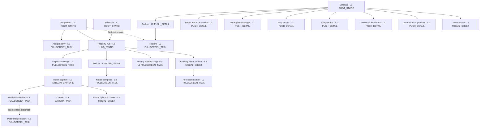
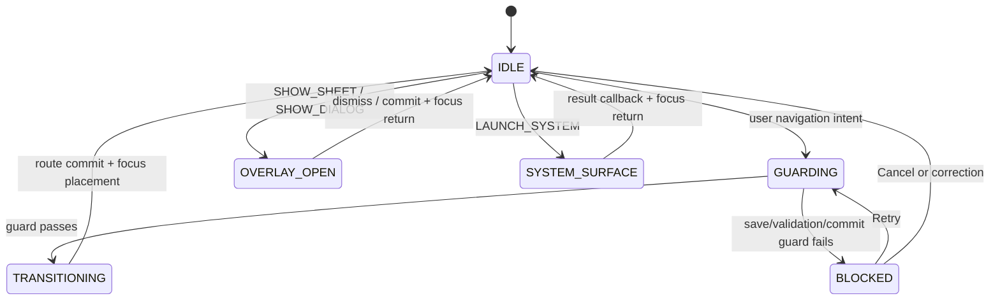

# Design System Truth Source — MyInspection Field Ledger

## Overview

MyInspection is a **field instrument, not an office dashboard**. Its primary user is a New Zealand landlord or property operator walking through a home with one hand occupied, variable light, intermittent connectivity, and limited time. The interface is calm, exact, and trustworthy enough to support evidence that is later printed or reviewed in a dispute.

Implementation coverage is indexed in [`docs/UI-UX-ELEMENTS.md`](../docs/UI-UX-ELEMENTS.md). This file remains the only normative source for tokens, component states, behaviour, accessibility, and motion; the index must never override it.

The visual direction is **Field Ledger**: the clarity of a paper inspection sheet combined with the immediacy of a camera viewfinder. Cool mineral surfaces, deep fern green, measured amber, compact metadata, and firm rectangular controls make the app feel durable without becoming industrial or severe.

The signature device is the **evidence rail**. Inspection item cards carry a narrow leading rail whose segments encode status, photo, and note completeness. The same visual grammar appears in room progress and the camera capture sequence. It is functional navigation, never decoration, and must always pair color with an icon or label.

This document describes the target production UI for `T2-CAPTURE-UI` and later UI cards. The current `skeleton` package is a disposable end-to-end proof and is not a visual precedent.

## Experience principles

1. **Resume before recall.** The app remembers the active property, inspection, room, item expansion, and list position. Returning to field work must not require reconstructing context from memory.
2. **Evidence before decoration.** The decision-driving facts are current status, missing evidence, prior evidence, and save state. They outrank branding, illustration, and generic dashboard metrics.
3. **One physical action at a time.** Each capture surface has one dominant next action. Secondary detail is progressively disclosed after `Needs attention` or an explicit request.
4. **Local is the normal state.** Offline is not an error banner. Only an operation that genuinely needs a provider or network explains that dependency at the point of use.
5. **Reversible until evidence is sealed.** Draft edits, inserted phrases, and temporary captures are easy to undo. Finalize, contact clearing, and local-byte removal use explicit review and confirmation.

## Information architecture

Compact phones use three labelled top-level destinations: **Properties**, **Schedule**, and **Settings**. `Properties` is the start destination. There is no Dashboard tab, Reports tab, navigation drawer, or hamburger menu.

### Page contract metadata

Every navigable surface declares one record. Undeclared routes fail navigation-contract tests.

```json
{
  "pageId": "PROPERTY_HUB",
  "route": "properties/{propertyId}",
  "level": 2,
  "pageType": "HUB_STATIC",
  "shell": "FieldLedgerAppShell",
  "parentPageId": "PROPERTIES_ROOT",
  "ownerTask": "T2-CAPTURE-UI",
  "topAppBar": "HUB",
  "bottomNav": "VISIBLE",
  "restorePolicy": "RESTORE_STACK_AND_SCROLL",
  "entryFocusKey": "page:property-hub:title"
}
```

```kotlin
enum class PageType {
    ROOT_STATIC,
    HUB_STATIC,
    PUSH_DETAIL,
    STREAM_CAPTURE,
    FULLSCREEN_TASK,
    CAMERA_TASK,
    MODAL_SHEET,
    ALERT_DIALOG,
    MODAL_DIALOG,
    SYSTEM_SURFACE
}

enum class NavigationOperation { PUSH, POP, REPLACE, RESET, SHOW_SHEET, SHOW_DIALOG, LAUNCH_SYSTEM }
enum class BottomNavVisibility { VISIBLE, HIDDEN }
```

### Global sitemap



### Page inventory

| Level | `pageId` | Route | Page type | Parent | Bottom nav | Owner |
| ---: | --- | --- | --- | --- | --- | --- |
| 1 | `PROPERTIES_ROOT` | `properties` | `ROOT_STATIC` | — | Visible | `T2-CAPTURE-UI` |
| 1 | `SCHEDULE_ROOT` | `schedule` | `ROOT_STATIC` | — | Visible | `T4-SCHEDULE` |
| 1 | `SETTINGS_ROOT` | `settings` | `ROOT_STATIC` | — | Visible | Shared settings shell |
| 2 | `PROPERTY_CREATE` | `properties/new` | `FULLSCREEN_TASK` | `PROPERTIES_ROOT` | Hidden | `T2-CAPTURE-UI` |
| 2 | `PROPERTY_HUB` | `properties/{propertyId}` | `HUB_STATIC` | `PROPERTIES_ROOT` | Visible | `T2-CAPTURE-UI` |
| 2 | `INSPECTION_SETUP` | `properties/{propertyId}/inspection/new` | `FULLSCREEN_TASK` | `PROPERTY_HUB` | Hidden | `T2-CAPTURE-UI` |
| 2 | `INSPECTION_CAPTURE` | `inspections/{inspectionId}/capture` | `STREAM_CAPTURE` | `PROPERTY_HUB` | Hidden | `T2-CAPTURE-UI` |
| 2 | `INSPECTION_REVIEW` | `inspections/{inspectionId}/review` | `FULLSCREEN_TASK` | `INSPECTION_CAPTURE` | Hidden | `T2-CAPTURE-UI` / `T3-FINALIZE` |
| 2 | `REPORT_EXPORT` | `inspections/{inspectionId}/export` | `FULLSCREEN_TASK` | `PROPERTY_HUB` | Hidden | `T3-PDF-RENDERER` |
| 2 | `REPORT_REEXPORT` | `inspections/{inspectionId}/re-export` | `FULLSCREEN_TASK` | `PROPERTY_HUB` | Hidden | `T3-PDF-RENDERER` |
| 2 | `NOTICE_CENTER` | `properties/{propertyId}/notices` | `PUSH_DETAIL` | `PROPERTY_HUB` | Hidden | `T4-NOTICES` |
| 3 | `NOTICE_COMPOSE` | `inspections/{inspectionId}/notice/new` | `FULLSCREEN_TASK` | `NOTICE_CENTER` | Hidden | `T4-NOTICES` |
| 2 | `HHC_CAPTURE` | `properties/{propertyId}/healthy-homes` | `FULLSCREEN_TASK` | `PROPERTY_HUB` | Hidden | `T6-HHC` |
| 2 | `BACKUP_SETTINGS` | `settings/backup` | `PUSH_DETAIL` | `SETTINGS_ROOT` | Hidden | `T5-BACKUP-IO` |
| 3 | `RESTORE_TASK` | `settings/backup/restore` | `FULLSCREEN_TASK` | `BACKUP_SETTINGS` | Hidden | `T5-BACKUP-IO` |
| 2 | `QUALITY_SETTINGS` | `settings/quality` | `PUSH_DETAIL` | `SETTINGS_ROOT` | Hidden | `T2-PHOTO-QUALITY-PROFILES` / `T3-PDF-RENDERER` |
| 2 | `LOCAL_MEDIA_SETTINGS` | `settings/local-media` | `PUSH_DETAIL` | `SETTINGS_ROOT` | Hidden | `T5-LOCAL-MEDIA-RETENTION` |
| 2 | `HEALTH_STATUS` | `settings/health` | `PUSH_DETAIL` | `SETTINGS_ROOT` | Hidden | `T7-LOCAL-HEALTH-RELEASE` |
| 2 | `DIAGNOSTIC_EXPORT` | `settings/diagnostics` | `PUSH_DETAIL` | `SETTINGS_ROOT` | Hidden | `T5-DIAGNOSTIC-EXPORT` |
| 2 | `LOCAL_DATA_ERASURE` | `settings/delete-all-data` | `FULLSCREEN_TASK` | `SETTINGS_ROOT` | Hidden | `T5-LOCAL-DATA-ERASURE` |
| 2 | `REMEDIATION_SETTINGS` | `settings/remediation` | `PUSH_DETAIL` | `SETTINGS_ROOT` | Hidden | `T7-REMEDIATION` |
| 3 | `CAMERA_CAPTURE` | `inspections/{inspectionId}/camera/{targetType}/{targetId}` | `CAMERA_TASK` | `INSPECTION_CAPTURE` | Hidden | `T2-CAPTURE-UI` |
| 3 | `CAMERA_REVIEW` | `inspections/{inspectionId}/camera-review/{tempAssetId}` | `CAMERA_TASK` | `CAMERA_CAPTURE` | Hidden | `T2-CAPTURE-UI` |

The page inventory is exhaustive for route-backed surfaces. The overlay/system-surface registry below is exhaustive for non-route surfaces.

Existing finalized inspections do not open an in-app report viewer. Selecting one opens `REPORT_ACTION_SHEET`, which exposes Open PDF through the system viewer, Share, and Export another quality. This preserves the explicit v1 exclusion of a read-only history/report viewer.

### Page type contract

| Page type | Container | Navigation model | Persistent state | Exit rule |
| --- | --- | --- | --- | --- |
| `ROOT_STATIC` | `FieldLedgerAppShell` | Top-level tab root | Restore scroll/filter per tab | Back exits app |
| `HUB_STATIC` | `FieldLedgerAppShell` | Push inside Properties stack | Restore property, scroll, expanded summary | Back Pops to Properties root |
| `PUSH_DETAIL` | `FieldLedgerDetailScaffold` | Push from parent | Restore scroll and selected row | Back Pops to parent |
| `STREAM_CAPTURE` | `InspectionCaptureScaffold` | Focused task inside Properties stack | Persist draft + route/room/item/scroll/focus | Save barrier then Pop to Property hub |
| `FULLSCREEN_TASK` | `FieldLedgerTaskScaffold` | Task subgraph | Persist step and task payload | Complete Replaces parent state; Cancel follows dirty-state table |
| `CAMERA_TASK` | `CameraCaptureScaffold` | Edge-to-edge task subgraph | Persist temp asset ID only | Use Photo Pops to Capture; discard returns Preview; Close Pops to Capture |
| `MODAL_SHEET` | `FieldLedgerModalSheet` | Overlay, not back-stack destination | Persist committed selection only | Dismiss matrix controls Back/drag/scrim/Close |
| `ALERT_DIALOG` | `FieldLedgerAlertDialog` | Blocking overlay | No route state | Cancel returns trigger; Confirm executes one named command |
| `MODAL_DIALOG` | Component-owned full-screen dialog | Overlay, not back-stack destination | Persist selected asset and viewport state | Close returns to the exact source control |
| `SYSTEM_SURFACE` | Android-owned | External activity/dialog | Persist launch request ID | Result callback returns to stored focus key |

The property hub is the operational home for one property. Its primary card is `Continue inspection` when a draft exists and `Start inspection` otherwise. Due date, last finalized inspection, last verified backup, notices, and compliance blockers remain supporting facts on the same page.

App launch never enters Capture or Camera automatically. A draft appears through `Continue inspection`. Notification deep links construct the minimal declared parent stack and never land on a generic page. A deep link with an unknown entity ID resets to the owning top-level root, shows one persistent `Content unavailable` banner with Retry, and focuses that banner.

### Core screen composition contract

These rules remove page-level interpretation from implementation. Cards group one decision or one evidence unit; they are not decorative wrappers around every row.

| Screen | First viewport priority | Main content | Persistent action | Empty / exceptional state |
| --- | --- | --- | --- | --- |
| `PROPERTIES_ROOT` | `Properties` heading, then an active draft when one exists | Non-clickable `property-summary-card` surfaces sorted active draft → due date → address; each shows address, property type, next-inspection fact, last finalized date, and one result action | `Add property` remains visible without overflow | `No properties yet` explains that a property is required before an inspection and exposes `Add property`; its route and owner task must be declared before this state can ship |
| `PROPERTY_CREATE` | `Add property` heading and address | One scrolling form in decision order: address → occupancy → boarding-house status | Bottom CTA is `Save property` | Validation stays inline; Cancel returns to the originating Add property action without creating a partial property |
| `PROPERTY_HUB` | Address, compliance block if present, then exactly one `Start inspection` or `Continue inspection` hero | One compact facts group for due inspection, last finalized inspection, last verified backup, and notice status; history is a dated list, not dashboard metrics | `Continue inspection` or `Start inspection` | Missing tenancy or baseline is explained beside the affected inspection type; no generic empty illustration |
| `INSPECTION_SETUP` | Inspection type and date/time | One scrolling form in decision order: type → tenancy/baseline → date/time → template; conditional fields appear directly after their cause | Bottom CTA uses `Start inspection` and remains above IME/system insets | Core compliance failures show the entered value and valid correction inline; an unavailable tenancy-creation path is a blocking task-graph gap, never a fake selector value |
| `INSPECTION_CAPTURE` | Property/room identity, exact missing evidence, room navigation | Room panorama, safe bulk action, then the item stream | Dock shows only `Next room`, `Review {N} missing items`, or `Review inspection` | Save, permission, media, and restoration failures preserve the current room/item and expose one recovery action |
| `INSPECTION_REVIEW` | Decision fact: `{complete} of {total} items complete` | Missing state groups by room; each row names item, exact missing evidence, and `Fix`; when complete, show evidence totals and the permanence handoff | `Review {N} missing items` until complete; then `Finish inspection` | No disabled `Finish inspection` button and no undifferentiated error list; selecting a row returns to and focuses the exact control |

Property cards never combine a clickable card surface with nested buttons. The surface is structural; one labelled full-width `Open property` action owns navigation. Search/filter stays absent until the active property count exceeds eight, avoiding permanent chrome for a small self-use list.

Setup never exposes raw IDs, enum names, or an empty dropdown. Dates use the device locale with the full month name at widths `≥320dp` and abbreviated month name below `320dp`; timestamps and UUIDs are never user-facing. A conditional section keeps its prior valid value while temporarily hidden; core validation alone determines whether that value is submitted.

## Navigation bars and containers

### Top app bar contract

All app-bar titles are start-aligned. v1 has no centered-title variant, Home icon, hamburger icon, or persistent Save action. Autosave state is rendered by `SaveStateIndicator`; it is never represented as a toolbar button.

| Page type | Bar | Leading action | Title | Trailing actions | Primary action placement |
| --- | --- | --- | --- | --- | --- |
| `ROOT_STATIC` | `FieldLedgerTopAppBar` | None | Destination label | Maximum two contextual actions | In content or bottom dock |
| `HUB_STATIC` | `FieldLedgerTopAppBar` | Back | Property short address | One direct action plus overflow | Primary property card |
| `PUSH_DETAIL` | `FieldLedgerTopAppBar` | Back | Page label | One direct action plus overflow | In content |
| `STREAM_CAPTURE` | `FieldLedgerTopAppBar` | Back, accessible label `Save and exit` | Current room | Overflow only | `CaptureActionDock` |
| `FULLSCREEN_TASK` | `FieldLedgerTaskTopAppBar` | Cancel | Task label | None | `FieldLedgerBottomActionDock` |
| `CAMERA_TASK` | No app bar | Overlay Close | None | Flash only during preview | Camera control region |
| `MODAL_SHEET` | Sheet header | Close | Sheet label | None | Sheet content or fixed footer |
| `ALERT_DIALOG` | No app bar | None | Start-aligned dialog title | None | Dialog action row |
| `MODAL_DIALOG` | Dialog header | Close | Content label | Contextual action only | Dialog content |
| `SYSTEM_SURFACE` | Android-owned | Android-owned | Provider/picker label | Android-owned | Android-owned |

Toolbar commands follow these fixed rules:

1. Back performs one `POP` after the page exit guard succeeds.
2. Cancel performs `SHOW_DIALOG(DISCARD_CHANGES)` when the task is dirty; otherwise it performs one `POP`.
3. Overflow exists only when two or more secondary commands exist.
4. A destructive command never appears as the direct trailing action. It lives in overflow and requires `FieldLedgerAlertDialog` confirmation.
5. A bar exposes no more than two trailing icons. Every icon has a visible tooltip and an accessibility label using verb + object.

### Bottom navigation and independent stacks

The app owns exactly three independent stacks. Switching destinations never pushes a tab onto another tab's stack.

```kotlin
enum class TopLevelDestination(val rootPageId: PageId) {
    PROPERTIES(PageId.PROPERTIES_ROOT),
    SCHEDULE(PageId.SCHEDULE_ROOT),
    SETTINGS(PageId.SETTINGS_ROOT)
}

data class AppNavigationState(
    val selectedDestination: TopLevelDestination,
    val propertiesStack: List<RouteEntry>,
    val scheduleStack: List<RouteEntry>,
    val settingsStack: List<RouteEntry>,
    val overlay: OverlayEntry?,
    val pendingSystemRequest: SystemRequest?
)
```

| Event | Deterministic result |
| --- | --- |
| Select inactive destination | Save current stack and page state; restore selected destination's last stack and focus |
| Select active destination at its root | Keep route; scroll primary container to top; focus page heading |
| Select active `Properties` while `PROPERTY_HUB` is top | Pop to `PROPERTIES_ROOT`; retain property list filter and scroll |
| Select active destination on any deeper route | Pop to that destination's root |
| System Back at a root | Exit app; never reveal a previously selected tab |
| Process recreation | Restore selected destination and all three stacks; remove invalid entries from the first invalid entry onward |

Bottom navigation is visible only on `ROOT_STATIC` and `HUB_STATIC`. It is hidden before the transition into every other page type and restored after the Pop transition completes. Every destination always displays icon and label. `Schedule` renders a count badge `1`–`99+` for due properties; `Settings` renders an unlabelled error dot only for an actionable local-health state (including failed/revoked backup), never for informational diagnostics; `Properties` has no badge.

### Container and inset contract

| Container | Edge behavior | Scroll owner | Fixed regions | Inset owner |
| --- | --- | --- | --- | --- |
| `FieldLedgerAppShell` | Opaque status/navigation surfaces | Page content | Top app bar + bottom navigation | Shell consumes system bars once |
| `FieldLedgerDetailScaffold` | Opaque status bar | Page content | Top app bar | Scaffold consumes system bars once |
| `FieldLedgerTaskScaffold` | Opaque status bar | Task content | Task bar + bottom action dock | Scaffold consumes top/bottom once |
| `InspectionCaptureScaffold` | Opaque status bar | Room/item list | Top bar + room strip + capture dock | Scaffold consumes top/bottom once |
| `CameraCaptureScaffold` | Edge-to-edge | None | Close/flash/shutter overlays | Controls pad against safe drawing insets |
| `FieldLedgerModalSheet` | Edge-to-edge overlay | Sheet body | Handle + header; optional footer | Sheet consumes bottom/IME once |

Nested content never consumes the same system inset. When the IME opens, the focused field remains at least `16dp` above the IME and the bottom action dock translates above it. Touch targets remain at least `48dp × 48dp`.

### Transition contract

| Operation | Enter | Exit | Duration/easing |
| --- | --- | --- | --- |
| `PUSH` | New page `+16dp → 0`, alpha `.92 → 1` | Old page `0 → -8dp`, alpha `1 → .96` | `200ms`, emphasized decelerate |
| `POP` | Parent `-8dp → 0`, alpha `.96 → 1` | Current page `0 → +16dp`, alpha `1 → .92` | `150ms`, emphasized accelerate |
| Top-level switch | Crossfade only | Crossfade only | `100ms`, linear-out-slow-in |
| `SHOW_SHEET` | Bottom edge → resting position | Resting position → bottom edge | `250ms` enter / `150ms` exit |
| `SHOW_DIALOG` | Scale `.96 → 1`, fade in | Scale `1 → .98`, fade out | `180ms` enter / `120ms` exit |
| Camera enter/exit | Fade | Fade | `150ms` |

With Reduce Motion enabled, every route, sheet, and dialog uses a `100ms` crossfade with zero translation and zero scale. Navigation state commits once at transition start; repeated activation of the same trigger is ignored until transition completion.

## Trigger-to-route mapping



Only `IDLE` accepts a new navigation intent. `TRANSITIONING`, overlay commit, and system-launch preparation reject duplicate activation. A guard failure never mutates the back stack.

### Core routes

| Trigger source | Preconditions / guard | Navigation action | Target | Transition | Exit and focus return |
| --- | --- | --- | --- | --- | --- |
| `Add property` | Always | `PUSH` | `PROPERTY_CREATE` | Push | Cancel → originating Add property action |
| `Open property` | Property exists | `PUSH` | `PROPERTY_HUB(propertyId)` | Push | Pop → source Open property button |
| `Start inspection` | No active draft | `PUSH` | `INSPECTION_SETUP(propertyId)` | Push | Cancel → property primary card |
| `Continue inspection` | Active draft exists | `PUSH` | `INSPECTION_CAPTURE(inspectionId)` | Push | Save barrier, then Pop → Continue card |
| Schedule due-property card | Property exists | Select Properties; replace its stack with `PROPERTIES_ROOT → PROPERTY_HUB(propertyId)`; then `PUSH` | Existing draft → `INSPECTION_CAPTURE`; no draft → `INSPECTION_SETUP` | Top-level crossfade, stack commit, then Push | Pop → target `PROPERTY_HUB`, then Properties root |
| Setup `Start inspection` | Required fields valid | `REPLACE` setup entry | `INSPECTION_CAPTURE(inspectionId)` | Push visual | Save and exit → property primary card |
| Room segment | Target room exists | No route; persist current room then select | Same `INSPECTION_CAPTURE` instance | `150ms` content crossfade | Focus selected room heading |
| `Take photo` | Camera permission granted and target requires evidence | `PUSH` | `CAMERA_CAPTURE(targetType,targetId)` | Camera fade | Close → original Take photo button |
| Camera shutter | Camera state `PREVIEW_READY` | `PUSH` | `CAMERA_REVIEW(tempAssetId)` | Camera fade | Retake → shutter; Use photo → evidence thumbnail |
| `Review N missing items` | Missing count `N > 0` | `PUSH` | `INSPECTION_REVIEW(inspectionId)` | Push | Select gap → Pop capture and focus exact item status group |
| `Review inspection` | Missing count `0`; latest revision durably saved | `PUSH` | `INSPECTION_REVIEW(inspectionId)` | Push | Back → editable capture at Review inspection action |
| Review `Finish inspection` | Current page is `INSPECTION_REVIEW`; missing count `0`; state `READY` | `SHOW_DIALOG` | `FINALIZE_CONFIRMATION` | Dialog | Cancel → Finish inspection button; confirm → finalize progress heading |
| Finalize succeeds | Finalized record and immutable evidence seal committed | Replace capture task subgraph | `REPORT_EXPORT(inspectionId)` | Push visual | Close → `PROPERTY_HUB`, focus finalized inspection row |
| Finalized inspection row | Finalized PDF metadata exists | `SHOW_SHEET` | `REPORT_ACTION_SHEET` | Sheet | Dismiss → source report row |
| Report action `Open PDF` | PDF exists or render succeeds | `LAUNCH_SYSTEM` | `PDF_VIEWER` | System | Return → Open PDF action |
| Report action `Share` | Share URI granted | `LAUNCH_SYSTEM` | `SHARE_SHEET` | System | Return → Share action |
| Report action `Export another quality` | Inspection finalized | Dismiss sheet, then `PUSH` from `PROPERTY_HUB` | `REPORT_REEXPORT(inspectionId)` | Push | Pop → source finalized inspection row |

`T2-CAPTURE-UI` emits the single-use `InspectionFinalized(inspectionId)` event. `T3-PDF-RENDERER` consumes it and performs the declared task-subgraph replacement. Recomposition never re-emits or re-consumes the event.

### Supporting routes and overlays

| Trigger source | Action | Target | Close rule | Focus return |
| --- | --- | --- | --- | --- |
| Property hub `Notices` | `PUSH` | `NOTICE_CENTER(propertyId)` | Back Pop | Notices card |
| Notice center `New notice` | If one selected eligible inspection belongs to this property, `PUSH`; otherwise keep the stack unchanged, show `Choose an inspection`, and focus the required inspection selector | `NOTICE_COMPOSE(inspectionId)` | Dirty-state guard after Push; a deleted or ineligible selection returns to the selector without creating a notice | New notice button, or inspection selector on guard failure |
| Property hub `Healthy Homes` | `PUSH` | `HHC_CAPTURE(propertyId)` | Dirty-state guard | Healthy Homes card |
| First-run `Restore encrypted backup` | Select Settings; reset its stack to `SETTINGS_ROOT → BACKUP_SETTINGS → RESTORE_TASK`; then `LAUNCH_SYSTEM` | `BACKUP_FILE_PICKER` | Cancel restores `PROPERTIES_ROOT` first-run state; successful restore relaunches | Restore encrypted backup action |
| Settings `Backup` | `PUSH` | `BACKUP_SETTINGS` | Back Pop | Backup row |
| Backup `Choose destination` | `LAUNCH_SYSTEM` | `DOCUMENT_TREE_PICKER` | System result | Choose destination row |
| Backup `Restore` | `PUSH`, then `LAUNCH_SYSTEM` | `RESTORE_TASK`, then `BACKUP_FILE_PICKER` | Cancel Pop; committing blocks Back | Restore row |
| Settings `Photo and PDF quality` | `PUSH` | `QUALITY_SETTINGS` | Back Pop | Quality row |
| Settings `Local photo storage` | `PUSH` | `LOCAL_MEDIA_SETTINGS` | Back Pop | Local storage row |
| Settings `App health` | `PUSH` | `HEALTH_STATUS` | Back Pop | App health row |
| Settings `Diagnostics` | `PUSH` | `DIAGNOSTIC_EXPORT` | Back Pop | Diagnostics row |
| Settings `Delete all local data` | `PUSH` | `LOCAL_DATA_ERASURE` | Cancel Pop; erasing blocks Back | Delete all local data row |
| Settings `Remediation provider` | `PUSH` | `REMEDIATION_SETTINGS` | Back Pop | Remediation row |
| Theme setting row | `SHOW_SHEET` | `THEME_MODE_SHEET` | Commit on selection, then dismiss | Theme row |
| Status field | `SHOW_SHEET` | `STATUS_SHEET(itemId)` | Commit on selection, then dismiss | Status field |
| `Insert phrase` | `SHOW_SHEET` | `PHRASE_SHEET(fieldId)` | Insert on selection, then dismiss with Undo snackbar | Text field at insertion point |
| Evidence source action | `SHOW_SHEET` | `MEDIA_SOURCE_SHEET(targetId)` | Dismiss after source choice or Close | Originating evidence source action |
| Evidence tile `Open preview` | `SHOW_DIALOG` | `MEDIA_PREVIEW(assetId)` | Close dialog | Originating evidence tile |
| Dirty task Cancel/Back | `SHOW_DIALOG` | `DISCARD_CHANGES` | Cancel keeps task; Discard exits | Original Cancel/Back action |
| Camera review Back | `SHOW_DIALOG` | `DISCARD_CAPTURE` | Keep returns to review; Discard returns to shutter | Camera review Keep action |
| Contact clear action | `SHOW_DIALOG` | `CLEAR_CONTACT_CONFIRMATION` | Cancel keeps data; confirm runs one clear command | Clear contact info action |
| Local media removal action | `SHOW_DIALOG` | `REMOVE_LOCAL_MEDIA_CONFIRMATION` | Cancel keeps bytes; confirm runs one removal command | Remove local photos action |
| Evidence `Import` | `LAUNCH_SYSTEM` | `MEDIA_IMPORT_PICKER` | System result | Source Import action |
| Date/time field | `LAUNCH_SYSTEM` | `DATE_TIME_PICKER(fieldId)` | System result | Originating date/time field |
| Diagnostics `Save report` | `LAUNCH_SYSTEM` | `DIAGNOSTIC_SAVE_DOCUMENT` | System result | Save report action |
| Diagnostics `Share report` | `LAUNCH_SYSTEM` | `DIAGNOSTIC_SHARE_SHEET` | System result | Share report action |
| Permission-gated action | `LAUNCH_SYSTEM` | `PERMISSION_DIALOG(capability)` | System result | Original triggering action |
| Denied-permission `Open settings` | `LAUNCH_SYSTEM` | `ANDROID_APP_SETTINGS` | System return | Original recovery panel |

### Overlay and system-surface registry

| Target | Page type | Parent / launch context | Owner | Restoration policy | Entry focus key |
| --- | --- | --- | --- | --- | --- |
| `DISCARD_CHANGES` | `ALERT_DIALOG` | Dirty `FULLSCREEN_TASK` | Owning task | Cancel restores triggering Back/Cancel action | `dialog:discard-changes:cancel` |
| `FINALIZE_CONFIRMATION` | `ALERT_DIALOG` | `INSPECTION_REVIEW` | `T3-FINALIZE` | Cancel restores Finish inspection; confirm focuses progress heading | `dialog:finalize:cancel` |
| `REPORT_ACTION_SHEET` | `MODAL_SHEET` | Finalized row in `PROPERTY_HUB` | `T3-PDF-RENDERER` | Dismiss restores finalized row | `sheet:report-actions:title` |
| `THEME_MODE_SHEET` | `MODAL_SHEET` | Theme row in `SETTINGS_ROOT` | Shared settings shell | Selection/dismiss restores Theme row | `sheet:theme-mode:title` |
| `STATUS_SHEET(itemId)` | `MODAL_SHEET` | Status field in `INSPECTION_CAPTURE` | `T2-CAPTURE-UI` | Selection/dismiss restores exact item status field | `sheet:status:{itemId}:title` |
| `PHRASE_SHEET(fieldId)` | `MODAL_SHEET` | Note field in `INSPECTION_CAPTURE` | `T2-CAPTURE-UI` | Insert/dismiss restores field insertion point | `sheet:phrase:{fieldId}:title` |
| `MEDIA_SOURCE_SHEET(targetId)` | `MODAL_SHEET` | Evidence source action | `T2-CAPTURE-UI` | Choice/dismiss restores originating evidence action | `sheet:media-source:{targetId}:title` |
| `MEDIA_PREVIEW(assetId)` | `MODAL_DIALOG` | Evidence tile in history/capture | `T2-CAPTURE-UI` | Close restores originating evidence tile and viewport | `dialog:media-preview:{assetId}:title` |
| `DISCARD_CAPTURE` | `ALERT_DIALOG` | `CAMERA_REVIEW` | `T2-CAPTURE-UI` | Keep restores camera review; discard focuses shutter | `dialog:discard-capture:keep` |
| `CLEAR_CONTACT_CONFIRMATION` | `ALERT_DIALOG` | Clear contact info action | `T5-RETENTION` | Cancel restores clear action; confirm focuses progress | `dialog:clear-contact:cancel` |
| `REMOVE_LOCAL_MEDIA_CONFIRMATION` | `ALERT_DIALOG` | Local media removal action | `T5-LOCAL-MEDIA-RETENTION` | Cancel restores removal action; confirm focuses progress | `dialog:remove-local-media:cancel` |
| `DOCUMENT_TREE_PICKER` | `SYSTEM_SURFACE` | `BACKUP_SETTINGS` destination row | `T5-BACKUP-IO` | Result restores Choose destination row | `system:document-tree-picker` |
| `BACKUP_FILE_PICKER` | `SYSTEM_SURFACE` | `RESTORE_TASK` package step | `T5-BACKUP-IO` | Result restores package field | `system:backup-file-picker` |
| `PDF_VIEWER` | `SYSTEM_SURFACE` | `REPORT_ACTION_SHEET` Open PDF | `T3-PDF-RENDERER` | Return restores Open PDF action | `system:pdf-viewer` |
| `SHARE_SHEET` | `SYSTEM_SURFACE` | `REPORT_ACTION_SHEET` Share | `T3-PDF-RENDERER` | Return restores Share action | `system:share-sheet` |
| `MEDIA_IMPORT_PICKER` | `SYSTEM_SURFACE` | Evidence Import action | `T2-CAPTURE-UI` | Result restores originating evidence slot | `system:media-import-picker` |
| `DATE_TIME_PICKER(fieldId)` | `SYSTEM_SURFACE` | Date/time field | Owning task | Result restores originating date/time field | `system:date-time-picker:{fieldId}` |
| `DIAGNOSTIC_SAVE_DOCUMENT` | `SYSTEM_SURFACE` | Diagnostics Save report | `T5-DIAGNOSTIC-EXPORT` | Result restores Save report action and selected range | `system:diagnostic-save` |
| `DIAGNOSTIC_SHARE_SHEET` | `SYSTEM_SURFACE` | Diagnostics Share report | `T5-DIAGNOSTIC-EXPORT` | Return restores Share report action and selected range | `system:diagnostic-share` |
| `PERMISSION_DIALOG(capability)` | `SYSTEM_SURFACE` | Exact permission-gated action | Owning task | Result resumes once or restores trigger with fallback | `system:permission:{capability}` |
| `ANDROID_APP_SETTINGS` | `SYSTEM_SURFACE` | Permission recovery panel | Owning task | Return restores original recovery panel | `system:app-settings` |

### Overlay dismissal and interception

| Overlay or state | Scrim tap | Swipe down | System Back | Explicit action |
| --- | --- | --- | --- | --- |
| Choice/action sheet | Dismiss | Dismiss | Dismiss | Close dismisses; selection commits then dismisses |
| Phrase sheet | Dismiss | Dismiss | Dismiss | Selection inserts, dismisses, and exposes Undo |
| Destructive confirmation | No effect | Not applicable | Equivalent to Cancel | Confirm executes exactly one named command |
| Finalize confirmation | No effect | Not applicable | Equivalent to Cancel before commit | Confirm enters non-dismissible `COMMITTING` |
| Camera with uncommitted photo | No effect | Not applicable | Show `DISCARD_CAPTURE` dialog | Discard deletes temp bytes; Keep returns to review |
| Restore while `COMMITTING` | No effect | Not applicable | Block and announce `Restore in progress` | Completion or failure changes state |

Exit guards are evaluated in this order: `COMMITTING` block → temporary camera bytes → unsaved task payload → autosave barrier → route operation. Capture uses the autosave barrier and never shows a generic unsaved-changes dialog. If the save barrier fails, navigation is cancelled, the save error banner receives focus, and Retry is the primary action.

Permission flow is fixed: action → in-app rationale when required → system permission dialog → granted continues the original action once; denied returns to the triggering page with `Open settings` and a non-camera fallback when one exists. The app never relaunches a denied system dialog automatically.

## Navigation feedback and focus lifecycle

### Interaction state contract

| State/event | Visual response | Input policy | Haptic |
| --- | --- | --- | --- |
| `PRESSED` | State layer reaches `12%` opacity within `100ms`; content does not move | Accept one pointer/keyboard activation | None for navigation |
| `LOADING` | Preserve label; add trailing progress after `300ms` | Block duplicate activation; keep Back unless state is `COMMITTING` | None |
| `DISABLED` | Disabled semantic colors; no elevation; adjacent text states the unmet requirement | Remove click action; keep readable and discoverable | None |
| Route committed | Selected destination or source state updates at transition start | Ignore repeated source activation until completion | None |
| Evidence saved | Save indicator becomes `Saved`; evidence thumbnail appears | Re-enable source action | Light confirmation |
| Finalize succeeds | Success summary replaces progress | Actions re-enable | Confirmation |
| Blocked/destructive confirmation | Warning color and explicit cause | One command per activation | Warning once |

Loading never replaces a button label with only a spinner. Disabled primary actions are not used for recoverable validation: the active action states the next correction, such as `Review 3 missing items`.

### Focus fallback matrix

Focus moves only after layout and transition completion. The destination lookup order is exact: stored semantic focus key → route heading → first enabled primary action → first enabled control → scroll container heading.

| Event | Focus destination | Announcement |
| --- | --- | --- |
| Push / deep-link entry | Destination H1 heading | Page title once |
| Pop | Original trigger semantic key | None unless context changed |
| Top-level switch | Restored last focused key; root heading when absent | Destination label once |
| Active destination reselect | Root heading after scroll-to-top | Destination label once |
| Sheet/dialog opens | Sheet/dialog heading; destructive dialog then focuses Cancel | Overlay title once |
| Sheet/dialog closes | Original trigger; nearest enabled sibling if trigger was removed | Committed selection when changed |
| Camera Use photo | New evidence thumbnail | `Photo added` |
| Missing-item jump | Exact item's status group heading | Room, item, and missing requirement |
| Dynamic insertion/removal | Inserted item heading; otherwise next sibling, previous sibling, then container heading | One concise change message |
| Save failure blocks exit | Save error banner, then Retry action | Error and retained-page state |

Focus keys use domain identity, never list index: `page:<page-id>:<entity-id>:<part>`. Hidden, disabled, or deleted targets are invalid and trigger the ordered fallback.

## Primary inspection journey

1. **Property hub:** continue an existing draft or start a new inspection.
2. **Setup:** choose type, tenancy/baseline, date, and template; inline compliance errors sit beside the field that must change.
3. **Room capture:** select room, take required panorama, rate items, and add evidence. The bottom dock offers only the next room or review action.
4. **Review:** group missing evidence by room. An incomplete primary action reads `Review N missing items` and jumps to the first gap; it does not appear inert or rely on a disabled button.
5. **Finalize:** once complete, show a concise permanence confirmation naming the inspection, property, and effect: original evidence becomes read-only and later changes are Supplements.
6. **Export:** generate landlord and tenant PDFs, show progress per audience, then expose `Open PDF`, `Share`, and `Export another quality` without losing the finalized summary.

### End-to-end experience contract

#### First run

First run is a useful empty state, not an onboarding carousel. The first viewport contains:

1. `Add your first property` as the only primary action.
2. One sentence: `No account. Inspection data stays on this device.`
3. A secondary `Restore encrypted backup` action for an existing user.

Do not ask for camera, microphone, notification, storage-provider, or backup permissions during launch. Request each permission at the action that needs it and keep a usable fallback: camera → Import, microphone → keyboard, notifications → in-app Schedule, provider access → local data remains unchanged.

Property creation asks only for the fields needed to begin: address, rental/owner-occupied, and boarding-house status. Tenancy details are requested only when the selected inspection type requires them. Backup setup is recommended after the first finalized inspection, not placed between first launch and first capture.

#### Pre-inspection readiness

Setup ends with an inline `Ready to inspect` summary rather than another route. It restates property, type, tenancy/baseline, local date/time, template, and any non-blocking warning. `Start inspection` is the only primary action. Camera permission remains just-in-time on the first photo action; a permission request never appears before the user understands why it is needed.

#### Routine fast path

Routine uses an anomaly-first rhythm without weakening evidence rules:

1. Capture the room panorama.
2. Review visible item names and mark exceptions `Needs attention`.
3. Use `Mark {N} remaining items OK` for the still-unrated eligible items.
4. Complete photo/note evidence only for exceptions required by core.

The app never copies a previous status into the current inspection and never bulk-rates suppressed, already rated, or ineligible items. The bulk action remains reversible until the room save barrier succeeds. Ingoing, Exit, and Annual flows use the same components but may omit the Routine shortcut when their template requires explicit per-item decisions.

#### Ready-to-leave checkpoint

Completion and finalization are distinct. When core completeness reaches zero missing items and the latest revision is durably saved, Review displays a calm `Ready to leave the property` checkpoint with exactly these facts:

- `All required evidence captured`
- `Saved on this device`
- `{N} items need attention` or `No items need attention`

This checkpoint must not claim `Backed up`, `Report ready`, or `Notice sent`. Those states belong to later verified operations. `Finish inspection` then opens the permanence confirmation; Back still returns to editable Capture.

#### Post-finalize handoff

After finalize, keep the finalized summary visible while landlord and tenant reports generate independently. The default Medium quality is shown inline; `Change quality` is secondary and does not force a four-option decision every time. Each audience card owns `Generating`, `Ready`, and `Failed` states with one recovery action.

The product uses four non-interchangeable completion labels:

| Label | Evidence required |
| --- | --- |
| `Saved on this device` | Draft write completed |
| `Inspection finalized` | Immutable snapshot and hash committed |
| `Report ready` | PDF closed and reopened successfully |
| `Encrypted backup verified` | Destination archive reopened, decrypted, and manifest/assets verified |

No screen promotes a weaker state using the wording or icon of a stronger state.

### Offline and data-protection experience

Offline is the ordinary field state, not a persistent banner. The shell does not show a global `Offline` warning because Properties, Schedule, capture, history, finalize, and local reports continue to work. Connectivity appears only beside the action that needs an external provider.

| Capability | Offline presentation | Core-flow effect |
| --- | --- | --- |
| Local inspection, history, rules, finalize, PDF | No network copy or network spinner | Fully available |
| Voice without an installed offline recognizer | `Voice unavailable offline` beside the microphone; keyboard remains visible | No block |
| Local/USB backup | Normal backup phases while the selected volume is available | No block on inspection |
| Cloud SAF backup/restore | `Backup provider unavailable` with `Try again` or `Choose another folder` | Only that operation stops |
| Offline remediation seed match | Show local suggestion and label `On-device` | No block |
| Remote remediation | `Remote suggestions unavailable offline`; keep `Use on-device suggestions` | No block on finalize/report |

The app never waits for a connectivity probe before showing local data. It does not auto-open Wi-Fi settings, repeatedly toast connection loss, or imply that local work is unsaved because a cloud provider is unavailable.

#### Backup setup and health

Setup explains three facts before choosing a folder: `Backups are encrypted`, `There is no password recovery`, and `A local or USB folder works without internet`. It recommends, but does not require, a second independent copy. The user can paste from a password manager, Show/Hide, confirm the phrase, and choose the destination without exposing the phrase again.

Backup health has two permanent rows:

1. `Last verified backup` — absolute date/time, format/scope, effective data coverage, inspection/photo counts, and destination display name.
2. `Latest attempt` — current phase or exact failure and its recovery action.

One failed attempt never erases or visually downgrades a previous verified receipt.

Format v1 offers both `All app data` and `This property` backup scopes.

| Package | Export disclosure | Recoverable verified receipt | Restore preflight and result |
| --- | --- | --- | --- |
| v1 `full` | `Includes all app data and media` | Yes, only after reopen/decrypt/manifest verification | Accepted after full validation; show `All app data`; action `Replace all data on this device` |
| v1 `property` | `Compatibility export: database contains all properties; only media for this property is included. This file is not property-isolated and cannot be restored.` | No; completion reads `Compatibility export created — not restorable` | Reject after manifest inspection, before replacement confirmation; action `Choose another backup` |
| v2 `full` after its frozen-format version review | `Includes all app data and media` | Yes, only after full verification | Accepted after full validation; show `All app data`; action `Replace all data on this device` |
| v2 `property` after its frozen-format version review | `Contains only {property}; restoring replaces current app data with this property` | Yes, only after row-set, logical-reference, media, and manifest completeness verification | Accepted after isolated-snapshot validation; show `This property`; action `Replace current data with this property`; when other data exists, recommend `Back up all current data first` |
| Unknown scope, future format, or unsupported schema | `This backup version or scope is not supported` | No | Reject before replacement confirmation; action `Choose another backup` |

Until the v2 frozen-format version review ships, v2 rows are reserved behavior, not an available export choice. No UI may describe v1 `property` as isolated, verified for recovery, suitable for property delivery, or restorable.

| State | Required message | Primary action |
| --- | --- | --- |
| `NOT_CONFIGURED` | `Encrypted backup not set up. Data is only on this device.` | Set up backup |
| `READY` | Destination + last verified time or `No verified backup yet` | Back up now |
| `RUNNING` | Announced phase `Preparing → Encrypting → Writing → Verifying`; retain prior receipt | None |
| `VERIFIED` | `Encrypted backup verified` + absolute time and counts | Back up now |
| `PROVIDER_UNAVAILABLE` | `Backup folder is unavailable offline`; local data unchanged | Try again |
| `AUTHORIZATION_REVOKED` | `Backup folder access was removed`; existing files unchanged | Choose folder again |
| `NEEDS_UNLOCK` | `Unlock this device to continue automatic backup` | Dismiss |
| `NEEDS_PASSPHRASE` | `Enter your backup password again`; previous backup remains valid | Verify password |
| `LOW_STORAGE` | Required additional space and which side is full | Manage storage |
| `FAILED` | Specific, non-secret reason; prior receipt retained | Try again |

Progress shown for more than 300ms is announced politely at phase changes, not on every byte. A running backup can leave the screen and continues safely; duplicate starts are rejected. Notifications use generic copy and never include an address, tenant name, photo, folder URI, or object name.

#### Restore as a guarded task

Restore is full-screen and sequential: choose package → enter password → inspect and verify into staging → review scope-specific preflight → confirm replacement → commit/relaunch. Preflight always shows backup date, exact format and scope, effective data coverage, property/inspection/photo counts, required free space, and whether the selected provider must remain connected. A v1 `property`, unknown scope, future format, or unsupported schema stops at the rejection copy in the matrix and never reaches replacement confirmation.

For accepted full packages, the destructive action reads `Replace all data on this device`. For an accepted v2 `property`, it reads `Replace current data with this property` and explains that every other current property and setting will be removed. Neither action ever reads `Continue`. It stays unavailable until the applicable verification, completeness, compatibility, and space checks pass; the adjacent explanation names the unmet condition. Confirmation requires typing `RESTORE`. Cancel and any failure leave current data untouched. Before a full replacement offer `Back up current data first`; before a property replacement with other current data offer `Back up all current data first`.

Wrong password, corrupt package, unsupported version, insufficient space, provider disconnect, and interrupted verification each have distinct copy and one safe next action. After a process restart, the restore journal resolves first; the UI reports either `Current data restored safely` or `Backup restored`, never exposes a half-restored home screen.

#### Diagnostics and support export

Diagnostics is a quiet Settings page, not an admin console. Its first sentence is `Diagnostic information stays on this device until you export it.` It shows the retention rule (`Up to 90 days or 20,000 events`) and the last local integrity-check result without exposing operation IDs in the normal viewport.

The export panel has three fixed range choices: `Last 7 days` (default), `30 days`, and `90 days`. Before enabling `Export diagnostic report`, it shows two plain-language lists:

- **Included:** app/database versions, Android API/device model, local integrity result, aggregate record counts, and sanitized operation outcomes/reason codes.
- **Never included:** property addresses, tenant details, notes/transcriptions, photos/audio, file or folder locations, backup names, passwords, keys, tokens, or the main database.

Export launches the system save/share surface only after explicit activation. `Preparing report` may be announced after 300ms; cancel or failure returns to the same range and focus, names one recovery action, and leaves no shareable partial. Success reads `Diagnostic report ready to share` and reminds the user that a copy will leave MyInspection. There is no sign-in, upload, live support session, SQL console, repair button, or evidence-edit action.

#### App health and full local-data erasure

`App health` is a derived, local-only summary. It shows only actionable states produced by authoritative receipts/events: backup older than seven days, three consecutive backup failures, integrity failure, restore rollback, previous-crash recovery, or slow startup. Each row names when it occurred and exposes exactly one owning recovery action. Healthy/informational history remains in Diagnostics; no charts, remote status, upload switch, device identity, or green vanity dashboard are added.

`Delete all local data` is visually separated at the end of Settings under `Danger zone`. It first shows the exact app-owned categories that will be removed, the last verified backup fact, and `Encrypted backups you saved outside MyInspection will not be deleted.` The recommended secondary action is `Back up current data`; the destructive action remains disabled until the user types `ERASE`. Before execution, Back/Cancel returns focus to the Settings row. During `ERASING` and `VERIFYING`, Back, gesture dismissal, duplicate activation, and app navigation are blocked with one polite announcement. Completion restarts into first-run; any unverified category produces `Data removal incomplete` with one retry action and never renders old business content.

#### Sensitive surfaces and sharing

Password entry, restore preflight, tenant-contact detail, and full-screen tenant-belongings photos are protected from screenshots/recents. Ordinary property lists and capture remain usable for legitimate screenshots; security is not presented as a global guarantee.

`Open PDF`, `Share`, and `Copy notice` always name the boundary: `A copy will leave MyInspection and may be stored by another app.` Sharing uses a scoped, temporary read grant. Success means the chooser/file handoff opened—not that a notice was sent or that another app stored the file.

## Colors

The palette is light-first for daylight legibility. Large fields of pure white are avoided; the cool stone background reduces glare while keeping dark text crisp.

- **Primary — fern ink (`#0B5D52`):** main actions, completed progress, selected controls, and camera alignment guidance. Use it sparingly enough that it still signals commitment.
- **Secondary — survey slate (`#3E5B67`):** navigation and structural controls. It should feel quieter than the primary action.
- **Tertiary — site amber (`#8B5C00`):** incomplete evidence, attention states, and the persistent missing-items strip. Amber means “resolve before completion,” not generic emphasis.
- **Error — ledger red (`#B3261E`):** legal/compliance blocks, destructive actions, and significant defects. Never use it for ordinary validation hints.
- **Privacy — archive violet (`#60458E`):** tenant-property privacy flags and report-exclusion controls. Keeping privacy distinct from defects prevents semantic confusion.
- **Surfaces:** use `surface` for the screen, `surface-container-low` for active item cards, and darker container steps for grouping and pressed states. Borders use `outline-variant`; `outline` is reserved for focus and high-contrast separation.

Status must never rely on color alone. Pair every status with a label and stable symbol: check for OK, exclamation for attention, cross/octagon for blocked, dash for not applicable, and shield for privacy.

## Typography

Use Android system families only: `sans-serif` for readable prose and controls, and `sans-serif-condensed` for room labels, counts, timestamps, and evidence metadata. This avoids a bundled-font dependency while giving field data a compact, instrument-like voice.

- **Headlines:** bold, sentence case, and brief. A room name or next action should be understood at a glance.
- **Body:** never below 16px for primary instructions. Use 14px only for supporting metadata that is not needed to complete the current step.
- **Labels:** buttons remain sentence case. Condensed labels may use modest tracking, but do not use all caps for sentences.
- **Data:** counts such as `3 photos` or `8 of 12 complete` use `data-lg` when they are the screen’s decision-driving fact.
- **Compose mapping:** treat token `px` values as density-independent `sp` for text and `dp` for spacing, size, and radius. Respect the user’s font scale; do not clamp text or hide overflow that contains a requirement, date, or status.

## Layout

Design portrait-first for a compact Android handset. Tablet and landscape optimisation are outside the current UI card, but content must remain structurally responsive rather than depending on fixed screen coordinates.

- Use a `16dp` screen gutter and a strict `4dp` base rhythm.
- Keep primary controls at least `48dp` high; primary actions and status choices are `56dp` high.
- Put the current room, missing-evidence strip, and room progress near the top. Put the next physical action in a bottom dock within thumb reach.
- Use one dominant vertical list. Horizontal scrolling is reserved for room navigation and chronological history, where direction has meaning.
- Item cards reveal detail progressively: name and current status first; note, phrase, voice, photo, and history controls only when relevant.
- Leave enough bottom inset for system navigation and enough space above the action dock that the final card is not obscured.

Core capture shape:

```text
┌────────────────────────────┐
│ Kitchen          8/12 done │
│ 2 photos · 1 note missing  │  ← persistent amber strip when incomplete
├────────────────────────────┤
│ ▌Bench top                 │
│ ▌ Previous: OK · 3 mo ago │  ← evidence rail + optional history
│ ▌ [ OK ] [ Needs attention]│
│ ▌ Photo · Phrase · Voice   │
├────────────────────────────┤
│ ▌Sink and taps             │
│ ▌ ...                      │
└────────────────────────────┘
│        Next room →          │  ← bottom action dock
└────────────────────────────┘
```

The camera screen is the exception to the surface layout: the live preview fills the screen, with only capture-critical controls over it. Room panoramas may default to the history overlay; item photos do not. The overlay control, privacy flag, and shutter stay in the lower reach zone.

## Elevation & Depth

Use **tonal layers and rails**, not floating-card shadows, to express hierarchy. The app will often be used in bright conditions where subtle shadows disappear.

- Screen background → grouped room surface → active item card is the normal three-layer stack.
- Cards use a 1px `outline-variant` edge only when adjacent tones do not separate clearly.
- Dialogs and bottom sheets may use standard Material 3 elevation because they represent a true modal layer.
- Pressed state is a darker tonal container plus immediate haptic feedback where Android conventions allow it. Do not animate cards upward.

## Shapes

Shapes are **sturdy and measured**: `8dp` for controls, `12dp` for cards, and `16dp` only for large sheets. Avoid pill-shaped containers except compact tags such as privacy or source labels.

The evidence rail and progress segments are square-ended. This deliberate contrast with softly rounded cards makes completion state read like a checklist rather than decoration. Camera shutters remain circular because that form is a learned platform convention.

## Components

### App bars and progress

The top app bar names the current property or room and exposes only navigation and one overflow menu. The missing-evidence strip sits immediately below it whenever work remains. Its copy names the exact next gap, for example `2 photos and 1 note still needed`; tapping moves focus to the next missing item.

Room navigation is a horizontally scrollable row of labelled progress segments. Each room shows name plus completion count. Do not reduce rooms to unlabeled dots.

### Inspection item card

An item card is the central component. Its default state shows the item name, evidence rail, prior status if available, and two equal-width primary choices: `OK` and `Needs attention`. `Needs attention` reveals the allowed detailed statuses, suggested phrases, note, and required-photo affordance. `Not applicable` and `Not present at this property` remain in overflow because they are less frequent and have different persistence semantics.

The evidence rail has three semantic segments in a stable order: status, photo, note. A complete segment uses primary; missing-required evidence uses amber; a compliance-blocked segment uses red; optional/irrelevant evidence uses neutral with a dash. Add a short accessible description such as `Status complete, photo missing, note complete`.

### Buttons and selection controls

Use full-width or paired large buttons, never dropdowns, for condition/status choices. Only one visually primary action appears in a decision region. Secondary actions use a filled tonal treatment; tertiary actions use text plus icon without adding another card.

Button labels describe the result: `Start inspection`, `Take room photo`, `Mark remaining items OK`, `Finish inspection`, and `Clear contact info`. Keep the same verb in confirmation and success feedback.

### Notes, phrases, and voice

The input order is phrase first, voice second, keyboard last. Suggested phrases open in a bottom sheet grouped by purpose and filtered by the current item and status. Inserting a phrase is immediate but reversible. The microphone control states whether on-device recognition is available; when unavailable, hide it and keep keyboard entry usable.

Voice recording and transcription states are explicit: `Listening`, `Processing on device`, `Saved with this item`, or a specific recovery action. Never represent recording only with a pulsing color.

### Photos and camera

Photo slots use a 4:3 thumbnail, source label (`Camera` or `Imported`), capture time, and privacy state. Required photos show an amber empty slot with the exact reason. Do not use a generic image placeholder when the user needs to know whether a room panorama or defect close-up is missing.

The camera view keeps the shutter as the largest control. Ghost overlay is approximately 30% opacity with a labelled slider and `Overlay off/on`; it must never be baked into the saved photo. After capture, show rotation-correct preview, retake, privacy flag, and confirm before leaving the item.

### Compliance and destructive actions

A compliance failure is an in-context blocking panel, not a transient toast. State the violated rule, the entered value, and the earliest valid correction where calculable. The primary action returns to the exact field that must change. Compliance blocks cannot be dismissed or disabled.

Irreversible contact clearing uses the established type-to-confirm dialog. The dialog distinguishes the contact fields that will be cleared from inspection records, photos, reports, and hashes that remain.

### Empty, loading, and offline states

Empty states provide a next action: `No properties yet` pairs with `Add property`; an item with no history says `No earlier inspection for this item` without inventing sample data. Local reads should not show network-style spinners. Save feedback is quiet (`Saved on this device`) and only becomes prominent when a write fails.

## Do's and Don'ts

- Do optimise every capture screen for one hand, bright light, and interrupted attention.
- Do use the evidence rail consistently for status, photo, and note completion.
- Do pair every status color with a label and icon; preserve at least WCAG AA contrast.
- Do keep legal, privacy, capture, and defect meanings visually distinct.
- Do show the exact missing evidence and navigate directly to it.
- Do use plain English UI terms even when reports contain parallel English and Chinese.
- Do preserve system back, font scaling, screen-reader order, and minimum `48dp` targets.
- Don't treat the temporary walking skeleton as a component or spacing reference.
- Don't use dropdowns for inspection status or hide primary capture actions in overflow.
- Don't turn every block into a rounded card; grouping should come from spacing and tonal layers first.
- Don't use gradients, glass effects, decorative illustrations, or soft floating shadows in the capture flow.
- Don't use red for ordinary incompleteness, amber for destructive actions, or privacy violet for defects.
- Don't auto-advance after a destructive choice or a newly recorded defect; let the user verify evidence first.
- Don't imply cloud sync, automatic notice sending, diagnosis, cost estimates, or any other excluded capability.
