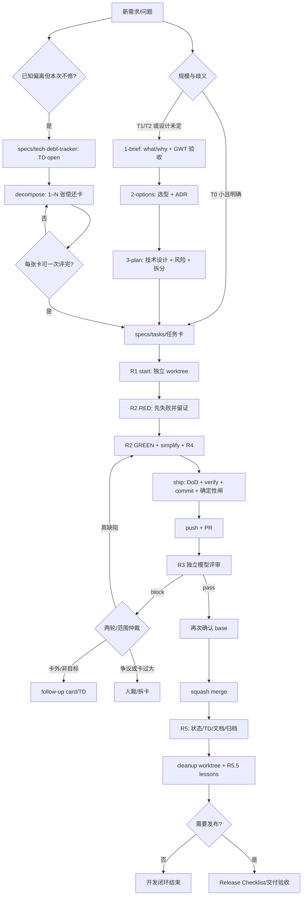

# MyInspection harness：需求到 merge 的完整链路与 R3 慢点诊断

> 截面日期：2026-08-19。本文是解释与诊断，不是新的流程真相源。发生冲突时，以
> [`CLAUDE.md`](../CLAUDE.md)、[`docs/DEVOPS-WORKFLOW.md`](DEVOPS-WORKFLOW.md)、
> [`specs/README.md`](../specs/README.md)、[`scripts/task.ps1`](../scripts/task.ps1) 和
> [`scripts/review.ps1`](../scripts/review.ps1) 为准。

## 先给结论

这个项目有两段相连的 harness：

1. **规划 harness**：把模糊需求收敛成 brief、ADR、PLAN 和可执行任务卡。
2. **交付 harness**：每张任务卡走 R1 worktree、R2 TDD、R3 独立评审、PR/squash merge、R5 文档同步与清理。

当前 R3 慢的首要设计错误是把 TD（登记/总验收单元）与任务卡（一次评审/一个 PR 的交付单元）强制成 1:1。
最主要的因果链是：

> TD2 未拆成多卡 → 单卡/PR 过大（PR #20 改 2,422 行）→ 初始 prompt 只能装约 1/3 diff → reviewer 需要继续读文件并可能跑约 13 分钟的 full selftest → 每轮可用 3,600 秒 → 修复又扩大 diff → 新一轮重新走 ship 后半段。

当前“两轮封顶”只记在某个 worktree 的 `.review/*.rounds`，并不是 PR 全局上限。换 worktree、重建 worktree 或人工 reset 后，同一个 PR 仍可继续产生更多 R3 轮次。PR #20 已有 **11 条 R3 结果评论**，说明这道止损机制没有限制住 PR 级总成本。

## 1. 先消除一个词义歧义：TD 到底是什么

在本仓：

- `TD2`、`TD16` 这类编号中的 **TD = Technical Debt（技术债）**。
- 用户常说的 **Technical Design（技术设计）**，本仓没有单独叫 `TD.md` 的工件；它由 `_local/PLAN.md`、`docs/adr/*.md` 和 `specs/tasks/*.md` 共同表达。

所以正常新需求不应该被强行“变成技术债”。正确分流是：

```text
正常新能力
需求 → brief → 选型/ADR → 技术 PLAN → 1–N 张任务卡 → 各自 R1–R5/PR/merge

已知偏离暂时不修
需求/评审发现偏离 → tech-debt-tracker 的 TD 行 → decomposition → 1–N 张右尺寸任务卡 → 各自 R1–R5/PR/merge → TD 总验收 → paid
```

只有“现在明确知道偏离了既定契约，但决定以后偿还”时，才登记技术债。

## 2. 全链路总图



重要边界：**merge 不等于发布**。这个 harness 明确不自动发布。真正上线还要走
[`docs/RELEASE-CHECKLIST.md`](RELEASE-CHECKLIST.md) 和需要的交付/真机验收。

## 3. 新需求怎样变成技术设计和任务卡

### Step 1：把需求写成可验收问题

输入可以只是一句话，例如：

> 用户导出 80 张照片的 PDF 时，要能在文件大小与小字清晰度之间选择。

对 T1 项目，先把它收敛为：

- 用户是谁、为什么需要；
- 本次做什么、不做什么；
- Given/When/Then 验收；
- 哪些决定必须由人批准。

工件是 `_local/1-brief.md`。它不入库，只是产品需求草稿。需求未批准前不写代码。

### Step 2：完成选型与 ADR

比较平台原生能力、现有实现、依赖、许可、迁移和维护成本。难逆选择进入 `docs/adr/`，临时比较落 `_local/2-options.md`。

例子里的设计问题可能是：

- 质量档位是只影响 PDF 采样，还是也重编码本机原图；
- 默认档是什么；
- 是否允许改变报告内容或 `data_hash`；
- 固定绝对 MB 是否可测，还是只保证固定夹具的大小单调性。

### Step 3：形成技术 PLAN

`_local/PLAN.md` 是技术设计真相源，至少要写：

- 目标、成功标准、非目标；
- 最薄端到端闭环；
- 模块/文件边界；
- 数据模型、状态机、错误路径；
- 任务依赖与冻结点；
- 每张卡可运行的 DoD。

对于上述 PDF 例子，仓库已经把偏离登记成 `TD130`：现有 PDF 卡只有固定采样参数，没有用户可选质量契约。偿还指针是 `T3-PDF-RENDERER`。这说明它同时经历了两件事：

1. 新需求扩充技术设计；
2. 发现当前计划与新目标有偏离，因此登记技术债，避免悄悄丢失。

### Step 4：投影成任务卡

任务卡不是第二份计划，而是 `task.ps1` 能执行的薄投影。核心字段如下：

| 字段 | 作用 | 错了会怎样 |
|---|---|---|
| `id` | 文件名、branch、worktree 的唯一主键 | `check-cards` 在 start 前拒绝 |
| `depends_on` | 依赖拓扑 | 依赖未合并就开工会返工 |
| `allow_paths` | 本 PR 可修改的文件围栏 | ship scope gate 非零退出 |
| `forbid` | 不能突破的硬边界 | R3 block |
| `non_goals` | 本卡明确不做的能力 | 顺手实现会触发 R3 #14 |
| `diagnosis` | bug/债项的根因与同类面 | 只修症状会触发 R3 #17 |
| `dod_command` | 实际执行的二值验收命令 | 非 0 不能 ship |
| `dod_assert` | 人能读懂的验收解释 | 命令与目标漂移会被评审指出 |
| `doc_sync` | merge 后要同步的状态和文档 | R5 未闭合 |

这里必须先做一次 **TD decomposition**：

```text
1 个 TD（登记/总验收单元）
  ├─ Task A → PR A
  ├─ Task B → PR B
  └─ Task C → PR C
全部子卡 merged + TD 总验收通过 → TD paid
```

一张好卡应是“**一次能评完、一次能验完**”的单元，而不是把整笔 TD 或同一里程碑的所有事情塞进一张卡。
小债可以拆解后确认只需一张卡；中大型债默认应产生多张依赖有序的卡。任务卡/PR 是交付尺寸，TD 是整体债务尺寸，
两者没有 1:1 约束。

## 4. 一张卡从 start 到 merge 的真实执行顺序

所有相位命令都从主检出 `D:\Projects\MyInspection` 执行；只在 `C:\wt\<TaskId>` 内编辑。

### 4.1 R1：start

```powershell
pwsh -NoProfile -File scripts\task.ps1 -TaskId T0-EXAMPLE -Phase start
```

脚本会：

1. 用 `check-cards.ps1` 验证卡片形状；
2. 创建同名 branch；
3. 创建 `C:\wt\T0-EXAMPLE` worktree；
4. 引导每棵树自己的 `.venv`/`node_modules`；
5. 打印本卡 DoD 和 TDD 提醒。

产物：独立 worktree。失败时不进入编码。

### 4.2 R2：先写失败测试，再铸 RED 证据

先在 worktree 内写能表达验收的失败测试，再从主检出执行：

```powershell
pwsh -NoProfile -File scripts\task.ps1 -TaskId T0-EXAMPLE -Phase red
```

`red` 会实际运行 `dod_command`，要求退出码**非 0**，然后写：

```text
C:\wt\T0-EXAMPLE\.review\T0-EXAMPLE.red
```

证据含 `taskId`、当前 `sha` 和 `dodExit`。`ship` 会校验内容和 SHA，不是只看文件存在。

纯文档/不可 TDD 的卡可显式 `-SkipRed`，但会记账；它不是默认捷径。

### 4.3 R2 GREEN + 清理 + R4

在 worktree 内：

1. 写最小实现让 DoD 变绿；
2. 重构并再次跑 DoD；
3. 用 mutation-survivor 证明测试真能杀掉目标缺陷；
4. 检查没有触碰冻结契约、卡外路径或非目标；
5. 首次 R3 前按质量 rubric 做一次本地同类扫描。

### 4.4 ship：确定性闸、PR、R3、merge

```powershell
pwsh -NoProfile -File scripts\task.ps1 -TaskId T0-EXAMPLE -Phase ship
```

远端 ship 的**可执行代码真实顺序**是：

| 顺序 | 动作 | 硬条件/产物 |
|---:|---|---|
| 1 | 再跑 `check-cards` | 防 start 后卡片漂移 |
| 2 | 检查 reviewer/账号 | 无 R3 后端则 push 前 fail-fast |
| 3 | 校验 `.red` | 本卡、非零、SHA 新鲜或 receipt 自洽 |
| 4 | 跑卡片 DoD | 必须 exit 0 |
| 5 | 跑 `scripts/verify.ps1` | 项目级离线回归必须 exit 0 |
| 6 | `git add` + commit | 铸造 watershed receipt，支持非原子 resume |
| 7 | 刷新 `origin/<base>` + scope gate | 所有改动必须属于 `allow_paths` |
| 8 | license gate | 禁列/未知许可按政策 fail-closed |
| 9 | secret gate | 密钥和被追踪机密必须为零 |
| 10 | push + 创建/复用 PR | PR base 必须等于本次评审 base |
| 11 | R3 | 独立 reviewer 必须输出 `pass` |
| 12 | merge 前再查 PR base | 防评审期间 PR 被 retarget |
| 13 | squash merge | 当前 client-enforced 路径直接合并 |
| 14 | 写 merge token | cleanup 才可安全删本地 branch |

当前 GitHub 仓库是 public，但查询不到任何 repository ruleset；`task.ps1` 仍走 client-enforced 直接合并路径。因此 GitHub CI `verify` 是信息性复跑，本地 ship 的 DoD/verify/R3 才是当前合并权威，CI 可能在 merge 后才结束。脚本内仍把这条分支称作 `free+private`，也是一处应同步的陈旧说明。

### 4.5 R5：文档、TD 和清理

merge 后要：

1. 任务卡 `status` 改为 `merged`；
2. 当前子卡的 PR/merge SHA 追加到 TD 偿还指针；只有全部子卡 merged 且 TD 总验收通过，才把技术债从 `carded` 改成 `paid`；
3. 更新 CLAUDE/README/board 中真正受影响的状态；
4. 已闭合卡和 TD 进入 archive；
5. 清理 worktree；
6. 有可复发经验才写 lesson。

```powershell
pwsh -NoProfile -File scripts\task.ps1 -TaskId T0-EXAMPLE -Phase cleanup
```

`cleanup` 有脏树守卫和 merge-token/在线 PR 校验，不会因为“看起来合过了”就盲删本地 branch。

## 5. R3 内部到底做了什么

R3 不是简单把 PR URL 发给模型。`review.ps1` 会：

1. 解析并钉死 base commit OID；
2. 从这个不可变 base 读取 `QUALITY-RUBRIC.md`；
3. 从同一个 base 读取任务卡与 `FrozenPaths`；
4. 生成 `base...HEAD` 的 `--stat` 和 unified diff；
5. unified diff 最多注入 **60,000 字符**，超出部分提示 reviewer 自己只读打开工作树；
6. 拼入整份 rubric、任务卡、冻结面和反提示注入规则；
7. 启动只读 Codex：`gpt-5.6-sol`、`high`、忽略用户级配置；
8. 等待 reviewer 写 `.review/<branch>.json`；
9. 只接受一行结构化 `pass|block`；
10. 校验退出码、可选 verdict SHA、文件安全性和可持久化性；
11. 回贴 `codex-review` commit status 和 PR 评论；
12. block 时递增 `.review/<branch>.rounds`。

R3 的输出必须是：

```json
{"verdict":"pass","reasons":[]}
```

或：

```json
{"verdict":"block","reasons":["<dimension> @ <file:location> — <why + fix>"]}
```

任何超时、没输出、坏 JSON、陈旧 SHA、路径不安全或无法保存裁决都按 fail-closed 处理。

## 6. 完整真实例子：小型 TD16 拆解后 N=1 → PR #12 → merge

### 6.1 问题被登记为 TD16

问题：多份权威文档把 `TD14`、`TD1`、`TD96`、`TD83` 指向错误或不存在的本地债项。后果是操作者沿错误指针排障。

tracker 行写清了：

- 后果：安全/治理/R3 读者被导向错误债项；
- 修法：逐处确认并替换为正确本地章节或显式 upstream 引用；
- 可测：source→target 映射夹具和单句回退变异；
- 前置：无，单独 worktree。

状态开始为 `open`。

### 6.2 TD16 decomposition 后确认一张卡足够

卡：[`T0-DEBT-REFERENCE-INTEGRITY`](../specs/archive/tasks/T0-DEBT-REFERENCE-INTEGRITY.md)

TD16 只涉及同一类“权威交叉引用完整性”，共享一个 seeded DoD，拆开反而会制造中间不一致，所以 decomposition 的结果是 N=1。
该卡把 TD 行扩成可执行合同：

- 7 个 `allow_paths`；
- 禁止重编号/改写 tracker 历史；
- 不做全仓历史 TD 重写；
- DoD = `selftest.ps1 -Shard seeded`；
- 目标 = 六个权威位置 + 语义验证 + targeted mutation。

状态变成 `carded`。这里的一张卡是**右尺寸判断结果**，不是“一债一卡”的默认规则。

### 6.3 R1/R2

```powershell
pwsh -File scripts\task.ps1 -TaskId T0-DEBT-REFERENCE-INTEGRITY -Phase start
# 在 C:\wt\T0-DEBT-REFERENCE-INTEGRITY 写失败夹具
pwsh -File scripts\task.ps1 -TaskId T0-DEBT-REFERENCE-INTEGRITY -Phase red
# 修实现、DoD 变绿
pwsh -File scripts\task.ps1 -TaskId T0-DEBT-REFERENCE-INTEGRITY -Phase ship
```

第一版 commit：`8cf3489`。

### 6.4 R3 第一轮 block

时间线（UTC）：

| 时间 | 事件 |
|---|---|
| 01:18:18 | 第一版 commit `8cf3489` |
| 01:20:53 | R3 block，约 2.6 分钟后 |

R3 指出：测试只做 whole-file Contains，漏掉两个具体回退点，不满足卡片自己的 behavioral fixture 要求。

这是一条**卡内真缺陷**，所以不新开 TD；直接在原卡修。

### 6.5 修复、pass、merge

| 时间 | 事件 |
|---|---|
| 01:37:02 | 修复 commit `1f302b2` |
| 01:39:59 | R3 pass，约 3 分钟后 |
| 01:40:02 | PR #12 squash merge，merge commit `e8bf550` |
| 01:41:05 | GitHub `verify` 完成；晚于 merge，因为当前 CI 是信息性复跑 |

闭环结果：

- [PR #12](https://github.com/Asun28/MyInspection/pull/12) merged；
- TD16 = `paid`，写入 PR #12 和 master SHA；
- 卡移入 `specs/archive/tasks/`；
- archive index 保留可追溯指针。

这就是一个健康的两轮闭环：首轮发现明确缺口，修复后次轮 pass，随后 merge。

## 7. 当前反例：为什么 PR #20 的 R3 take forever

### 7.1 当前状态快照

| 项 | 当前值 |
|---|---|
| TD | `TD2`：Gradle 主实现面许可扫描假绿 |
| 错误的单张偿还卡 | `T0-LICENSE-SCANNER` |
| PR | [#20](https://github.com/Asun28/MyInspection/pull/20) · OPEN |
| 当前 PR head | `b844635` |
| base | `master` @ `f2cca8b` |
| merge state | CLEAN |
| CI `verify` | SUCCESS，约 5 分 09 秒 |
| `codex-review` | 当前 head 无成功状态 |
| 卡片状态字段 | 仍是 `todo`，与真实 PR 状态漂移 |
| diff | 5 文件，+2,317 / -105，共 2,422 changed lines |
| 最大文件增量 | `scripts/selftest.ps1` +1,580；`check-licenses.ps1` +718 |
| unified diff | 182,069 字符 |
| R3 初始 diff cap | 60,000 字符，约只覆盖 33% |
| 基础 prompt payload | 至少约 85,374 字符（rubric + card + capped diff，未计固定指令） |

### 7.2 11 次 R3 结果

下面的“距前一 commit”包含 commit 后的 scope/license/secrets/push/PR/R3，因此是 ship 后半段耗时代理，不是纯模型 wall-clock。

| R3 结束 UTC | 前一 commit | 分钟 | 结果 |
|---|---:|---:|---|
| 08-18 00:32:51 | `1ef9b4a` | 1.2 | 基础设施 block：no output |
| 08-18 10:43:05 | `17984f0` | 27.4 | 质量 block |
| 08-18 10:50:35 | `17984f0` | 34.9 | 同一 head 又一条质量 block |
| 08-18 22:42:48 | `4575c6d` | 32.6 | 质量 block |
| 08-18 23:55:51 | `5b833c7` | 26.8 | 质量 block |
| 08-19 00:48:03 | `12b8953` | 20.2 | 质量 block |
| 08-19 01:43:08 | `e076e50` | 20.9 | 质量 block |
| 08-19 02:58:08 | `661cc43` | 24.1 | 质量 block |
| 08-19 03:54:59 | `33f43c9` | 27.7 | 900 秒 timeout block |
| 08-19 04:53:10 | `6507d30` | 7.4 | 质量 block |
| 08-19 05:18:01 | `6507d30` | 32.3 | 同一 head 又一条质量 block |

汇总：9 次质量 block、1 次 timeout、1 次 no-output；可见耗时代理中位数约 **26.8 分钟**。

### 7.3 真正慢点，按影响排序

#### 1. 根因：TD2 被错误地 1:1 投影成一张卡

卡标为 M，但 diff 达 2,422 行，且核心是许可/安全 fail-closed parser。它同时涉及：

- Gradle dependency graph；
- POM/XML；
- JSON exception schema；
- 跨平台 cache path；
- credential redaction；
- 全局 license policy wording；
- 1,580 行自测变更。

这些本应是同一 TD 下的多张依赖卡，却被“一债一卡”契约塞进同一 PR。这已经超过“单一可评审单元”，R3 每次都在做
近似全系统安全审计。**R3 超时是结果，错误的 TD→Task 1:1 decomposition 才是首要根因。**

#### 2. reviewer 首屏看不完整 diff

脚本只注入前 60,000/182,069 字符。模型必须自己打开剩余文件、定位 hunk、跑命令，review 不可能只用一次推理结束。

#### 3. 测试本身很贵，而且允许 reviewer 重跑

项目配置记录 full selftest 在评审沙箱约 13 分钟；模型若因退出码或证据不清重跑一次，就可能超过 1,800 秒。因此 timeout 被放宽到 3,600 秒。

提高预算避免误杀是正确的安全方向，但它也意味着一个坏/过大的 review 最多占一小时。

#### 4. 每次重 ship 不是只跑 R3

修复后重跑 ship 会重新执行 DoD、verify、范围、许可、密钥等闸，再到 R3。这样保证修复后的新 head 没有绕过确定性闸，但每轮都付完整成本。

#### 5. 两轮 cap 不是 PR 级 cap

`.review/<branch>.rounds`：

- 只属于当前 worktree；
- worktree 删除就消失；
- clone/另一个 worktree 有自己的计数；
- `-ResetRounds` 可清零；
- infrastructure block 也可能占用次数。

所以 PR #20 能远超两轮。当前 cap 只防“同一目录里无脑连续跑”，没有防“同一 PR 总体失控”。

#### 6. 卡片 scope 与全局 policy 有张力

卡的 `non_goals` 排除了 PyPI/npm scanner，但 diff 又修改了共享 license policy/共享扫描行为。R3 一度要求恢复 shared Scan 以尊重 non-goal，另一些轮次又因全局 EPL 政策要求 shared path 同步 fail-closed。

这是设计合同不够干净，不只是 reviewer 挑剔：

- 若新政策是全局的，卡就必须明确拥有所有生态共享面；
- 若本卡只做 Gradle，就不该顺带把全局政策写成所有生态已同步生效。

不先裁这个边界，reviewer 会在“范围越界”和“政策不一致”之间来回打。

#### 7. 可见状态漂移让恢复更难

- PR 已有 20 个 commits，任务卡仍写 `status: todo`；
- `task.ps1` 文件头和 `task-loop` skill 的摘要写成 review→push→PR；
- 可执行代码和权威 DEVOPS 文档实际是 push/PR→R3。

脚本本身仍按正确顺序执行，但 agent/人读摘要时可能误判当前腿，导致重复 review 或错误恢复。

## 8. 当前 PR #20 应该怎样收口

### Do now

1. **停止 blind retry R3。** 把 9 次质量 block 合并成一张 current-head closure checklist，逐项标出：已修代码、测试、mutation、当前 SHA 证据。
2. **把 TD2 重新 decomposition。** 推荐的依赖序列如下；名称是建议，尚未创建：

   | 子卡 | 单一产出 | 明确不做 |
   |---|---|---|
   | `T0-LICENSE-GRADLE-GRAPH` | 枚举 policy-relevant configuration、解析 concrete GAV、offline/native cache 边界 | POM policy、异常表、日志美化 |
   | `T0-LICENSE-POM-POLICY` | POM license 读取、禁列分类、exact-GAV exception schema | CI 接线、通用日志 redaction |
   | `T0-LICENSE-DIAGNOSTICS` | bounded/redacted/injection-safe 诊断输出 | 依赖图和许可判定语义 |
   | `T0-LICENSE-CI-INTEGRATION` | CI warm-up→offline scan 接线、policy/release 文档与 TD2 总验收 | 重写 scanner 核心 |

   因为这些卡会依次触及 `check-licenses.ps1`/`selftest.ps1`，应串行 merge，不是假并行。
3. **决定现有 PR 的保存策略。** watershed 后不能 rebase/amend；用前向 commit 把非首卡范围的改动剥离，或把当前 PR 明确降为第一张子卡，其余改动进入后续 PR。不要继续把四张卡的修复全堆回 #20。
4. **只对缩到右尺寸的 exact head 再跑一次 R3。** 若 reviewer 仍需读取被截断的大半 diff，说明拆分还不够。

watershed 后不要 rebase/amend/改写历史。需要缩 scope 时用前向 revert/剥离 commit。

### 不建议

- 不建议降 reviewer 模型或 effort 来求快；许可闸是安全/发布面。
- 不建议禁止 reviewer 验证；应让验证证据更便宜、更清楚、更可复用。
- 不建议用 `--no-verify`、手工伪造 `codex-review` 或只看 CI 绿就 merge。
- 不建议再用一个新 worktree 绕过 round cap 后继续无限尝试。

## 9. Harness 层的改进建议

### P0：把 TD decomposition 设为 `open → carded` 的必经闸

`carded` 不应只表示“随便找了一张卡接住 TD”，而应证明：

- 已列出 1–N 张卡和依赖顺序；
- 每张卡有单一产出、独立 DoD、收敛 `allow_paths`；
- 每张卡能形成一个正常体量 PR；
- TD 总验收与 `paid` 条件覆盖所有子卡，没有部分完成即误关债。

### P0：在进入 R3 前阻止不可评审的大卡

利用现有 60,000 字符 cap 做确定性预检：

- diff 超 60,000 字符时，ship 在 reviewer 启动前明确报告“首屏将截断多少”；
- 默认要求拆卡；
- 真正不可拆的冻结点/横切卡必须在卡里给出 large-review rationale、测试证据目录和同类面清单。

这不是少审，而是让 reviewer 每次拿到一个能完整审的单位。

### P1：把 round cap 绑定到 PR/head，而不是 worktree

至少记录：

- PR number；
- reviewed head SHA；
- base SHA；
- quality block 次数；
- infrastructure block 次数；
- reset 的人裁理由。

质量争议和配额/timeout/no-output 应分开计数，不能用同一个数字掩盖。

### P1：记录每条 ship leg 的真实耗时

目前 saga 记录“完成了哪条腿”，但没有持续时间。应输出 SHA 绑定的 timing receipt：

```text
DoD=...
verify=...
scope=...
license=...
secrets=...
R3 model-read=...
R3 test-exec=...
post-status=...
```

这样下一次不用靠 commit→评论时间猜 R3 到底慢在哪。

### P1：给 reviewer SHA 绑定的测试证据包

ship 已经跑过 DoD 和 verify。把命令、exit code、关键 sentinel、开始/结束时间、HEAD SHA 写成 reviewer 可读的 receipt。reviewer 仍可独立重跑，但证据清楚时不必因为“退出码是否丢失”重复跑整套。

### P2：自动同步任务卡状态

至少在：

- `start` 后提示/更新 `in-progress`；
- PR 创建后提示/更新 `in-review`；
- merge/R5 后更新 `merged` 并 archive。

如果不愿让脚本改 tracked file，也应生成单一 runtime status，而不是让 `status: todo` 长期撒谎。

### P2：修正文档顺序漂移

统一成可执行事实：

```text
deterministic local gates → push/create PR → R3/status → merge
```

需要同步的至少是 `task.ps1` 文件头、`task-loop` skill 摘要和所有高层流程图。权威 DEVOPS 文档当前描述是对的。

## 10. “完整结束”的验收定义

一项需求只有同时满足下面几层才叫完整：

### 需求层

- 用户故事与 Given/When/Then 被批准；
- 非目标写清；
- 难逆设计有 ADR/人裁。

### 实现层

- 所有依赖任务卡均 merged；
- 每张卡有真实 RED、GREEN、DoD；
- 项目 `verify` 绿；
- R3 对被 merge 的 exact head/base pass；
- PR squash merge 完成。

### 收口层

- 卡状态和 task board 不漂移；
- 技术债的全部子卡 merged、总验收通过后 `paid`，或经 ADR `accepted`；
- 卡/TD 已 archive；
- worktree/branch 安全清理；
- 必要 lesson 已回流。

### 用户价值/发布层

- 真机、场景或 e2e 验收完成；
- release checklist 完成；
- 若要求上线，部署/发布成功且可回滚。

**只 merge 代码而没做 R5，叫“实现已合并”；不自动等于“需求已完整交付”。**

## 11. 最短操作清单

```powershell
# 1. 卡已由批准的 PLAN/TD 投影出来
pwsh -File scripts\check-cards.ps1 -TaskId T0-EXAMPLE

# 2. R1
pwsh -File scripts\task.ps1 -TaskId T0-EXAMPLE -Phase start

# 3. worktree 内先写失败测试，然后主检出铸 RED
pwsh -File scripts\task.ps1 -TaskId T0-EXAMPLE -Phase red

# 4. worktree 内实现到绿、清理、mutation/self-review

# 5. 全闸、PR、R3、squash merge
pwsh -File scripts\task.ps1 -TaskId T0-EXAMPLE -Phase ship

# 6. R5 状态/TD/doc/archive 后清理
pwsh -File scripts\task.ps1 -TaskId T0-EXAMPLE -Phase cleanup
```

失败后先读 `T26-SHIPSAGA` 报告。标准恢复动作通常是修复后重跑同一条 `ship`；不要用 cleanup“重来”，也不要绕过范围/R3。

## 12. 证据来源

- 流程权威：[`docs/DEVOPS-WORKFLOW.md`](DEVOPS-WORKFLOW.md)
- 规划漏斗：[`docs/IDEA-TO-PLAN.md`](IDEA-TO-PLAN.md)
- 卡片合同：[`specs/README.md`](../specs/README.md)
- 交付编排：[`scripts/task.ps1`](../scripts/task.ps1)
- R3 实现：[`scripts/review.ps1`](../scripts/review.ps1)
- R3 rubric：[`docs/QUALITY-RUBRIC.md`](QUALITY-RUBRIC.md)
- R3 配置：[`scripts/_config.ps1`](../scripts/_config.ps1)
- 当前 TD tracker：[`specs/tech-debt-tracker.md`](../specs/tech-debt-tracker.md)
- 完成例卡：[`T0-DEBT-REFERENCE-INTEGRITY.md`](../specs/archive/tasks/T0-DEBT-REFERENCE-INTEGRITY.md)
- 完成 PR：[PR #12](https://github.com/Asun28/MyInspection/pull/12)
- 当前慢例：[PR #20](https://github.com/Asun28/MyInspection/pull/20)
