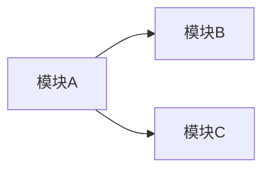
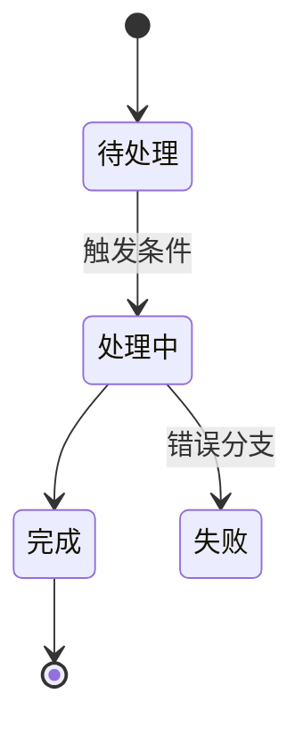
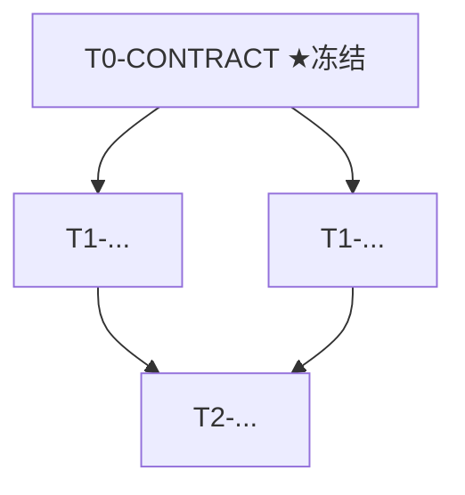

# 计划模板（复制为 `_local/PLAN.md` 后填写）

> **上游**：若还没想清「做什么/为什么」，先填一份产品简报 `docs/PROJECT-BRIEF-TEMPLATE.md`——它谈产品，本计划谈「怎么做」。简报批准后照本模板手工扩写。
>
> **用法**：`Copy-Item docs\PLAN-TEMPLATE.md _local\PLAN.md`，然后填写下面各节。
> `_local/` 已 gitignore，**计划是项目唯一真相源**，永不入库。
> 填好后用 `.claude/workflows/plan-forge.mjs`（审计 → 拆卡）或 `decompose-cards.mjs` 投影成
> `specs/tasks/*.md`。本模板的节标题与 `plan-forge.mjs` 的审计 lens 对齐——
> **不要删节**，没有内容的节写「本版无」而非留空（审计器会据节判完整性）。
>
> **可视化投影（L26 工具无关）**：本计划结构应有可视投影——依赖图（§7）/ 状态机（§5）/ 模块图（§4.5）默认用内嵌 **mermaid**（本地零依赖：VS Code 装 mermaid 预览扩展 / Obsidian / Typora 即渲染，随 `_local/PLAN.md` 不入库）；**UI 线框 / 原型**走已有的 `pencil MCP` / `frontend-flow`；需要托管、可分享、可批注的评审面时可选 Builder `visual-plan`（local-files 档，opt-in）。后端可换，「计划应有可视投影」这条标准不变。

---

## 1. 目标与边界
- **一句话目标**：MyInspection 要交付什么。
- **本版范围内**：明确列出本里程碑要做的能力。
- **本版砍掉 / 推迟**（防范围蔓延）：明确列出**不做**的；每条注明砍掉理由。**这些会被 `decompose-cards` 按影响域下沉到对应卡的 `non_goals` 字段**，供 R3 评审 #14 判「能力级越界（顺手多做）」——是 `allow_paths`（文件围栏）的能力级对偶。
- **成功标准**：怎样算这一版「完成」（与第 8 节的可机检验收呼应）。

## 2. 最小可验收闭环
- 端到端最薄的一条「输入 → 处理 → 可验收产物」路径。
- 这条闭环产出的**最终产物 + 合法元数据**是什么、存在哪（经 storage/派生层，不硬编码路径）。
- 这条闭环就是 `scripts/verify.ps1` 闸门 2 与 e2e 卡要跑通的东西。

## 3. 技术栈
- 语言 / 运行时 / 关键框架（与 `scripts/_config.ps1` 的 `PythonVersion` 等对齐）。
- 每个第三方依赖标注许可（GPL/AGPL/SSPL/非商用 = 禁；见 `docs/LICENSE-POLICY.md`）。

## 4. 目录结构
```
backend/ | frontend/ | scripts/ | docs/ | specs/ | samples/ | runtime/(gitignored)
```
- 列出本版会新建的关键目录/模块，及其职责（一行）。
- import 路径 / 包根要与此结构一致（否则 DoD 命令永远跑不绿——见 L16 类隐蔽坑）。

## 4.5 模块设计（模块化 / 扁平化 / 去中心化 · 先右尺寸）
> 设计期「做乘法」。`plan-forge` 的 `module-design` lens 会据此审。**先右尺寸**：小 MVP 默认**模块化单体**，别过度拆分（AI 最易在此过度工程）。没有内容写「本版无（单体即可）」。
- **模块化（高内聚低耦合）**：各模块单一职责；模块间靠显式接口/事件，不直读对方数据 / 不共享可变状态；依赖无环。
- **扁平化**：没有不必要的中间层 / 编排层 / adapter（删了它下游会重复逻辑吗？不会就删）；同步调用链别过深。
- **去中心化**：标出单点故障（SPOF）与能否降级；关键编排别集中一处；（若用 DDD）各 bounded context 自有数据与语言。
- **右尺寸声明**：本版**刻意不做**的分布式 / 微服务 / 队列化是哪些、为何（YAGNI）——过早分布式本身就是缺陷。

**模块投影**（把上面的模块关系画成依赖图；必须**无环**——有环即耦合缺陷，`plan-forge` 的 `module-design` lens 会据此审）：



## 5. 数据模型与状态机
- 核心实体 / 字段 / 关系。
- 状态机（若有）：状态集合 + 合法转移 + 触发条件。
- 契约层 ↔ 持久层 ↔ 对外 schema 三处模型须同构（plan-forge 的「内部矛盾猎手」lens 会逐字段查）。

**状态机投影**（若有状态机，填本版实际状态与合法转移；无则写「本版无」）：



## 6. Provider 契约 / 核心接口
- 接口签名 / schema 字段（**这是一等资产**）。
- **冻结时机**：哪张卡冻结契约/schema（冻结后改 = 版本评审 + 全下游返工）。
- mock → real 演进路径：承诺「只改注册表/适配层即可切换实现」是否在真实接入下成立。
- 把要冻结的文件登记到 `scripts/_config.ps1` 的 `FrozenPaths`。

## 7. 任务拆分（带依赖与可并行标记）
> 这是投影成 `specs/tasks/*.md` 的源。每张卡一行，标 `depends_on` 与可否并行。

> 优先级用 MoSCoW（MUST/SHOULD/COULD；Won't 的不进表，写到第 1 节"砍掉/推迟"）。MUST 必须二值："没它产品就废吗？"否则降 SHOULD。

| 卡 id | 优先级 | 产出（一句话） | depends_on | 可并行窗口 | 备注/冻结点 |
|---|---|---|---|---|---|
| T0-... | MUST | ... | [] | ‖ T0-... | |
| T0-CONTRACT | MUST | 契约/schema 冻结 | [T0-...] | — | ★冻结点 |
| T1-... | SHOULD | ... | [T0-CONTRACT] | ‖ T1-... | 各自 worktree，allow_paths 不重叠 |

**依赖投影**（把上表 `depends_on` 列画成图；冻结点标 ★；本地 mermaid 渲染、随计划不入库）：



- 冻结点（契约/schema 卡）必须在所有依赖它的卡之前。
- 声称并行的卡：`allow_paths` 必须互不重叠（各 worktree 合并不撞）。
- **每卡足够小（一个可评审/可验证单元）**：尺寸标准工具/模型无关——单一连贯产出（产出一句话讲得清、不含"且/和"多件事）、一条 `dod_command` 二值判一件事、能被一个评审者一次评审判完、自足（`plan_ref`/`notes` 让卡可独立开工）。量化缺省分两档：**默认档（保守）** 净改动约 ≤ 200–400 行、touched 文件 ≈ 1–3（最多 5）；**长自主档** 允许多文件/多子系统弧，但须显式声明并配间隔 fresh-context 校验（受支持模式）。**超默认档且未声明长自主执行 → 必拆**（开工即跑偏/返工），**过碎必并**（一函数/一行一张、测试与实现分卡都是过度拆分）。完整定义见 `.claude/workflows/decompose-cards.mjs` 的尺寸判据；`plan-forge` / `decompose-cards` 会按此审。
- **债务清扫捆绑卡（微修批处理例外）**：一批**同类小修**（去模型名、改措辞、补 warn 文案之类）不必各拆一张卡——各付一遍 R1–R5（worktree / 评审 / PR）开销不划算（教训：T3 波 8 张微卡各付全额闭环）。可**一卡捆绑 N 个相关微修**：`dod_command` 逐项断言（每个微修一条可机检断言）、共用一个 worktree / 一次评审 / 一个 PR。前提仍是"一个可评审单元"——捆绑项须同类、能被一次评审判完、`allow_paths` 收敛；跨子系统或需分别评审的别硬捆。

## 8. 验收（每张卡 = 命令 + 退出码 + 断言 三元组）
> 对应 `specs/tasks/_TEMPLATE.md` 的 `dod_command` / `dod_exit` / `dod_assert`。

| 卡 id | dod_command（目标 shell 真能跑、二值可判） | 退出码 | 断言 |
|---|---|---|---|
| T1-... | `uv run python -m pytest backend/tests/test_x.py -q` | 0 | ... |

- 命令必须机器可判（不靠人眼读输出）；用到的依赖须在该卡 `allow_paths` / 依赖清单内。

## 9. 风险清单
- 「前期错则后面白干」的根本决策（契约/冻结点/数据模型/依赖许可/合规）排最前。
- 每条：风险 → 影响 → 缓解 / 前置决策。
- 这些会被 `plan-forge.mjs` 的对抗核验逐条压测。

## 10. 合并之后（交付/运维 · 占位 · 方法论见 `docs/DELIVERY-OPS.md`）
> 想法→合并之外的 opt-in 层。小项目每节可写「本版无」。
- **可观测**：关键路径/错误分支的结构化日志字段（须含 请求ID / 用户ID / 关键参数；机密脱敏）。本版无 => 写明。
- **集成/e2e 验收**：哪些主流程 + 模块接缝要有集成/e2e 覆盖（不只单卡 DoD），接到 `verify.ps1` 闸门 2 / `docs/EVAL.md`。
- **发布策略**：灰度 / feature-flag / 回滚路径（小项目可写「本版无，直接全量」）。
