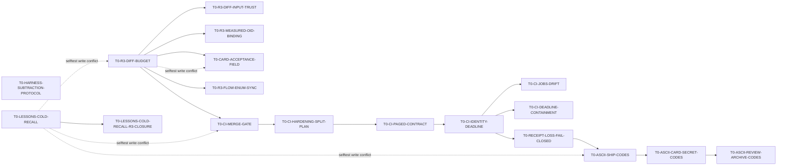

# TASK-BOARD — 任务/模型路由总表（v1 · 2026-08-14）

> **这张表管「谁做哪张卡、用什么档」**；每张卡的完整上下文包/验收在 `specs/tasks/<id>.md`；**状态以卡为准**（本表不追状态，防双源漂移）。
> 计划真相源 `_local/PLAN.md`；设计决策 `docs/adr/0001–0004`；需求 `docs/inspection-app-requirements.md`。
> 执行形态：每卡走 R1–R5（`scripts/task.ps1` start→ship），R3 评审恒 = **GPT-5.6 Sol**（`scripts/_config.ps1` 已钉；Sol 原则上不作同卡作者）。

## 模型席位（性价比路由原则）
| 席位 | 模型 | 用在 | 理由 |
|---|---|---|---|
| 工作马（默认） | **DeepSeek V4 Pro** | 规格清晰、契约已冻结的实现/测试/内容卡 | 最高性价比；卡内上下文包给足即可靠 |
| 设计/新颖单点 | **Opus 5** | 相机、PDF composer、加密格式、法律边界引擎 | 错误代价高或无先例可抄的卡 |
| 中档实现 | **Sonnet 5（max effort）** | 标准 Compose UI、Android 平台适配、本机装环境 | android 细节多但模式成熟 |
| 中档替补/只读消化 | **GPT-5.6 Terra** | WorkManager/通知类中档卡、大体量文档消化 | 分流 + 交叉视角 |
| 轻档内容/交叉复核 | **GPT-5.6 Luna Max** | 双语内容卡的第二双眼睛（抄录错编译不报错） | 便宜的独立复核 |
| 评审席（固定） | **GPT-5.6 Sol** | 全卡 R3 合并闸 + 安全面复核 | 已钉 `_config`；作者≠评审 |

效果档说明：effort 值为执行 harness 通用档（low/medium/high/max）；「难度」= 该卡对模型能力的真实要求（S 机械 / M 中档 / H 难 / H+ 最难）。

## 总表（波次 = 依赖拓扑；同波卡可并行，allow_paths 互不重叠）
| 波 | 卡 id | 产出（一句话） | depends_on | 难度 | 首选模型 · effort | 备选 | 内容交叉复核 |
|---|---|---|---|---|---|---|---|
| W0 | T0-TOOLCHAIN | JDK17+SDK+`android/` Gradle 骨架空编译绿+verify/ci 收紧 | — | M | Sonnet 5 · max | Opus 5 | **merged**（本地合并 `eb22da38`；R3 pass 证据 `5fec73c`） |
| W0 | T0-GATE-HARDENING | 许可闸递归发现+verify 确定性+两枚闸门自测（拆自 T0-TOOLCHAIN） | T0-TOOLCHAIN | M | Sonnet 5 · max | DeepSeek V4 Pro | **merged**（本地合并 `5ba3319e`；事后 R3 finding 由 T0-GATE-FIXFORWARD PR #4 `6f255d35` 结清） |
| W0 | T0-HARNESS-PERF | 横切优化 selftest 与 CI 墙钟时间（约 300 行 harness 改动） | T0-GATE-HARDENING | M | Sonnet 5 · max | DeepSeek V4 Pro | **merged**（master `fc1e763f`，PR #1） |
| W0 | T0-SCAFFOLD-LEAN-CI | 普通产品 PR 不启动 scaffold-only 六分片；脚手架权威面变化仍全跑 | T0-HARNESS-PERF | S | GPT-5.6 Terra · high | DeepSeek V4 Pro | **merged**（master `f976d0f`，PR #22；R3 零发现；基线产品 PR #5–#11 = 60 runs / 360 shard jobs；本次 `.github/**` PR 实测 1 run / 6 jobs 全保留；无新增脚本/job/依赖） |
| W0 | T0-R3-DIFF-BUDGET | pre-push/R3 按真实 changed lines + diff chars fail-closed，超大卡必须拆 | T0-DEBT-R3-CARD-BASELINE,T0-DEBT-SELFTEST-CRITICAL-PATH | M | GPT-5.6 Terra · high | Sonnet 5 max | **merged**（master `b82054bc`，PR #128；度量/边界/ship 接线已落地，输入可信与 OID 绑定仍由后两张专卡承接） |
| W0 | T0-R3-DIFF-INPUT-TRUST | diff 预算的输入只信 git 自己：ext-diff/textconv/属性二进制均不可缩小体量 | T0-R3-DIFF-BUDGET | S | GPT-5.6 Terra · high | Sonnet 5 max | A5 是**已复现**的真绕过：一行 .gitattributes `-diff` 让 1001 行量成 1 行 |
| W0 | T0-R3-MEASURED-OID-BINDING | 被测量的提交＝被 push/评审/合并的那一个（分支引用与 HEAD 双钉） | T0-R3-DIFF-BUDGET | S | GPT-5.6 Terra · high | Sonnet 5 max | 第 3 轮 finding：只钉分支引用时 detached HEAD 可「审 A 合 B」 |
| W0 | T0-R3-FLOW-ENUM-SYNC | 预算闸补进每一处确定性闸枚举 + 每处一条锚定断言（承接母卡 A13） | T0-R3-DIFF-BUDGET | S | GPT-5.6 Terra · high | Sonnet 5 max | **merged**（master `d19a4c22`，PR #200；17 个枚举面一一登记并逐处删除变异，补齐 English overview、跨行/顺序/Step 锚定与 lone-CR 防回归；workflow + seeded + SizeOnly、Luna/Terra Max 复核与 Sol R3 均 PASS；R5 candidate `74328b2d` released-master verify + seeded exit 0，含 canary、ADDED/REMOVED、cleanup 与 `selftest: PASS`） |
| W0 | ~~T0-R3-DIFF-BUDGET-R3-CLOSURE~~ | **已退役**（2026-08-23）：人裁选路线 2，第 2 轮两项 finding 已在原卡修完；余下契约由上面两张拆卡承接 | — | — | — | — | 退役理由见 T0-R3-DIFF-BUDGET「拆分依据」 |
| W0 | T0-CI-MERGE-GATE | 候选 CI 运行时 + 一红一绿的远端行为证明（TD134 1a/6） | T0-R3-DIFF-BUDGET | M | GPT-5.6 Luna · max | GPT-5.6 Terra · max | **merged**（master `56c02c0f`，PR #207；R3 后钉定候选 head，消费 ci.yml workflow/jobs，复核 base/head 后以 `--match-head-commit` 合并；一红一绿 hermetic + unrelated-CWD 证明；DoD/verify/R3 PASS；R5 candidate `25d3a95c` released-master `selftest -Shard seeded-remote` exit 0，含 T37-REMOTEMX/1–4 与 `selftest: PASS`） |
| W0 | ~~T0-CI-HARDENING-MATRIX~~ | **已退役且未合并**：PR #214 reviewed head `cce6fa5e`（verify green，量测 59713/60000）经 R3 第 1 轮 block「分页条目无稳定身份 ⇒ 重放页凑满 total_count、掩盖未读到的红 run 并走到 merge」；修复该发现后又暴露 PR 关联大小写不敏感与旧 mock 缺 id 两处真缺陷，exact head `2ce7aa0f` 本地量测 **61092** 超 60000 闸（超限主因是长 JSON 行区的 hunk 上下文，非行数：524/1000） | — | — | — | — | 由 PAGED-CONTRACT→IDENTITY-DEADLINE 承接；成果只读保全于 `wip/T0-CI-hardening-validated` |
| W0 | T0-CI-HARDENING-SPLIT-PLAN | 把候选 CI 硬化卡拆成分页契约与身份/deadline 两张可读串行卡（TD134 1b/6 规划） | T0-CI-MERGE-GATE | S | GPT-5.6 Luna · max | GPT-5.6 Terra · max | **merged**（master `7c426cd1`，PR #216，R3 第 3 轮 pass；前两轮 6 条 finding 全属实且同类——断言面宽于契约，末轮按类一次性锚到判定行）|
| W0 | T0-CI-PAGED-CONTRACT | 分页读取的形态、总数、稳定身份与跨页重放契约（TD134 1b/6 之一） | T0-CI-HARDENING-SPLIT-PLAN | M | GPT-5.6 Luna · max | GPT-5.6 Terra · max | **merged**（master `86bf1a42`，PR #218，R3 **第 1 轮 pass 零发现**；新闸 `T37-CIGATE/API-CONTRACT` 端到端 27 例：三 endpoint 各跑形态/严格 total/跨页重放，完整畸形+id 矩阵在 check-runs 跑一遍，另 3 条有效分页正例 + 1 条「第二页红 check」消费证明；6 枚函数级变异 + 2 枚 A4 端到端变异全杀（删 `$seen.Add` ⇒ 重放页凑满 total_count 并**合并成功**，正是本卡要封的洞）；DoD/verify/R3 PASS；R5 candidate `86bf1a42` released-master `selftest -Shard seeded-remote` exit 0，含 `T37-CIGATE/API-CONTRACT OK` 与 `selftest: PASS`。遗留：该分片墙钟由约 2.5 min 增至约 9.6 min，已记 TD163） |
| W0 | T0-CI-IDENTITY-DEADLINE | run 身份绑定与最终 exact-head/base 快照（TD134 1b/6 之二） | T0-CI-PAGED-CONTRACT | M | GPT-5.6 Luna · max | GPT-5.6 Terra · max | **merged**（master `424009ee`，PR #220，R3 于重置后第 2 轮 pass；累计 4 轮、3 轮出实质 finding）。落地 `T37-CIGATE/WORKFLOW-BINDING`：逐层身份绑定（本地 HEAD ≡ PR headRefOid ≡ run head_sha → run id/attempt → 终局快照 → merge --match-head-commit）、`path`/`event`/`pull_requests[].number` 三处**大小写敏感**比较、终局 exact-head/base 快照四态（LOCAL-HEAD-MOVED / BASE-MOVED / BASE-MISMATCH / HEAD-MOVED）、`-NoAutoMerge` 不放松任何一层；每条负例断言专属哨兵 + 精确读计数 + 未触达合并 + 效果账本点名被造坏那一处；5/5 单点变异 KILLED。**两次拆卡**（皆用户裁定）：diff 超 R3 字符预算 ⇒ `T0-CI-JOBS-DRIFT`；R3 连续三轮实质 finding 皆落 deadline/进程树 ⇒ `T0-CI-DEADLINE-CONTAINMENT` |
| W0 | T0-CI-JOBS-DRIFT | 候选 run 返回 job 集与 ci.yml 声明集的漂移判定（API 侧平面） | T0-CI-IDENTITY-DEADLINE | S | GPT-5.6 Luna · max | GPT-5.6 Terra · max | 从 T0-CI-IDENTITY-DEADLINE 拆出（该卡 diff 61233 字符 > R3 60000 预算，按 DEVOPS-WORKFLOW §35 拆卡）。实现与 6 条夹具已在前卡分支跑绿，存档 scratchpad `pre-split-full.patch`；**按未经审阅的新代码逐行读**，绿相不构成证据 |
| W0 | T0-CI-DEADLINE-CONTAINMENT | 单一 wall-clock deadline 扩面（gh+git）与 fail-closed 进程树容纳 | T0-CI-IDENTITY-DEADLINE | M | Opus 5 · xhigh | GPT-5.6 Sol · max | 从 T0-CI-IDENTITY-DEADLINE 二次拆出：R3 连续三轮的实质 finding **全部**落在这段机器上（无界 WaitForExit / 单点挂起分辨不出共享预算 / 子进程早退致孙进程漏杀 / 清理余量串行花两遍 / 容纳非 fail-closed + 句柄泄漏 + assign 竞态）。起点 scratchpad `pre-a3-split.patch`，**带着 r3 点名的全部缺陷**；平台原语选型（Windows job object vs POSIX 进程组、挂起创建）是本卡正题 || W0 | T0-RECEIPT-LOSS-FAIL-CLOSED | receipt-loss 禁止第二套 review/CI/merge，恢复不到 T35 receipt 就保持未合并（TD134 1c/6） | T0-CI-IDENTITY-DEADLINE | M | GPT-5.6 Luna · max | GPT-5.6 Terra · max | 串行终点；下游 ASCII ship codes 依赖本卡 |
| W0 | T0-GATE-ID-UNIQUENESS | 闸号唯一性机检 + 锚点唯一性与自身 parse 自检 | — | S | GPT-5.6 Terra · high | Sonnet 5 max | **merged**（master `b1e5f0b5`，PR #186；闸头/Fail 文案双面 AST+token 扫描、重复 id 全位置诊断、唯一 raw 插入锚、ParseFile、6 类删除变异；core/workflow/verify 与 R3 全绿；TD146 paid） |
| W0 | T0-GRADLE-RUNTIME-FILE-INPUTS | 测试运行期读的仓内文件声明为 Gradle 测试输入，消除「改了权威文件仍 UP-TO-DATE」的假绿 | — | S | GPT-5.6 Terra · high | Sonnet 5 max | **merged**（2026-08-29，master `6fda9f88`，PR #188；精确声明配置、模板与源码输入，补全双语 tuple 哈希守卫，T3/T4 DoD 强制真实执行；变异、verify、R3 全绿） |
| W0 | T0-CARD-ACCEPTANCE-FIELD | 把 acceptance 封闭验收集合登记为正式卡片字段 + 形态机检（可选字段、缺失只告警） | T0-R3-DIFF-BUDGET | S | GPT-5.6 Terra · high | Sonnet 5 max | 四张卡已在用该字段而 `specs/README.md` 字段表无此行；机检只判形态（编号 A1..An 连续），不判条目精度。与 5 张在飞卡共用 selftest.ps1，须排在其后 |
| W0 | T0-CI-DOCS-FAST-PATH | 纯文档 PR 保留轻量 verify 状态，跳过 Android/Gradle 重闸（TD159） | — | S | GPT-5.6 Terra · high | Codex R3 | **merged**（PR #114 · master `620fb43`；两轮 R3 后人裁；docs-only lane 保留 cards/archive/secrets） |
| W0 | T0-CI-UNICODE-DEP-FIXTURE | 补齐 license scanner 自检夹具的 Unicode helper 依赖并防止 17p3 假绿 | T0-DEBT-LICENSE-SCALAR-FORMAT | S | GPT-5.6 Terra · high | Codex R3 | **merged**（PR #120 · master `bb0c199`；两处 fixture 依赖齐备，17p3 锚定 `gpl-pkg@1.0.0`，seeded/R3 PASS） |
| W0 | T0-CI-LICENSE-GATE-HASH-SYNC | 同步 docs-only License gate 的 8.2b2 规范块哈希 | T0-CI-DOCS-FAST-PATH | S | GPT-5.6 Terra · high | Codex R3 | **merged**（失败 run `32535429955` 定位到 8.2b2 基线漂移；PR #122 · master `5b2e5a5`；本地 core/verify 与 R3 PASS，合并后 run `32538957860` 的 Windows/Linux core 双绿） |
| W0 | T0-HARNESS-SUBTRACTION-PROTOCOL | 量化、可迁移、按组可回滚的 harness 减负协议（TD134 2/6） | — | S | GPT-5.6 Terra · high | DeepSeek V4 Pro | **merged**（master `e971ef8`，PR #24；R3 零发现；只增 15 行协议文本，无实际删减或脚本行为变化） |
| W0 | T0-LESSONS-COLD-RECALL | 一次性 lesson 归冷、热冷统一检索和 ID 并集（TD134 3/6） | — | M | DeepSeek V4 Pro · high | GPT-5.6 Terra · high | **merged**（master `1e302201`，PR #51；round-cap 后人裁，剩余 meta 解析转专卡） |
| W0 | T0-LESSONS-CAP-CORE-SPLIT | 从超预算 PR #127 提取 resident-id 共享核与 lessons 消费者 | — | S | GPT-5.6 Sol · high | Codex R3 | **merged**（master `116a5f76`，PR #133） |
| W0 | T0-LESSONS-CAP-TRIAGE-DOCS-SPLIT | 先同步 triage 探针 roster，解除代码片的既有 doc-count 闸循环 | T0-LESSONS-CAP-CORE-SPLIT | S | GPT-5.6 Sol · high | Codex R3 | **merged**（master `65fcfa08`，PR #136） |
| W0 | T0-LESSONS-CAP-TRIAGE-SPLIT | 从超预算 PR #127 提取 lessons triage 探针与 hermetic 夹具 | T0-LESSONS-CAP-TRIAGE-DOCS-SPLIT | S | GPT-5.6 Sol · high | Codex R3 | **merged**（master `74d09a69`，PR #137） |
| W0 | T0-TRIAGE-EVIDENCE-CASE | triage 裁决证据身份、HEAD 绑定与失败可观测性 | T0-LESSONS-CAP-TRIAGE-SPLIT | S | GPT-5.6 Sol · high | Codex R3 | PR #137 R3 fix-forward；独立于 exact extraction；actual-root case、per-root SHA、unreadable/unknown finding |
| W0 | T0-LESSONS-CMD-DOCSYNC | lessons.ps1 纳入 doc-drift 机检 + archive 子命令同步三处命令清单 | T0-LESSONS-COLD-RECALL | S | GPT-5.6 Terra · high | Sonnet 5 max | **merged**（master `c92018d2`，PR #202；R5 `c163ae89`，released-master final `6dd963a4`；DocSyncMap 已含 `lessons.ps1`） |
| W0 | T0-LESSONS-BUMP-PLANE | bump 写主检出账本，复发计数不再随卡片 diff 丢失（含 L226/L106 晋升裁断） | — | S | DeepSeek V4 Pro · high | Sonnet 5 max | **merged**（master `edc2770`，PR #129；R3 第 4 轮 pass 零发现——前 3 轮：1 轮 3 条全是基线陈旧假象、2/3 轮各 1 条真缺陷；另有 R3 前 codex 预审再出 2 条真缺陷，合计 8 枚变异全杀） |
| W0 | T0-DEBT-LESSONS-BUMP-SUBMODULE-ROOT | bump 在 submodule 中按 Git 声明的主工作树写自己的仓库级账本（TD145） | — | S | GPT-5.6 Terra · max | GPT-5.6 Luna · max | **merged**（master `6c227115`，PR #197；真实 primary/linked submodule、fail-closed 变异、verify 与 R3 全绿） |
| W0 | T0-RECONCILE-DATA-AUTHORITY | 同步数据库生命周期、离线安全与备份权威文档 | T0-RECONCILE-LESSONS | S | GPT-5.6 Terra · high | Sonnet 5 max | **merged**（master `86c86eec`，PR #151；调和 1/12） |
| W0 | T0-RECONCILE-T1-SECURITY-CARDS | 登记数据库生命周期与 Android 本地安全三张实现卡 | T0-RECONCILE-DATA-AUTHORITY | S | GPT-5.6 Terra · high | Sonnet 5 max | **merged**（master `a403a757`，PR #152；调和 2/12） |
| W0 | T0-RECONCILE-T5-DIAGNOSTIC-CARDS | 登记事件、诊断、清除与本机健康四张实现卡 | T0-RECONCILE-T1-SECURITY-CARDS | S | GPT-5.6 Terra · high | Sonnet 5 max | **merged**（master `bdc85f10`，PR #153；调和 3/12） |
| W0 | T0-RECONCILE-ROADMAP-INDEX | 将七张卡投影到任务表和技术债索引 | T0-RECONCILE-T1-SECURITY-CARDS,T0-RECONCILE-T5-DIAGNOSTIC-CARDS | S | GPT-5.6 Terra · high | Sonnet 5 max | **merged**（master `782471da`，PR #154；调和 4/12） |
| W0 | T0-RECONCILE-DESIGN-METADATA | Field Ledger 可机读 tokens 与组件注册表 | — | S | GPT-5.6 Terra · high | Sonnet 5 max | **merged**（primary master `5e67e0cd`，PR #155；fixture follow-up master `281dff2e`，PR #156；调和 5/12） |
| W0 | T0-RECONCILE-DESIGN-JOURNEYS | 信息架构、导航恢复与离线隐私旅程 | T0-RECONCILE-DESIGN-METADATA,T0-RECONCILE-T5-DIAGNOSTIC-CARDS | S | GPT-5.6 Terra · high | Sonnet 5 max | **merged**（primary master `85bdf1df`，PR #160；fixture follow-up master `94b92146`，PR #163；调和 6/12） |
| W0 | T0-RECONCILE-DESIGN-COMPONENTS | 组件合同、对比度、动效与无障碍规则 | T0-RECONCILE-DESIGN-JOURNEYS | S | GPT-5.6 Terra · high | Sonnet 5 max | **merged**（primary master `e139eee2`，PR #169；fixture follow-up master `e7ce52cc`，PR #171；调和 7/12） |
| W0 | T0-RECONCILE-UI-COVERAGE | UI elements 页面与组件覆盖索引 | T0-RECONCILE-DESIGN-COMPONENTS,T0-RECONCILE-ROADMAP-INDEX | S | GPT-5.6 Terra · high | Sonnet 5 max | **merged**（master `9c8cfcda`，PR #175；调和 8/12） |
| W0 | T0-RECONCILE-UI-CAPTURE | 采集、历史与 PDF 卡的设计指针 | T0-RECONCILE-UI-COVERAGE | S | GPT-5.6 Terra · high | Sonnet 5 max | **merged**（master `622ebea8`，PR #176；调和 9/12） |
| W0 | T0-RECONCILE-UI-NOTICE-SCHEDULE | 通知与日程卡的设计指针 | T0-RECONCILE-UI-COVERAGE | S | GPT-5.6 Terra · high | Sonnet 5 max | **merged**（master `96dbc81d`，PR #177；调和 10/12） |
| W0 | T0-RECONCILE-UI-OFFLINE-OPERATIONS | 备份、媒体、remediation、smoke 的离线体验指针 | T0-RECONCILE-UI-COVERAGE,T0-RECONCILE-ROADMAP-INDEX | S | GPT-5.6 Terra · high | Sonnet 5 max | **merged**（PR #178 先入 integration；同一结果由 PR #179 合入 master `5235ffe4`；调和 11/12） |
| W0 | T0-RECONCILE-LESSONS | 当前 schema 下归并仍可复现的本地经验 | — | S | GPT-5.6 Terra · high | Sonnet 5 max | **merged**（primary master `e60fec91`，PR #148；fixture follow-up master `3bcd1cc9`，PR #150；调和 12/12） |
| W0 | T0-LESSONS-COLD-RECALL-R3-CLOSURE | PR #51 round-cap 后规范 meta 行锚定解析（TD144） | T0-LESSONS-COLD-RECALL | S | GPT-5.6 Terra · high | Sonnet 5 max | 原 PR 先人裁；只补正文诱饵/缺失/重复/非法 meta fail-closed |
| W0 | T0-ASCII-SHIP-CODES | ship saga/CI gate 的机器断言改锚 ASCII code（TD134 4/6） | T0-RECEIPT-LOSS-FAIL-CLOSED | M | GPT-5.6 Terra · high | DeepSeek V4 Pro | 只改观测面，不改控制流 |
| W0 | T0-ASCII-CARD-SECRET-CODES | check-cards/check-secrets 状态码迁移（TD134 5/6） | T0-ASCII-SHIP-CODES | S | GPT-5.6 Terra · high | DeepSeek V4 Pro | 状态码 wave 2a |
| W0 | T0-ASCII-REVIEW-ARCHIVE-CODES | review/archive/init 剩余状态码迁移与 TD134 总验收入口（TD134 6/6） | T0-ASCII-CARD-SECRET-CODES | M | GPT-5.6 Terra · high | Sonnet 5 max | 全六卡 merged + 总验收才可 paid |
| W0 | T0-GATE-FIXFORWARD | 许可闸路径比较改 OS 感知 + 发布清单收敛为单一解锁路径 | T0-GATE-HARDENING | M | Sonnet 5 · max | DeepSeek V4 Pro | **merged**（master `6f255d35`，PR #4；R3 pass） |
| W0 | T0-LICENSE-SCANNER | 产出四张批准 classpath 图的 concrete GAV + offline wrapper 基础（TD2 1/5；PR #20 缩 scope） | T0-GATE-HARDENING | M | DeepSeek V4 Pro · high | Sonnet 5 max | **merged**（master `035df10`，PR #25；23 个 graph mutation、4 图/150 GAV 真实离线扫描、Sol R3 pass；TD2 仍 carded） |
| W0 | T0-LICENSE-POLICY | POM 安全读取、许可分类与 exact-GAV exception（TD2 2/5） | T0-LICENSE-SCANNER | M | DeepSeek V4 Pro · high | Sonnet 5 max | **merged**（master `04f80fd`，PR #26；30 个 policy mutation、150 GAV strict 离线扫描、verify/CI 绿；R3 两轮修复后达 cap，经用户人裁批准；TD2 仍 carded） |
| W0 | T0-LICENSE-DIAGNOSTICS | scanner 诊断有界、脱敏、不可注入且不改失败语义（TD2 3/5） | T0-LICENSE-POLICY | M | GPT-5.6 Terra · high | Sonnet 5 max | **merged**（master `e3b52c7`，PR #27；18 个 diagnostics mutation、graph/policy 回归、150 GAV strict 离线扫描与 verify 绿；R3 round cap 后按记录人裁；TD2 仍 carded） |
| W0 | T0-LICENSE-GAV-BOUNDS | GAV 每段上界，使 exact accepted coordinate 与有界诊断可同时成立（TD135；TD2 4/5） | T0-LICENSE-DIAGNOSTICS | M | GPT-5.6 Terra · max | Sonnet 5 max | **merged**（master `f61f586`，PR #28；255/256 共享边界、5 个入口 mutation、graph 23/policy 30 回归、150 GAV strict 离线扫描、R3 pass；TD135 paid，TD2 仍 carded） |
| W0 | T0-LICENSE-CI-INTEGRATION | CI warm-up→offline scan、文档同步与 TD2 总验收（TD2 5/5） | T0-LICENSE-GAV-BOUNDS | S | GPT-5.6 Terra · high | DeepSeek V4 Pro | **merged**（master `1e283297`，PR #49） |
| W0 | T0-LICENSE-CI-INTEGRATION-R3-CLOSURE | PR #49 round-cap 后活跃接线断言与 cold 聚合语义（TD143） | T0-LICENSE-CI-INTEGRATION | S | GPT-5.6 Terra · high | DeepSeek V4 Pro | 原 PR 先人裁；不恢复旧内联 fixture、不重审 scanner 核心 |
| W0 | T0-DEBT-TASK-INVENTORY | 移除 CLAUDE.md 易漂移的静态任务卡库存数（偿还 TD21） | — | S | GPT-5.6 Terra · max | Sonnet 5 max | **merged**（master `53eebf9`，PR #13；当前阶段改用活卡/归档真相源，无静态库存；句级分类器覆盖同栏历史计数、`cardboard` 边界与 `active cards`，Sol R3 pass；TD22 另卡） |
| W0 | T0-DEBT-SEEDED-CLOSURE-SCOPE | 让 17cc 变异闭包显式携带断言器（偿还 TD23；TD21 再审前置） | — | S | GPT-5.6 Terra · max | Sonnet 5 max | **merged**（master `39ea794`，PR #14；独立 worktree，真实 A/B mutation 在外层 helper 解绑后仍保持 exact marker/exit/control/SHA，Sol R3 pass；未混入 TD21） |
| W0 | T0-DEBT-CASE-PROBE-CLOSURE-SCOPE | 让 17cc case mutation 闭包显式携带探针函数（偿还 TD25） | — | S | GPT-5.6 Terra · max | Sonnet 5 max | **merged**（master `b7efd94`，PR #15；File/Command 两宿主 seeded 全绿，删除 capture 与恢复裸调用均命中专属 TD25 诊断，Sol R3 pass） |
| W0 | T0-DEBT-R3-CARD-BASELINE | 让 R3 与范围闸读取同一 pinned-base 任务卡（偿还 TD3） | — | S | GPT-5.6 Terra · max | Sonnet 5 max | **merged**（master `6eec97f`，PR #16；R3 卡片、diff、rubric 与 FrozenPaths 均钉到同一不可变 OID；base 卡非普通 blob、读取/探测失败均 fail-closed；Sol R3 pass） |
| W0 | T0-DEBT-ARCHIVED-CARD-PATHS | 修复三个已归档任务卡的失效入站路径（偿还 TD22） | — | S | GPT-5.6 Terra · max | Sonnet 5 max | **merged**（master `4ed2ec7`，PR #17；三处具名来源均改指 archive，17hh 覆盖 TA1 真实移动、非普通文件目标与三枚 old-path 变异；Sol R3 pass） |
| W0 | T0-DEBT-ARCHIVE-CARDS-INDEX-GATE | 让归档卡索引成为 verify 可证的真实投影（TD146） | — | S | GPT-5.6 Terra · high | Sonnet 5 max | **merged**（master `f9775f6`，PR #61；exact-byte/BOM/同长度漂移与 verify 接线均有 12e 行为证据，Sol R3 第二轮 pass） |
| W0 | T0-DEBT-MUTATION-RESTORE-SAFETY | 把 L214 的 mutation 还原防丢纪律晋升为必须层（TD147） | — | S | GPT-5.6 Terra · high | Sonnet 5 max | **merged**（master `8648673`，PR #64；L214 ledger→must，必须层 9→10，DoD/verify/R3 pass） |
| W0 | T0-DEBT-MUTATION-BATCH-COUNT | 把 L177 的 mutation 批次条数自证纪律合并进 L17 铁律（TD148） | T0-DEBT-MUTATION-RESTORE-SAFETY | S | GPT-5.6 Terra · high | Sonnet 5 max | **merged**（master `3177e54`，PR #67；L177 ledger→must，与 L17 合并后常驻条目仍为 10，第二轮 R3 pass） |
| W0 | T0-DEBT-MUTATION-EVIDENCE-CLASSIFIER | 把 L167 的 mutation 判据分类器纪律合并进 L165 铁律（TD149） | T0-DEBT-MUTATION-BATCH-COUNT | S | GPT-5.6 Terra · high | Sonnet 5 max | **merged**（master `1bc6feb`，PR #70；L167 ledger→must，与 L165 合并后常驻条目仍为 10，R3 pass） |
| W0 | T0-DEBT-POWERSHELL-DETACHED-ENCODING | 把 L172 的 detached pwsh 编码纪律合并进 L17/L177 铁律（TD150） | T0-DEBT-MUTATION-BATCH-COUNT | S | GPT-5.6 Terra · high | Sonnet 5 max | **merged**（master `bcaa568`，PR #73；L172 ledger→must，与 L17/L177 合并后常驻条目仍为 10，R3 pass） |
| W0 | T0-DEBT-UNICODE-SANITIZER-CATEGORIES | 把 L181 的 Unicode sanitizer 类别纪律合并进 L193 铁律（TD151） | — | S | GPT-5.6 Terra · high | Sonnet 5 max | **merged**（master `83465fc`，PR #76；L181 ledger→must，与 L193 合并后常驻条目仍为 10，R3 pass） |
| W0 | T0-DEBT-UNICODE-SCALAR-TEXT | scalar-aware Cc/Cf 替换与 malformed UTF-16 fail-closed 单一真相源（TD157 1/3） | — | S | GPT-5.6 Terra · high | Sonnet 5 max | **merged**（master `9572270`，PR #99；全量 1,112,064 scalar oracle + over-replacement mutant，R3 pass；consumer 留后两卡） |
| W0 | T0-DEBT-LICENSE-SCALAR-FORMAT | 许可 metadata/diagnostics 接入 scalar helper（TD157 2/3） | T0-DEBT-UNICODE-SCALAR-TEXT | S | GPT-5.6 Terra · high | Sonnet 5 max | **merged**（master `9dce927`，PR #104；POM/exception 与 diagnostic 真实入口覆盖增补 Cc/Cf、malformed UTF-16 和普通 emoji，policy/diagnostics DoD、verify、R3 pass；TD157 保持 carded，待 secrets consumer） |
| W0 | T0-DEBT-SECRETS-SCALAR-FORMAT | tracked-sensitive path/purpose 接入 scalar helper（TD157 3/3） | T0-DEBT-UNICODE-SCALAR-TEXT | S | GPT-5.6 Terra · high | Sonnet 5 max | **merged**（PR #118 · master `4b308c0`；真实 allowlist path/purpose 覆盖全部增补 `Cf`、malformed UTF-16、emoji 保留与双接线 mutation；seeded/verify/R3 PASS；TD157 paid） |
| W0 | T0-DEBT-WINDOWS-PYTHON-UTF8 | 把 L162 的 Windows Python UTF-8 工具纪律合并进脚本工具铁律（TD152） | T0-DEBT-POWERSHELL-DETACHED-ENCODING | S | GPT-5.6 Terra · high | Sonnet 5 max | **merged**（master `89d9c5e`，PR #79；L162 ledger→must，与 L17/L172/L177 合并后常驻条目仍为 10，R3 pass） |
| W0 | T0-DEBT-UNSAFE-PATH-DELEGATION | 把 L171 的不安全路径不得委托下游纪律晋升为必须层（TD153） | T0-DEBT-MUTATION-RESTORE-SAFETY | S | GPT-5.6 Terra · high | Sonnet 5 max | **merged**（master `577a456`，PR #82；L171 ledger→must，L196/L214 合并后常驻条目仍为 10，R3 pass） |
| W0 | T0-DEBT-GATE-ENTRY-TRUST-BINDINGS | 把 L164 的 fail-closed 新入口信任绑定纪律合并进 L171 铁律（TD154） | T0-DEBT-UNSAFE-PATH-DELEGATION | S | GPT-5.6 Terra · high | Sonnet 5 max | **merged**（master `4c16281`，PR #85；L164 ledger→must，与 L171 合并后常驻条目仍为 10，R3 pass） |
| W0 | T0-DEBT-R3-QUOTA-ROUND-CLASSIFICATION | 把 L21 的 R3 配额/轮次证据分类纪律合并进 L205 铁律（TD155） | — | S | GPT-5.6 Terra · high | Sonnet 5 max | **merged**（master `e388def`，PR #88；L21 ledger→must，与 L205 合并后常驻条目仍为 10，第二轮 R3 pass） |
| W0 | T0-DEBT-SELFTEST-SNAPSHOT-BASELINE | 让 selftest all 快照钉住调用者 HEAD 与权威 master（TD156） | — | S | GPT-5.6 Sol · high | Codex R3 | **merged**（master `83d6c54`，PR #91；hostile linked/detached all 三分片 PASS，HEAD/base 删除变异均杀红，R3 pass） |
| W0 | T0-DEBT-TEMPLATE-STORE-IMMUTABILITY | 补 TemplateStore 读回列表不可替换的变异自证（偿还 TD13） | — | S | GPT-5.6 Terra · max | Sonnet 5 max | **merged**（master `20d028f`，PR #18；三项 fixture 的 MutableList 索引替换命中 UOE，外层 wrapper 删除变异精确 RED，生产 SHA 恢复；Sol R3 pass） |
| W0 | T0-DEBT-RELEASE-CHECKLIST-HASH-GUARD | merged：17ee 编辑警示与删除变异自证（偿还 TD11） | — | S | GPT-5.6 Terra · max | Sonnet 5 max | PR #19 · master `210513d`；RED/GREEN、Sol R3、canonical row/hash 不变 |
| W0 | T0-DEBT-REFERENCE-INTEGRITY | 修复权威文档／脚本中漂移或失效的 TD 交叉引用（偿还 TD16） | T0-GATE-FIXFORWARD | M | GPT-5.6 Terra · max | Sonnet 5 max | **merged**（master `e8bf550`，PR #12；正式 RED 先证旧 TD14 指向必红，Sol R3 首轮拦下两处未覆盖回退与诊断字段缺口，修为六文件九个 source→target 映射、9 枚 code/path/reference 分类变异后次轮 pass） |
| W0 | T0-DEBT-SELFTEST-FAIL-DIAGNOSTICS | 单分片与 all 汇总以稳定哨兵点名失败 shard/gate（TD9 1/5） | T0-DEBT-SELFTEST-CRITICAL-PATH | M | GPT-5.6 Terra · high | Sonnet 5 max | **merged**（master `b8dee45`，PR #31；稳定 ASCII gate、协议 fail-closed、hermetic/mutation 覆盖、core/verify/R3 绿；TD9 仍 carded） |
| W0 | T0-LICENSE-SELFTEST-DRIFT | 恢复 Gradle diagnostics 的 selftest 回归覆盖并迁移非 vacuous mutation（TD138） | T0-LICENSE-GAV-BOUNDS | M | GPT-5.6 Terra · high | Sonnet 5 max | **merged**（master `d00c062`，PR #36；diagnostics 19 mutations、normal seeded、verify、R3 pass；因并发登记冲突从 TD137 重编号） |
| W0 | T0-DEBT-SELFTEST-SKIP-VISIBILITY | 有意 skip 与前置失败裁剪进入确定性执行台账（TD9 2/5） | T0-DEBT-SELFTEST-CRITICAL-PATH + T0-LICENSE-SELFTEST-DRIFT | M | GPT-5.6 Terra · high | Sonnet 5 max | **merged**（master `c745015`，PR #33；机器 skip 台账、汇总与 bounded helper，core/verify/R3 PASS；生产 no-git routing 与 mutation 预算按卡拆分） |
| W0 | T0-DEBT-SELFTEST-NOGIT-ROUTING | 有界 fixture mode 证明生产 seeded git-present/absent routing 与 outcome ledger（TD9 3/5） | T0-DEBT-SELFTEST-SKIP-VISIBILITY | M | GPT-5.6 Terra · high | Sonnet 5 max | **merged**（master `02425dd`，PR #110；完整 130-gate 身份、nonce 子进程与 route inversion mutation；DoD/verify 绿，两轮 R3 finding 修复后人裁；TD9 仍 carded） |
| W0 | T0-DEBT-SELFTEST-CANARY-HARNESS | 修复 post-merge workflow 静默失败与 seeded cold-Gradle 假红（TD158） | T0-DEBT-SELFTEST-SPLIT-PLAN | S | GPT-5.6 Terra · high | Codex R3 | **merged**（master `3748028`，PR #101；post-merge run #32479728740 六 job 全绿，双平台明确 GRADLE-WRAPPER-OFFLINE skip，R3 pass） |
| W0 | T0-DEBT-TD9-SPLIT-ARCHIVE-CONSUMER | 让 TD9 split checker 在规划卡冷存后仍验证历史合同 | T0-DEBT-SELFTEST-SPLIT-PLAN | S | GPT-5.6 Terra · high | Codex R3 | **merged**（master `3922dd5`，PR #107；bounded live/archive consumer 夹具、verify/R3 PASS） |
| W0 | T0-HANDOFF-REVALIDATE | 续接旧 HANDOFF 前重验阻塞前提、卡状态与更小方案仍成立 | — | S | GPT-5.6 Terra · high | Codex R3 | **merged**（master `17d6cf2`，PR #100；verify/R3 PASS，真实 init/check/SessionStart 三臂 DoD） |
| W0 | T0-DEBT-SELFTEST-MUTATION-BUDGET | parse-once 紧凑 identity inventory，消除数百份整脚本 mutation 副本（TD9 4/5） | T0-DEBT-SELFTEST-NOGIT-ROUTING | M | GPT-5.6 Terra · high | Sonnet 5 max | **merged**（master `86a895a9`，PR #187；91 个候选只执行 4 个代表性变异，峰值完整源码集合 2、终态 1；DoD/verify/R3 PASS；TD9 仍 carded） |
| W0 | T0-DEBT-SELFTEST-LOAD-STABILITY | 8.2e 用具名有界预算承受超过五秒的 runner 调度延迟（TD9 5/5） | T0-DEBT-SELFTEST-MUTATION-BUDGET | M | GPT-5.6 Terra · high | Sonnet 5 max | **merged**（master `95f74222`，PR #189；具名默认/注入预算、marker handshake、timeout/early-exit/cleanup mutations；DoD/focused gate8/verify/R3 PASS；TD9 仍 carded，等待 post-merge core 重放） |
| W0 | T0-SELFTEST-ALLOWLIST-BASELINE-CLOSURE | 让动态 E2E 基线从权威清单追踪全部已审敏感路径 | — | S | GPT-5.6 Luna · max | GPT-5.6 Terra · max | **merged**（master `9c47b97d`，PR #192；失败 run #33215637748 定位 gate 15 的 `2.db` 未追踪基线；双路径控制、first-only 变异、两次完整 workflow 重放与 R3 PASS；post-merge run #33226580801 的 Windows/Linux workflow shards PASS；上游 #305、L256） |
| W0 | T0-SELFTEST-MIGRATION-CHECK-CONTINUE | 让 seeded migration 负例在 core:test 失败后继续跑真实 verifyMigrations task | — | S | GPT-5.6 Sol · high | GPT-5.6 Luna/Terra · max | **merged**（master `770ffb7f`，PR #201；Windows/POSIX 17a3 调用精确加入 `--continue`，scoped 删除/移位/扩散 canary、真实 ADDED/REMOVED 行为、cleanup、verify 与 R3 全绿；R5 candidate `5565bb17` released-master `selftest -Shard seeded` exit 0，含 canary + ADDED/REMOVED + cleanup + `selftest: PASS`） |
| W0 | T0-DEBT-MIGRATION-FIXTURE-CLEANUP | PR #47 round-cap 后收敛 Windows migration fixture 清理（TD145） | T0-DEBT-MIGRATION-SNAPSHOT-ALLOWLIST | S | GPT-5.6 Terra · high | Sonnet 5 max | **merged**（master `19e4646`，PR #93；短路径、有界重试、完整诊断与清理终态通过，解除 TD4 R5 阻塞） |
| W1 | T1-SKELETON-E2E | **一次性走通骨架**：建巡检→加一项→拍一张→导出 PDF（真机可见，用完即弃） | T0 | S–M | Opus 5 | Sonnet 5 max | **merged**（本地合并 `19fd908e`；R5 `320f8dac`） |
| W1 | T1-SCHEMA-CORE ★ | SQLDelight 全 schema+UUIDv7+基线迁移+JVM 测试 | T0 | H | DeepSeek V4 Pro · high | Sonnet 5 max | **merged**（本地合并 `fcdc88d2`；R5/冻结登记 `a64f8f45`） |
| W1 | T1-SPIKE-PLATFORM | 真机可行性 ×4：overlay/离线听写/SAF/80 照 PDF 压力 | T0 | H | Opus 5 · max | Sonnet 5 max | —（人工真机验收） |
| W1 | T1-LOCAL-DATA-SECURITY | 本地数据安全底座：内外存储分层 + Keystore secret box + 脱敏日志 | T1-SPIKE-PLATFORM | M | GPT-5.6 Terra · high | Sonnet 5 max | ADR-0006；不改 schema/backup format |
| W1 | T1-SHARE-SCREEN-PRIVACY | Android 隐私出口：安全文件分享 + 敏感窗口分级 + cleartext/系统备份清单闸 | T1-LOCAL-DATA-SECURITY | S–M | GPT-5.6 Terra · high | Sonnet 5 max | 下游统一隐私出口 |
| W1 | T1-CANON-HASH ★ | canonical JSON+SHA-256+黄金向量 | T1-SCHEMA-CORE | H | DeepSeek V4 Pro · high | Opus 5 | **merged**（master `4681e69c`，PR #2；R5/冻结登记 `2425d07e`） |
| W1 | T1-TEMPLATE-ENGINE ★ | 模板 schema+加载器+stable-id/版本对齐+按类型枚举 | T1-SCHEMA-CORE | M | DeepSeek V4 Pro · high | Sonnet 5 max | **merged**（master `72ec5e67`，PR #3；R5/冻结登记 `774022e7`） |
| W2 | T2-ROUTINE-CONTENT | Routine 双语模板 80–120 项+校验测试 | T1-TEMPLATE-ENGINE | S | DeepSeek V4 Pro · medium | Luna Max | **merged**（master `00cb5f0`；deepseek-rescue 替代 Luna Max 复核，卡文已同步登记；9 轮 R3 后合并——烟雾报警器声明组连续 4 轮被拦：内容照抄→许可风险→中性标签改写丢事实→措辞被压缩丢法定 or 替代方案，详见 PR #5） |
| W2 | T2-PHOTO-PIPELINE | 照片存储/EXIF 转正(8 向)/哈希去重/导入 | T1-SCHEMA-CORE | M | Sonnet 5 · max | DeepSeek V4 Pro | **merged**（master `2a3fa6b`，PR #6；R3 第 9 轮触 `ReviewRoundCap` 转人裁，用户裁定选项①：合并+剩余两条登记 TD14（跨 FS+DB 共享临界区式真原子性）/TD15（编码字节上界形式证明），均写入卡 `non_goals`；裁后 3 轮各拦到真缺陷并逐一修复——去重复用漏判存在性校验/位图内存无界/EXIF 亚秒精度缺失、日志缺结构化上下文（round 10），以及本卡收尾时最深的一处：`PhotoAssociationRecorder` 补偿逻辑按内容哈希判活，而同一 rel_path 允许不同哈希并存，导致同 photoId 但哈希不同的重试会误删赢家仍引用的证据文件——改按 `selectById(photoId)` 判活 + 安全性不对称（判不清就不删）、`clock.nowMs()` 移入 try、补偿内部查询失败不再顶掉主异常、导入临时文件改逐次调用唯一命名、SAF 流从函数入口起就纳入所有权（round 11，含两次 L205 独立对抗复核）。78 个 JVM 测试、变异逐一击杀+SHA 复核；L236 登记（变异靶点粒度须与被证明的叙事性主张等宽，同 L165 族）） |
| W2 | T2-PHOTO-STREAMING-ENCODE | 流式 JPEG 编码+同流哈希/落盘，偿还 TD15 | T2-PHOTO-PIPELINE | M | Sonnet 5 · max | GPT-5.6 Terra · high | **merged**（master `c8f3b63`，PR #29；生产共用 workflow、4096² 真实暂存文件夹具、故障/顺序变异；R3 round 2 pass；TD15 paid） |
| W2 | T2-FIELD-LEDGER-THEME-R3-CLOSURE | PR #41 round-cap 后 Material 3 遗漏角色显式映射（TD140） | T2-FIELD-LEDGER-THEME | S | GPT-5.6 Terra · high | Sonnet 5 max | **merged**（master `cc4c67c`，PR #55；Material 3 inverse/fixed/surface 与四个 Typography 遗漏角色已显式映射，逐角色合同、变异、verify/core selftest、R3 全绿；TD140 paid） |
| W2 | T2-PHOTO-PROPERTY-DEDUPE | 去重限定同物业，保证按物业备份资产闭包，偿还 TD24 | T2-PHOTO-PIPELINE,T0-DEBT-MIGRATION-SNAPSHOT-ALLOWLIST | M | DeepSeek V4 Pro · high | Sonnet 5 max | **merged**（master `7e6ba4f`，PR #116；同物业 SQL 查询 + 路径二次闸 + 历史跨物业只读审计；R3 round 1 pass；TD24 paid） |
| W2 | T2-CAPTURE-CORE | 采集状态机+房间粒度草稿自动保存(:core) | T1-TEMPLATE-ENGINE | M | DeepSeek V4 Pro · high | Sonnet 5 max | **merged**（master `89d522e`；6 轮 R3 后合并——round 1-2 拦真缺陷（入参未校验致悬空引用/跨记录归属未核对/wear_or_damage 状态回退未清）；round 3 拦原子性（读-判-写跨事务边界）、登记 TD10（跨连接并发契约债，与 T3-FINALIZE 共享，仲裁后禁止评审再以此 block 单连接卡）；round 4-5 拦基线字段范围误读（人裁维持统一解析）、房间序未定、校验不对称、测试严谨度（DTO-only 断言/无时间戳断言/单物业覆盖）；round 6 拦 AdverseStatuses 可变集合强转泄露（同 T1-TEMPLATE-ENGINE 缺陷类）与草稿态基线语义。全程 76 测试、约 30 个单点变异逐一击杀+SHA 复核；L222 登记 SQLite 无 ORDER BY 返回序坑） |
| W2 | T2-PHRASELIB | 双语短语库种子+数据接口 | T1-TEMPLATE-ENGINE | S | DeepSeek V4 Pro · low | Luna Max | **merged**（master `b4655a1`；deepseek-rescue 替代 Luna Max 复核 66 条短语，卡文已同步登记，复核记录同时留在 PR body 与内容测试类头注——L227：R3 只读 diff 不读 PR body；4 轮 R3——round 1-2 拦真缺陷（sort 漏抄可被默认值 0 静默吞掉/suggestFor 对拼错评级值静默放行/5 处双语译文丢推测语气或语法不全/校验顺序注释与实现不符）后撞 ReviewRoundCap，stableId 是否需参与过滤的争议转人裁：卡文修订裁定 v1 契约=纯按状态过滤、stableId 为消费端预留接口缝，评审据此不得再以此 block；人裁后 round 1 拦下我自行加的分类过滤器（与刚裁定的"纯按状态"契约矛盾，已删）、round 2 pass。34 个 JVM 测试、24 枚单点变异逐一击杀+SHA 复核；新登记 L227，L223 追加一例） |
| W2 | T2-ROOM-REPEATABLE | 房间定义带 repeatable 标记：模板契约 + `.sqm` 迁移 + 入库读回往返 | T1-TEMPLATE-ENGINE,T0-DEBT-MIGRATION-SNAPSHOT-ALLOWLIST | M | DeepSeek V4 Pro · high | Sonnet 5 max | **merged**（master `deb01fe1`，PR #190，R3 第 2 轮 pass）；schema v2 + 房间往返 + 历史读回索引落地，TD6/TD7/TD8 paid；运行时实例化已由 PR #193 闭合 |
| W2 | T2-REPEATABLE-ROOM-RUNTIME | 重复房间配置、实例化、完备性与实例级历史基线（TD26） | T0-DEBT-MIGRATION-SNAPSHOT-ALLOWLIST,T2-ROOM-REPEATABLE | M | GPT-5.6 Sol · high | GPT-5.6 Luna · max | **merged**（master `6a92aa58`，PR #193；schema v4 + 审计快照、确定实例计划、缺实例 finalize 闸与实例级 baseline；Luna/Terra max 协审，R3 第 2 轮 pass，TD26 paid） |
| W2 | T1-DATABASE-LIFECYCLE-AUTHORITY | 数据库生命周期写权限：活跃/历史读取分流 + 基线与清理终态守卫 | T0-DEBT-MIGRATION-SNAPSHOT-ALLOWLIST | H | DeepSeek V4 Pro · high | Sonnet 5 max | **merged**（master `3d50f690`，PR #191）；schema v3 active/any 分流、具名 baseline 守卫、purge 终态与 deleted override 防写落地，R3 修复三组测试盲区后 pass，TD160 paid |
| W2 | T5-BACKUP-FORMAT ★ | 流式加密归档格式+manifest+防篡改/错口令测试 | T1-CANON-HASH | H+ | Opus 5 · max | Sonnet 5 max | **merged**（`efedcfb`，R3 第 4 轮 pass，两次人裁：分块 AEAD / CD 非规范性，见卡「格式评审记录」）；Terra 未接线 → DeepSeek V4 Pro 独立复读代替（L26），记录在 PR #9 |
| W3 | T2-CAPTURE-UI | Compose 走查界面：大按钮/备注/短语/听写/两级拍照 | T2-CAPTURE-CORE,T2-PHOTO-PIPELINE,T1-SPIKE-PLATFORM,T1-SHARE-SCREEN-PRIVACY,T2-FIELD-LEDGER-THEME-R3-CLOSURE,T2-REPEATABLE-ROOM-RUNTIME | M | Sonnet 5 · max | Terra | 重复房间运行时前置已由 PR #193 / master `6a92aa58` 满足；UI 消费实例级 core 合同 |
| W3 | T2-PHOTO-QUALITY-PROFILES | 新照片 Low/Medium/High/Extra High；默认 Medium | T2-PHOTO-STREAMING-ENCODE | M | Sonnet 5 · max | GPT-5.6 Terra · high | **merged**（master `703af59`，PR #30；四档持久设置、双管线单次快照、转正后按比例缩小、动态位图峰值预算；同设备 Android 生产编码 16 输出总体大小单调；R3 round 2 pass；TD131 paid） |
| W3 | T2-PHOTO-ORPHAN-CLEANUP-SCHEDULER | `.jpg.pending` durable lease + 24h WorkManager 回收无行/软删照片孤儿（TD14） | T2-PHOTO-PIPELINE | M | GPT-5.6 Terra · max | Sonnet 5 · max | **merged**（master `4971f1b`，PR #32；内部 `filesDir/media` + `myinspection.db` 固化为唯一运行时组成；目录级掉电顺序拆至 `T2-PHOTO-DIRECTORY-DURABILITY`） |
| W3 | T2-PHOTO-DIRECTORY-DURABILITY | marker 祖先目录 fsync + JPEG 删除 durable 后再清 sidecar（TD137） | T2-PHOTO-ORPHAN-CLEANUP-SCHEDULER | S | GPT-5.6 Terra · high | Sonnet 5 · high | **merged**（master `e9c56b9`，PR #35；完整祖先目录 fsync、补偿/worker JPEG 删除 durable 后才清 sidecar；TD137 paid） |
| W3 | T5-MEDIA-ARCHIVE-SCHEMA ★ | schema v5 四表形态、约束、迁移快照与完整查询面 | T0-DEBT-MIGRATION-SNAPSHOT-ALLOWLIST,T2-PHOTO-PROPERTY-DEDUPE,T5-BACKUP-FORMAT | M | GPT-5.6 Luna · max | GPT-5.6 Terra · max | **merged**（master `902228e1`，PR #195；v4→v5 迁移、四表约束/查询面与 mutation 证据全绿，R3 pass） |
| W3 | T5-MEDIA-ARCHIVE-ELIGIBILITY ★ | 本机状态+PDF 回执+exact tuple/scope/revocation 资格 | T5-MEDIA-ARCHIVE-SCHEMA | M | GPT-5.6 Terra · max | GPT-5.6 Luna · max | **merged**（master `f7bd3f1e`，PR #196；exact tuple/scope/revocation/future-time 资格与 mutation 证据全绿，R3 pass） |
| W3 | T5-MEDIA-ARCHIVE-CONTRACT ★ | 重新打开逐字节核验+原子 verified receipt+finalized 不变性 | T5-MEDIA-ARCHIVE-ELIGIBILITY | M | GPT-5.6 Terra · max | GPT-5.6 Luna · max | **merged**（master `abb12837`，PR #198；provider-neutral 流式写入/重开按字节数+SHA-256 精确核验，identity/scope/revocation 可见，receipt+entries 原子落库，finalized 证据不变；R3 reset 后 pass） |
| W3 | T3-REPORT-COMPOSER ★ | 纯 Kotlin 布局引擎：分页/双语配对/哈希页脚+黄金布局树 | T1-CANON-HASH,T2-CAPTURE-CORE | H+ | Opus 5 · max | Sonnet 5 max | **merged**（master `bc3b6bcd`，PR #39；报告布局与 A1–A6 均已实现；hardened focused DoD `--rerun-tasks --no-build-cache` exit 0 at master `6eb5d377`；formal closure complete） |
| W3 | T3-REPORT-COMPOSER-R3-CLOSURE | PR #39 round-cap 后六项 renderer-ready 布局收口（TD139） | T3-REPORT-COMPOSER | M | DeepSeek V4 Pro · high | Sonnet 5 max | **merged**（PR #40 / master `d130ca13` 仅登记收口卡；A1–A6 由 PR #39 / master `bc3b6bcd` 吸收实现；hardened focused DoD `--rerun-tasks --no-build-cache` exit 0 at master `6eb5d377`） |
| W3 | T3-FINALIZE | finalize 事务+只读强制+Supplement 哈希链 | T1-CANON-HASH | M | DeepSeek V4 Pro · high | Sonnet 5 max | **merged**（master `a5a71ed`；PR #7，15 轮 R3 后合并，48 测试）——唯一悬点（DbCompletenessChecker 逐项 allowed_statuses 重验，评审三度提出，round 5/12/13 均按 mint-point/L220 驳回）触发两轮争议转人裁，用户裁**选项 A**（实现该检查，防御纵深）：新增 `itemsWithDisallowedStatus`；裁后评审又拦两条真发现——① 删掉自己此前引入的重复权威 `classifyAdverseness`/`Adverseness`（ADVERSE/NOT_ADVERSE 从未被消费），简化为 `isInDomain` 纯域成员判定；② 只读强制此前只证过冻结 SQL 谓词，补一条经真实 `InspectionRepository.setItemStatus`/`setWearOrDamage` 的集成测试。TD5 → paid（本 PR 为偿还指针） |
| W3 | T3-REPORT-INTERCHANGE-AUTHORITY | 可编辑 Routine DOCX 导入 + 共用 PDF/HTML 的产品/导航/安全/ADR 权威 | T3-REPORT-COMPOSER | S | GPT-5.6 Sol · high | GPT-5.6 Terra · max | 从内容合同拆出，遵守 R3 60k 完整 diff 硬预算；私样与身份 metadata 不入库 |
| W3 | T3-REPORT-CONTENT-CONTRACT | PDF/HTML 共用的受众与隐私过滤后语义合同 + parity fingerprint | T3-REPORT-INTERCHANGE-AUTHORITY | M | GPT-5.6 Sol · high | GPT-5.6 Terra · max | 纯 Kotlin 合同；不改 canonical hash v1；产品权威由前置卡冻结 |
| W3 | T2-ROUTINE-CONTEXT-V2 | Routine v2 增 Hallway + GEN-SUMMARY-01，v1 字节与 stable ID 不变 | T3-REPORT-CONTENT-CONTRACT,T2-ROUTINE-CONTENT,T2-ROOM-REPEATABLE | S–M | GPT-5.6 Sol · high | GPT-5.6 Terra · max | 旧报告摘要映射到普通 item note，进入既有 data_hash |
| W3 | T3-REPORT-INTERCHANGE-SCHEMA ★ | schema v6：不可变导入 provenance/mapping receipt + format-aware export receipt | T3-REPORT-CONTENT-CONTRACT,T5-MEDIA-ARCHIVE-SCHEMA | H | GPT-5.6 Sol · max | GPT-5.6 Terra · max | 5.sqm/version review；HTML quality=NONE；归档资格仍只认 PDF |
| W3 | T3-DOCX-PACKAGE-READER | 敌意 DOCX 的有界 ZIP/XML 多 story no-write 读取边界 | T3-REPORT-CONTENT-CONTRACT | M | GPT-5.6 Sol · max | GPT-5.6 Terra · max | 禁宏/OLE/外链/XXE/zip bomb；无三方 DOCX 库 |
| W3 | T3-REPORT-HTML-RENDERER | ReportContent → 自包含、无脚本、无外链、可访问且可打印 HTML | T3-REPORT-CONTENT-CONTRACT | M | GPT-5.6 Sol · high | GPT-5.6 Terra · max | byte-level redaction；响应式 + A4 print CSS |
| W3 | T3-REPORT-CONTENT-ADAPTER | ReportContent → 既有 DocumentPlan，保持 A1–A18 黄金排版 | T3-REPORT-CONTENT-CONTRACT | M | GPT-5.6 Sol · high | GPT-5.6 Terra · max | **merged**（master `4ec952df`，PR #225，R3 第 2 轮 pass；排版入口 `compose(content)` 不收 audience/options，语义投影唯一权威归 projector；新增 ProvenanceBlock 独立标注；17/17 变异全杀） |
| W4 | T3-DOCX-REPORT-EXTRACTOR | 多 story/表格/段落/inline+anchor → 可审 extraction manifest | T3-DOCX-PACKAGE-READER | H | GPT-5.6 Sol · max | GPT-5.6 Terra · max | 合成 64 row / 89 caption / 67 photo 对抗夹具；私样不入库 |
| W4 | T3-REPORT-IMPORT-PLANNER | ROUTINE extraction → 穷尽式映射/排除/阻塞 review plan | T2-ROUTINE-CONTEXT-V2,T3-DOCX-REPORT-EXTRACTOR | H | GPT-5.6 Sol · max | GPT-5.6 Terra · max | 状态只建议不确认；照片默认 privacy-review-required |
| W4 | T3-REPORT-IMPORT-COMMIT | staged media + recovery marker + 单事务创建正常 editable DRAFT | T3-REPORT-INTERCHANGE-SCHEMA,T3-REPORT-IMPORT-PLANNER,T2-REPEATABLE-ROOM-RUNTIME,T2-CAPTURE-CORE,T2-PHOTO-QUALITY-PROFILES,T3-FINALIZE | H+ | GPT-5.6 Sol · max | GPT-5.6 Terra · max | ROUTINE-only；不留 raw DOCX；不 auto-finalize/回写历史 links |
| W4 | T3-PDF-RENDERER | 纯 JVM 渲染程序：四档质量+mm→pt 几何+逐槽采样/逐页内存上界+产物路径 | T3-REPORT-CONTENT-ADAPTER | M | Sonnet 5 · max | Opus 5 | 2026-09-02 用户裁定按可证明性拆卡（见卡内「拆分依据」）；默认 Medium；文件名含 audience+quality；设备渲染下沉 T3-PDF-RENDER-DEVICE |
| W4 | T3-PDF-RENDER-DEVICE | PdfDocument 执行器 + CJK 字体资产 + 真机四档记录 | T3-PDF-RENDERER,T1-SPIKE-PLATFORM | M | Sonnet 5 · max | Opus 5 | DoD 含 :app:testDebugUnitTest；平台调用收窄成可替换端口；A4 需用户真机 |
| W4 | T3-REPORT-EXPORT-CORE | 一次语义投影→PDF/HTML；重开逐字节核验、parity、format receipt | T3-REPORT-INTERCHANGE-SCHEMA,T3-REPORT-HTML-RENDERER,T3-PDF-RENDER-DEVICE,T5-MEDIA-ARCHIVE-CONTRACT | H | GPT-5.6 Sol · max | GPT-5.6 Terra · max | sibling 失败不删 last verified；不宣称 delivery/backup |
| W4 | T3-REPORT-IMPORT-UI | 物业内 Choose file→Scan→Match→Review→Create editable draft | T3-REPORT-IMPORT-COMMIT,T2-CAPTURE-UI | H | GPT-5.6 Sol · max | GPT-5.6 Terra · max | Field Ledger；阻塞精确聚焦；成功进普通 INSPECTION_REVIEW |
| W4 | T3-REPORT-EXPORT-UI | PDF/HTML × 房东/房客的 verified open/save/share 状态流 | T3-REPORT-EXPORT-CORE,T2-CAPTURE-UI,T1-SHARE-SCREEN-PRIVACY | H | GPT-5.6 Sol · max | GPT-5.6 Terra · max | PDF 默认 Medium；HTML 无伪质量；系统 viewer/browser/chooser |
| W4 | T3-HISTORY-COMPARE | 历史条(上次状态/滑动)+ghost overlay 集成+双轨基线 | T2-CAPTURE-UI,T1-SPIKE-PLATFORM,T2-REPEATABLE-ROOM-RUNTIME | H | Sonnet 5 · max | Opus 5 | 实例级 baseline 前置已由 PR #193 / master `6a92aa58` 满足；禁止退回 stable_id 单键匹配 |
| W4 | T4-COMPLIANCE-ENGINE ★ | 配置驱动合规引擎+阻断 API+NZ DST 边界测试 | T1-SCHEMA-CORE | H | Opus 5 · high | DeepSeek V4 Pro | **merged**（master `525b0111`，PR #43；配置驱动引擎与测试已落地；round-cap 余项由 T4-COMPLIANCE-ENGINE-R3-CLOSURE 承接） |
| W4 | T4-COMPLIANCE-ENGINE-R3-CLOSURE | PR #43 round-cap 后配置驱动/改期身份/拒绝与不可变证据收口（TD141） | T4-COMPLIANCE-ENGINE | M | GPT-5.6 Terra · high | Sonnet 5 max | 原 PR 先人裁；只接第 2 轮四项 finding |
| W4 | T5-BACKUP-IO | SAF 目的地+内容回读验证回执+自动导出+恢复先试跑后落刀 | T5-BACKUP-FORMAT,T2-PHOTO-PROPERTY-DEDUPE,T5-MEDIA-ARCHIVE-CONTRACT | H | Sonnet 5 · max | Terra | Google Photos 状态不算回执；不接云账号 |
| W5 | T5-OPERATION-EVENT-STORE | 独立本机诊断库：有界脱敏 operation_event 与失败隔离 | T0-DEBT-MIGRATION-SNAPSHOT-ALLOWLIST, T1-LOCAL-DATA-SECURITY | H | Sonnet 5 · max | GPT-5.6 Terra · high | 不进主库/备份/证据哈希；TD161 1/2 |
| W5 | T5-DIAGNOSTIC-EXPORT | 用户授权的离线诊断导出：只读健康摘要 + 脱敏事件包 | T5-OPERATION-EVENT-STORE, T1-SHARE-SCREEN-PRIVACY | M | GPT-5.6 Terra · high | Sonnet 5 max | 无远程 admin；TD161 2/2 |
| W5 | T3-E2E-GOLDEN-FIXTURE | 冻结 canonical inspection/photo/report/redaction 黄金夹具 | T2-ROUTINE-CONTENT | S | DeepSeek V4 Pro · high | Sonnet 5 max | **merged**（master `5c93f3a`，PR #180；真实 routine-v1 83 项、9 张 photo evidence、landlord/private/public sentinel 与 expected data_hash `67889661…e2d0`） |
| W5 | T3-E2E-HASH | 真实 JVM 闭环验证 fixture/DB/报告/独立重算 hash | T3-E2E-GOLDEN-FIXTURE,T3-FINALIZE,T3-REPORT-COMPOSER,T2-CAPTURE-CORE,T2-PHOTO-PIPELINE | M | DeepSeek V4 Pro · high | Sonnet 5 max | **merged**（master `278db69`，PR #181；真实 template→SQLite→photo→finalize→landlord report，DB/report footer/独立 DB 重读重算三源 hash 一致） |
| W5 | T3-E2E-TENANT-REDACTION | tenant report landlord/private sentinel 防泄露 | T3-E2E-HASH | S | DeepSeek V4 Pro · high | Sonnet 5 max | **merged**（master `eb51159`，PR #182；public sentinel 保留，landlord/private/remediation sentinel 与 landlord judgment 不进入 tenant report） |
| W5 | T3-E2E-CORE | 已验收 JVM e2e fail-closed 接 verify Gate 2 | T3-E2E-TENANT-REDACTION | S | DeepSeek V4 Pro · high | Sonnet 5 max | **merged**（master `99254ef`，PR #183；Gate 2 精确 `:core:test --tests nz.myinspection.core.e2e.* --offline --no-daemon`，wrapper 缺失/命令未执行/选择器错误/测试非零均红；不含 Android UI/权限/设备面） |
| W5 | T3-E2E-GATE-ISOLATION | Golden Evidence 独立 e2eTest source set/task | T3-E2E-CORE | S | GPT-5.6 Sol · high | — | **merged**（master `f49f6a5`，PR #184；普通 `:core:test`/`:core:check` 不含 Golden Evidence，Gate 2 精确 `:core:e2eTest --offline --no-daemon`；fixture/断言 100% rename，fail-closed 变异全杀） |
| W5 | T3-E2E-GATE-PORTABILITY | 修复 verify Gradle wrapper 的 Windows/Linux 跨平台执行 | T3-E2E-GATE-ISOLATION | S | GPT-5.6 Sol · high | — | **merged**（master `56f2bc51`，PR #185；Windows 经 `cmd` 执行 `.bat`，Unix 经 `sh` 执行非 executable 的 `gradlew`；两平台精确 Gate 1/2 参数与 fail-closed 动态变异覆盖） |
| W5 | T4-NOTICES | 48h 通知双语文本+一键复制+送达存档(全文快照) | T4-COMPLIANCE-ENGINE | M | DeepSeek V4 Pro · high | Terra | **merged**（master `b77fbc21`，PR #199；合规先行的固定双语全文快照、显式剪贴板边界与 sensitive metadata、人工送达方式/时刻一次性锁定；伪造的生成前/未来送达时刻拒绝且不锁行，送达后掉出窗口以 error 语义保留真实失败。7 个 SQLite JVM 测试、7 枚定向变异全杀；Luna Max 文案复核 + Terra Max 并发/审计预审，R3 首轮两项 UI/隐私证据缺口修复后 pass） |
| W5 | ~~T4-SCHEDULE~~ | **已退役**：PR #208 R3 证明正常 Kotlin 格式与完整错误测试无法同时进入 1000/60000 单卡预算 | — | — | — | — | 由下面三张串行卡承接；失败分支保留到抽取完成 |
| W5 | T4-SCHEDULE-SPLIT-PLAN | 将退役单卡拆为 cadence → reminder → UI 串行交付 | T4-COMPLIANCE-ENGINE | S | GPT-5.6 Luna · max | GPT-5.6 Terra · max | **merged**（master `ba1de2c1`，PR #210；check-cards、verify、CI 与 Sol R3 PASS） |
| W5 | T4-SCHEDULE-CADENCE | 本地民历 cadence 纯 core | T4-COMPLIANCE-ENGINE,T4-SCHEDULE-SPLIT-PLAN | S | GPT-5.6 Luna · max | GPT-5.6 Terra · max | **merged**（master `a413ac91`，PR #211；focused core、verify、Luna/Terra Max、Sol R3 与 CI PASS） |
| W5 | ~~T4-SCHEDULE-REMINDER~~ | **已退役且未合并**：PR #212 exact head `a0ed8da4ed2f374a48ddeef9de146f9be2696d7d`（CI run `33356482177` green）虽入 1000/60000，仍靠 12 aliases/39 分号行；三角度 Sol Max 预审拦 callback、状态恢复、极值 delay 与测试证伪缺口 | — | — | — | — | 由 DELIVERY→SCHEDULER 承接；只读保留至抽取完成 |
| W5 | T4-SCHEDULE-REMINDER-SPLIT-PLAN | 将退役 reminder 拆为 delivery → scheduler 串行交付 | T4-SCHEDULE-CADENCE | S | GPT-5.6 Luna · max | GPT-5.6 Terra · max | **merged**（master `20cc0222`，PR #213；三角度 Sol Max 预审、Luna/Terra Max、DoD、verify、Sol R3 与 CI PASS；冻结 dual-key loss、全 WorkInfo 六态与 worker-before-callback 合同） |
| W5 | T4-SCHEDULE-REMINDER-CONTRACTS | 提醒身份、路由文案、隐私描述符与精确诊断合同 | T4-SCHEDULE-CADENCE,T4-SCHEDULE-REMINDER-SPLIT-PLAN | S | GPT-5.6 Luna · max | GPT-5.6 Terra · max | **merged**（master `a1fb2bbe`，PR #215；R3 第 **3** 轮 pass，前两轮 5 条 finding 全属实且卡内已修）——`ReminderContracts.kt` 身份/路由/文案/隐私描述符 + `ReminderDiagnostics.kt` 精确关联诊断；27 个 JVM 测试、**17 枚语义变异逐一击杀**（收据含 selector/production effect/RED exit/前后同一 SHA-256，已写进两个测试文件本体）。**修掉 4 个真缺陷**：① `work_request_id` 三字段各自独立校验 ⇒ 合法但无关的 UUID 被当作本 occurrence 的 work id 发布，且 generation 无法校验时 work id 仍存活（现经 `reminderGenerationId` 联合校验，关联不上一律 null）；② `isCanonicalUuid` 接受大写 UUID 并原样回显 ⇒ 同一 work request 以两种拼写出现、日志关联断裂（现恒出规范小写）；③ `reminderDeliveryPlan` 的 (sdkInt, permissionGranted) 四角只测 2 角 ⇒ 删掉 `&& !permissionGranted` 全绿，而**用户授予通知权限后永远拿到 Retry、永不被提醒**；④ A3 要求的 private 锁屏可见性描述符缺失，迫使下游 adapter 自行发明该合同（现为 `NotificationVisibility`，含 PUBLIC 仅为使断言可失败）。另封掉 7 处变异幸存点，其中 3 处是「看着绿却什么都没证明」的断言：`assertFailsWith<IllegalArgumentException>` 无法区分真守卫与 `NumberFormatException`（其子类）、枚举 wire 值断言回读被测属性本身、requestCode 断言比较两次相同的生产调用。黄金向量（occurrence `c118fefe…`、generation 0/1 UUID）经独立 Python 复算三方一致。 |
| W5 | T4-SCHEDULE-REMINDER-RECEIPTS | 私有耐久回执、损坏隔离与 generation CAS | T4-SCHEDULE-REMINDER-CONTRACTS | S | GPT-5.6 Luna · max | GPT-5.6 Terra · max | **merged**（master `3c08c2dd`，PR #217；**R3 两轮 block 后达轮次上限 `ReviewRoundCap=2`，经人裁合并**）——`ReminderReceiptStore.kt`：凭证加密的应用私有 v1 store，sentinel + 不可变 admitted/seen 标记 + record 信封由**同一次 commit** 落盘，任何残存子集都是损坏而非全新 occurrence；9 字段规范信封以**回写往返比对为唯一规范性权威**（带 padding / 尾位非零的 base64、大写枚举、前导零与带符号整数、会归一进秒的 nano、坏 UTF-8、异版本信封、多余字段一律拒绝，另立版本或元数检查会是没有测试能弄红的第二权威）；`ReminderCause`/`ReminderQuarantineReason` 让未知 cause 与未分类 quarantine 在内存中不可表达；generation CAS 精确比对 occurrence+generation+work-id+phase，唯一的 generation 递增 API **自行派生 n+1**（身份漂移遂不可表达）。19 个 JVM 测试、**48 枚语义变异逐一击杀**（收据在卡内，因 diff 已顶满 1000 行上限）。**继承 seed 613 行藏 6 个真缺陷**、**R3 4 条 finding 全属实全已修**，详见卡内「交付记录」。 |
| W5 | T4-SCHEDULE-REMINDER-DELIVERY | Worker、通知发布、并发唯一 post 与不重投边界 | T4-SCHEDULE-REMINDER-RECEIPTS | S | GPT-5.6 Luna · max | GPT-5.6 Terra · max | **merged**（master `41793005`，PR #219，R3 第 **2** 轮 pass）——`ReminderWorker.kt`：`ReminderDeliveryRunner` 纯 JVM 决策核 + 薄 Android 适配（Worker/权限/通知构建/发布四个运行时端口）。**pre-post 与 post 的分界做进类型**：preparation 与 notifier 是两个独立端口，于是「失败发生在发布之前」由**哪个端口抛的**决定，而非退役 seed 那种任何调用方都可能忘记套的 `PrePostNotificationException` 包装器。两次写夹住通知：`ENQUEUED`/`RETRYABLE` → `DELIVERY_UNCERTAIN` 的 CAS **只有自己 applied 的那个调用方**可以发布（观察到别人已置 uncertain 是停止、不是发布许可），发布后再写 `DELIVERED`；一旦发布，任何 Throwable 或末次写不确定都只能停在 uncertain，无任何自动路径可重投。身份三重绑定：occurrence 摘要重算绑定 property/type/dueAt，**平台实际运行的 WorkRequest UUID** 绑定 generation，落库回执再核一次，任何一环不符都不读到回执。A3 重试阶梯 = 权限与显式 pre-post 瞬时故障只在 attempt 0/1 重试，权限耗尽 → `PERMISSION_BLOCKED`，其余耗尽/永久/未知 → `TERMINAL`（带 `PERMANENT_DELIVERY_FAILURE`）。15 个 JVM 测试（含 40 轮并发竞态证明恰好一次发布）、**16 枚语义变异逐一击杀**（收据写在测试文件本体，含 selector / 生产效应 / RED 退出码 / 前后同一 SHA-256）。合并时另有 2 枚**事前声明的幸存**，已由承接卡 `T4-REMINDER-CORRESPONDS-TRIM`（master `f91cfb81`，PR #221）**删除该两处比较**而清零。**R3 首轮 1 条 finding 属实已修**：两张重试表每个 attempt 都新建 `ENQUEUED` 夹具，于是 `RETRYABLE→RETRYABLE`（attempt 1）与耗尽时的 `RETRYABLE→PERMISSION_BLOCKED/TERMINAL` 从未被真正走过——现改为同一个 occurrence 顺序走完 0→1→2。 |
| W5 | T4-REMINDER-CORRESPONDS-TRIM | 删掉 corresponds 中两个被 store 不变量蕴含的比较 | T4-SCHEDULE-REMINDER-DELIVERY | XS | GPT-5.6 Luna · max | GPT-5.6 Terra · max | **merged**（master `f91cfb81`，PR #221，R3 第 **1** 轮 pass 零 finding，diff 32 行）——DELIVERY 合并时 `corresponds` 比三项，其中 work id 与 spec 被 `ReminderReceiptStore` 自身的回执不变量蕴含、无任何输入能证伪，R4 遂如实记为**事前声明的幸存变异**。用户裁定删除而非留作信任边界：`corresponds` 整个移除，唯一可证伪的 generation 比较内联到判定点并就地写下蕴含论证（否则下一个读者会把另两项加回来）。行为不变由 15 个用例全绿 + 16 枚变异按新 SHA `8fe2cb22` 重跑仍全杀承担，收据幸存条目清零。 |
| W5 | T4-SCHEDULE-REMINDER-SCHEDULER | WorkRequest 构造、注册预留与保留工作恢复（同步注册路径） | T4-SCHEDULE-REMINDER-DELIVERY | S | GPT-5.6 Luna · max | GPT-5.6 Terra · max | **merged**（master `afc0c3c2`，PR #222，**R3 五轮后人裁合并**：CI verify 与全部确定性闸绿，codex 五轮全部落在「一次 CAS 失败后可以断定什么」这一个点上且先后给出四种互反立场，按「同一争点两轮互不认可即停」转人裁；前四轮 finding 全部属实已修，第五轮的剩余缺口是**低报**（该记 admission 处记 contention，安全且下次注册自愈），细化归 FLIGHT 卡 TD167。16 测试 + 21 枚变异全杀，收据钉 SHA `ab224f64`；996 行 / 51k 字符。**两次按预算拆卡**：动手前拆出 FLIGHT，实现后又把诊断 JSON 渲染与权限恢复移入该卡） |
| W5 | T4-SCHEDULE-REMINDER-FLIGHT | 注册合流、异步 callback flight 与单调 watchdog | T4-SCHEDULE-REMINDER-SCHEDULER | S | GPT-5.6 Luna · max | GPT-5.6 Terra · max | **ready**（依赖 SCHEDULER 已合并 `afc0c3c2`。**开工前按预算再拆一次**：SCHEDULER 留给本卡的三项继承项 （诊断 JSON 渲染 + `retained_work_request_id` + 失败类别 · 权限恢复 · TD167 definitive-admission recovery）连同 flight 机制合计约 950 行 / 66k 字符，顶破 `review.ps1` 的 60000 字符硬闸；用户裁定二分，三项继承项移入承接卡 `T4-SCHEDULE-REMINDER-RECOVERY`，本卡只留 A1–A5 的 flight 机制） |
| W5 | T4-SCHEDULE-REMINDER-RECOVERY | 权限恢复、注册诊断渲染与确定性 admission 重读 | T4-SCHEDULE-REMINDER-FLIGHT | S | GPT-5.6 Luna · max | GPT-5.6 Terra · max | todo（承接 FLIGHT 的预算拆分，拿走 SCHEDULER 留下的三项继承项 + 有界重读耗尽；`allow_paths` 与 FLIGHT 相同故**严格串行**，FLIGHT 合并后才开工。落点：`coordinate()` 的 PERMISSION_BLOCKED 分支、注册诊断渲染、`reread()` 判定策略。合并时 TD167 置 paid） |
| W5 | T4-SCHEDULE-UI | badge/filter/route 与权限恢复重试 UI | T4-SCHEDULE-REMINDER-RECOVERY | S | GPT-5.6 Luna · max | GPT-5.6 Terra · max | todo |
| W5 | T5-RETENTION | 租客数据保留期+一键清理 | T1-SCHEMA-CORE | S | DeepSeek V4 Pro · medium | Luna Max | **merged**（master `60cee85`；5 轮 R3（两次撞 ReviewRoundCap=2，均经人裁 reset）——round 1 拦法律措辞混淆（联系方式清理期 12 个月被误述为 RTA s123A 本身规定的数字）+ UI type-to-confirm 对空 tenant_name 永久锁死清理按钮；round 2（撞 cap）拦措辞残留（改写后仍暗示"无限期保留系 RTA 要求"）+ 哈希不变量测试造假（DRAFT 巡检+未持久化照片，未验证真实 finalize 记录）+ purge() 自身到期边界无测试覆盖，人裁：findings 属实且卡内可修 → reset；round 3（reset 后首轮）拦 civil-calendar 时区错用（`ZoneOffset.UTC` 误引"存储用 UTC 入库"规则算日历月，应循 ADR-0004 先例改用 Pacific/Auckland + DST 边界测试），人裁 reset；round 4（再撞 cap）拦 5 处测试盲区（sortedBy 排序/isPurgeable/`Collections.unmodifiableList`/`months` 覆盖参数均无证伪测试、UI "12 个月"字符串未溯源常量），人裁：全部属实 → 定裁修法（删 `months` 参数/补 4 处测试/UI 单源化）+ reset；round 5 pass。20 个 JVM 测试、8 处单点变异逐一击杀+SHA 复核（其一因误用 `.clear()` 而非 `.set()` 产出假证明，识破后重做）；新登记 L231（civil-calendar 计算时区与存储格式规则混淆）、L232（产品策略数值与法条数字巧合相同时的措辞混淆）；TD13（`TemplateStore.read()` 同款 `Collections.unmodifiableList` 缺自证测试） |
| W5 | T5-LOCAL-DATA-ERASURE | 无账号场景的全量本机数据物理清除：影响预览 + ERASE 强确认 + 清除验证 | T5-BACKUP-IO, T1-LOCAL-DATA-SECURITY, T1-SHARE-SCREEN-PRIVACY | M | Sonnet 5 · max | GPT-5.6 Terra · high | 前向新增；外部 `.mibk` 不删 |
| W5 | T5-LOCAL-MEDIA-RETENTION | 每物业保留最近 1/3/5/10/Always 次全尺寸照片；预览确认+安全归档+回填 | T5-BACKUP-IO,T3-PDF-RENDER-DEVICE,T3-HISTORY-COMPARE,T5-MEDIA-ARCHIVE-CONTRACT | H | Sonnet 5 · max | Opus 5 | 默认 3；30 天宽限；只删本机字节，不删记录/PDF/备份/云端 |
| W6 | T6-TEMPLATES-REST | Ingoing/Exit/Annual 内容+Exit wear/damage+配对约束 | T2-ROUTINE-CONTENT,T3-HISTORY-COMPARE | M | DeepSeek V4 Pro · medium | Luna Max | **Luna Max 全文复核** |
| W6 | T6-HHC | Healthy Homes 五项子模块+合规快照输出 | T3-PDF-RENDER-DEVICE | M | DeepSeek V4 Pro · high | Terra | — |
| W7 | T7-REMEDIATION | LLM 建议：mock 优先+仅房东版+措辞边界+免责声明 | T3-PDF-RENDER-DEVICE | M | Sonnet 5 · max | Opus 5 | Sol 安全面重点评审 |
| W7 | T7-LOCAL-HEALTH-RELEASE | 本机健康与发布证据：秒级可操作提示 + 脱敏崩溃恢复 + release mapping 回执 | T5-OPERATION-EVENT-STORE, T5-DIAGNOSTIC-EXPORT, T5-BACKUP-IO, T1-LOCAL-DATA-SECURITY | M | GPT-5.6 Terra · high | Sonnet 5 max | 无遥测/上传 SDK/远程告警；本机可操作提示 |
| W7 | T7-SMOKE-POLISH | 真机全流程冒烟+微修捆绑（清单产出 docs/SMOKE-CHECKLIST.md） | 全部 MUST + T7-REMEDIATION（收官卡，不并行） | S | Sonnet 5 · medium | DeepSeek V4 Pro | — |

★ = 冻结点卡：合并后其产出登记 `scripts/_config.ps1` FrozenPaths，改动走版本评审。
并行窗口速查：同波仍须服从 `depends_on` 与 allow_paths；媒体路径关键支线 = STREAMING→QUALITY，DEDUPE→ARCHIVE-CONTRACT→BACKUP-IO→LOCAL-MEDIA-RETENTION；主闭环关键路径仍约为 T0→SCHEMA→CANON→COMPOSER→PDF→E2E。

## Scaffold 0.38 selective backport

本图只表示真实产物依赖；虚线表示共享 `scripts/selftest.ps1` 的写资源冲突。资源冲突要求串行合并或在后合卡重放验收，**不**把独立目标伪造成 `depends_on`。

- 当前状态（2026-08-23）：`T0-R3-DIFF-BUDGET` 已按自身教义拆成 3 张（度量 / 输入可信 / 提交身份），PR #53 的实现分属三张卡，各自独立评审；`T0-LESSONS-COLD-RECALL` PR #51 已修完第 2 轮 finding 待评审。`T0-CI-MERGE-GATE` 的依赖歧义已收口（2026-08-23）：卡内 `depends_on: [T0-R3-DIFF-BUDGET]` 为准（CLAUDE.md「状态以卡为准」），本表该栏与上图边已同步；此前本行建议的 `T0-R3-MEASURED-OID-BINDING` 未被采纳——OID 绑定与合并闸无产物依赖。
- 推荐执行宽度 2：文档协议可与任一实现卡并行；所有写 `scripts/selftest.ps1` 的卡合并宽度 1。
- 上游只提交通用建议，不要求其修本仓：[#163 TD→1–N cards](https://github.com/Asun28/claude-devops-scaffold/issues/163) · [#164 actual diff budget](https://github.com/Asun28/claude-devops-scaffold/issues/164) · [#165 read-only scaffold diff](https://github.com/Asun28/claude-devops-scaffold/issues/165)。

> **调研已回流**（docs/research/synthesis.md + 3 篇深挖）：官方 NZ 巡检表成为 Routine 模板骨架；二值主评级 UI（存储枚举不变）、照片隐私标记、物业级条目抑制、封面卷积/出处页脚等已并入相应卡上下文包；ghost overlay 确认为全品类空白（唯一差异化确认）。

## 用户已定（2026-08-15 签认，下列为**执行契约**，执行模型按此做，勿再问）
1. ✅ **ADR-0002 已签认**：备份 = app 私有存储 + SAF 加密归档导出；需求 §11 那处[定]以 ADR-0002 为准。T5 线解锁。
2. ✅ **房产现状 = 2 套以上，部分在租**。两条硬后果：
   - **既有租约补不回 Ingoing** ⇒ schema 必须支持「把某次 Routine 指定为该 tenancy 的基线」（详见 T1-SCHEMA-CORE 上下文包新增段），Exit 对照 `tenancy.baseline_inspection_id` 而非「必有 Ingoing」的假设；
   - 多物业是**常态不是边缘**：物业切换/按物业筛选是 v1 面（T2-CAPTURE-UI 与 T5-BACKUP-IO 的「按物业导出」照 ADR-0002 已含）。
3. ✅ **租客数据保留期 = 租约结束后 12 个月**（对**联系方式**）：`tenant_name`/`contact` 到期一键清空（置 NULL，**不删行**——证据链要留）。照片记录、报告、哈希和加密备份继续保留；本机全尺寸照片字节另按第 9 项归档。落地卡 = T5-RETENTION。
4. ✅ **年检评级 5 态**（NO_ISSUE/MONITOR/MAINTENANCE_ITEM/SIGNIFICANT_DEFECT/NOT_APPLICABLE）——用户未否决，按 5 态做。
7. ✅ **不做** Condition/Cleanliness 全量双刻度：v1 = 单刻度 + Exit/Ingoing 房间级清洁条目（已在卡内）。
8. ✅ **不做** 缺陷责任方/费用字段：v1 只保留 Exit 的 `wear_or_damage` 三态。
9. ✅ **照片/PDF 空间策略（2026-08-19）**：照片存储质量与 PDF 导出质量各有 Low/Medium/High/Extra High，均默认 Medium；本机全尺寸照片按每物业最近 `1/3/5/10/Always` 次已完成巡检保留，默认 3。只有 exact `.mibk` 内容回读验证、PDF 完成、30 天宽限和保护引用检查全绿后才进入人工预览清理；不删记录/PDF/哈希/音频/备份/云端，Google Photos 状态不算验证回执。落地卡 = T2-PHOTO-QUALITY-PROFILES、T3-PDF-RENDERER（四档契约/采样算术）、T3-PDF-RENDER-DEVICE（真机执行与实测）、T5-MEDIA-ARCHIVE-CONTRACT、T5-BACKUP-IO、T5-LOCAL-MEDIA-RETENTION。

> **未来云备份（不建卡、不进 v1）**：保留 provider-neutral `ArchiveStore` 与 opaque destination/object/version 回执。若以后做 S3 付费服务，另走账号/订阅/威胁模型 ADR；客户端先加密 `.mibk`，后端签发短时授权，APK 永不持有 AWS 长期凭据。云备份不自动等同多设备同步。

> 3/7/8 是 **T1-SCHEMA-CORE 冻结前**必须落定的项，现已落定 ⇒ 该卡可开工，无待定阻塞。

## 仍待定（不阻塞当前波次）
5. **s48(2)(c) 复检语义**：向 Tenancy Services/持牌人士确认「查验已约定维修」是否占 4 周限额；确认后只改配置（ADR-0004），不改码。
6. **Remediation 用哪家 LLM/key**（T7 前定即可；接口做成 provider 可换）。

## 已由 3 方讨论定稿（原[待] → 已定）
技术栈原生 Kotlin+Compose（ADR-0001）· 租赁评级 4 档 · Exit 独立 wear/damage 三态且仅差异项 · 两级拍照规则（N_A 不逼拍照）· UI 英文单语 + 报告平行双语 · finalize 锁定+哈希页脚 · SQLDelight/自研 UUIDv7/canonical 规范（ADR-0003）。
