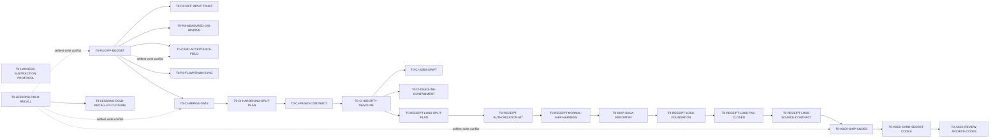

# TASK-BOARD — 任务/模型路由总表（v1 · 更新于 2026-09-24）

> **这张表管「谁做哪张卡、用什么档」**；每张卡的完整上下文包/验收在 `specs/tasks/<id>.md`；**状态与 depends_on 以活卡及归档卡为准**（本表状态是各行最后一次同步时的快照，不作为实时状态源）。
> 计划真相源 `_local/PLAN.md`；设计决策 `docs/adr/`；需求 `docs/inspection-app-requirements.md`。
> 执行形态：每卡走 R1–R5（`scripts/task.ps1` start→ship），R3 评审恒 = **GPT-5.6 Sol**（`scripts/_config.ps1` 已钉；Sol 原则上不作同卡作者）。

## PR review v2

> 2026-09 reconcile：本地 1a 链的本地独有部分（PROTOCOL-DOC、CHECKLISTS、RECORDS、FACTS-LIB、STATE-1A）随 reconcile 并入 master（schema 与校验器保留 origin 经 T0-PREREVIEW-REMOTE-SCHEMA 采纳的版本），记录见下方「PR review v2：本地 1a 链记录」一节。`docs/PREREVIEW-PROTOCOL.md`、`docs/PREREVIEW-CHECKLISTS.md` 与 `scripts/_prereview-facts.ps1` 因此已在 master 上；T0-PREREVIEW-REMOTE-POLICY、T0-PREREVIEW-REMOTE-FACTS、T0-PREREVIEW-POLICY-SOURCE、T0-PREREVIEW-POLICY-SOURCE-CHECK 与 T0-PREREVIEW-SOURCE-REGISTRATION 的处置待用户裁定。origin 经 #303 登记的待发布卡 T0-PREREVIEW-RECORDS 与 T0-PREREVIEW-STATE-1A 与本地已交付卡同 ID，reconcile 以本地归档卡取代，其远端发布判据未单独执行，处置同样待用户裁定；三个本地 prereview 库都加了 gate 1h 自检入口，因而 FACTS-LIB 与 STATE-1A 卡钉住的 SHA 描述的是 reconcile 前的文件。

远端采纳按 [交付计划](plans/PREREVIEW-REMOTE-ADOPTION.md) 顺序执行：T0-PREREVIEW-REMOTE-SCHEMA → T0-PREREVIEW-REMOTE-POLICY → T0-PREREVIEW-REMOTE-FACTS。只采纳最终 revision 1 契约、策略与 FACTS-LIB；原始本地卡图及其它实现不计为远端完成。作者沿用当前 Astra，正式 R3 为 Sol。

## 模型席位（性价比路由原则）
| 席位 | 模型 | 用在 | 理由 |
|---|---|---|---|
| 工作马（默认） | **DeepSeek V4 Pro** | 规格清晰、契约已冻结的实现/测试/内容卡 | 最高性价比；卡内上下文包给足即可靠 |
| 综合实现/复杂调试 | **GPT-6 Astra** | 跨文件实现、复杂调试、评审入口与交付链改动 | 原表未指明模型的执行席位改用此模型；默认 high |
| 设计/新颖单点 | **Opus 5** | 相机、PDF composer、加密格式、法律边界引擎 | 错误代价高或无先例可抄的卡 |
| 中档实现 | **Sonnet 5（max effort）** | 标准 Compose UI、Android 平台适配、本机装环境 | android 细节多但模式成熟 |
| 中档替补/只读消化 | **GPT-5.6 Terra** | WorkManager/通知类中档卡、大体量文档消化 | 分流 + 交叉视角 |
| 轻档内容/交叉复核 | **GPT-5.6 Luna Max** | 双语内容卡的第二双眼睛（抄录错编译不报错） | 便宜的独立复核 |
| 评审席（固定） | **GPT-5.6 Sol** | 全卡 R3 合并闸 + 安全面复核 | 已钉 `_config`；作者≠评审 |

路由栏只填写具体模型；备选栏表示替补作者，R3 评审统一服从上方固定席位。历史交付记录中的工具名称保留原文。

效果档说明：effort 值为执行 harness 通用档（low/medium/high/max）；「难度」= 该卡对模型能力的真实要求（S 机械 / M 中档 / H 难 / H+ 最难）。

## 总表（波次为粗分组；执行顺序以 depends_on 为准，并行前核对 allow_paths）

状态从对应活卡或归档卡读取。`merged` 仅表示卡片登记为已合并，不等于 R3 pass、真机验收通过或整个功能完成；人裁合并、后继收口与未执行验证仍须单独看备注和原卡。备注中的复核、测试及限制属于执行要求或历史记录，不自动视作已满足。

| 波 | 卡 id | 产出（一句话） | depends_on | 难度 | 首选模型 · effort | 备选 | 卡片状态 / 备注 |
|---|---|---|---|---|---|---|---|
| W0 | T0-TOOLCHAIN | JDK17+SDK+`android/` Gradle 骨架空编译绿+verify/ci 收紧 | — | M | Sonnet 5 · max | Opus 5 | **merged**（本地合并 `eb22da38`；R3 pass 证据 `5fec73c`） |
| W0 | T0-GATE-HARDENING | 许可闸递归发现+verify 确定性+两枚闸门自测（拆自 T0-TOOLCHAIN） | T0-TOOLCHAIN | M | Sonnet 5 · max | DeepSeek V4 Pro | **merged**（本地合并 `5ba3319e`；事后 R3 finding 由 T0-GATE-FIXFORWARD PR #4 `6f255d35` 结清） |
| W0 | T0-HARNESS-PERF | 横切优化 selftest 与 CI 墙钟时间（约 300 行 harness 改动） | T0-GATE-HARDENING | M | Sonnet 5 · max | DeepSeek V4 Pro | **merged**（master `fc1e763f`，PR #1） |
| W0 | T0-SCAFFOLD-LEAN-CI | 普通产品 PR 不启动 scaffold-only 六分片；脚手架权威面变化仍全跑 | T0-HARNESS-PERF | S | GPT-5.6 Terra · high | DeepSeek V4 Pro | **merged**（master `f976d0f`，PR #22；R3 零发现；基线产品 PR #5–#11 = 60 runs / 360 shard jobs；本次 `.github/**` PR 实测 1 run / 6 jobs 全保留；无新增脚本/job/依赖） |
| W0 | T0-SCAFFOLD-SYNC-046 | 核对 upstream v0.46.0，并推进 origin/current 高水位账 | T0-SCAFFOLD-SYNC-045 | S | GPT-5.6 Luna · high | GPT-5.6 Terra · high | 本地已具备 v0.46 双版本行为；只登记发布版等价采用与精确 tag，不纳入已发布 v0.47.0 tiered-acceptance/nightly-meta coupling 组 |
| W0 | T0-SELFTEST-NIGHTLY-META | 普通 push 延后聚合压力测试；本地/手动/每日保持完整 meta | — | S | Codex | Codex R3 | **merged**（master `52ec509c`；R3 PASS `ddc2b8c1`）；执行/延后收据明确；保留两 OS、五 shard；superseded_by T0-SCAFFOLD-UPSTREAM-ADOPTION：本地实现 `52ec509c` 在 2026-09 reconcile 中由 origin 的 T279 策略取代（meta 只在定时运行跑） |
| W0 | T0-CARD-TEMPLATE-SLIM | 精简任务卡；acceptance/requirements 可选且兼容旧卡 | — | S | Codex | Codex R3 | **merged**（master `c60a67ba`；R3 PASS `a6a180f8`）；可选字段与引用合同已同步；2026-09 local/origin reconcile 按 origin 整文件规则回退了本地实现，未被其他卡取代；一条起的 acceptance、R-id 校验与精简生成器不在 master，见 TD182 |
| W0 | T0-SELFTEST-META-EXPANSION | 默认延后三处元测试；保留实时检查及每日完整覆盖 | — | S | Codex | Codex R3 | **merged**：本地 04b355d4；R3 pass，core/workflow IncludeMeta 全绿；superseded_by T0-SCAFFOLD-UPSTREAM-ADOPTION（origin 卡记录，2026-09 local/origin reconcile） |
| W0 | T0-SELFTEST-SKILL-ROUTING | 仅技能改动复用 core + workflow，混合及未知范围仍全跑 | T0-SELFTEST-META-EXPANSION | S | Codex | Codex R3 | **merged**：本地 5f0000cf；R3 pass，core/workflow 全绿，8项关键变异被检出；superseded_by T0-SCAFFOLD-UPSTREAM-ADOPTION（origin 卡记录，2026-09 local/origin reconcile） |
| W0 | T0-REVIEW-LOW-RISK | 低风险文档评审建议模式与本地可信入口 | — | M | GPT-6 Astra · high | GPT-5.6 Terra · high | **merged**（退役，未交付）：superseded_by T0-SCAFFOLD-UPSTREAM-ADOPTION。用户 2026-09-24 先裁定保留为活卡，同日改裁退役：master 已由 PR #297 带来 rubric §0 advisory-by-default 与 T301 `ReviewIntensityByTier`，且本卡分支与 master 十个文件全部冲突；见卡片「Retired as superseded」节 |
| W0 | T0-REVIEW-GOVERNING-DOCS | 定义闸门、安全规则与代理边界的七份文档走 adversarial 评审档（不走 tier-0 的 advisory 单轮） | — | S | Sonnet 5 · medium | 第二模型R3 | **merged**（PR #347，squash `f970f741`，reviewed head `3b4ebfe8`，CI `35999775552` success）：tier 0 改 adversarial，闸 17ib 现网策略检查改为期待 adversarial；全量 selftest 5 分片通过；Codex 配额耗尽期间经用户同意由 Opus 5.5 作 R3（第 1 轮 block 两条记录措辞，修后第 2 轮 pass） |
| W0 | T0-POST-MERGE-DOCS-PR | 合并后自动开 R5 文档同步 PR（严格白名单、仅 CI 即合并）并清理已合并 PR 的远端分支 | — | S | Opus 5.5 · high | 第二模型R3 | **merged**（PR #367，squash `34241b18`，reviewed head `c1a40522`，CI `36105963558` success）：新增 `scripts/post-merge.ps1`，`r5` 在 origin 新切的 worktree 里落位 R5 文档同步、仅 CI 通过即合并（严格白名单），`prune` 只删 PR 已合并且 tip 未动的远端分支；R3 五轮，第 5 轮 Codex pass；本 R5 由 `post-merge.ps1 r5` 自身完成 |
| W0 | T0-POST-MERGE-R5-BOARD-TABLE | post-merge.ps1 r5 只改主卡片表里本卡的行（表头第二格「卡 id」、末格「卡片状态 / 备注」、表头下有分隔行、行的格数等于表头） | T0-POST-MERGE-DOCS-PR | S | Opus 5.5 · high | 第二模型R3 | **merged**（PR #393，squash `5ea3ea2d`，reviewed head `5cf25719`，CI `36117231819` success，R3 由 Opus 5.5 代 Codex、pass 零 finding）：r5 改看板时只认主卡片表里本卡的行（表头第二格 `卡 id`、末格 `卡片状态 / 备注`、表头下有分隔行、格数与表头相同）；主表中带装饰的 34 格卡 id 仍匹配不到，记入技术债 |
| W0 | T0-POST-MERGE-R5-WIRING | post-merge.ps1 -SelfCheck 核依赖接线：命令、具名参数、Scaffold* 变量都能解析 | T0-POST-MERGE-R5-BOARD-TABLE | S | Opus 5.5 · high | 第二模型R3 | **merged**（PR #396，squash `af554598`，reviewed head `ea0db4c0`，CI `36119448202` success，R3 由 Opus 5.5 代 Codex、pass 零 finding）：`post-merge.ps1 -SelfCheck` 加载 `_guard.ps1` 与 `_ci.ps1` 后核本文件的 Verb-Noun 命令、具名参数与 `Scaffold*` 变量都能解析；预审发现名字带数字的 r5 入口 `Invoke-PostMergeR5` 原本漏检，已修 |
| W0 | T0-POST-MERGE-R5-GUARDS | post-merge.ps1 r5 加 -DryRun 预览（三个加固 PR 的最后一个） | T0-POST-MERGE-R5-WIRING | S | Opus 5.5 · high | 第二模型R3 | **todo**：2026-09-25 用户裁定从 T0-POST-MERGE-DOCS-PR 拆出（DeepSeek 预审第 1 轮三条）；同日用户要求分多个 PR 交付，看板规则与接线自检拆给 T0-POST-MERGE-R5-BOARD-TABLE、T0-POST-MERGE-R5-WIRING |
| W0 | T0-POST-MERGE-LESSONS | 合并后自动开经验 PR（仅 LEDGER.md），lessons.ps1 bump 增 -Here | T0-POST-MERGE-DOCS-PR,T0-POST-MERGE-R5-GUARDS | S | Opus 5.5 · high | 第二模型R3 | **todo**：2026-09-25 用户要求开卡 |
| W0 | T0-MAIN-CHECKOUT-READONLY | 主检出对受跟踪文件只读（PreToolUse 钩子拦编辑工具）、会话开始时只做 fast-forward 同步 origin/master、本机评审后端覆盖移到 gitignored 的 `scripts/_config.local.ps1` | T0-POST-MERGE-DOCS-PR | S | Opus 5.5 · medium | 第二模型R3 | **todo**：2026-09-25 用户要求开卡（多会话并行时改动滞留主检出、互相干扰） |
| W0 | T0-POST-MERGE-CARD-DRIFT | 卡片本身的合并后收口：`post-merge.ps1 audit` 只读报出「PR 已合并但卡仍 todo」与「PR 未合并关闭但卡未退役」，`retire` 以 `superseded_by` 退役卡片，task-loop 规定合并后同一回合跑完 R5 | T0-POST-MERGE-R5-GUARDS | S | Opus 5.5 · medium | 第二模型R3 | **todo**：2026-09-25 用户要求开卡；实测 7 张卡 PR 已合并仍 todo、2 张未合并关闭未退役（后 2 张随登记 PR 手工退役） |
| W0 | T0-PLAN-FORGE-PROMPT-TRIM | 按 Opus 5.5 精简 plan-forge 提示词：去掉强调标记、打气句、给 lens 的下游核验机制说明与内部编号；评审标准、lens、裁判与返回结构不变 | — | S | Opus 5.5 · medium | 第二模型R3 | **merged**（origin `76d77385`，PR #360，reviewed head `1c1b3d34`；Codex 配额耗尽期间经用户裁定由全新 Opus 5.5（medium）作 R3，首轮 pass、两轴零 finding；卡由 #348 登记、#355/#357 修订） |
| W0 | T0-PLAN-FORGE-FOLLOWUP | 按 Opus 5.5 精简 decompose-cards.mjs 提示词；修正仍称 plan-forge 投影任务卡（TD180 前）或卡审 4 角度（实为 5）的文档 | T0-PLAN-FORGE-PROMPT-TRIM | S | Opus 5.5 · medium | 第二模型R3 | **merged**（origin `2ae80225`，PR #378，reviewed head `6dbf97e5`；Codex R3 第 1 轮以 DoD 强度 block（#379 补快照与行钉），第 2 轮 pass 零 finding；卡由 #368 登记、#375/#376/#379 修订） |
| W0 | T0-DECOMPOSE-NULL-GUARDS | decompose-cards.mjs：Decompose 返回 null 不再崩溃；缺席的卡审角度记入 skipped_audits 并计一条 HIGH，不当成「无问题」；selftest 子闸 1j 驱动验证 | T0-PLAN-FORGE-FOLLOWUP | S | Opus 5.5 · medium | 第二模型R3 | **todo**：2026-09-25 用户要求开卡；base `e064b828` 上 DoD exit 1（1j 尚不存在） |
| W0 | T0-RECONCILE-LESSONS-PATTERN-FIXTURE | lessons 精确源的变异守卫语义夹具 | T0-RECONCILE-LESSONS-FIXTURE | S | GPT-5.6 Terra · high | Sonnet 5 · max | **已退役**（2026-09-25 登记）：PR #144 未合并关闭，由 `T0-RECONCILE-LESSONS-FINAL-FIXTURE`（PR #145）取代；卡片 `superseded_by` 已补 |
| W0 | T0-SHIP-REVIEW-BASE-BUNDLE | 两条 ship 路径使用同一基线的评审脚本及辅助文件 | T0-SELFTEST-SKILL-ROUTING | M | Codex | Codex R3 | **merged**（origin 卡记录）；不改变既有评审上限；superseded_by T0-SCAFFOLD-UPSTREAM-ADOPTION（origin 卡记录，2026-09 local/origin reconcile） |
| W0 | T0-INIT-ASSIGNMENT-ANCHORS | 初始化只匹配真实配置赋值，保留注释及字面量 | T0-SHIP-REVIEW-BASE-BUNDLE | S | Codex | Codex R3 | **merged**（origin 卡记录）；仅在隔离夹具运行初始化；superseded_by T0-SCAFFOLD-UPSTREAM-ADOPTION（origin 卡记录，2026-09 local/origin reconcile） |
| W0 | T0-R3-DIFF-BUDGET | pre-push/R3 按真实 changed lines + diff chars fail-closed，超大卡必须拆 | T0-DEBT-R3-CARD-BASELINE,T0-DEBT-SELFTEST-CRITICAL-PATH | M | GPT-5.6 Terra · high | Sonnet 5 max | **merged**（master `b82054bc`，PR #128；度量/边界/ship 接线已落地，输入可信与 OID 绑定仍由后两张专卡承接） |
| W0 | T0-R3-DIFF-INPUT-TRUST | diff 预算的输入只信 git 自己：ext-diff/textconv/属性二进制均不可缩小体量 | T0-R3-DIFF-BUDGET | S | GPT-5.6 Terra · high | Sonnet 5 max | **todo**；A5 是**已复现**的真绕过：一行 .gitattributes `-diff` 让 1001 行量成 1 行 |
| W0 | T0-R3-MEASURED-OID-BINDING | 被测量的提交＝被 push/评审/合并的那一个（分支引用与 HEAD 双钉） | T0-R3-DIFF-BUDGET | S | GPT-5.6 Terra · high | Sonnet 5 max | **merged**（origin 卡记录：superseded_by T0-SCAFFOLD-UPSTREAM-ADOPTION，PR #297）；第 3 轮 finding：只钉分支引用时 detached HEAD 可「审 A 合 B」 |
| W0 | T0-R3-FLOW-ENUM-SYNC | 预算闸补进每一处确定性闸枚举 + 每处一条锚定断言（承接母卡 A13） | T0-R3-DIFF-BUDGET | S | GPT-5.6 Terra · high | Sonnet 5 max | **merged**（master `d19a4c22`，PR #200；17 个枚举面一一登记并逐处删除变异，补齐 English overview、跨行/顺序/Step 锚定与 lone-CR 防回归；workflow + seeded + SizeOnly、Luna/Terra Max 复核与 Sol R3 均 PASS；R5 candidate `74328b2d` released-master verify + seeded exit 0，含 canary、ADDED/REMOVED、cleanup 与 `selftest: PASS`） |
| W0 | ~~T0-R3-DIFF-BUDGET-R3-CLOSURE~~ | **已退役**（2026-08-23）：人裁选路线 2，第 2 轮两项 finding 已在原卡修完；余下契约由上面两张拆卡承接 | — | — | — | — | 退役理由见 T0-R3-DIFF-BUDGET「拆分依据」 |
| W0 | T0-CI-MERGE-GATE | 候选 CI 运行时 + 一红一绿的远端行为证明（TD134 1a/6） | T0-R3-DIFF-BUDGET | M | GPT-5.6 Luna · max | GPT-5.6 Terra · max | **merged**（master `56c02c0f`，PR #207；R3 后钉定候选 head，消费 ci.yml workflow/jobs，复核 base/head 后以 `--match-head-commit` 合并；一红一绿 hermetic + unrelated-CWD 证明；DoD/verify/R3 PASS；R5 candidate `25d3a95c` released-master `selftest -Shard seeded-remote` exit 0，含 T37-REMOTEMX/1–4 与 `selftest: PASS`） |
| W0 | ~~T0-CI-HARDENING-MATRIX~~ | **已退役且未合并**：PR #214 reviewed head `cce6fa5e`（verify green，量测 59713/60000）经 R3 第 1 轮 block「分页条目无稳定身份 ⇒ 重放页凑满 total_count、掩盖未读到的红 run 并走到 merge」；修复该发现后又暴露 PR 关联大小写不敏感与旧 mock 缺 id 两处真缺陷，exact head `2ce7aa0f` 本地量测 **61092** 超 60000 闸（超限主因是长 JSON 行区的 hunk 上下文，非行数：524/1000） | — | — | — | — | 由 PAGED-CONTRACT→IDENTITY-DEADLINE 承接；成果只读保全于 `wip/T0-CI-hardening-validated` |
| W0 | T0-CI-HARDENING-SPLIT-PLAN | 把候选 CI 硬化卡拆成分页契约与身份/deadline 两张可读串行卡（TD134 1b/6 规划） | T0-CI-MERGE-GATE | S | GPT-5.6 Luna · max | GPT-5.6 Terra · max | **merged**（master `7c426cd1`，PR #216，R3 第 3 轮 pass；前两轮 6 条 finding 全属实且同类——断言面宽于契约，末轮按类一次性锚到判定行）|
| W0 | T0-CI-PAGED-CONTRACT | 分页读取的形态、总数、稳定身份与跨页重放契约（TD134 1b/6 之一） | T0-CI-HARDENING-SPLIT-PLAN | M | GPT-5.6 Luna · max | GPT-5.6 Terra · max | **merged**（master `86bf1a42`，PR #218，R3 **第 1 轮 pass 零发现**；新闸 `T37-CIGATE/API-CONTRACT` 端到端 27 例：三 endpoint 各跑形态/严格 total/跨页重放，完整畸形+id 矩阵在 check-runs 跑一遍，另 3 条有效分页正例 + 1 条「第二页红 check」消费证明；6 枚函数级变异 + 2 枚 A4 端到端变异全杀（删 `$seen.Add` ⇒ 重放页凑满 total_count 并**合并成功**，正是本卡要封的洞）；DoD/verify/R3 PASS；R5 candidate `86bf1a42` released-master `selftest -Shard seeded-remote` exit 0，含 `T37-CIGATE/API-CONTRACT OK` 与 `selftest: PASS`。遗留：该分片墙钟由约 2.5 min 增至约 9.6 min，已记 TD163） |
| W0 | T0-SELFTEST-RISK-ROUTING | 按钉定任务变化选择既有脚手架覆盖 | — | M | GPT-6 Astra · high | — | **merged**；PR #273，merge `fcdb4d8ca5f4d76c2fe73fc6177bc828e239ce6c`；focused DoD/verify/Sol high R3/CI 通过；11 当前变异 + 14 历史同源复用；官方 cleanup 后归档 |
| W0 | T0-SELFTEST-SCAFFOLD-ONLY | 产品改动与脚手架自检隔离；先修复 17a3 临时夹具 | — | M | GPT-5.6 Terra · high | Sonnet 5 · max | **merged**；PR #272，merge `7500992541d15cc7a53b06efe4560dc62123dcff`；reviewed head `d3a206a979468888b208569a2701a9dd3b67fcf6`；R3 pass；CI 34314990805 success；full selftest 已覆盖 parent HEAD `5bff8a` 的未提交修复，完整源码等于最终 Git blob `5b05aac083d260978a4c5987902d6bb9ebc4dd0d`（见归档卡来源说明）；source SHA-256 `BFACF8485F7255DDF0C7E39B6671AB50C8071E933B6AF4F00DBB48D06DD29376` exit 0/2629.0102968s，17a3 real17a3PASS，explicit skips 21；official cleanup 后归档 |
| W0 | T0-SELFTEST-PAGED-PERF | 分页全矩阵直测真实函数，每 endpoint 仅留两条完整 ship 边界证明 | T0-CI-PAGED-CONTRACT, T0-SELFTEST-SCAFFOLD-ONLY | S | GPT-5.6 Luna · high | GPT-5.6 Terra · high | 偿还 TD163；确定性预算把完整 ship 调用锁到最多 6 次，安静机器 seeded-remote 中位数目标 <5m |
| W0 | T0-SCAFFOLD-TRIGGER-ADOPTION | 产品 compliance push 排除、独立迁移 canary 与共享触发 fixture | — | S | GPT-6 Astra · high | GPT-5.6 Terra · high | **merged**：本地 9229141a；最终完整自检和 R3 pass；产品 compliance push 排除，17a3/17ai 修复；旧准备分支保留（reconcile 后由 origin 版取代；A2/A4 不在 master，见归档卡） |
| W0 | T0-CI-IDENTITY-DEADLINE | run 身份绑定与最终 exact-head/base 快照（TD134 1b/6 之二） | T0-CI-PAGED-CONTRACT | M | GPT-5.6 Luna · max | GPT-5.6 Terra · max | **merged**（master `424009ee`，PR #220，R3 于重置后第 2 轮 pass；累计 4 轮、3 轮出实质 finding）。落地 `T37-CIGATE/WORKFLOW-BINDING`：逐层身份绑定（本地 HEAD ≡ PR headRefOid ≡ run head_sha → run id/attempt → 终局快照 → merge --match-head-commit）、`path`/`event`/`pull_requests[].number` 三处**大小写敏感**比较、终局 exact-head/base 快照四态（LOCAL-HEAD-MOVED / BASE-MOVED / BASE-MISMATCH / HEAD-MOVED）、`-NoAutoMerge` 不放松任何一层；每条负例断言专属哨兵 + 精确读计数 + 未触达合并 + 效果账本点名被造坏那一处；5/5 单点变异 KILLED。**两次拆卡**（皆用户裁定）：diff 超 R3 字符预算 ⇒ `T0-CI-JOBS-DRIFT`；R3 连续三轮实质 finding 皆落 deadline/进程树 ⇒ `T0-CI-DEADLINE-CONTAINMENT` |
| W0 | T0-CI-JOBS-DRIFT | 候选 run 返回 job 集与 ci.yml 声明集的漂移判定（API 侧平面） | T0-CI-IDENTITY-DEADLINE | S | GPT-5.6 Luna · max | GPT-5.6 Terra · max | **merged**（2026-09-08，PR #253，master `297b5245`，reviewed head `8815d99c`；Sol R3、候选 CI、DoD/verify、Luna/Terra Max 终审均 PASS）。稳定态/终局均以大小写敏感精确多重集合拦缺失、额外、改名、大小写、重复与畸形状态；两枚单点变异 KILLED |
| W0 | T0-CI-DEADLINE-CONTAINMENT | 单一 wall-clock deadline 扩面（gh+git）与 fail-closed 进程树容纳 | T0-CI-IDENTITY-DEADLINE | M | Opus 5 · xhigh | GPT-5.6 Sol · max | **merged**（2026-09-08，PR #265，master `d9da183d`，reviewed head `f5a5bc73`；Sol R3、候选 CI、DoD/verify、三路 Sol 预审与 Luna/Terra Max 终审均 PASS）。Windows suspended CreateProcess + Job Object 消除 assign-before-execute 竞态并整组收口孙进程；全部 gh/git 腿共享一个绝对 deadline，根/流清理只花一份 2s grace；容纳 API 故障、句柄泄漏、孤儿进程与 deadline 复用均有实跑负例 |
| W0 | T0-RECEIPT-LOSS-SPLIT-PLAN | 将超限 receipt-loss 交付注册为 A/B/C 三张串行卡 | T0-CI-IDENTITY-DEADLINE | S | GPT-5.6 Sol · max | GPT-5.6 Terra · max | 本登记 PR 内投影 merged；不预填 future SHA、不自归档；保留既有 B id/path |
| W0 | T0-RECEIPT-AUTHORIZATION-BIT | 以本轮四谓词/铸据结果授权 catch resume | T0-RECEIPT-LOSS-SPLIT-PLAN | S | GPT-5.6 Sol · max | GPT-5.6 Luna · max | fresh RED-first；prototype 只读，不作实现历史 |
| W0 | T0-RECEIPT-NORMAL-SHIP-HARNESS | 用真实 normal ship 验证既有收据恢复边界 | T0-RECEIPT-AUTHORIZATION-BIT | S | GPT-6 Astra · high | GPT-5.6 Sol · high | 非 TDD 验证重构；替换测试自造配方，不宣称手工配方等价覆盖；生产与文档不变 |
| W0 | T0-SHIP-SAGA-REPORTER | T26 receipt-loss failure reporter / unauthorized fallback boundary | T0-RECEIPT-NORMAL-SHIP-HARNESS | S | GPT-6 Astra · high | GPT-5.6 Sol · high | post-watershed 未授权 fallback；独立 reporter 能力，不宣称 FOUNDATION/B fail-closed |
| W0 | T0-RECEIPT-LOSS-FOUNDATION | 收据失效单一路径基线与旧恢复旁路退役 | T0-SHIP-SAGA-REPORTER | M | GPT-6 Astra · high | GPT-5.6 Sol · high | 独立 RED/GREEN；复用真实 missing/valid 夹具；完整四态/reset-safe 留后继 B |
| W0 | T0-RECEIPT-LOSS-FAIL-CLOSED | 已发布 receipt 四类失效态单一路径 fail-closed（TD134 1c/6） | T0-RECEIPT-LOSS-FOUNDATION | M | GPT-5.6 Luna · max | GPT-5.6 Terra · max | 保留原卡全部运行时/T37/doc/reset-safe 责任；只把源码 mutation 后移 C |
| W0 | T0-RECEIPT-LOSS-SOURCE-CONTRACT | receipt-loss 源码合同、enum/discovery 与 mutation 防回归 | T0-RECEIPT-LOSS-FAIL-CLOSED | S | GPT-5.6 Sol · max | GPT-5.6 Terra · max | 只改 selftest + 自身卡；内部预算 300 行/35000 字符 |
| W0 | T0-GATE-ID-UNIQUENESS | 闸号唯一性机检 + 锚点唯一性与自身 parse 自检 | — | S | GPT-5.6 Terra · high | Sonnet 5 max | **merged**（master `b1e5f0b5`，PR #186；闸头/Fail 文案双面 AST+token 扫描、重复 id 全位置诊断、唯一 raw 插入锚、ParseFile、6 类删除变异；core/workflow/verify 与 R3 全绿；TD146 paid） |
| W0 | T0-GRADLE-RUNTIME-FILE-INPUTS | 测试运行期读的仓内文件声明为 Gradle 测试输入，消除「改了权威文件仍 UP-TO-DATE」的假绿 | — | S | GPT-5.6 Terra · high | Sonnet 5 max | **merged**（2026-08-29，master `6fda9f88`，PR #188；精确声明配置、模板与源码输入，补全双语 tuple 哈希守卫，T3/T4 DoD 强制真实执行；变异、verify、R3 全绿） |
| W0 | T0-CARD-ACCEPTANCE-FIELD | 把 acceptance 作者声明的验收清单登记为正式卡片字段 + 形态机检（可选字段、缺失只告警） | T0-R3-DIFF-BUDGET | S | GPT-5.6 Terra · high | Sonnet 5 max | **merged**（归档卡已核验，2026-09-08）；完整范围与验收见 [归档卡](../specs/archive/tasks/T0-CARD-ACCEPTANCE-FIELD.md) |
| W0 | T0-CI-DOCS-FAST-PATH | 纯文档 PR 保留轻量 verify 状态，跳过 Android/Gradle 重闸（TD159） | — | S | GPT-5.6 Terra · high | Sonnet 5 · max | **merged**（PR #114 · master `620fb43`；两轮 R3 后人裁；docs-only lane 保留 cards/archive/secrets） |
| W0 | T0-CI-UNICODE-DEP-FIXTURE | 补齐 license scanner 自检夹具的 Unicode helper 依赖并防止 17p3 假绿 | T0-DEBT-LICENSE-SCALAR-FORMAT | S | GPT-5.6 Terra · high | Sonnet 5 · max | **merged**（PR #120 · master `bb0c199`；两处 fixture 依赖齐备，17p3 锚定 `gpl-pkg@1.0.0`，seeded/R3 PASS） |
| W0 | T0-CI-LICENSE-GATE-HASH-SYNC | 同步 docs-only License gate 的 8.2b2 规范块哈希 | T0-CI-DOCS-FAST-PATH | S | GPT-5.6 Terra · high | Sonnet 5 · max | **merged**（失败 run `32535429955` 定位到 8.2b2 基线漂移；PR #122 · master `5b2e5a5`；本地 core/verify 与 R3 PASS，合并后 run `32538957860` 的 Windows/Linux core 双绿） |
| W0 | T0-HARNESS-SUBTRACTION-PROTOCOL | 量化、可迁移、按组可回滚的 harness 减负协议（TD134 2/6） | — | S | GPT-5.6 Terra · high | DeepSeek V4 Pro | **merged**（master `e971ef8`，PR #24；R3 零发现；只增 15 行协议文本，无实际删减或脚本行为变化） |
| W0 | T0-LESSONS-COLD-RECALL | 一次性 lesson 归冷、热冷统一检索和 ID 并集（TD134 3/6） | — | M | DeepSeek V4 Pro · high | GPT-5.6 Terra · high | **merged**（master `1e302201`，PR #51；round-cap 后人裁，剩余 meta 解析转专卡） |
| W0 | T0-LESSONS-CAP-CORE-SPLIT | 从超预算 PR #127 提取 resident-id 共享核与 lessons 消费者 | — | S | GPT-5.6 Sol · high | Codex R3 | **merged**（master `116a5f76`，PR #133） |
| W0 | T0-LESSONS-CAP-TRIAGE-DOCS-SPLIT | 先同步 triage 探针 roster，解除代码片的既有 doc-count 闸循环 | T0-LESSONS-CAP-CORE-SPLIT | S | GPT-5.6 Sol · high | Codex R3 | **merged**（master `65fcfa08`，PR #136） |
| W0 | T0-LESSONS-CAP-TRIAGE-SPLIT | 从超预算 PR #127 提取 lessons triage 探针与 hermetic 夹具 | T0-LESSONS-CAP-TRIAGE-DOCS-SPLIT | S | GPT-5.6 Sol · high | Codex R3 | **merged**（master `74d09a69`，PR #137） |
| W0 | T0-TRIAGE-EVIDENCE-CASE | triage 裁决证据身份、HEAD 绑定与失败可观测性 | T0-LESSONS-CAP-TRIAGE-SPLIT | S | GPT-5.6 Terra · high | Sonnet 5 · max | PR #137 R3 fix-forward；独立于 exact extraction；actual-root case、per-root SHA、unreadable/unknown finding |
| W0 | T0-LESSONS-CMD-DOCSYNC | lessons.ps1 纳入 doc-drift 机检 + archive 子命令同步三处命令清单 | T0-LESSONS-COLD-RECALL | S | GPT-5.6 Terra · high | Sonnet 5 max | **merged**（master `c92018d2`，PR #202；R5 `c163ae89`，released-master final `6dd963a4`；DocSyncMap 已含 `lessons.ps1`） |
| W0 | T0-LESSONS-BUMP-PLANE | bump 写主检出账本，复发计数不再随卡片 diff 丢失（含 L226/L106 晋升裁断） | — | S | DeepSeek V4 Pro · high | Sonnet 5 max | **merged**（master `edc2770`，PR #129；R3 第 4 轮 pass 零发现——前 3 轮：1 轮 3 条全是基线陈旧假象、2/3 轮各 1 条真缺陷；另有 R3 前 codex 预审再出 2 条真缺陷，合计 8 枚变异全杀） |
| W0 | T0-DEBT-LESSONS-BUMP-SUBMODULE-ROOT | bump 在 submodule 中按 Git 声明的主工作树写自己的仓库级账本（TD145） | — | S | GPT-5.6 Terra · max | GPT-5.6 Luna · max | **merged**（master `6c227115`，PR #197；真实 primary/linked submodule、fail-closed 变异、verify 与 R3 全绿） |
| W0 | T0-RECONCILE-DATA-AUTHORITY | 同步数据库生命周期、离线安全与备份权威文档 | T0-RECONCILE-LESSONS | S | GPT-5.6 Terra · high | Sonnet 5 max | **merged**（master `86c86eec`，PR #151；调和 1/12） |
| W0 | T0-RECONCILE-T1-SECURITY-CARDS | 登记数据库生命周期与 Android 本地安全三张实现卡 | T0-RECONCILE-DATA-AUTHORITY | S | GPT-5.6 Terra · high | Sonnet 5 max | **merged**（master `a403a757`，PR #152；调和 2/12） |
| W0 | T0-RECONCILE-T5-DIAGNOSTIC-CARDS | 登记事件、诊断、清除与本机健康四张实现卡 | T0-RECONCILE-T1-SECURITY-CARDS | S | GPT-5.6 Terra · high | Sonnet 5 max | **merged**（master `bdc85f10`，PR #153；调和 3/12） |
| W0 | T0-RECONCILE-ROADMAP-INDEX | 将七张卡投影到任务表和技术债索引 | T0-RECONCILE-T1-SECURITY-CARDS,T0-RECONCILE-T5-DIAGNOSTIC-CARDS | S | GPT-5.6 Terra · high | Sonnet 5 max | **merged**（master `782471da`，PR #154；调和 4/12） |
| W0 | T0-RECONCILE-DESIGN-METADATA | Field Ledger 可机读 tokens 与组件注册表 | — | S | GPT-5.6 Terra · high | Sonnet 5 max | **merged**（primary master `5e67e0cd`，PR #155；fixture follow-up master `281dff2e`，PR #156；调和 5/12） |
| W0 | T0-RECONCILE-DESIGN-JOURNEYS | 信息架构、导航恢复与离线隐私旅程 | T0-RECONCILE-DESIGN-METADATA,T0-RECONCILE-T5-DIAGNOSTIC-CARDS | S | GPT-5.6 Terra · high | Sonnet 5 max | **merged**（primary master `85bdf1df`，PR #160；fixture follow-up master `94b92146`，PR #163；调和 6/12） |
| W0 | T0-RECONCILE-DESIGN-COMPONENTS | 组件合同、对比度、动效与无障碍规则 | T0-RECONCILE-DESIGN-FOUNDATIONS | S | GPT-5.6 Terra · high | Sonnet 5 max | **merged**（primary master `e139eee2`，PR #169；fixture follow-up master `e7ce52cc`，PR #171；调和 7/12） |
| W0 | T0-RECONCILE-UI-COVERAGE | UI elements 页面与组件覆盖索引 | T0-RECONCILE-DESIGN-COMPONENTS, T0-RECONCILE-ROADMAP-INDEX, T0-RECONCILE-UI-COVERAGE-ELEMENT-FIXTURE, T0-RECONCILE-UI-COVERAGE-SOURCE-FIXTURE | S | GPT-5.6 Terra · high | Sonnet 5 max | **merged**（master `9c8cfcda`，PR #175；调和 8/12） |
| W0 | T0-RECONCILE-UI-CAPTURE | 采集、历史与 PDF 卡的设计指针 | T0-RECONCILE-UI-COVERAGE | S | GPT-5.6 Terra · high | Sonnet 5 max | **merged**（master `622ebea8`，PR #176；调和 9/12） |
| W0 | T0-RECONCILE-UI-NOTICE-SCHEDULE | 通知与日程卡的设计指针 | T0-RECONCILE-UI-COVERAGE | S | GPT-5.6 Terra · high | Sonnet 5 max | **merged**（master `96dbc81d`，PR #177；调和 10/12） |
| W0 | T0-RECONCILE-UI-OFFLINE-OPERATIONS | 备份、媒体、remediation、smoke 的离线体验指针 | T0-RECONCILE-UI-COVERAGE,T0-RECONCILE-ROADMAP-INDEX | S | GPT-5.6 Terra · high | Sonnet 5 max | **merged**（PR #178 先入 integration；同一结果由 PR #179 合入 master `5235ffe4`；调和 11/12） |
| W0 | T0-RECONCILE-LESSONS | 当前 schema 下归并仍可复现的本地经验 | — | S | GPT-5.6 Terra · high | Sonnet 5 max | **merged**（primary master `e60fec91`，PR #148；fixture follow-up master `3bcd1cc9`，PR #150；调和 12/12） |
| W0 | T0-LESSONS-COLD-RECALL-R3-CLOSURE | PR #51 round-cap 后规范 meta 行锚定解析（TD144） | T0-LESSONS-COLD-RECALL | S | GPT-5.6 Terra · high | Sonnet 5 max | 原 PR 先人裁；只补正文诱饵/缺失/重复/非法 meta fail-closed |
| W0 | T0-ASCII-SHIP-CODES | ship saga/CI gate 的机器断言改锚 ASCII code（TD134 4/6） | T0-RECEIPT-LOSS-SOURCE-CONTRACT | M | GPT-5.6 Terra · high | DeepSeek V4 Pro | 只改观测面，不改控制流 |
| W0 | T0-ASCII-CARD-SECRET-CODES | check-cards/check-secrets 状态码迁移（TD134 5/6） | T0-ASCII-SHIP-CODES | S | GPT-5.6 Terra · high | DeepSeek V4 Pro | 状态码 wave 2a |
| W0 | T0-ASCII-REVIEW-ARCHIVE-CODES | review/archive/init 剩余状态码迁移与 TD134 总验收入口（TD134 6/6） | T0-ASCII-CARD-SECRET-CODES | M | GPT-5.6 Terra · high | Sonnet 5 max | 全六卡 merged + 总验收才可 paid |
| W0 | T0-GATE-FIXFORWARD | 许可闸路径比较改 OS 感知 + 发布清单收敛为单一解锁路径 | T0-GATE-HARDENING | M | Sonnet 5 · max | DeepSeek V4 Pro | **merged**（master `6f255d35`，PR #4；R3 pass） |
| W0 | T0-LICENSE-SCANNER | 产出四张批准 classpath 图的 concrete GAV + offline wrapper 基础（TD2 1/5；PR #20 缩 scope） | T0-GATE-HARDENING | M | DeepSeek V4 Pro · high | Sonnet 5 max | **merged**（master `035df10`，PR #25；23 个 graph mutation、4 图/150 GAV 真实离线扫描、Sol R3 pass；TD2 仍 carded） |
| W0 | T0-LICENSE-POLICY | POM 安全读取、许可分类与 exact-GAV exception（TD2 2/5） | T0-LICENSE-SCANNER | M | DeepSeek V4 Pro · high | Sonnet 5 max | **merged**（master `04f80fd`，PR #26；30 个 policy mutation、150 GAV strict 离线扫描、verify/CI 绿；R3 两轮修复后达 cap，经用户人裁批准；TD2 仍 carded） |
| W0 | T0-LICENSE-DIAGNOSTICS | scanner 诊断有界、脱敏、不可注入且不改失败语义（TD2 3/5） | T0-LICENSE-POLICY | M | GPT-5.6 Terra · high | Sonnet 5 max | **merged**（master `e3b52c7`，PR #27；18 个 diagnostics mutation、graph/policy 回归、150 GAV strict 离线扫描与 verify 绿；R3 round cap 后按记录人裁；TD2 仍 carded） |
| W0 | T0-LICENSE-GAV-BOUNDS | GAV 每段上界，使 exact accepted coordinate 与有界诊断可同时成立（TD135；TD2 4/5） | T0-LICENSE-DIAGNOSTICS | M | GPT-5.6 Terra · max | Sonnet 5 max | **merged**（master `f61f586`，PR #28；255/256 共享边界、5 个入口 mutation、graph 23/policy 30 回归、150 GAV strict 离线扫描、R3 pass；TD135 paid，TD2 仍 carded） |
| W0 | T0-LICENSE-CI-INTEGRATION | CI warm-up→offline scan、文档同步与 TD2 总验收（TD2 5/5） | T0-LICENSE-GAV-BOUNDS | S | GPT-5.6 Terra · high | DeepSeek V4 Pro | **merged**（master `1e283297`，PR #49） |
| W0 | T0-LICENSE-CI-INTEGRATION-R3-CLOSURE | PR #49 round-cap 后活跃接线断言与 cold 聚合语义（TD143） | T0-LICENSE-CI-INTEGRATION | S | GPT-5.6 Terra · high | DeepSeek V4 Pro | **todo**；原 PR 先人裁；不恢复旧内联 fixture、不重审 scanner 核心 |
| W0 | T0-DEBT-TASK-INVENTORY | 移除 CLAUDE.md 易漂移的静态任务卡库存数（偿还 TD21） | — | S | GPT-5.6 Terra · max | Sonnet 5 max | **merged**（master `53eebf9`，PR #13；当前阶段改用活卡/归档真相源，无静态库存；句级分类器覆盖同栏历史计数、`cardboard` 边界与 `active cards`，Sol R3 pass；TD22 另卡） |
| W0 | T0-DEBT-SEEDED-CLOSURE-SCOPE | 让 17cc 变异闭包显式携带断言器（偿还 TD23；TD21 再审前置） | — | S | GPT-5.6 Terra · max | Sonnet 5 max | **merged**（master `39ea794`，PR #14；独立 worktree，真实 A/B mutation 在外层 helper 解绑后仍保持 exact marker/exit/control/SHA，Sol R3 pass；未混入 TD21） |
| W0 | T0-DEBT-CASE-PROBE-CLOSURE-SCOPE | 让 17cc case mutation 闭包显式携带探针函数（偿还 TD25） | — | S | GPT-5.6 Terra · max | Sonnet 5 max | **merged**（master `b7efd94`，PR #15；File/Command 两宿主 seeded 全绿，删除 capture 与恢复裸调用均命中专属 TD25 诊断，Sol R3 pass） |
| W0 | T0-DEBT-R3-CARD-BASELINE | 让 R3 与范围闸读取同一 pinned-base 任务卡（偿还 TD3） | — | S | GPT-5.6 Terra · max | Sonnet 5 max | **merged**（master `6eec97f`，PR #16；R3 卡片、diff、rubric 与 FrozenPaths 均钉到同一不可变 OID；base 卡非普通 blob、读取/探测失败均 fail-closed；Sol R3 pass） |
| W0 | T0-DEBT-ARCHIVED-CARD-PATHS | 修复三个已归档任务卡的失效入站路径（偿还 TD22） | — | S | GPT-5.6 Terra · max | Sonnet 5 max | **merged**（master `4ed2ec7`，PR #17；三处具名来源均改指 archive，17hh 覆盖 TA1 真实移动、非普通文件目标与三枚 old-path 变异；Sol R3 pass） |
| W0 | T0-DEBT-ARCHIVE-CARDS-INDEX-GATE | 让归档卡索引成为 verify 可证的真实投影（TD146） | — | S | GPT-5.6 Terra · high | Sonnet 5 max | **merged**（master `f9775f6`，PR #61；exact-byte/BOM/同长度漂移与 verify 接线均有 12e 行为证据，Sol R3 第二轮 pass） |
| W0 | T0-DEBT-MUTATION-RESTORE-SAFETY | 把 L214 的 mutation 还原防丢纪律晋升为必须层（TD147） | — | S | GPT-5.6 Terra · high | Sonnet 5 max | **merged**（master `8648673`，PR #64；L214 ledger→must，必须层 9→10，DoD/verify/R3 pass） |
| W0 | T0-DEBT-MUTATION-BATCH-COUNT | 把 L177 的 mutation 批次条数自证纪律合并进 L17 铁律（TD148） | T0-DEBT-MUTATION-RESTORE-SAFETY | S | GPT-5.6 Terra · high | Sonnet 5 max | **merged**（master `3177e54`，PR #67；L177 ledger→must，与 L17 合并后常驻条目仍为 10，第二轮 R3 pass） |
| W0 | T0-DEBT-MUTATION-EVIDENCE-CLASSIFIER | 把 L167 的 mutation 判据分类器纪律合并进 L165 铁律（TD149） | T0-DEBT-MUTATION-BATCH-COUNT | S | GPT-5.6 Terra · high | Sonnet 5 max | **merged**（master `1bc6feb`，PR #70；L167 ledger→must，与 L165 合并后常驻条目仍为 10，R3 pass） |
| W0 | T0-DEBT-POWERSHELL-DETACHED-ENCODING | 把 L172 的 detached pwsh 编码纪律合并进 L17/L177 铁律（TD150） | T0-DEBT-MUTATION-BATCH-COUNT | S | GPT-5.6 Terra · high | Sonnet 5 max | **merged**（master `bcaa568`，PR #73；L172 ledger→must，与 L17/L177 合并后常驻条目仍为 10，R3 pass） |
| W0 | T0-DEBT-UNICODE-SANITIZER-CATEGORIES | 把 L181 的 Unicode sanitizer 类别纪律合并进 L193 铁律（TD151） | — | S | GPT-5.6 Terra · high | Sonnet 5 max | **merged**（master `83465fc`，PR #76；L181 ledger→must，与 L193 合并后常驻条目仍为 10，R3 pass） |
| W0 | T0-DEBT-UNICODE-SCALAR-TEXT | scalar-aware Cc/Cf 替换与 malformed UTF-16 fail-closed 单一真相源（TD157 1/3） | — | S | GPT-5.6 Terra · high | Sonnet 5 max | **merged**（master `9572270`，PR #99；全量 1,112,064 scalar oracle + over-replacement mutant，R3 pass；consumer 留后两卡） |
| W0 | T0-DEBT-LICENSE-SCALAR-FORMAT | 许可 metadata/diagnostics 接入 scalar helper（TD157 2/3） | T0-DEBT-UNICODE-SCALAR-TEXT | S | GPT-5.6 Terra · high | Sonnet 5 max | **merged**（master `9dce927`，PR #104；POM/exception 与 diagnostic 真实入口覆盖增补 Cc/Cf、malformed UTF-16 和普通 emoji，policy/diagnostics DoD、verify、R3 pass；TD157 保持 carded，待 secrets consumer） |
| W0 | T0-DEBT-SECRETS-SCALAR-FORMAT | tracked-sensitive path/purpose 接入 scalar helper（TD157 3/3） | T0-DEBT-UNICODE-SCALAR-TEXT | S | GPT-5.6 Terra · high | Sonnet 5 max | **merged**（PR #118 · master `4b308c0`；真实 allowlist path/purpose 覆盖全部增补 `Cf`、malformed UTF-16、emoji 保留与双接线 mutation；seeded/verify/R3 PASS；TD157 paid） |
| W0 | T0-DEBT-WINDOWS-PYTHON-UTF8 | 把 L162 的 Windows Python UTF-8 工具纪律合并进脚本工具铁律（TD152） | T0-DEBT-POWERSHELL-DETACHED-ENCODING | S | GPT-5.6 Terra · high | Sonnet 5 max | **merged**（master `89d9c5e`，PR #79；L162 ledger→must，与 L17/L172/L177 合并后常驻条目仍为 10，R3 pass） |
| W0 | T0-DEBT-UNSAFE-PATH-DELEGATION | 把 L171 的不安全路径不得委托下游纪律晋升为必须层（TD153） | T0-DEBT-MUTATION-RESTORE-SAFETY | S | GPT-5.6 Terra · high | Sonnet 5 max | **merged**（master `577a456`，PR #82；L171 ledger→must，L196/L214 合并后常驻条目仍为 10，R3 pass） |
| W0 | T0-DEBT-GATE-ENTRY-TRUST-BINDINGS | 把 L164 的 fail-closed 新入口信任绑定纪律合并进 L171 铁律（TD154） | T0-DEBT-UNSAFE-PATH-DELEGATION | S | GPT-5.6 Terra · high | Sonnet 5 max | **merged**（master `4c16281`，PR #85；L164 ledger→must，与 L171 合并后常驻条目仍为 10，R3 pass） |
| W0 | T0-DEBT-R3-QUOTA-ROUND-CLASSIFICATION | 把 L21 的 R3 配额/轮次证据分类纪律合并进 L205 铁律（TD155） | — | S | GPT-5.6 Terra · high | Sonnet 5 max | **merged**（master `e388def`，PR #88；L21 ledger→must，与 L205 合并后常驻条目仍为 10，第二轮 R3 pass） |
| W0 | T0-DEBT-SELFTEST-SNAPSHOT-BASELINE | 让 selftest all 快照钉住调用者 HEAD 与权威 master（TD156） | — | S | GPT-5.6 Sol · high | Sonnet 5 · max | **merged**（master `83d6c54`，PR #91；hostile linked/detached all 三分片 PASS，HEAD/base 删除变异均杀红，R3 pass） |
| W0 | T0-DEBT-TEMPLATE-STORE-IMMUTABILITY | 补 TemplateStore 读回列表不可替换的变异自证（偿还 TD13） | — | S | GPT-5.6 Terra · max | Sonnet 5 max | **merged**（master `20d028f`，PR #18；三项 fixture 的 MutableList 索引替换命中 UOE，外层 wrapper 删除变异精确 RED，生产 SHA 恢复；Sol R3 pass） |
| W0 | T0-DEBT-RELEASE-CHECKLIST-HASH-GUARD | merged：17ee 编辑警示与删除变异自证（偿还 TD11） | — | S | GPT-5.6 Terra · max | Sonnet 5 max | **merged**；PR #19 · master `210513d`；RED/GREEN、Sol R3、canonical row/hash 不变 |
| W0 | T0-DEBT-REFERENCE-INTEGRITY | 修复权威文档／脚本中漂移或失效的 TD 交叉引用（偿还 TD16） | T0-GATE-FIXFORWARD | M | GPT-5.6 Terra · max | Sonnet 5 max | **merged**（master `e8bf550`，PR #12；正式 RED 先证旧 TD14 指向必红，Sol R3 首轮拦下两处未覆盖回退与诊断字段缺口，修为六文件九个 source→target 映射、9 枚 code/path/reference 分类变异后次轮 pass） |
| W0 | T0-DEBT-SELFTEST-FAIL-DIAGNOSTICS | 单分片与 all 汇总以稳定哨兵点名失败 shard/gate（TD9 1/5） | T0-DEBT-SELFTEST-CRITICAL-PATH | M | GPT-5.6 Terra · high | Sonnet 5 max | **merged**（master `b8dee45`，PR #31；稳定 ASCII gate、协议 fail-closed、hermetic/mutation 覆盖、core/verify/R3 绿；TD9 仍 carded） |
| W0 | T0-LICENSE-SELFTEST-DRIFT | 恢复 Gradle diagnostics 的 selftest 回归覆盖并迁移非 vacuous mutation（TD138） | T0-LICENSE-GAV-BOUNDS | M | GPT-5.6 Terra · high | Sonnet 5 max | **merged**（master `d00c062`，PR #36；diagnostics 19 mutations、normal seeded、verify、R3 pass；因并发登记冲突从 TD137 重编号） |
| W0 | T0-DEBT-SELFTEST-SKIP-VISIBILITY | 有意 skip 与前置失败裁剪进入确定性执行台账（TD9 2/5） | T0-DEBT-SELFTEST-CRITICAL-PATH + T0-LICENSE-SELFTEST-DRIFT | M | GPT-5.6 Terra · high | Sonnet 5 max | **merged**（master `c745015`，PR #33；机器 skip 台账、汇总与 bounded helper，core/verify/R3 PASS；生产 no-git routing 与 mutation 预算按卡拆分） |
| W0 | T0-DEBT-SELFTEST-NOGIT-ROUTING | 有界 fixture mode 证明生产 seeded git-present/absent routing 与 outcome ledger（TD9 3/5） | T0-DEBT-SELFTEST-SKIP-VISIBILITY | M | GPT-5.6 Terra · high | Sonnet 5 max | **merged**（master `02425dd`，PR #110；完整 130-gate 身份、nonce 子进程与 route inversion mutation；DoD/verify 绿，两轮 R3 finding 修复后人裁；TD9 仍 carded） |
| W0 | T0-DEBT-SELFTEST-CANARY-HARNESS | 修复 post-merge workflow 静默失败与 seeded cold-Gradle 假红（TD158） | T0-DEBT-SELFTEST-SPLIT-PLAN | S | GPT-5.6 Terra · high | Sonnet 5 · max | **merged**（master `3748028`，PR #101；post-merge run #32479728740 六 job 全绿，双平台明确 GRADLE-WRAPPER-OFFLINE skip，R3 pass） |
| W0 | T0-DEBT-TD9-SPLIT-ARCHIVE-CONSUMER | 让 TD9 split checker 在规划卡冷存后仍验证历史合同 | T0-DEBT-SELFTEST-SPLIT-PLAN | S | GPT-5.6 Terra · high | Sonnet 5 · max | **merged**（master `3922dd5`，PR #107；bounded live/archive consumer 夹具、verify/R3 PASS） |
| W0 | T0-HANDOFF-REVALIDATE | 续接旧 HANDOFF 前重验阻塞前提、卡状态与更小方案仍成立 | — | S | GPT-5.6 Terra · high | Sonnet 5 · max | **merged**（master `17d6cf2`，PR #100；verify/R3 PASS，真实 init/check/SessionStart 三臂 DoD） |
| W0 | T0-DEBT-SELFTEST-MUTATION-BUDGET | parse-once 紧凑 identity inventory，消除数百份整脚本 mutation 副本（TD9 4/5） | T0-DEBT-SELFTEST-NOGIT-ROUTING | M | GPT-5.6 Terra · high | Sonnet 5 max | **merged**（master `86a895a9`，PR #187；91 个候选只执行 4 个代表性变异，峰值完整源码集合 2、终态 1；DoD/verify/R3 PASS；TD9 仍 carded） |
| W0 | T0-DEBT-SELFTEST-LOAD-STABILITY | 8.2e 用具名有界预算承受超过五秒的 runner 调度延迟（TD9 5/5） | T0-DEBT-SELFTEST-MUTATION-BUDGET | M | GPT-5.6 Terra · high | Sonnet 5 max | **merged**（master `95f74222`，PR #189；具名默认/注入预算、marker handshake、timeout/early-exit/cleanup mutations；DoD/focused gate8/verify/R3 PASS；TD9 仍 carded，等待 post-merge core 重放） |
| W0 | T0-SELFTEST-ALLOWLIST-BASELINE-CLOSURE | 让动态 E2E 基线从权威清单追踪全部已审敏感路径 | — | S | GPT-5.6 Luna · max | GPT-5.6 Terra · max | **merged**（master `9c47b97d`，PR #192；失败 run #33215637748 定位 gate 15 的 `2.db` 未追踪基线；双路径控制、first-only 变异、两次完整 workflow 重放与 R3 PASS；post-merge run #33226580801 的 Windows/Linux workflow shards PASS；上游 #305、L256） |
| W0 | T0-SELFTEST-MIGRATION-CHECK-CONTINUE | 让 seeded migration 负例在 core:test 失败后继续跑真实 verifyMigrations task | — | S | GPT-5.6 Sol · high | GPT-5.6 Luna/Terra · max | **merged**（master `770ffb7f`，PR #201；Windows/POSIX 17a3 调用精确加入 `--continue`，scoped 删除/移位/扩散 canary、真实 ADDED/REMOVED 行为、cleanup、verify 与 R3 全绿；R5 candidate `5565bb17` released-master `selftest -Shard seeded` exit 0，含 canary + ADDED/REMOVED + cleanup + `selftest: PASS`） |
| W0 | T0-DEBT-MIGRATION-FIXTURE-CLEANUP | PR #47 round-cap 后收敛 Windows migration fixture 清理（TD145） | T0-DEBT-MIGRATION-SNAPSHOT-ALLOWLIST | S | GPT-5.6 Terra · high | Sonnet 5 max | **merged**（master `19e4646`，PR #93；短路径、有界重试、完整诊断与清理终态通过，解除 TD4 R5 阻塞） |
| W1 | T1-SKELETON-E2E | **一次性走通骨架**：建巡检→加一项→拍一张→导出 PDF（真机可见，用完即弃） | T0 | S–M | Opus 5 | Sonnet 5 max | **merged**（本地合并 `19fd908e`；R5 `320f8dac`） |
| W1 | T1-SCHEMA-CORE ★ | SQLDelight 全 schema+UUIDv7+基线迁移+JVM 测试 | T0 | H | DeepSeek V4 Pro · high | Sonnet 5 max | **merged**（本地合并 `fcdc88d2`；R5/冻结登记 `a64f8f45`） |
| W1 | T1-SPIKE-PLATFORM | V1 真机可行性 ×3：overlay/SAF/80 照 PDF 压力 | T0-TOOLCHAIN | H | Opus 5 · max | Sonnet 5 max | **merged**：PR #286 / `6ad05ec40b6bcfc7a1831cc36a1e71f856d335fb`；R3 首轮 pass、CI 成功、cleanup 完成；真机与 APK 边界见平台报告 |
| W1 | T1-SAFE-MEDIA-LOGGING | 封闭日志字段与四处媒体失败接线，保留真实控制流和回归 | T1-SPIKE-PLATFORM | M | GPT-5.6 Terra · medium | GPT-5.6 Sol R3 · high | **merged**（master `b58eeb4a`，R3 第二次评审 pass）；7 项故障测试含 RETRY/FAILURE、2 项原有接线检查、24 项语义变异和完整 verify/E2E 通过；647 changed lines / 38419 chars |
| W1 | T1-STORAGE-PATH-BOUNDARY | 真实路径解析、已验证根快照与子目录边界 | T1-SPIKE-PLATFORM | M | GPT-6 Astra · high | GPT-5.6 Sol R3 · high | **merged**（master `115138a4`，R3 首轮 pass；R5 于 2026-09-24 补记）；20 项真实文件系统测试（Windows Junction，POSIX 未跑）、35/35 变异；615 行 |
| W1 | T1-APP-STORAGE-POLICY | 环境转换、六类存储路由、封闭媒体状态与路径前置接线 | T1-SPIKE-PLATFORM,T1-SAFE-MEDIA-LOGGING,T1-STORAGE-PATH-BOUNDARY | M | GPT-6 Astra · high | GPT-5.6 Sol R3 · high | **merged**（master `f68d7006`；Codex 配额耗尽期间全新 Opus 5.5 R3 第 3 轮 pass，合并树=评审树 `448da9cd`）；消费 StoragePathBoundary，12 项策略测试、45/45 变异、250 项 app 测试；500 行 / 27.3k；实际 Android 能力仍归 T1-APP-STORAGE-ANDROID |
| W1 | T1-APP-STORAGE-ANDROID | Android 存储适配器与双设备自验证探针 | T1-APP-STORAGE-POLICY,T1-SPIKE-PLATFORM | M | GPT-6 Astra · high | GPT-5.6 Sol R3 · high | **merged**（PR #351，master `0a89bbbf`；reviewed head `a98840d5`，CI `36007644259`；Codex 配额耗尽期间 Opus 5.5 R3 第 2 轮 pass，合并树=评审树）；API 33 真机与 API 35 模拟器 31 项自验证、19/19 变异；527 行 / 33.5k |
| W1 | [T1-SAFE-MEDIA-LOGGING-REMOTE](../specs/archive/tasks/T1-SAFE-MEDIA-LOGGING-REMOTE.md) | 封闭安全日志与四处媒体失败接线 | T1-SPIKE-PLATFORM | M | GPT-5.6 Terra · medium | GPT-5.6 Sol R3 · high | **merged**；[PR #304](https://github.com/Asun28/MyInspection/pull/304)，reviewed head `6216e9d16f93cac6b4a62a1edb93de09c9746330`，CI `35158547855`，merge `cd7e20160a093817c9a4245cfafe9e393e9a6e49`；正式 R3 pass；不改存储、调度或删除语义 |
| W1 | T1-APP-STORAGE-POLICY-TESTS | AppStoragePolicyTest 钉住端口参数、环境转换读值与两处 catch 宽度（纯测试） | T1-APP-STORAGE-POLICY-REMOTE | S | Opus 5.5 · high | Opus 5.5 R3（Codex配额恢复前） | **merged**；[PR #332](https://github.com/Asun28/MyInspection/pull/332)，reviewed head `a2d788e030b54704500f4139e37d0b224cc3426d`，CI `35932836390`，merge `d2e98e9c29ed2d14a0dab1482e304b0c80be954b`；Opus R3 首轮 pass；变异 36/44 → 44/44，生产代码不变 |
| W1 | T1-LOCAL-SECRET-BOX | LocalSecretBox JVM 核心：AES-GCM 信封、alias/version/purpose 隔离与 NEEDS_UNLOCK/NEEDS_PASSPHRASE 映射 | T1-APP-STORAGE-POLICY,T1-APP-STORAGE-ANDROID | M | GPT-5.6 Terra · high | Sonnet 5 max | **merged**（PR #371，master `b045a2dc`；reviewed head `83b5ebaa`，CI `36078602806`；Codex R3 第 2 轮 pass）；纯 JVM、经 key/unlock/信封文件端口注入；23 项测试、R4 43/43；673 行 / budget 800；信封存储移至 T1-LOCAL-SECRET-STORE |
| W1 | T1-LOCAL-SECRET-STORE | LocalSecretEnvelopeStore：受检 no-backup 信封目录、原子替换与不含路径的失败 | T1-LOCAL-SECRET-BOX,T1-APP-STORAGE-POLICY | S | GPT-5.6 Terra · high | Sonnet 5 max | **merged**（PR #377，master `412f9fb4`；reviewed head `edeef67f`，CI `36094068454`；Codex R3 第 2 轮 pass）；7 项测试、R4 23/23；370 行 / budget 400（R3 第 1 轮后用户裁定 300 → 400） |
| W1 | T1-LOCAL-DATA-SECURITY | 内外存储分层与 Keystore secret box（依赖安全日志） | T1-SPIKE-PLATFORM,T1-SAFE-MEDIA-LOGGING-REMOTE,T1-STORAGE-PATH-BOUNDARY-REMOTE,T1-APP-STORAGE-POLICY,T1-APP-STORAGE-ANDROID,T1-LOCAL-SECRET-BOX,T1-LOCAL-SECRET-STORE | M | GPT-5.6 Terra · high | Sonnet 5 max | **merged**（PR #394，master `ef480578`；reviewed head `94f27eeb`，CI `36123375795`；Codex R3 第 3 轮 pass，第 3 轮经用户授权）；AndroidKeyStore 适配 + 双设备探针与模拟器锁屏检查；R4 24/24；748 行 / budget 850（用户裁定 700 → 850） |
| W1 | T1-PRIVACY-MANIFEST-POLICY-GATE | merged-manifest 隐私闸与窄 policy primitives | T1-LOCAL-DATA-SECURITY | M | GPT-5.6 Terra · high | GPT-5.6 Sol R3 · high | **todo**；独立执行；450–620 行，守 backup/D2D、cleartext、全相册权限及三份闭集 policy |
| W1 | T1-SHARE-SCREEN-PRIVACY | verified report staging、窄 FileProvider 与临时 grant | T1-LOCAL-DATA-SECURITY,T1-PRIVACY-MANIFEST-POLICY-GATE,T3-REPORT-EXPORT-CORE | H | GPT-5.6 Terra · high | GPT-5.6 Sol R3 · high | **todo**；仅消费 Export Core typed VerifiedReportArtifact；完整范围预估 960–1,330 行 / 62k–88k，不能直接实施，须再按 staging 与 provider/grant 拆分 |
| W1 | T1-CANON-HASH ★ | canonical JSON+SHA-256+黄金向量 | T1-SCHEMA-CORE | H | DeepSeek V4 Pro · high | Opus 5 | **merged**（master `4681e69c`，PR #2；R5/冻结登记 `2425d07e`） |
| W1 | T1-TEMPLATE-ENGINE ★ | 模板 schema+加载器+stable-id/版本对齐+按类型枚举 | T1-SCHEMA-CORE | M | DeepSeek V4 Pro · high | Sonnet 5 max | **merged**（master `72ec5e67`，PR #3；R5/冻结登记 `774022e7`） |
| W2 | T2-ROUTINE-CONTENT | Routine 双语模板 80–120 项+校验测试 | T1-TEMPLATE-ENGINE | S | DeepSeek V4 Pro · medium | Luna Max | **merged**（master `00cb5f0`；deepseek-rescue 替代 Luna Max 复核，卡文已同步登记；9 轮 R3 后合并——烟雾报警器声明组连续 4 轮被拦：内容照抄→许可风险→中性标签改写丢事实→措辞被压缩丢法定 or 替代方案，详见 PR #5） |
| W2 | T2-PHOTO-PIPELINE | 照片存储/EXIF 转正(8 向)/哈希去重/导入 | T1-SCHEMA-CORE | M | Sonnet 5 · max | DeepSeek V4 Pro | **merged**（master `2a3fa6b`，PR #6；R3 第 9 轮触 `ReviewRoundCap` 转人裁，用户裁定选项①：合并+剩余两条登记 TD14（跨 FS+DB 共享临界区式真原子性）/TD15（编码字节上界形式证明），均写入卡 `non_goals`；裁后 3 轮各拦到真缺陷并逐一修复——去重复用漏判存在性校验/位图内存无界/EXIF 亚秒精度缺失、日志缺结构化上下文（round 10），以及本卡收尾时最深的一处：`PhotoAssociationRecorder` 补偿逻辑按内容哈希判活，而同一 rel_path 允许不同哈希并存，导致同 photoId 但哈希不同的重试会误删赢家仍引用的证据文件——改按 `selectById(photoId)` 判活 + 安全性不对称（判不清就不删）、`clock.nowMs()` 移入 try、补偿内部查询失败不再顶掉主异常、导入临时文件改逐次调用唯一命名、SAF 流从函数入口起就纳入所有权（round 11，含两次 L205 独立对抗复核）。78 个 JVM 测试、变异逐一击杀+SHA 复核；L236 登记（变异靶点粒度须与被证明的叙事性主张等宽，同 L165 族）） |
| W2 | T2-PHOTO-STREAMING-ENCODE | 流式 JPEG 编码+同流哈希/落盘，偿还 TD15 | T2-PHOTO-PIPELINE | M | Sonnet 5 · max | GPT-5.6 Terra · high | **merged**（master `c8f3b63`，PR #29；生产共用 workflow、4096² 真实暂存文件夹具、故障/顺序变异；R3 round 2 pass；TD15 paid） |
| W2 | T2-FIELD-LEDGER-THEME-R3-CLOSURE | PR #41 round-cap 后 Material 3 遗漏角色显式映射（TD140） | T2-FIELD-LEDGER-THEME | S | GPT-5.6 Terra · high | Sonnet 5 max | **merged**（master `cc4c67c`，PR #55；Material 3 inverse/fixed/surface 与四个 Typography 遗漏角色已显式映射，逐角色合同、变异、verify/core selftest、R3 全绿；TD140 paid） |
| W2 | T2-PHOTO-PROPERTY-DEDUPE | 去重限定同物业，保证按物业备份资产闭包，偿还 TD24 | T2-PHOTO-PIPELINE,T0-DEBT-MIGRATION-SNAPSHOT-ALLOWLIST | M | DeepSeek V4 Pro · high | Sonnet 5 max | **merged**（master `7e6ba4f`，PR #116；同物业 SQL 查询 + 路径二次闸 + 历史跨物业只读审计；R3 round 1 pass；TD24 paid） |
| W2 | T2-CAPTURE-CORE | 采集状态机+房间粒度草稿自动保存(:core) | T1-TEMPLATE-ENGINE | M | DeepSeek V4 Pro · high | Sonnet 5 max | **merged**（master `89d522e`；6 轮 R3 后合并——round 1-2 拦真缺陷（入参未校验致悬空引用/跨记录归属未核对/wear_or_damage 状态回退未清）；round 3 拦原子性（读-判-写跨事务边界）、登记 TD10（跨连接并发契约债，与 T3-FINALIZE 共享，仲裁后禁止评审再以此 block 单连接卡）；round 4-5 拦基线字段范围误读（人裁维持统一解析）、房间序未定、校验不对称、测试严谨度（DTO-only 断言/无时间戳断言/单物业覆盖）；round 6 拦 AdverseStatuses 可变集合强转泄露（同 T1-TEMPLATE-ENGINE 缺陷类）与草稿态基线语义。全程 76 测试、约 30 个单点变异逐一击杀+SHA 复核；L222 登记 SQLite 无 ORDER BY 返回序坑） |
| W2 | T2-PHRASELIB | 双语短语库种子+数据接口 | T1-TEMPLATE-ENGINE | S | DeepSeek V4 Pro · low | Luna Max | **merged**（master `b4655a1`；deepseek-rescue 替代 Luna Max 复核 66 条短语，卡文已同步登记，复核记录同时留在 PR body 与内容测试类头注——L227：R3 只读 diff 不读 PR body；4 轮 R3——round 1-2 拦真缺陷（sort 漏抄可被默认值 0 静默吞掉/suggestFor 对拼错评级值静默放行/5 处双语译文丢推测语气或语法不全/校验顺序注释与实现不符）后撞 ReviewRoundCap，stableId 是否需参与过滤的争议转人裁：卡文修订裁定 v1 契约=纯按状态过滤、stableId 为消费端预留接口缝，评审据此不得再以此 block；人裁后 round 1 拦下我自行加的分类过滤器（与刚裁定的"纯按状态"契约矛盾，已删）、round 2 pass。34 个 JVM 测试、24 枚单点变异逐一击杀+SHA 复核；新登记 L227，L223 追加一例） |
| W2 | T2-ROOM-REPEATABLE | 房间定义带 repeatable 标记：模板契约 + `.sqm` 迁移 + 入库读回往返 | T1-TEMPLATE-ENGINE,T0-DEBT-MIGRATION-SNAPSHOT-ALLOWLIST | M | DeepSeek V4 Pro · high | Sonnet 5 max | **merged**（master `deb01fe1`，PR #190，R3 第 2 轮 pass）；schema v2 + 房间往返 + 历史读回索引落地，TD6/TD7/TD8 paid；运行时实例化已由 PR #193 闭合 |
| W2 | T2-REPEATABLE-ROOM-RUNTIME | 重复房间配置、实例化、完备性与实例级历史基线（TD26） | T0-DEBT-MIGRATION-SNAPSHOT-ALLOWLIST,T2-ROOM-REPEATABLE | M | GPT-5.6 Sol · high | GPT-5.6 Luna · max | **merged**（master `6a92aa58`，PR #193；schema v4 + 审计快照、确定实例计划、缺实例 finalize 闸与实例级 baseline；Luna/Terra max 协审，R3 第 2 轮 pass，TD26 paid） |
| W2 | T1-DATABASE-LIFECYCLE-AUTHORITY | 数据库生命周期写权限：活跃/历史读取分流 + 基线与清理终态守卫 | T0-DEBT-MIGRATION-SNAPSHOT-ALLOWLIST | H | DeepSeek V4 Pro · high | Sonnet 5 max | **merged**（master `3d50f690`，PR #191）；schema v3 active/any 分流、具名 baseline 守卫、purge 终态与 deleted override 防写落地，R3 修复三组测试盲区后 pass，TD160 paid |
| W2 | T2-GHOST-EDGE-OVERLAY | Ghost 叠图的边缘描边层：纯 JVM 抽取（Sobel + 覆盖率阈值）+ debug 探针五 style 目检 | T1-SPIKE-PLATFORM | M | Sonnet 5 · max | DeepSeek V4 Pro | **todo**；2026-09-09 用户提出把 ghost 从 alpha 0.30 整片照片改画成绿色轮廓；卡形经用户裁定取「核心算法 + 探针」而非纯 debug spike（不复制 T1-SPIKE-PLATFORM 零测试源、R4 零候选那个缺口）；A5 五 style 真机对比标注为人工评审；矢量虚线在 non_goals |
| W2 | T5-BACKUP-FORMAT ★ | 流式加密归档格式+manifest+防篡改/错口令测试 | T1-CANON-HASH | H+ | Opus 5 · max | Sonnet 5 max | **merged**（`efedcfb`，R3 第 4 轮 pass，两次人裁：分块 AEAD / CD 非规范性，见卡「格式评审记录」）；Terra 未接线 → DeepSeek V4 Pro 独立复读代替（L26），记录在 PR #9 |
| W3 | T2-CAPTURE-UI | Field Ledger 采集、预设短语/键盘、单图导入与生产导航 | T2-CAPTURE-CORE, T2-PHOTO-PIPELINE, T1-SPIKE-PLATFORM, T1-SHARE-SCREEN-PRIVACY, T2-FIELD-LEDGER-THEME-R3-CLOSURE, T2-REPEATABLE-ROOM-RUNTIME, T1-APP-BOUNDARY-ASSEMBLY, T2-MEDIA-ACCESS-BOUNDARY, T2-PHRASELIB | M | Sonnet 5 · max | Terra | 重复房间运行时前置已由 PR #193 / master `6a92aa58` 满足；UI 消费实例级 core 合同 |
| W3 | T2-PHOTO-QUALITY-PROFILES | 新照片 Low/Medium/High/Extra High；默认 Medium | T2-PHOTO-STREAMING-ENCODE | M | Sonnet 5 · max | GPT-5.6 Terra · high | **merged**（master `703af59`，PR #30；四档持久设置、双管线单次快照、转正后按比例缩小、动态位图峰值预算；同设备 Android 生产编码 16 输出总体大小单调；R3 round 2 pass；TD131 paid） |
| W3 | T2-PHOTO-ORPHAN-CLEANUP-SCHEDULER | `.jpg.pending` durable lease + 24h WorkManager 回收无行/软删照片孤儿（TD14） | T2-PHOTO-PIPELINE | M | GPT-5.6 Terra · max | Sonnet 5 · max | **merged**（master `4971f1b`，PR #32；内部 `filesDir/media` + `myinspection.db` 固化为唯一运行时组成；目录级掉电顺序拆至 `T2-PHOTO-DIRECTORY-DURABILITY`） |
| W3 | T2-PHOTO-DIRECTORY-DURABILITY | marker 祖先目录 fsync + JPEG 删除 durable 后再清 sidecar（TD137） | T2-PHOTO-ORPHAN-CLEANUP-SCHEDULER | S | GPT-5.6 Terra · high | Sonnet 5 · high | **merged**（master `e9c56b9`，PR #35；完整祖先目录 fsync、补偿/worker JPEG 删除 durable 后才清 sidecar；TD137 paid） |
| W3 | T5-MEDIA-ARCHIVE-SCHEMA ★ | schema v5 四表形态、约束、迁移快照与完整查询面 | T0-DEBT-MIGRATION-SNAPSHOT-ALLOWLIST,T2-PHOTO-PROPERTY-DEDUPE,T5-BACKUP-FORMAT | M | GPT-5.6 Luna · max | GPT-5.6 Terra · max | **merged**（master `902228e1`，PR #195；v4→v5 迁移、四表约束/查询面与 mutation 证据全绿，R3 pass） |
| W3 | T5-MEDIA-ARCHIVE-ELIGIBILITY ★ | 本机状态+PDF 回执+exact tuple/scope/revocation 资格 | T5-MEDIA-ARCHIVE-SCHEMA | M | GPT-5.6 Terra · max | GPT-5.6 Luna · max | **merged**（master `f7bd3f1e`，PR #196；exact tuple/scope/revocation/future-time 资格与 mutation 证据全绿，R3 pass） |
| W3 | T5-MEDIA-ARCHIVE-CONTRACT ★ | 重新打开逐字节核验+原子 verified receipt+finalized 不变性 | T5-MEDIA-ARCHIVE-ELIGIBILITY | M | GPT-5.6 Terra · max | GPT-5.6 Luna · max | **merged**（master `abb12837`，PR #198；provider-neutral 流式写入/重开按字节数+SHA-256 精确核验，identity/scope/revocation 可见，receipt+entries 原子落库，finalized 证据不变；R3 reset 后 pass） |
| W3 | T3-REPORT-COMPOSER ★ | 纯 Kotlin 布局引擎：分页/双语配对/哈希页脚+黄金布局树 | T1-CANON-HASH,T2-CAPTURE-CORE | H+ | Opus 5 · max | Sonnet 5 max | **merged**（master `bc3b6bcd`，PR #39；报告布局与 A1–A6 均已实现；hardened focused DoD `--rerun-tasks --no-build-cache` exit 0 at master `6eb5d377`；formal closure complete） |
| W3 | T3-REPORT-COMPOSER-R3-CLOSURE | PR #39 round-cap 后六项 renderer-ready 布局收口（TD139） | T3-REPORT-COMPOSER | M | DeepSeek V4 Pro · high | Sonnet 5 max | **merged**（PR #40 / master `d130ca13` 仅登记收口卡；A1–A6 由 PR #39 / master `bc3b6bcd` 吸收实现；hardened focused DoD `--rerun-tasks --no-build-cache` exit 0 at master `6eb5d377`） |
| W3 | T3-FINALIZE | finalize 事务+只读强制+Supplement 哈希链 | T1-CANON-HASH | M | DeepSeek V4 Pro · high | Sonnet 5 max | **merged**（master `a5a71ed`；PR #7，15 轮 R3 后合并，48 测试）——唯一悬点（DbCompletenessChecker 逐项 allowed_statuses 重验，评审三度提出，round 5/12/13 均按 mint-point/L220 驳回）触发两轮争议转人裁，用户裁**选项 A**（实现该检查，防御纵深）：新增 `itemsWithDisallowedStatus`；裁后评审又拦两条真发现——① 删掉自己此前引入的重复权威 `classifyAdverseness`/`Adverseness`（ADVERSE/NOT_ADVERSE 从未被消费），简化为 `isInDomain` 纯域成员判定；② 只读强制此前只证过冻结 SQL 谓词，补一条经真实 `InspectionRepository.setItemStatus`/`setWearOrDamage` 的集成测试。TD5 → paid（本 PR 为偿还指针） |
| W3 | T3-REPORT-INTERCHANGE-AUTHORITY | 可编辑 Routine DOCX 导入 + 共用 PDF/HTML 的产品/导航/安全/ADR 权威 | T3-REPORT-COMPOSER | S | GPT-5.6 Sol · high | GPT-5.6 Terra · max | **merged**（归档卡已核验，2026-09-08）；完整范围与验收见 [归档卡](../specs/archive/tasks/T3-REPORT-INTERCHANGE-AUTHORITY.md) |
| W3 | T3-REPORT-CONTENT-CONTRACT | PDF/HTML 共用的受众与隐私过滤后语义合同 + parity fingerprint | T3-REPORT-INTERCHANGE-AUTHORITY | M | GPT-5.6 Sol · high | GPT-5.6 Terra · max | **merged**（归档卡已核验，2026-09-08）；完整范围与验收见 [归档卡](../specs/archive/tasks/T3-REPORT-CONTENT-CONTRACT.md) |
| W3 | T2-ROUTINE-CONTEXT-V2 | Routine v2 增 Hallway + GEN-SUMMARY-01，v1 字节与 stable ID 不变 | T3-REPORT-CONTENT-CONTRACT,T2-ROUTINE-CONTENT,T2-ROOM-REPEATABLE | S–M | GPT-5.6 Sol · high | GPT-5.6 Terra · max | PR #241 已合并 `35cb59f3`；21 项测试、R3 与候选 CI 通过；92 项模板及固定 active v2 选择，应用装配另行承接 |
| W3 | T3-REPORT-INTERCHANGE-SCHEMA ★ | schema v6：不可变导入 provenance/mapping receipt + format-aware export receipt | T3-REPORT-CONTENT-CONTRACT,T5-MEDIA-ARCHIVE-SCHEMA | H | GPT-5.6 Sol · max | GPT-5.6 Terra · max | **merged**（2026-09-08，本地 `800593b4`，R3 首轮 pass）；50 项定向测试、32 项源码变异；HTML quality=NONE；归档资格仍只认 PDF |
| W3 | T3-DOCX-PACKAGE-READER | 敌意 DOCX 的有界 ZIP/XML 多 story no-write 读取边界 | T3-REPORT-CONTENT-CONTRACT | M | GPT-5.6 Sol · max | GPT-5.6 Terra · max | 禁宏/OLE/外链/XXE/zip bomb；无三方 DOCX 库；**merged**（2026-09-08，PR #242，`a4febb7f`；reviewed head `d56d4e39`，正式 R3 pass 空 reasons、候选 CI `verify` SUCCESS；最新 DoD 28 项及 verify 通过；41 项同源变异仅历史证据）；该 reader 交付范围仅图片字节/签名边界；后续资格验证与提取状态见各独立卡 |
| W3 | T3-REPORT-HTML-EVIDENCE-PORT | 证据字节端口：EmbeddedImage 允许集、专属拒绝类型、端口签名上界与 bounds 不变量 | (none) | S | GPT-5.6 Sol · high | Sonnet 5 · max | **merged**（2026-09-03，master `cadfa2b5`，PR #232，R3 第 2 轮 pass）；10/10 变异全杀；R3 第 1 轮抓到 `setOf` 可强转回 MutableSet 加进 SVG，按 `AdverseStatuses` 定式改成只暴露谓词、不暴露集合；P3 首批是 compile-kill（编译器抢在断言前杀掉变异体），捕获改标 Throwable 后才算数 |
| W3 | T3-REPORT-HTML-CHARACTER-POLICY | 两个转义上下文 + 文档能如实承载的字符政策（拒未配对代理项/U+0000） | (none) | S | GPT-5.6 Sol · high | Sonnet 5 · max | **merged**（2026-09-03，master `9a0cac9c`，PR #231，R3 第 3 轮 pass）；17/17 变异全杀；三轮 R3 各抓一条真 finding（KDoc 与代码自相矛盾、CR 断言过弱、孤立 CR 从未被字面量字节钉住）；轮次到顶经用户裁定 ResetRounds |
| W3 | T3-REPORT-HTML-RENDERER | ReportContent → 自包含、无脚本、无外链、可访问的 HTML 文档 | T3-REPORT-CONTENT-CONTRACT,T3-REPORT-HTML-CHARACTER-POLICY,T3-REPORT-HTML-EVIDENCE-PORT | M | GPT-5.6 Sol · high | GPT-5.6 Terra · max | byte-level redaction；有界内嵌图片 + `HtmlClass` 单一真相源；**两次用户裁定拆卡**：A3 的 CSS 归 T3-REPORT-HTML-PRESENTATION（2026-09-02），转义层与字符政策归 T3-REPORT-HTML-CHARACTER-POLICY（2026-09-03，R3 第 1 轮 block 时卡在 999/1000 行）。**merged**（2026-09-03，master `054f6d58`，PR #230）；977 行、28 测试、28/28 变异全杀。**三次用户裁定拆卡**（CSS→PRESENTATION、转义与字符政策→CHARACTER-POLICY、证据端口→EVIDENCE-PORT），每次都由 1000 行硬闸逼出。**R3 六轮共 10 条 finding 全部成立**，形态一致：写下的保证超出代码或断言真正兑现的东西——端口上界未按剩余预算、被拒证据中止整份报告、缺 SECURITY.md 要求的 CSP、测试看不进 style 正文、KDoc 超出兑现、`lang` 缺省继承 en 而非未知、CSP 哈希自引用、字节声明只比 String、累计预算恰好花光而中间态未测 |
| W3 | T3-REPORT-HTML-PRESENTATION | 响应式 + A4 print + dark/forced-colors 样式表，class 双向 parity | T3-REPORT-HTML-RENDERER | S–M | GPT-5.6 Sol · high | GPT-5.6 Terra · max | 禁 `@import`/外部 `url()`/web font；CSS 永不承担隐私；原子证据组 `break-inside: avoid` **merged**（PR #250，`e792ea75`；46 tests，R3/CI pass；23 项字节绑定历史变异沿用，浏览器视觉未验收） |
| W3 | T3-REPORT-CONTENT-ADAPTER | ReportContent → 既有 DocumentPlan，保持 A1–A18 黄金排版 | T3-REPORT-CONTENT-CONTRACT | M | GPT-5.6 Sol · high | GPT-5.6 Terra · max | **merged**（master `4ec952df`，PR #225，R3 第 2 轮 pass；排版入口 `compose(content)` 不收 audience/options，语义投影唯一权威归 projector；新增 ProvenanceBlock 独立标注；17/17 变异全杀） |
| W4 | T3-DOCX-IMAGE-QUALIFICATION | 有界 PNG 验证仅提供小图候选；全部图片保留待审 | T3-DOCX-PACKAGE-READER | M | GPT-5.6 Sol · max | GPT-5.6 Terra · max | 已远端合并 PR #269（b43a8d41）；22 tests / 35 mutations；不授权自动排除 |
| W4 | T3-DOCX-EXTRACTION-MANIFEST | 不可变提取证据模型与独立摘要向量 | — | M | GPT-5.6 Sol · max | GPT-5.6 Terra · max | **merged**（[PR #262](https://github.com/Asun28/MyInspection/pull/262)，`11cf5899`；10 tests、45 fresh mutations、R3/CI pass）；八组集合不可变，151/1472/230-byte 独立向量 |
| W4 | T3-DOCX-XML-TREE | 已验证 DOCX part 的安全 XML 树与拒绝外部访问测试 | T3-DOCX-PACKAGE-READER | M | GPT-5.6 Sol · max | GPT-5.6 Terra · max | **merged**（[PR #261](https://github.com/Asun28/MyInspection/pull/261)，`94dfbe58`；6 tests、13 fresh mutations、R3/CI pass）；资源上界沿用 reader，JDK I/O 验证不代表 ART 验收 |
| W4 | T3-DOCX-REPORT-EXTRACTOR | 多 story/表格/段落/inline+anchor → 可审 extraction manifest | T3-DOCX-PACKAGE-READER,T3-DOCX-IMAGE-QUALIFICATION,T3-DOCX-EXTRACTION-MANIFEST,T3-DOCX-XML-TREE | H | GPT-5.6 Sol · max | GPT-5.6 Terra · max | **merged**（2026-09-17 NZ，[PR #288](https://github.com/Asun28/MyInspection/pull/288)，`34d88e26`；reviewed head `69ba6c1d`，正式 R3 双轴 pass 空 reasons；CI `35095926100/1` required PASS）；64 item name / 89 caption / 82 image（含15小图）/ 83 placement，全部图片待审、0布局排除；STATUS raw/normalized 保序；DoD 59项、4项当前定向变异、verify 971项（4项既有skip）+6 E2E；90项旧变异仅历史证据 |
| W4 | T3-DOCX-CUSTOM-PROPERTIES | 有界校验后丢弃 DOCX 自定义属性（TD174） | T3-DOCX-PACKAGE-READER,T3-DOCX-REPORT-EXTRACTOR | M | GPT-6 Astra | GPT-5.6 Sol R3 | **merged**（2026-09-07，本地 master `b00bcbcd`；R3 pass，94 项测试、10 项变异）；TD174 自定义属性边界闭合，完整私样导入未验 |
| W4 | T3-REPORT-IMPORT-PLAN-SNAPSHOT | 不可变导入模型、选定上下文与房间目标校验 | T2-ROUTINE-CONTEXT-V2,T3-DOCX-REPORT-EXTRACTOR | M | GPT-5.6 Terra · high | GPT-5.6 Sol · high | **merged**（2026-09-08，本地 `8fba92e3`，正式 R3 pass）；6 项测试、29 种故障验证，来源投影由后继卡承接 |
| W4 | T3-REPORT-IMPORT-PLAN-PROJECTION | 不可变来源清单、重复房间目标与保守候选 | T2-ROUTINE-CONTEXT-V2,T3-DOCX-REPORT-EXTRACTOR,T3-REPORT-IMPORT-PLAN-SNAPSHOT | M | GPT-5.6 Terra · high | GPT-5.6 Sol · high | **merged**（本地 master `5b86137e`；正式 R3 pass；35 plan 测试 + 19 源码变异；确认/预览/回执由父卡承接） |
| W4 | T3-REPORT-IMPORT-REVIEW-DECISIONS | 不可变逐项确认、完整来源处置、照片隐私与摘要汇总 | T2-ROUTINE-CONTEXT-V2,T3-DOCX-REPORT-EXTRACTOR,T3-REPORT-IMPORT-PLAN-PROJECTION | M | GPT-6 Astra | GPT-5.6 Sol R3 | **merged**（2026-09-08，本地 `8f56d01f`；正式 R3 首轮 pass；52 plan 测试、15 项源码变异）；无 preview/bulk/READY/receipt |
| W4 | T3-REPORT-IMPORT-PLANNER | 显式导入确认、完整当前预览与确定性映射回执（拆卡后的收尾半；来源清单与逐项决定见 PLAN-PROJECTION / REVIEW-DECISIONS） | T2-ROUTINE-CONTEXT-V2,T3-DOCX-REPORT-EXTRACTOR,T3-REPORT-IMPORT-PLAN-PROJECTION,T3-REPORT-IMPORT-REVIEW-DECISIONS | H | GPT-5.6 Sol · max | GPT-5.6 Terra · max | **merged**（2026-09-08，本地 `d7510b02`；正式 R3 首轮 pass；62 plan、实际合并树 1044 core、6 E2E、24 项源码变异）；当前预览、原子批确认、READY 与脱敏回执完成；写入/UI 仍待后续卡 |
| W4 | T3-REPORT-IMPORT-COMMIT | staged media + recovery marker + 单事务创建正常 editable DRAFT | T3-REPORT-INTERCHANGE-SCHEMA,T3-REPORT-IMPORT-PLANNER,T2-REPEATABLE-ROOM-RUNTIME,T2-CAPTURE-CORE,T2-PHOTO-QUALITY-PROFILES,T3-FINALIZE | H+ | GPT-5.6 Sol · max | GPT-5.6 Terra · max | ROUTINE-only；不留 raw DOCX；不 auto-finalize/回写历史 links |
| W4 | T3-PDF-RENDERER | 纯 JVM 渲染程序：四档质量+mm→pt 几何+逐槽采样/逐页内存上界 | T3-REPORT-CONTENT-ADAPTER | M | Sonnet 5 · max | Opus 5 | **merged**（master `a3d1e702`，PR #227，R3 第 2 轮 pass 零 finding；27 测试、26/26 变异全杀；两次用户裁定拆卡，见卡内「拆分依据」） |
| W4 | T3-PDF-TYPOGRAPHY-CONTRACT | 纯数据profile、font role与有符号metric guard | T3-PDF-RENDERER | M | GPT-5.6 Terra · high | GPT-5.6 Sol R3 · high | **merged**；2026-09-17本地8779d05d；首轮R3 pass；137行/7,469字符；5直接测试、328报告+6e2e、12/12变异通过；排版绑定由后继负责 |
| W4 | T3-PDF-PAGINATION-FIXTURES | 两处固定行高分页夹具迁移，保留首块/续页预算证据 | T3-PDF-TYPOGRAPHY-CONTRACT | M | GPT-5.6 Terra · medium | GPT-5.6 Sol R3 · high | **merged**；2026-09-17本地7e4e35d3，feature8e828486；首轮R3 pass零finding；58行/5,408字符；基线/迁移/恢复各328报告+6e2e通过，2/2具名变异；SkipRed已记账，生产零diff；Binding/API/设备由后继交付 |
| W4 | T3-PDF-MEASUREMENT-REQUESTS | language-aware请求、所有入口校验与legacy profile迁移 | T3-PDF-TYPOGRAPHY-CONTRACT,T3-PDF-PAGINATION-FIXTURES | M | GPT-6 Astra · xhigh | GPT-5.6 Sol R3 · high | **todo**；RED前新增完整前置；原47k未含修复余量；九文件候选36.8k–39.4k，含25%余量46.0k–49.3k；未含余量预测>40k先拆；不改TextRun |
| W4 | T3-PDF-MEASUREMENT-BINDING | TextRun精确快照、caption最终来源与DEFAULT双图同页 | T3-PDF-MEASUREMENT-REQUESTS | M | GPT-6 Astra · high | GPT-5.6 Sol R3 · high | **todo**；第4轮与StorageAndroid同轮；原test-only草稿未RED并保留；四文件含修复余量219–253行/18k–24.1k；完整原验收由两卡分担，无default/fallback snapshot |
| W4 | T3-PDF-TEXT-METRICS-OPS | PdfTextOp快照与baseline转发、实际行框校验 | T3-PDF-MEASUREMENT-BINDING | M | GPT-5.6 Terra · high | GPT-5.6 Sol R3 · high | **todo**；拆分B；候选144行/11,443字符，未GREEN/R4；不重算字形度量 |
| W4 | T3-PDF-ANDROID-TEXT-MEASURER | Android Paint/Typeface 测量适配器与 CJK fallback 资产搬迁 | T3-PDF-TEXT-METRICS-OPS,T1-SPIKE-PLATFORM | M | GPT-5.6 Terra · high | GPT-6 Astra · high | **todo**；前置 OPS 后启动；实测后采用每次最终行 getTextBounds union，超框明确拒绝；380–570 行/34k–51k预估，650行/50k前拆；一次 move assets，未识别rename则须RED前拆资产/许可 |
| W4 | T3-PDF-IMAGE-FIT | 固定FIT_CENTER几何：不变placement框+实际解码尺寸 | T3-PDF-RENDERER | S | Opus 5.5 · xhigh | DeepSeek V4 Flash预审 → Opus 5.5 R3（Codex配额恢复前） | **merged**；2026-09-23本地f367ca86，featuredaa4f720；196行；11测试、26/26变异；DeepSeek V4 Flash 8轮预审，Opus 5.5 R3第5轮pass（第3–5轮用户逐轮授权）；合并树=评审树0092e994；远端 PR #325 |
| W4 | T3-PDF-IMAGE-OWNERSHIP | bounds/采样转交、decode/draw与流/位图所有权（窄端口） | T3-PDF-IMAGE-FIT,T3-PDF-RENDERER | M | Opus 5.5 · xhigh | DeepSeek V4 Flash预审 → Opus 5.5 R3（Codex配额恢复前） | **merged**；2026-09-23本地1558594d，feature17060f81；443行；20测试、23/23变异；DeepSeek V4 Flash 2轮预审，Opus 5.5 R3首轮pass；合并树=评审树b85231ae；远端 PR #326 |
| W4 | T3-PDF-IMAGE-BRIDGE | Android BitmapFactory/Canvas端口，补全已交付bridge | T3-PDF-IMAGE-OWNERSHIP,T1-SPIKE-PLATFORM | S | Opus 5.5 · xhigh | DeepSeek V4 Flash预审 → Opus 5.5 R3（Codex配额恢复前） | **merged**；2026-09-23本地fee6451f，feature4993e073；174行；1个精确源码钉住测试、22/22变异；DeepSeek V4 Flash 5轮预审，Opus 5.5 R3第3轮pass（第3轮用户授权，并由用户裁定改为精确源码钉住）；合并树=评审树3a61ec1e；图片bridge三卡全部交付；RENDER-DEVICE 仍待 TEXT-METRICS-OPS / ANDROID-TEXT-MEASURER；远端 PR #327 |
| W4 | T0-APP-TEST-SOURCE-INPUTS | :app源码读取型测试的Gradle输入声明（同PR #188对:core所做） | T3-PDF-IMAGE-BRIDGE | S | Sonnet 5 · high | 第二模型R3 | **todo**；T3-PDF-IMAGE-BRIDGE R3的[FOLLOW-UP]，2026-09-24用户同意开卡；注释等字节码不变的改动可令源码钉住测试UP-TO-DATE假绿 |
| W4 | T3-PDF-RENDER-DEVICE | PdfDocument页/文档/文本执行与真实图片bridge集成 | T3-PDF-RENDERER,T1-SPIKE-PLATFORM,T3-PDF-TEXT-METRICS-OPS,T3-PDF-ANDROID-TEXT-MEASURER,T3-PDF-IMAGE-BRIDGE | M | GPT-5.6 Terra · high | GPT-5.6 Sol R3 · high | **todo**；消费已测量TextOp与已交付imagebridge；363–481行/24k–35k完整预测；本批第5轮后置 |
| W4 | T3-PDF-DEVICE-FIXTURE | debug real80清单预检与固定ReportContent/双哈希输入 | T3-REPORT-CONTENT-ADAPTER,T1-SPIKE-PLATFORM | M | GPT-5.6 Terra · high | DeepSeek V4 Flash预审 → Opus 5.5 R3（Codex配额恢复前） | **merged**；2026-09-24本地08ab4d8a，feature89285d67；825行（用户批准超650/45k早停）；11测试、63/63变异；真实Kotlin builder复现双hash；DeepSeek V4 Flash 7轮预审，Opus 5.5 R3第5轮pass（第3–5轮经用户逐轮授权）；合并树=评审树f22b89c4；不宣称设备验收 |
| W4 | T3-PDF-DEVICE-ACCEPTANCE | 真实80照四档完整真机验收及Agent视觉证据 | T3-PDF-RENDER-DEVICE,T3-PDF-DEVICE-FIXTURE | M | GPT-5.6 Terra · high | GPT-5.6 Sol R3 · high | **todo**；本次10卡之外独立承接完整physical四档80照/字形/铭牌/内存/大小/引用证据；498–684行含R4/证据/修复；仍为EXPORT-CORE前置，未验收 |
| W4 | T3-PDF-ARTIFACT-PATHS | reports/{prop}/{insp}-{audience}-{quality}.pdf 派生 + 锚定形状判定 | T3-PDF-RENDERER | S | Sonnet 5 | DeepSeek V4 Pro | **merged** 2026-09-02（master `ce4b0a86`，PR #228，R3 pass 于第 1 轮零 finding）；197 行、5 测试、19/19 变异全杀零编译型假击杀 |
| W4 | T3-REPORT-EXPORT-CORE | 一次语义投影→PDF/HTML；重开逐字节核验、parity、format receipt | T3-REPORT-INTERCHANGE-SCHEMA, T3-REPORT-HTML-RENDERER, T3-REPORT-HTML-PRESENTATION, T3-PDF-DEVICE-ACCEPTANCE, T5-MEDIA-ARCHIVE-CONTRACT | H | GPT-5.6 Sol · max | GPT-5.6 Terra · max | **todo**；sibling 失败不删 last verified；唯一创建 typed VerifiedReportArtifact，供 Share 以不可伪造 proof 消费；不宣称 delivery/backup |
| W4 | T3-REPORT-IMPORT-UI | 物业内 Choose file→Scan→Match→Review→Create editable draft | T3-REPORT-IMPORT-COMMIT,T2-CAPTURE-UI | H | GPT-5.6 Sol · max | GPT-5.6 Terra · max | **todo**；Field Ledger；阻塞精确聚焦；成功进普通 INSPECTION_REVIEW |
| W4 | T3-REPORT-EXPORT-UI | PDF/HTML × 房东/房客的 verified open/save/share 状态流 | T3-REPORT-EXPORT-CORE, T2-CAPTURE-UI, T1-SHARE-SCREEN-PRIVACY | H | GPT-5.6 Sol · max | GPT-5.6 Terra · max | **todo**；PDF 默认 Medium；HTML 无伪质量；系统 viewer/browser/chooser |
| W4 | T3-HISTORY-COMPARE | 历史条(上次状态/滑动)+ghost overlay 集成+双轨基线 | T2-CAPTURE-UI,T1-SPIKE-PLATFORM,T2-REPEATABLE-ROOM-RUNTIME | H | Sonnet 5 · max | Opus 5 | **todo**；实例级 baseline 前置已由 PR #193 / master `6a92aa58` 满足；禁止退回 stable_id 单键匹配；**T1-SPIKE-PLATFORM 已判 ghost overlay 成立**（master `e8c2359a`），按实时叠图推进、不走「拍完并排比对」降级；用户另提「ghost 改画成绿色描边而非平铺半透明照」，呈现方式归本卡决定 |
| W4 | T4-COMPLIANCE-ENGINE ★ | 配置驱动合规引擎+阻断 API+NZ DST 边界测试 | T1-SCHEMA-CORE | H | Opus 5 · high | DeepSeek V4 Pro | **merged**（master `525b0111`，PR #43；配置驱动引擎与测试已落地；round-cap 余项由 T4-COMPLIANCE-ENGINE-R3-CLOSURE 承接） |
| W4 | T4-COMPLIANCE-ENGINE-R3-CLOSURE | PR #43 round-cap 后配置驱动/改期身份/拒绝与不可变证据收口（TD141） | T4-COMPLIANCE-ENGINE | M | GPT-5.6 Terra · high | Sonnet 5 max | 原 PR 先人裁；只接第 2 轮四项 finding |
| W4 | T5-BACKUP-IO | SAF 目的地+内容回读验证回执+自动导出+恢复先试跑后落刀 | T5-BACKUP-FORMAT, T2-PHOTO-PROPERTY-DEDUPE, T5-MEDIA-ARCHIVE-CONTRACT, T1-SHARE-SCREEN-PRIVACY, T1-LOCAL-DATA-SECURITY, T1-APP-BOUNDARY-ASSEMBLY | H | Sonnet 5 · max | Terra | Google Photos 状态不算回执；不接云账号 |
| W5 | T5-OPERATION-EVENT-STORE | 独立本机诊断库：有界脱敏 operation_event 与失败隔离 | T0-DEBT-MIGRATION-SNAPSHOT-ALLOWLIST, T1-LOCAL-DATA-SECURITY | H | Sonnet 5 · max | GPT-5.6 Terra · high | 不进主库/备份/证据哈希；TD161 1/2 |
| W5 | T5-DIAGNOSTIC-EXPORT | 用户授权的离线诊断导出：只读健康摘要 + 脱敏事件包 | T5-OPERATION-EVENT-STORE, T1-SHARE-SCREEN-PRIVACY | M | GPT-5.6 Terra · high | Sonnet 5 max | 无远程 admin；TD161 2/2 |
| W5 | T3-E2E-GOLDEN-FIXTURE | 冻结 canonical inspection/photo/report/redaction 黄金夹具 | T2-ROUTINE-CONTENT | S | DeepSeek V4 Pro · high | Sonnet 5 max | **merged**（master `5c93f3a`，PR #180；真实 routine-v1 83 项、9 张 photo evidence、landlord/private/public sentinel 与 expected data_hash `67889661…e2d0`） |
| W5 | T3-E2E-HASH | 真实 JVM 闭环验证 fixture/DB/报告/独立重算 hash | T3-E2E-GOLDEN-FIXTURE,T3-FINALIZE,T3-REPORT-COMPOSER,T2-CAPTURE-CORE,T2-PHOTO-PIPELINE | M | DeepSeek V4 Pro · high | Sonnet 5 max | **merged**（master `278db69`，PR #181；真实 template→SQLite→photo→finalize→landlord report，DB/report footer/独立 DB 重读重算三源 hash 一致） |
| W5 | T3-E2E-TENANT-REDACTION | tenant report landlord/private sentinel 防泄露 | T3-E2E-HASH | S | DeepSeek V4 Pro · high | Sonnet 5 max | **merged**（master `eb51159`，PR #182；public sentinel 保留，landlord/private/remediation sentinel 与 landlord judgment 不进入 tenant report） |
| W5 | T3-E2E-CORE | 已验收 JVM e2e fail-closed 接 verify Gate 2 | T3-E2E-TENANT-REDACTION | S | DeepSeek V4 Pro · high | Sonnet 5 max | **merged**（master `99254ef`，PR #183；Gate 2 精确 `:core:test --tests nz.myinspection.core.e2e.* --offline --no-daemon`，wrapper 缺失/命令未执行/选择器错误/测试非零均红；不含 Android UI/权限/设备面） |
| W5 | T3-E2E-GATE-ISOLATION | Golden Evidence 独立 e2eTest source set/task | T3-E2E-CORE | S | GPT-5.6 Sol · high | — | **merged**（master `f49f6a5`，PR #184；普通 `:core:test`/`:core:check` 不含 Golden Evidence，Gate 2 精确 `:core:e2eTest --offline --no-daemon`；fixture/断言 100% rename，fail-closed 变异全杀） |
| W5 | T3-E2E-GATE-PORTABILITY | 修复 verify Gradle wrapper 的 Windows/Linux 跨平台执行 | T3-E2E-GATE-ISOLATION | S | GPT-5.6 Sol · high | — | **merged**（master `56f2bc51`，PR #185；Windows 经 `cmd` 执行 `.bat`，Unix 经 `sh` 执行非 executable 的 `gradlew`；两平台精确 Gate 1/2 参数与 fail-closed 动态变异覆盖） |
| W5 | T4-NOTICES | 48h 通知双语文本+一键复制+送达存档(全文快照) | T4-COMPLIANCE-ENGINE | M | DeepSeek V4 Pro · high | Terra | **merged**（master `b77fbc21`，PR #199；合规先行的固定双语全文快照、显式剪贴板边界与 sensitive metadata、人工送达方式/时刻一次性锁定；伪造的生成前/未来送达时刻拒绝且不锁行，送达后掉出窗口以 error 语义保留真实失败。7 个 SQLite JVM 测试、7 枚定向变异全杀；Luna Max 文案复核 + Terra Max 并发/审计预审，R3 首轮两项 UI/隐私证据缺口修复后 pass） |
| W5 | ~~T4-SCHEDULE~~ | **已退役**：PR #208 R3 证明正常 Kotlin 格式与完整错误测试无法同时进入 1000/60000 单卡预算 | — | — | — | — | 由下面三张串行卡承接；失败分支保留到抽取完成 |
| W5 | T4-SCHEDULE-SPLIT-PLAN | 将退役单卡拆为 cadence → reminder → UI 串行交付 | T4-COMPLIANCE-ENGINE | S | GPT-5.6 Luna · max | GPT-5.6 Terra · max | **merged**（master `ba1de2c1`，PR #210；check-cards、verify、CI 与 Sol R3 PASS） |
| W5 | T4-SCHEDULE-CADENCE | 本地民历 cadence 纯 core | T4-COMPLIANCE-ENGINE,T4-SCHEDULE-SPLIT-PLAN | S | GPT-5.6 Luna · max | GPT-5.6 Terra · max | **merged**（master `a413ac91`，PR #211；focused core、verify、Luna/Terra Max、Sol R3 与 CI PASS） |
| W5 | ~~T4-SCHEDULE-REMINDER~~ | **已退役且未合并**：PR #212 exact head `a0ed8da4ed2f374a48ddeef9de146f9be2696d7d`（CI run `33356482177` green）虽入 1000/60000，仍靠 12 aliases/39 分号行；三角度 Sol Max 预审拦 callback、状态恢复、极值 delay 与测试证伪缺口 | — | — | — | — | 由 DELIVERY→SCHEDULER 承接；只读保留至抽取完成 |
| W5 | T4-SCHEDULE-REMINDER-SPLIT-PLAN | 将退役 reminder 拆为 delivery → scheduler 串行交付 | T4-SCHEDULE-CADENCE | S | GPT-5.6 Luna · max | GPT-5.6 Terra · max | **merged**（master `20cc0222`，PR #213；三角度 Sol Max 预审、Luna/Terra Max、DoD、verify、Sol R3 与 CI PASS；冻结 dual-key loss、全 WorkInfo 六态与 worker-before-callback 合同） |
| W5 | T4-SCHEDULE-REMINDER-CONTRACTS | 提醒身份、路由文案、隐私描述符与精确诊断合同 | T4-SCHEDULE-CADENCE,T4-SCHEDULE-REMINDER-SPLIT-PLAN | S | GPT-5.6 Luna · max | GPT-5.6 Terra · max | **merged**（master `a1fb2bbe`，PR #215；R3 第 **3** 轮 pass，前两轮 5 条 finding 全属实且卡内已修）——`ReminderContracts.kt` 身份/路由/文案/隐私描述符 + `ReminderDiagnostics.kt` 精确关联诊断；27 个 JVM 测试、**17 枚语义变异逐一击杀**（收据含 selector/production effect/RED exit/前后同一 SHA-256，已写进两个测试文件本体）。**修掉 4 个真缺陷**：① `work_request_id` 三字段各自独立校验 ⇒ 合法但无关的 UUID 被当作本 occurrence 的 work id 发布，且 generation 无法校验时 work id 仍存活（现经 `reminderGenerationId` 联合校验，关联不上一律 null）；② `isCanonicalUuid` 接受大写 UUID 并原样回显 ⇒ 同一 work request 以两种拼写出现、日志关联断裂（现恒出规范小写）；③ `reminderDeliveryPlan` 的 (sdkInt, permissionGranted) 四角只测 2 角 ⇒ 删掉 `&& !permissionGranted` 全绿，而**用户授予通知权限后永远拿到 Retry、永不被提醒**；④ A3 要求的 private 锁屏可见性描述符缺失，迫使下游 adapter 自行发明该合同（现为 `NotificationVisibility`，含 PUBLIC 仅为使断言可失败）。另封掉 7 处变异幸存点，其中 3 处是「看着绿却什么都没证明」的断言：`assertFailsWith<IllegalArgumentException>` 无法区分真守卫与 `NumberFormatException`（其子类）、枚举 wire 值断言回读被测属性本身、requestCode 断言比较两次相同的生产调用。黄金向量（occurrence `c118fefe…`、generation 0/1 UUID）经独立 Python 复算三方一致。 |
| W5 | T4-SCHEDULE-REMINDER-RECEIPTS | 私有耐久回执、损坏隔离与 generation CAS | T4-SCHEDULE-REMINDER-CONTRACTS | S | GPT-5.6 Luna · max | GPT-5.6 Terra · max | **merged**（master `3c08c2dd`，PR #217；**R3 两轮 block 后达轮次上限 `ReviewRoundCap=2`，经人裁合并**）——`ReminderReceiptStore.kt`：凭证加密的应用私有 v1 store，sentinel + 不可变 admitted/seen 标记 + record 信封由**同一次 commit** 落盘，任何残存子集都是损坏而非全新 occurrence；9 字段规范信封以**回写往返比对为唯一规范性权威**（带 padding / 尾位非零的 base64、大写枚举、前导零与带符号整数、会归一进秒的 nano、坏 UTF-8、异版本信封、多余字段一律拒绝，另立版本或元数检查会是没有测试能弄红的第二权威）；`ReminderCause`/`ReminderQuarantineReason` 让未知 cause 与未分类 quarantine 在内存中不可表达；generation CAS 精确比对 occurrence+generation+work-id+phase，唯一的 generation 递增 API **自行派生 n+1**（身份漂移遂不可表达）。19 个 JVM 测试、**48 枚语义变异逐一击杀**（收据在卡内，因 diff 已顶满 1000 行上限）。**继承 seed 613 行藏 6 个真缺陷**、**R3 4 条 finding 全属实全已修**，详见卡内「交付记录」。 |
| W5 | T4-SCHEDULE-REMINDER-DELIVERY | Worker、通知发布、并发唯一 post 与不重投边界 | T4-SCHEDULE-REMINDER-RECEIPTS | S | GPT-5.6 Luna · max | GPT-5.6 Terra · max | **merged**（master `41793005`，PR #219，R3 第 **2** 轮 pass）——`ReminderWorker.kt`：`ReminderDeliveryRunner` 纯 JVM 决策核 + 薄 Android 适配（Worker/权限/通知构建/发布四个运行时端口）。**pre-post 与 post 的分界做进类型**：preparation 与 notifier 是两个独立端口，于是「失败发生在发布之前」由**哪个端口抛的**决定，而非退役 seed 那种任何调用方都可能忘记套的 `PrePostNotificationException` 包装器。两次写夹住通知：`ENQUEUED`/`RETRYABLE` → `DELIVERY_UNCERTAIN` 的 CAS **只有自己 applied 的那个调用方**可以发布（观察到别人已置 uncertain 是停止、不是发布许可），发布后再写 `DELIVERED`；一旦发布，任何 Throwable 或末次写不确定都只能停在 uncertain，无任何自动路径可重投。身份三重绑定：occurrence 摘要重算绑定 property/type/dueAt，**平台实际运行的 WorkRequest UUID** 绑定 generation，落库回执再核一次，任何一环不符都不读到回执。A3 重试阶梯 = 权限与显式 pre-post 瞬时故障只在 attempt 0/1 重试，权限耗尽 → `PERMISSION_BLOCKED`，其余耗尽/永久/未知 → `TERMINAL`（带 `PERMANENT_DELIVERY_FAILURE`）。15 个 JVM 测试（含 40 轮并发竞态证明恰好一次发布）、**16 枚语义变异逐一击杀**（收据写在测试文件本体，含 selector / 生产效应 / RED 退出码 / 前后同一 SHA-256）。合并时另有 2 枚**事前声明的幸存**，已由承接卡 `T4-REMINDER-CORRESPONDS-TRIM`（master `f91cfb81`，PR #221）**删除该两处比较**而清零。**R3 首轮 1 条 finding 属实已修**：两张重试表每个 attempt 都新建 `ENQUEUED` 夹具，于是 `RETRYABLE→RETRYABLE`（attempt 1）与耗尽时的 `RETRYABLE→PERMISSION_BLOCKED/TERMINAL` 从未被真正走过——现改为同一个 occurrence 顺序走完 0→1→2。 |
| W5 | T4-REMINDER-CORRESPONDS-TRIM | 删掉 corresponds 中两个被 store 不变量蕴含的比较 | T4-SCHEDULE-REMINDER-DELIVERY | XS | GPT-5.6 Luna · max | GPT-5.6 Terra · max | **merged**（master `f91cfb81`，PR #221，R3 第 **1** 轮 pass 零 finding，diff 32 行）——DELIVERY 合并时 `corresponds` 比三项，其中 work id 与 spec 被 `ReminderReceiptStore` 自身的回执不变量蕴含、无任何输入能证伪，R4 遂如实记为**事前声明的幸存变异**。用户裁定删除而非留作信任边界：`corresponds` 整个移除，唯一可证伪的 generation 比较内联到判定点并就地写下蕴含论证（否则下一个读者会把另两项加回来）。行为不变由 15 个用例全绿 + 16 枚变异按新 SHA `8fe2cb22` 重跑仍全杀承担，收据幸存条目清零。 |
| W5 | T4-SCHEDULE-REMINDER-SCHEDULER | WorkRequest 构造、注册预留与保留工作恢复（同步注册路径） | T4-SCHEDULE-REMINDER-DELIVERY | S | GPT-5.6 Luna · max | GPT-5.6 Terra · max | **merged**（master `afc0c3c2`，PR #222，**R3 五轮后人裁合并**：CI verify 与全部确定性闸绿，codex 五轮全部落在「一次 CAS 失败后可以断定什么」这一个点上且先后给出四种互反立场，按「同一争点两轮互不认可即停」转人裁；前四轮 finding 全部属实已修，第五轮的剩余缺口是**低报**（该记 admission 处记 contention，安全且下次注册自愈），细化归 FLIGHT 卡 TD167。16 测试 + 21 枚变异全杀，收据钉 SHA `ab224f64`；996 行 / 51k 字符。**两次按预算拆卡**：动手前拆出 FLIGHT，实现后又把诊断 JSON 渲染与权限恢复移入该卡） |
| W5 | T4-SCHEDULE-REMINDER-FLIGHT | 注册合流、异步 callback flight 与单调 watchdog | T4-SCHEDULE-REMINDER-SCHEDULER | S | GPT-5.6 Luna · max | GPT-5.6 Terra · max | **merged**（master `8d5c6d1b`，PR #226，**R3 第 8 轮 pass**，中途 3 次 `-ResetRounds`、2 次用户裁定）——`ReminderScheduler` 的 enqueue seam 改为异步 callback + 每 occurrence 一个 flight：一次预留/一次查询/一次提交服务全部并发注册，waiter 在锁外逐个隔离调用；worker 抢先离开 `ADMISSION_PENDING` 即构成 admission 证明，任何后到的失败都不得降级它；单调 30 秒 watchdog 每 flight 一枚，提前唤醒按剩余量重排、到期只在证据未变时报超时且不写回执。**26 个 JVM 测试、15 枚语义变异全杀**（收据钉生产 SHA `b118a0d3`，表在卡内——diff 顶满 60000 字符闸）。**开工前按预算拆卡**（三项继承项移入 RECOVERY），**R3 共 12 条 finding 全部属实**：修掉 `expire` 折叠一切非证明读数为 timeout（不可读/write-uncertain/跨代三条 fail-open，且跨代与 callback 路径自相矛盾）、waiter 断言只比总数、缺跨线程 callback 与活动期跨代用例、`both clear the flight` 只测了一半、缺「不写回执」的提交计数断言、抛错用例用的是 Exception 而合同要 Throwable。A2/A3/A4 三处措辞按实际合同收紧（均更严，理由记在卡内）；3 条诊断类缺陷移交 RECOVERY（TD168/169/170） |
| W5 | T4-SCHEDULE-REMINDER-RECOVERY | 权限恢复、注册诊断渲染与确定性 admission 重读 | T4-SCHEDULE-REMINDER-FLIGHT | S | GPT-5.6 Luna · max | GPT-5.6 Terra · max | **merged**（master `4ffd00d0`，PR #229，R3 三轮 block + 两轮 pass，人裁一次 ResetRounds）：权限恢复 + 有界重读（`MAX_RECOVERY_READS=3`）+ 确定性 admission（TD167）+ 迟到 callback 同类分类（TD168）+ 边缘结算落本代并点名取代者（TD169）+ waiter 抛错脱敏记录（TD170）；30 测试 / 30 变异全杀 + 30 枚只编译探针全 exit 0。**注册诊断渲染按预算拆给 `T4-SCHEDULE-REMINDER-DIAGNOSTICS`**（R3 首轮的 `cause_code` 挪用与身份两半各自校验两条 finding 随之移交，用户裁定）。三轮 block 全部落在证据而非实现上 |
| W5 | T4-SCHEDULE-REMINDER-DIAGNOSTICS | 注册诊断渲染：delivery 字段词汇、真实失败类别与原子身份 | T4-SCHEDULE-REMINDER-RECOVERY | S | GPT-5.6 Luna · max | GPT-5.6 Terra · max | **merged**（master `e7adb439`，PR #233，R3 第 3 轮 pass，零 finding；人裁一次 ResetRounds）：error_code / cause_code 分作两个字段，携带真实 Throwable 的结算发布该 Throwable 的分类（同一 error_code 可出 io 与 security 两种 cause_code）；身份原子校验，任一不成立则两半与派生 id 皆 null；retained id 仅在身份完整且非自身 work id 时发布。40 测试 / 26 变异全杀 / 26 枚只编译探针全 exit 0。R3 两条 finding 均属实：waiter 路径未修（卡片理由里的枚举是清单不是散文）、Absent callback 的分类随竞速顺序漂移（分类须随 callback 旅行，不得从它被归入的答案反推） |
| W5 | T4-SCHEDULE-UI | 排程 **reducer**：行种类、屏幕状态、筛选与路由效果 | T4-SCHEDULE-REMINDER-RECOVERY | S | GPT-5.6 Luna · max | GPT-5.6 Terra · max | **merged**（master `9ed88c06`，PR #234，R3 第 **2** 轮 pass 零 finding）——两层状态模型（互斥屏幕状态 × 逐行 row kind）+ 单发路由效果与未结算抑制 + 筛选/滚动恢复 + 单值动作槽。17 测试 / **15 枚变异全杀**。**本卡经两次用户裁定拆卡**：先拆呈现层，再因实测 1057 行越 R3 1000 行硬闸拆出 presenter 半，全程未删注释、未打包字面量、未修剪收据。**R3 首轮 4 条 finding 全部属实**：① A4 措辞与 `Loading` 矛盾且测试把违反写成期望值 ② `ScheduleScreen` 的 `onRetry` 违反本卡自己的 `forbid` ③ 收据缺三处分支变异 ④ 四处注释拆卡后失效；修 ① 时选择收回过度概括而非凭空发明 Loading 动作。修产线作废整批收据（L270），12 枚重跑为 15 枚 |
| W5 | T4-SCHEDULE-UI-REMINDER-ACTIONS | 排程 **presenter**：权限时序、授权恢复、注册结果分支与显式重试 | T4-SCHEDULE-UI | S | GPT-5.6 Luna · max | GPT-5.6 Terra · max | **merged**（master `cad2735c`，PR #235，R3 第 **2** 轮 pass 零 finding）——API 33 权限时序（resume 一次、紧贴提交一次，故「两次之间被撤销」拦的是这一次动作）+ 授权/拒绝/撤销/回前台四条转移 + 按 `outcome` 三分支遍历全部 25 个 cause + 复用 occurrenceId 的显式重试。39 测试 / **40 枚变异全杀** / 916 changed lines。**R3 首轮 2 条 finding 全部属实**：① 权限闸只装在 `onReminderAction` 上，`onRetry` 与公开的 `dispatch(ReminderRequested)` 都能绕过它注册——修法是把读取下沉到唯一提交点 `submit()`，与「在途不重投」守卫同处一地，于是重试/resume/直接派发一体受管；② 永久失败后被 ADMITTED 的重试不撤 Error，留下按不动的恢复动作——顺此扫出同类第二处：SKIPPED 把 submission 留在未结算态会把重试永久挂起，遂改为「Error 只在还有可重放的已结算 submission 时渲染」。**改产线作废整批收据（L270）**，37 枚重跑为 40 枚；为挤回 1000 行硬闸，合并两对同一 REQ 的重复用例、并把已合并卡的收据块留在原处只改两行哈希（而非整块替换），省约 119 行 diff 且保住逐枚具名击杀证据。 |
| W5 | ~~T4-DESIGN-SYMBOL-CHROME~~ | DESIGN.md 收口「符号化 chrome」准入条件 | — | S | Opus 5 | GPT-5.6 Luna · max | **已退役**（2026-09-06 用户裁定）——6 轮 R3 / 11 条 finding 全部属实却未收敛，两次人裁 reset；关闭 PR #236，范围折进 `T4-DESIGN-SYMBOL-CHROME-V2`。保留全文作机构记忆（逐轮 finding / 修法 / R4 收据 = V2 的输入）；卡片 `superseded_by` 于 2026-09-25 补上，分支同日删除（提交仍在 `refs/pull/236/head`）。病根与经验见 L300。 |
| W5 | T4-DESIGN-SYMBOL-CHROME-V2 | 「符号化 chrome」准入条件收口（承接退役卡，含相机面决策与逐行对齐） | — | M | Opus 5 | GPT-5.6 Sol · max | **merged**（master `53673571`，**人裁合并**：8 轮 R3 / 13 条 finding 全部属实且全部当场修，轮次上限达顶后由用户裁定合并，八道确定性闸本次 ship 全绿、R3 未被唤起）。落地 `Symbol-only chrome` 具名节（领域值载体规则 + 五条准入 + 更严合同不被覆盖），四处条款解析到它，计数/状态条款按 A4/A5 重写；OD-1 取「tooltip 按 anatomy 绑定」故相机 anatomy 未动，OD-2 令 `Settings` 播报本机健康状态。**沿途关掉十一处基线既有 WCAG 1.4.1 缺口**（非本卡引入），含签名组件 evidence rail 在每项默认态 `UNRATED` 下三态仅靠颜色区分、`task-stepper` 的失败阶段（RESTORE/BACKUP/IMPORT/ERASE 四流程必需元素）。R4 25/25 变异全杀。**最贵的一条教训**：R3 第 5 轮拦下「把播报当作可见视觉线索的替代项」——播报服务屏幕阅读器、不解决色觉障碍明眼用户，本地六轮对抗复核全部漏掉这条。解锁 `T4-SCHEDULE-UI-PRESENTATION`。） |
| W5 | T4-DESIGN-STATUS-CARRIERS | 状态载体收口的三处遗留：对比度绑定 / 两处边界行 / capture Back 双名 | T4-DESIGN-SYMBOL-CHROME-V2 | S | Opus 5 | GPT-5.6 Sol · max | **merged**（master `174c7ce6`，**R3 首轮 pass 零 finding**）；A1 实测缺口比建卡段猜的更大：状态色 × 内容底 40 对里缺 26 条绑定（`privacy` 四个底全缺），已补登记并新增具名 `State glyph contrast map` 表，每对带实测 light/dark 比值（最低 `outline` on `surface-container-high` = 3.51:1 light / 4.37:1 dark）；A2 两行十一个状态逐条判定（4 fixed / 7 carried / 0 exempt），`photo-evidence-tile` 的 `TEMPORARY` **未**借相机复核流的 owner 文字（该唯一性在文档里立不住），改给该行自己的可见文字；A3 定名 `Save and exit`，通用 `Back to {parent}` 为其让位，全文各只剩一次声明。27/27 变异全杀，DoD 除锚点外还从文档自身重算比值/绑定/配对覆盖。**遗留 FOLLOW-UP**：`NOT_APPLICABLE` 全文无取色绑定（`evidence-rail` 只声明 optional 色），属调色决定、在本卡 A1 范围外，已由 `T4-DESIGN-NOT-APPLICABLE-COLOR` 承接并合并（master `d6b369ee`）。（自 `T4-DESIGN-SYMBOL-CHROME-V2` 拆出。**初版曾承接整个非颜色载体分类学与十一处组件行补齐，R3 当轮即证明该切口不可分割**——把补齐撤回、只留下限声明后，`:691`「rail never carries state by color alone」立刻与 `:1736`（complete/missing/blocked 仅靠颜色区分）自相矛盾。补齐已还原进前卡，本卡收窄为三处真正独立的尾巴：① 前卡把若干状态图标改为必带，essential icon 须按对比度闸逐对登记，已查实 `light.tertiary`/`light.error` 缺对 `surface` 的绑定；② `verification-receipt` 与 `photo-evidence-tile` 两处边界读法（前卡给了理由未下终判）；③ capture Back 同时被声明为 `Save and exit` 与 `Back to {parent}`，令准入条件 3 的「同一短语」无唯一指代。**可复用教训：拆卡的切口必须落在「声称」与「证据」之间不产生断裂的地方。**） |
| W5 | T4-DESIGN-NOT-APPLICABLE-COLOR | `NOT_APPLICABLE` 的破折号没有声明前景色：`evidence-rail` 五个段态只有四个色 | T4-DESIGN-STATUS-CARRIERS | XS | Opus 5 | GPT-5.6 Sol · max | **merged**（master `d6b369ee`，R3 第 2 轮 pass）；OD-1 由用户裁定取 **A**：`NOT_APPLICABLE` 与 `OPTIONAL` 共用 `outline`，零新 token / role / 绑定 / 配对。落地形态取「加 `notApplicableColor` 键」而非把 `optionalColor` 的服务范围写成散文——四个既有键本就是 `<状态名转小驼峰>Color`，故「每个 `segmentStates` 解析到恰好一个已声明颜色」由既有命名规则**算得出**，无须发明第二套映射语法。五行改动：frontmatter 加键 · 对比度图引言的算术（四 role 服务五段、后两者共用）· 组件行声明共用 · rail 散文点名 role 并去掉 `irrelevant` · light 调色板项补上那两个段色的职责。21/21 变异全杀，DoD 除 11 条 ASCII 锚点（含 4 条 `expected 0` 反向断言）外从 frontmatter 重算：token 表 56、绑定集 75 无重复无漂移无欠比值、状态色×内容底 每主题 20 对全登记、13 行印刷比值逐位吻合，并断言「按自身状态命名颜色」的组件有且仅有 `evidence-rail`（这条把 `inspection-item-card` 的排除理由从散文变成机检）。**R3 第 1 轮 block 一条属实**：light 调色板项照抄 dark 侧名词写成「evidence segments use `outline`」是对整类段的全称断言，与同 diff 里 complete/missing-required/blocked 各用 primary/tertiary/error 自相矛盾（dark 原句带「or a semantic container, or the focus token」出口，抄名词时丢了出口）——收窄为「optional and not-applicable evidence segments」，并把基线措辞与该全称措辞双双钉成 `expected 0`。**遗留 `[FOLLOW-UP]`**：`outline` on `surface-container` 的 CI 条目标 `evidence-boundary`，而同底另三个段色标 `evidence-segment`；该配对现服务边界与段色两种职责，但规范要求每配对恰好一条条目，收口需 metadata schema 决定（多 usage），未开卡。承接 `T4-DESIGN-STATUS-CARRIERS` ship 前本地对抗复核记下的 `[FOLLOW-UP]`。**不是 WCAG 缺口**（每处 not-applicable 都已有破折号 + 显式标签这两个非颜色载体），是**颜色绑定完整性**缺口：前卡把状态条款改成「必带状态字形渲染在闸已登记的配对上」，而要判配对是否已登记就得先知道前景 token，对 `NOT_APPLICABLE` 这一步全文无答案——`evidence-rail` 声明四个颜色却有五个 `segmentStates`，散文只用了 `irrelevant` 这个非状态名的词。（OD-1 已由用户裁定取 A，见归档卡）`status-choice`/`compliance-check-row` 显式划在范围外（其所有变体都不声明颜色，属另一类问题）。 |
| W5 | T4-SCHEDULE-UI-PRESENTATION | 排程界面的最小呈现契约（动作数与反馈 banner · 无空状态 · 日期与计数形态；符号化半移交 T4-SCHEDULE-UI-SYMBOL-CHROME） | T4-SCHEDULE-UI-REMINDER-ACTIONS, T4-DESIGN-SYMBOL-CHROME-V2 | M | Sonnet 5 · max | GPT-5.6 Terra · max | **merged**（master `d22f5d33`，人裁合并：确定性闸全绿、R4 27/27 后 R3 达轮次上限转人裁）；渲染期约束仍按卡内人工设计评审 |
| W5 | T4-SCHEDULE-UI-SYMBOL-CHROME | 排程界面符号化 chrome 与无障碍声明（chrome/content 类型分割 / 8 枚字形 / RTL / 目标尺寸 / 动效） | T4-SCHEDULE-UI-PRESENTATION | M | Sonnet 5 · max | GPT-5.6 Terra · max | **todo**；（**二次拆卡后的 A2/A4 半**，A1–A3 重编号：REQ-044..047、050..052、054..060 + 图形对照表。自估上调至 ≈850–1200 行（2026-09-08 分两次接收移交：token 取值绑定，以及 R3 第 2 轮后连同 REQ-032/033/034 整条移来的 token 词汇声明，故本卡端到端拥有 token），**已越 900 止损点，开工前须先拆两张**。**继承前置卡已收口的 OD-1..OD-12，不得重开**。三处本卡自带判断：① 图形对照表补齐 `CLEAR_FILTER` 与**方向性** `NEXT` 两枚（8 枚而非 6 枚），后者是 REQ-057 唯一非空实例——**这正是「OD 砍掉 5 枚后总量反升」的原因**；② 原表 `Needs attention` 按 reducer 实有的 `ScheduleBadge.FIRST_INSPECTION` 更正，否则 accessible name 指向一个不存在的状态；③ 本视图只用 `icon-button`、不声明任何 `button-primary`，于是「符号化吃掉按钮文字标签」与 DESIGN.md「准入不覆盖更严组件合同」的抵触**不存在**而非被规则禁止。REQ-054 明确不配运行期死守卫，改断言枚举属性） |
| W5 | T5-RETENTION | 租客数据保留期+一键清理 | T1-SCHEMA-CORE | S | DeepSeek V4 Pro · medium | Luna Max | **merged**（master `60cee85`；5 轮 R3（两次撞 ReviewRoundCap=2，均经人裁 reset）——round 1 拦法律措辞混淆（联系方式清理期 12 个月被误述为 RTA s123A 本身规定的数字）+ UI type-to-confirm 对空 tenant_name 永久锁死清理按钮；round 2（撞 cap）拦措辞残留（改写后仍暗示"无限期保留系 RTA 要求"）+ 哈希不变量测试造假（DRAFT 巡检+未持久化照片，未验证真实 finalize 记录）+ purge() 自身到期边界无测试覆盖，人裁：findings 属实且卡内可修 → reset；round 3（reset 后首轮）拦 civil-calendar 时区错用（`ZoneOffset.UTC` 误引"存储用 UTC 入库"规则算日历月，应循 ADR-0004 先例改用 Pacific/Auckland + DST 边界测试），人裁 reset；round 4（再撞 cap）拦 5 处测试盲区（sortedBy 排序/isPurgeable/`Collections.unmodifiableList`/`months` 覆盖参数均无证伪测试、UI "12 个月"字符串未溯源常量），人裁：全部属实 → 定裁修法（删 `months` 参数/补 4 处测试/UI 单源化）+ reset；round 5 pass。20 个 JVM 测试、8 处单点变异逐一击杀+SHA 复核（其一因误用 `.clear()` 而非 `.set()` 产出假证明，识破后重做）；新登记 L231（civil-calendar 计算时区与存储格式规则混淆）、L232（产品策略数值与法条数字巧合相同时的措辞混淆）；TD13（`TemplateStore.read()` 同款 `Collections.unmodifiableList` 缺自证测试） |
| W5 | T5-LOCAL-DATA-ERASURE | 无账号场景的全量本机数据物理清除：影响预览 + ERASE 强确认 + 清除验证 | T5-BACKUP-IO, T1-LOCAL-DATA-SECURITY, T1-SHARE-SCREEN-PRIVACY | M | Sonnet 5 · max | GPT-5.6 Terra · high | 前向新增；外部 `.mibk` 不删 |
| W5 | T5-LOCAL-MEDIA-RETENTION | 每物业保留最近 1/3/5/10/Always 次全尺寸照片；预览确认+安全归档+回填 | T5-BACKUP-IO,T3-PDF-RENDER-DEVICE,T3-HISTORY-COMPARE,T5-MEDIA-ARCHIVE-CONTRACT | H | Sonnet 5 · max | Opus 5 | 默认 3；30 天宽限；只删本机字节，不删记录/PDF/备份/云端 |
| W6 | T6-TEMPLATES-REST | Ingoing/Exit/Annual 内容+Exit wear/damage+配对约束 | T2-ROUTINE-CONTENT, T3-HISTORY-COMPARE, T1-APP-BOUNDARY-ASSEMBLY | M | DeepSeek V4 Pro · medium | Luna Max | **Luna Max 全文复核** |
| W6 | T6-HHC | Healthy Homes 五项子模块+合规快照输出 | T3-PDF-RENDER-DEVICE | M | DeepSeek V4 Pro · high | Terra | — |
| W7 | T7-REMEDIATION | LLM 建议：mock 优先+仅房东版+措辞边界+免责声明 | T3-PDF-RENDERER, T1-SHARE-SCREEN-PRIVACY, T1-LOCAL-DATA-SECURITY, T7-REMEDIATION-PROVIDER-DECISION | M | Sonnet 5 · max | Opus 5 | Sol 安全面重点评审 |
| W7 | T7-LOCAL-HEALTH-RELEASE | 本机健康与发布证据：秒级可操作提示 + 脱敏崩溃恢复 + release mapping 回执 | T5-OPERATION-EVENT-STORE, T5-DIAGNOSTIC-EXPORT, T5-BACKUP-IO, T1-LOCAL-DATA-SECURITY | M | GPT-5.6 Terra · high | Sonnet 5 max | 无遥测/上传 SDK/远程告警；本机可操作提示 |
| W7 | T7-SMOKE-POLISH | 真机全流程冒烟+微修捆绑（清单产出 docs/SMOKE-CHECKLIST.md） | T3-E2E-CORE, T5-BACKUP-IO, T5-LOCAL-DATA-ERASURE, T4-NOTICES, T2-CAPTURE-UI, T3-FIELD-UX-ACCEPTANCE, T7-REMEDIATION, T7-LOCAL-HEALTH-RELEASE, T3-REPORT-EXPORT-UI, T3-REPORT-IMPORT-UI, T5-PROPERTY-RESTORE-INTEGRATION, T4-COMPLIANCE-OVERRIDE-IMPORT, T6-TEMPLATES-REST, T6-HHC | S | Sonnet 5 · medium | DeepSeek V4 Pro | — |

★ = 冻结点卡：合并后其产出登记 `scripts/_config.ps1` FrozenPaths，改动走版本评审。
并行窗口速查：同波仍须服从 `depends_on` 与 allow_paths；媒体路径关键支线 = STREAMING→QUALITY，DEDUPE→ARCHIVE-CONTRACT→BACKUP-IO→LOCAL-MEDIA-RETENTION；主闭环关键路径仍约为 T0→SCHEMA→CANON→COMPOSER→PDF→E2E。

## Scaffold 0.38 selective backport

本图只表示真实产物依赖；虚线表示共享 `scripts/selftest.ps1` 的写资源冲突。资源冲突要求串行合并或在后合卡重放验收，**不**把独立目标伪造成 `depends_on`。

- 历史状态（2026-08-23；冷存卡结局于 2026-09-08 核验补齐）：`T0-R3-DIFF-BUDGET` 已按自身教义拆成 3 张（度量 / 输入可信 / 提交身份），PR #53 的实现分属三张卡，各自独立评审；`T0-LESSONS-COLD-RECALL` PR #51 后续已于 `1e302201` 合并；收尾专卡 `T0-LESSONS-COLD-RECALL-R3-CLOSURE` 仍为 todo（TD144 未结）。`T0-CI-MERGE-GATE` 的依赖歧义已收口（2026-08-23）：卡内 `depends_on: [T0-R3-DIFF-BUDGET]` 为准（CLAUDE.md「状态以卡为准」），本表该栏与上图边已同步；此前本行建议的 `T0-R3-MEASURED-OID-BINDING` 未被采纳——OID 绑定与合并闸无产物依赖。
- 推荐执行宽度 2：文档协议可与任一实现卡并行；所有写 `scripts/selftest.ps1` 的卡合并宽度 1。
- receipt-loss 拆分证据（仅设计输入，不冒充正式验证）：reviewed WIP `c53ec489f7bb4b89dbe81ec7273deb037bd2e65d` 超 60,000 字符；旧行为 RED `session 54615` raw SHA256 `A6388DA76D404F6292E2905F5E5E7C3E7D904F67B2889CE6ACDB8139EC801637`，exit 1、HEAD PRE=POST `ceb2685e9e3ada76a503377584d512c0c6d2af4d`、receipt 真删除后唯一失败 `15r(e)B`；探索性 A prototype `4495fae854777eb4592d0b5223a9981de13f0ac4` 投影 57+/18-（75 changed lines）/ 17,120 字符。正式执行必须依次 fresh RED、实现、GREEN、R3、merge。
- 上游只提交通用建议，不要求其修本仓：[#163 TD→1–N cards](https://github.com/Asun28/claude-devops-scaffold/issues/163) · [#164 actual diff budget](https://github.com/Asun28/claude-devops-scaffold/issues/164) · [#165 read-only scaffold diff](https://github.com/Asun28/claude-devops-scaffold/issues/165)。

> **调研已回流**（docs/research/synthesis.md + 3 篇深挖）：官方 NZ 巡检表成为 Routine 模板骨架；二值主评级 UI（存储枚举不变）、照片隐私标记、物业级条目抑制、封面卷积/出处页脚等已并入相应卡上下文包；ghost overlay 确认为全品类空白（唯一差异化确认）。

## 2026-09-06 审校补卡与版本计划

交付记录（2026-09-07）：本节卡片/安全接口规格由 `T7-AUDIT-CARDS-CLOSURE` 本地合并 `d6e22084`；需求与页面文档由 `T7-AUDIT-DOCS-CLOSURE` 本地合并 `bdb428f0`。两卡均正式 R3 第2轮 pass；以下产品卡仍待实施，不把规格审定记作功能完成。
用户确认语音移到产品 V2，V1 先用简单预设选项与键盘；批量照片按 V1.1 规划。以下是发布范围和任务投影，未填发布日期，不把卡片登记等同于功能完成。状态以卡为准，沿用新的精简模板；EARS 语言/放置不限，不要求批量改写归档卡。

| 里程碑 | 范围与发布证据 |
|---|---|
| V1 当前版本 | 现有四类巡检、拍摄/单图导入、预设短语/键盘、历史、通知/合规、双受众 PDF/HTML、DOCX 导入普通草稿、全量与隔离物业备份恢复、安全与本机诊断。补齐生产装配/接口及可信规则导入；已保留范围不因底层库已完成就跳过真机验证。 |
| V1.1 | 批量照片选择和逐张分配，服务集中补录旧照片。V1 的现场拍摄与单张补录足够，不为批量功能延后 V1；批次提交/取消/重启策略和限额在对应卡实现前澄清。 |
| 产品 V2 | 原始录音证据与可替换的设备端听写。设备、语言、格式、限额和原件转写能力留给 V2；V1 不显示 app-owned 语音入口或申请麦克风。 |

**备份 format v2 与产品 V2 分开命名**：物业导出/恢复仍是 V1 保留范围，依次完成格式版本评审、数据闭包、应用导出与恢复三卡；整合卡负责 v2 writer→最终 SAF 对象关闭重开全验→回执→恢复。禁止新建 v1 property 包；旧包含整库 DB，不隔离且拒绝恢复。

V1 发布汇合卡是 `T7-SMOKE-POLISH`：增加 PDF/HTML/DOCX、物业恢复和规则更新的实际依赖与真机证据。报告须区分“证据采集完成”和“发布通过”；P0/P1 必须复测关闭或有用户明确风险接受记录，不能豁免项目硬边界，也不能仅凭开卡指针算通过。批量/语音卡依赖 V1 汇合卡，不倒挂阻塞 V1。

### 审校补卡（含已归档交付；状态以卡为准）

| 卡 | 里程碑 | 产出 | 前置 |
|---|---|---|---|
| [T1-APP-BOUNDARY-ASSEMBLY](../specs/tasks/T1-APP-BOUNDARY-ASSEMBLY.md) | V1 | 生产装配入口与巡检用例边界 | T1-LOCAL-DATA-SECURITY, T1-APP-STORAGE-ANDROID, T2-CAPTURE-CORE, T3-FINALIZE, T2-ROUTINE-CONTENT, T2-ROUTINE-CONTEXT-V2, T2-PHRASELIB |
| [T2-MEDIA-ACCESS-BOUNDARY](../specs/tasks/T2-MEDIA-ACCESS-BOUNDARY.md) | V1 | 媒体能力收窄与路径校验复用 | T1-LOCAL-DATA-SECURITY, T2-PHOTO-PIPELINE, T2-PHOTO-PROPERTY-DEDUPE |
| [T2-BULK-PHOTO-ASSIGNMENT](../specs/tasks/T2-BULK-PHOTO-ASSIGNMENT.md) | V1.1 | 批量照片选择、逐张分配与安全提交 | T7-SMOKE-POLISH, T2-MEDIA-ACCESS-BOUNDARY |
| [T2-AUDIO-EVIDENCE](../specs/tasks/T2-AUDIO-EVIDENCE.md) | 产品 V2 | V2 原始录音证据、回放与归属 | T7-SMOKE-POLISH, T2-MEDIA-ACCESS-BOUNDARY |
| [T2-ONDEVICE-DICTATION](../specs/tasks/T2-ONDEVICE-DICTATION.md) | 产品 V2 | V2 可替换的离线听写适配 | T2-AUDIO-EVIDENCE |
| [T4-COMPLIANCE-UPDATE-TRUST](../specs/archive/tasks/T4-COMPLIANCE-UPDATE-TRUST.md) | V1 | [ADR-0008](adr/0008-compliance-update-trust.md)：单公钥离线签名、轮换/撤销/日期/恢复矩阵（2026-09-08 用户批准） | PR #257 已合入远端 master；R3 第二轮 pass，此项前置完成，导入其余依赖不变 |
| [T4-COMPLIANCE-OVERRIDE-IMPORT](../specs/tasks/T4-COMPLIANCE-OVERRIDE-IMPORT.md) | V1 | 手动规则文件预检、可信激活与恢复 | T4-COMPLIANCE-UPDATE-TRUST, T4-COMPLIANCE-ENGINE-R3-CLOSURE, T1-LOCAL-DATA-SECURITY, T2-CAPTURE-UI |
| [T5-BACKUP-FORMAT-V2](../specs/tasks/T5-BACKUP-FORMAT-V2.md) | V1 | 备份格式 v2 版本评审及兼容读写 | T5-BACKUP-FORMAT |
| [T5-PROPERTY-SNAPSHOT-CLOSURE](../specs/tasks/T5-PROPERTY-SNAPSHOT-CLOSURE.md) | V1 | 按物业备份的逐表闭包与媒体双向核验 | T5-BACKUP-FORMAT-V2, T5-BACKUP-IO, T5-MEDIA-ARCHIVE-CONTRACT |
| [T5-PROPERTY-RESTORE-INTEGRATION](../specs/tasks/T5-PROPERTY-RESTORE-INTEGRATION.md) | V1 | 物业包导出、隔离替换与启动恢复接线 | T5-PROPERTY-SNAPSHOT-CLOSURE, T5-LOCAL-DATA-ERASURE, T1-APP-BOUNDARY-ASSEMBLY |
| [T7-REMEDIATION-PROVIDER-DECISION](../specs/tasks/T7-REMEDIATION-PROVIDER-DECISION.md) | V1 | 整改建议 provider 选择与出站合同决策 | 无；先收口真实决策 |

### 原卡改善归属

- `T1-SPIKE-PLATFORM` 去掉 V1 语音前置，`T3-PDF-RENDER-DEVICE` 同步按 PDF 探针名称引用；`T2-CAPTURE-UI` 接装配与媒体边界，提供预设/键盘；`T1-LOCAL-DATA-SECURITY` 补齐实际旧媒体日志的逐处验收。
- `T5-BACKUP-IO` 修正 Keystore 口令信封、DB 一致性屏障、SAF 最终对象重开验证与受保护恢复 staging；不重复立一张相同的 v1 restore 卡。
- `T7-REMEDIATION` 删除自由文本出站与默认 Anthropic，增加 provider 决策；`T6-TEMPLATES-REST` 正确认定已指定 Routine baseline。
- `T3-REPORT-EXPORT-CORE/UI` 绑定隐私确认、复用一次 ReportContent；`T3-FIELD-UX-ACCEPTANCE` 与 `T7-SMOKE-POLISH` 区分记录缺陷和发布闭合。

接口所有权与复用规格：`specs/android-module-boundaries.md`。不新增 Gradle 模块，不因几行 hash 相似而重写冻结协议。原审查已完成卡保留历史状态，新增卡负责未覆盖行为。

### 保留的待澄清

规则信任决策见 ADR-0008（2026-09-08 用户已批准）：APK 单公钥、本人批准规则、受控电脑分开保管两类私钥、USB 首次安装/传递。用户在完整方案和明确责任问题后回复“好的”，关闭用户待决策项；不代表密钥已生成或安装已完成。轮换、撤销、日期、确认绑定与恢复同步导入卡 A1–A8；本卡已通过远端 R3 并合并（PR #257），此项前置完成；实际制品与安装证据由后续验收提供。remediation provider/key 由 provider 决策卡先定，未选择供应商或授权采购；备份 format v2 字节布局必须走版本评审。V1.1/V2 参数由各自卡前置收口，不影响当前采集建设。既有 s48(2)(c) work-check 法律待办保留，不在本轮修改法律配置。

## PR review v2：本地 1a 链记录（经 2026-09 local/origin reconcile 并入）

> 2026-09 reconcile：本节是本地 master 的 1a 链计划与交付记录，随 reconcile 并入 origin。其中以 origin 领先为前提的排程规则（禁止 reconcile、先收口某卡再 reconcile 等）已被本次 reconcile 取代；远端采纳状态以上方「PR review v2」一节为准。

计划真相源 `_local/PLAN-PR-REVIEW-V2.md`（v7，不入库）；卡正文自足，实施者不需要读计划。基线（143 张归档卡）：R3 首轮 pass 32.9%，平均每卡 3.9 次 block；非正式 pre-review 抓到的 20 张里仍有 17 张被 block。目标：在 ship 之前跑一份**建议性**发现包（Claude 发现者读整棵快照树 + 一枚 DeepSeek 透镜，两者并行、不投票），把可在本卡内修的缺陷在 R3 之前吃掉。codex R3 仍是唯一合并闸；包不进 codex 提示词，包里没有 `verdict` 字段，发现者与评审者的提示词只差 nonce。

**阶段与检查点**

- **1a（原 17 张 + 1 张用户批准的 schema 修订前置卡）**：只出包、不闸。`PrereviewEnabled=false` 即 `[PRE-RUN-DISABLED]` 总开关，任何时候可关。
- **recall 检查点**：至少 5 张产品卡在首次 ship 前跑包、每次 R3 block 后跑 `link-r3`；合并 recall（same / related）≥ 50% 才开 1b；不足则包保持建议性或退役（kill criterion），不追加投入。
- **1b（11 张，检查点后按真实数据重投影再落卡）**：处置、`review_status` 与闸谓词、批次语义（≤2 批）、ship 闸腿、账本行（`task.ps1` 仍是唯一写者）、指标（§6.9）。

**调度约束（外部碰撞规则，卡内 Notes 同文）**

- 四条写资源链，同链串行、宽度 1：`review.ps1`（RUNNER → FACTS-EXTRACT → FACTS）· `prereview-facts.ps1`（FACTPACK → FACTPACK-SLICES）· `prereview-workers.ps1`（WORKERS → WORKERS-CLAUDE → WORKERS-DEEPSEEK）· `prereview.ps1`（RUN → LINK-RECALL）。无共享文件的卡可并行（每卡 `parallelizable_with` 按 allow_paths 不相交 + 无依赖关系算出）。
- （2026-09-15 快照，reconcile 前）任何 worktree 分支或 todo 卡的改动 / allow_paths 触及链文件（`review.ps1`、`task.ps1`、`selftest.ps1`、`_config.ps1`、`CLAUDE.md`、task-loop skill、`QUALITY-RUBRIC.md`、`DEVOPS-WORKFLOW.md`、`TRUST-MANIFEST.md`、`TASK-BOARD.md`）时，须在持有该文件的链卡开工前合并或退役。在飞分支：T0-SHIP-REVIEW-BASE-BUNDLE、T0-REVIEW-LOW-RISK、T0-SELFTEST-SCAFFOLD-ONLY、codex/task-loop-fast-patch-20260910、codex/local-master-reconcile-source-66c10ee、codex/T4-COMPLIANCE-ENGINE-R5-DOCSYNC、T0-CI-HARDENING-MATRIX、T0-SELFTEST-PAGED-PERF、T0-R3-DIFF-INPUT-TRUST 残留；todo 卡：T0-CI-DEADLINE-CONTAINMENT、T0-INIT-ASSIGNMENT-ANCHORS、T0-ASCII-*-CODES、T0-CI-JOBS-DRIFT、T0-R3-DIFF-BUDGET-R3-CLOSURE、T0-R3-MEASURED-OID-BINDING。
- `origin/master` 比本地 master 多 67 个提交（37 个改链文件，含 #265 已在上游交付 T0-CI-DEADLINE-CONTAINMENT）：任一 1a 链卡在飞期间不做 reconcile；先按 #265 关闭本地 T0-CI-DEADLINE-CONTAINMENT 卡，再在 RUNNER 开工前或 LINK-RECALL 合并后 reconcile，时点由用户裁定。
- 网络与机密：fixture 与 selftest 永不设 `PRE_LIVE`（唯一例外是 WORKERS-CLAUDE 登记的两个适配器用例，且先断言 fake claude 已解析、CI=1、HTTPS_PROXY 指向本机 record-and-refuse sink）；worker 环境为清空后的白名单，`ANTHROPIC_API_KEY` / `DEEPSEEK_API_KEY` / `GH_TOKEN` 不进子进程；包、状态、日志全部落 temp root 与 git common dir，不进被评审树。

| 波 | 卡 id | 产出（一句话） | depends_on | 难度 | 首选模型 · effort | 备选 | 卡片状态 / 备注 |
|---|---|---|---|---|---|---|---|
| 1a·0 | [T0-PREREVIEW-SCHEMA](../specs/archive/tasks/T0-PREREVIEW-SCHEMA.md) | 记录 schema（envelope + $defs、20 个状态码枚举、worker-envelope.min.json 投影）+ `check-prereview-schema.ps1` + `_config.ps1` 旋钮 | — | M | Opus 5 · high | Sonnet 5 · max | **merged**（master `9c3d3bdf`，2026-09-15） |
| 1a·0 | [T0-PREREVIEW-RUNNER](../specs/tasks/T0-PREREVIEW-RUNNER.md) | `_subprocess.ps1` 有界两阶段进程 runner；`review.ps1` 换用它（继承环境、零行为变化） | — | H | Opus 5 · high | GPT-5.6 Terra | todo；开工前先按 #265 关闭本地 T0-CI-DEADLINE-CONTAINMENT，并裁定 reconcile 时点 |
| 1a·1 | [T0-PREREVIEW-FACTS-EXTRACT](../specs/tasks/T0-PREREVIEW-FACTS-EXTRACT.md) | 评审提示词装配与 fence 助手纯搬到 `_reviewprompt.ps1`（同一提示词、只差 nonce） | RUNNER | M | Sonnet 5 · max | DeepSeek V4 Pro | todo；review.ps1 链第 2 张，宽度 1 |
| 1a·2 | [T0-PREREVIEW-FACTS](../specs/tasks/T0-PREREVIEW-FACTS.md) | `review.ps1 -FactsOut` / `-SizeOnly -Tree` 只读事实导出（不建 `.review`、不计轮次） | FACTS-EXTRACT | M | Sonnet 5 · max | DeepSeek V4 Pro | todo；review.ps1 链第 3 张，宽度 1 |
| 1a·1 | [T0-PREREVIEW-PROTOCOL-DOC](../specs/archive/tasks/T0-PREREVIEW-PROTOCOL-DOC.md) | `docs/PREREVIEW-PROTOCOL.md`（状态码表）+ TRUST-MANIFEST 两行 + CLAUDE.md 索引行 + task-loop 4.6 一句 | SCHEMA | M | Sonnet 5 · max | GPT-5.6 Luna | **merged**（master `a66af219`，2026-09-15，R3 四轮后人裁合并；兄弟卡 `[FOLLOW-UP]` 见卡体） |
| 1a·1 | [T0-PREREVIEW-CHECKLISTS](../specs/archive/tasks/T0-PREREVIEW-CHECKLISTS.md) | `docs/PREREVIEW-CHECKLISTS.md` 四个 `## Lens:` 节（进包、进 policy hash） | SCHEMA | M | Opus 5 · high | Sonnet 5 · max | **merged**（master `2782b55b`，2026-09-15，R3 第 5 轮 pass；两次用户裁定 ResetRounds） |
| 1a·1 | [T0-PREREVIEW-RECORDS](../specs/archive/tasks/T0-PREREVIEW-RECORDS.md) | `_prereview-records.ps1` 记录校验、unit 归属、C-n 铸造、指纹、missing 覆盖合成 | SCHEMA | M | Sonnet 5 · max | DeepSeek V4 Pro | **merged**（master `dec30514`，2026-09-16，R3 第 7 轮 pass 零 finding；三次用户裁定 ResetRounds，六轮 block 共 13 条 finding 全部属实、全部当场修） |
| 1a·2 | [T0-PREREVIEW-PROMPT](../specs/tasks/T0-PREREVIEW-PROMPT.md) | `_prereview-prompt.ps1` Build-PrereviewPrompt + 按路径类选 Lens 节 | FACTS-EXTRACT, CHECKLISTS | M | Sonnet 5 · max | DeepSeek V4 Pro | todo |
| 1a·1 | [T0-PREREVIEW-UNIT-ID-REVISION](../specs/archive/tasks/T0-PREREVIEW-UNIT-ID-REVISION.md) | 冻结 schema revision 1：hunk ID 序号消歧 + 夹具/投影/协议同步（2026-09-16 用户批准） | SCHEMA, RECORDS, PROTOCOL-DOC | M | Opus 5 · high | Sonnet 5 · max | **merged**（master `71895645`，首轮 R3 pass，10/10 定向变异） |
| 1a·1 | [T0-PREREVIEW-FACTS-LIB](../specs/archive/tasks/T0-PREREVIEW-FACTS-LIB.md) | `_prereview-facts.ps1` 纯函数库：worktree / base / 快照树 / policy hash / units / live_allowed / 模型路由 / temp root | SCHEMA, UNIT-ID-REVISION | M | Sonnet 5 · max | DeepSeek V4 Pro | **merged**（master `b675d6a6`，首轮 R3 pass，31 项自检、18/18 变异、常规完整 selftest PASS） |
| 1a·3 | [T0-PREREVIEW-FACTPACK](../specs/tasks/T0-PREREVIEW-FACTPACK.md) | `prereview-facts.ps1` 包骨架：temp root、`-FactsOut -Tree`、快照树导出、units.json、facts.json | FACTS, FACTS-LIB, CHECKLISTS | M | Sonnet 5 · max | DeepSeek V4 Pro | todo |
| 1a·4 | [T0-PREREVIEW-FACTPACK-SLICES](../specs/tasks/T0-PREREVIEW-FACTPACK-SLICES.md) | 改动文件切片、acceptance.json、包级 secret 扫描（内容 + 路径）、包大小上限 | FACTPACK | L | DeepSeek V4 Pro | Sonnet 5 · max | todo |
| 1a·2 | [T0-PREREVIEW-WORKERS](../specs/tasks/T0-PREREVIEW-WORKERS.md) | `prereview-workers.ps1` worker 命令契约、清空后白名单环境、自定义命令传输、envelope 解包 + provenance | SCHEMA, RUNNER, PROTOCOL-DOC | H | Opus 5 · high | Sonnet 5 · max | todo |
| 1a·3 | [T0-PREREVIEW-WORKERS-CLAUDE](../specs/tasks/T0-PREREVIEW-WORKERS-CLAUDE.md) | 内置 claude 适配器：绝对路径解析、inline settings / schema、PRE_LIVE 守卫、离线 argv 探针 | WORKERS | H | Opus 5 · high | Sonnet 5 · max | todo；argv 探针证据（CLI 版本、退出信息）写进卡正文 |
| 1a·4 | [T0-PREREVIEW-WORKERS-DEEPSEEK](../specs/tasks/T0-PREREVIEW-WORKERS-DEEPSEEK.md) | 内置 deepseek 透镜适配器：子进程、显式 `-Proxy`、端点先记日志、离线 HttpListener 回放 | WORKERS-CLAUDE | M | Sonnet 5 · max | DeepSeek V4 Pro | todo |
| 1a·2 | [T0-PREREVIEW-STATE-1A](../specs/archive/tasks/T0-PREREVIEW-STATE-1A.md) | `_prereview-state.ps1` 1a 状态文档 + 原子写 + 包渲染（落 git common dir，不进被评审树） | RECORDS, FACTS-LIB | M | Sonnet 5 · max | DeepSeek V4 Pro | **merged**（master `62ec5f3b`，首轮 R3 pass，86 项自检、25/25 变异） |
| 1a·5 | [T0-PREREVIEW-RUN](../specs/tasks/T0-PREREVIEW-RUN.md) | `prereview.ps1 run` 控制器：建包 → 提示词 → 并行两 worker → 归一 → 状态 / 包；`[PRE-RUN-DISABLED]` 总开关 | RECORDS, PROMPT, FACTPACK-SLICES, WORKERS-CLAUDE, WORKERS-DEEPSEEK, STATE-1A | H | Opus 5 · high | Sonnet 5 · max | todo；首次真跑证据（OAuth、包外读被拒、无 key 时透镜跳过、token / 墙钟）合并后记回卡 |
| 1a·6 | [T0-PREREVIEW-LINK-RECALL](../specs/tasks/T0-PREREVIEW-LINK-RECALL.md) | `prereview.ps1 link-r3` + `recall`：每次 R3 block 后关联、合并 recall 度量（检查点） | RUN | L | DeepSeek V4 Pro | Sonnet 5 · max | todo；合并后开始检查点计数（≥5 张产品卡） |

`1a·n` = 依赖图拓扑层，同层可并行（受上面的链约束）。R3 评审席不变：GPT-5.6 Sol（`_config.ps1`），不作同卡作者。

## 用户已定（2026-08-15 签认，下列为**执行契约**，执行模型按此做，勿再问）
1. ✅ **ADR-0002 已签认**：备份 = app 私有存储 + SAF 加密归档导出；需求 §11 那处[定]以 ADR-0002 为准。T5 线解锁。
2. ✅ **房产现状 = 2 套以上，部分在租**。两条硬后果：
   - **既有租约补不回 Ingoing** ⇒ schema 必须支持「把某次 Routine 指定为该 tenancy 的基线」（详见 T1-SCHEMA-CORE 上下文包新增段），Exit 对照 `tenancy.baseline_inspection_id` 而非「必有 Ingoing」的假设；
   - 多物业是**常态不是边缘**：物业切换/按物业筛选是 V1 面；按物业导出照 ADR-0002 保留，由 T5-PROPERTY-RESTORE-INTEGRATION 使用 format v2 接线，T5-BACKUP-IO 提供基础能力。
3. ✅ **租客数据保留期 = 租约结束后 12 个月**（对**联系方式**）：`tenant_name`/`contact` 到期一键清空（置 NULL，**不删行**——证据链要留）。照片记录、报告、哈希和加密备份继续保留；本机全尺寸照片字节另按第 9 项归档。落地卡 = T5-RETENTION。
4. ✅ **年检评级 5 态**（NO_ISSUE/MONITOR/MAINTENANCE_ITEM/SIGNIFICANT_DEFECT/NOT_APPLICABLE）——用户未否决，按 5 态做。
7. ✅ **不做** Condition/Cleanliness 全量双刻度：v1 = 单刻度 + Exit/Ingoing 房间级清洁条目（已在卡内）。
8. ✅ **不做** 缺陷责任方/费用字段：v1 只保留 Exit 的 `wear_or_damage` 三态。
9. ✅ **照片/PDF 空间策略（2026-08-19）**：照片存储质量与 PDF 导出质量各有 Low/Medium/High/Extra High，均默认 Medium；本机全尺寸照片按每物业最近 `1/3/5/10/Always` 次已完成巡检保留，默认 3。只有 exact `.mibk` 内容回读验证、PDF 完成、30 天宽限和保护引用检查全绿后才进入人工预览清理；不删记录/PDF/哈希/音频/备份/云端，Google Photos 状态不算验证回执。落地卡 = T2-PHOTO-QUALITY-PROFILES、T3-PDF-RENDERER（四档契约/采样算术）、T3-PDF-RENDER-DEVICE（真机执行与实测）、T5-MEDIA-ARCHIVE-CONTRACT、T5-BACKUP-IO、T5-LOCAL-MEDIA-RETENTION。

> **未来云备份（不建卡、不进 v1）**：保留 provider-neutral `ArchiveStore` 与 opaque destination/object/version 回执。若以后做 S3 付费服务，另走账号/订阅/威胁模型 ADR；客户端先加密 `.mibk`，后端签发短时授权，APK 永不持有 AWS 长期凭据。云备份不自动等同多设备同步。

> 3/7/8 是 **T1-SCHEMA-CORE 冻结前**必须落定的项，现已落定 ⇒ 该卡可开工，无待定阻塞。

## 仍待定（不阻塞当前波次）
5. **s48(2)(c) 复检语义**：向 Tenancy Services/持牌人士确认「查验已约定维修」是否占 4 周限额；确认后只改配置（ADR-0004），不改码。
6. **Remediation 用哪家 LLM/key**：由 `T7-REMEDIATION-PROVIDER-DECISION` 收口；接口可替换，禁止自由文本出站的合同保持不变。

## 已由 3 方讨论定稿（原[待] → 已定）
技术栈原生 Kotlin+Compose（ADR-0001）· 租赁评级 4 档 · Exit 独立 wear/damage 三态且仅差异项 · 两级拍照规则（N_A 不逼拍照）· UI 英文单语 + 报告平行双语 · finalize 锁定+哈希页脚 · SQLDelight/自研 UUIDv7/canonical 规范（ADR-0003）。

## 已验证本地卡的远端交付登记（2026-09-17）

以下别名与 W1 的 T1-SAFE-MEDIA-LOGGING-REMOTE 分别交付原四张产品卡，不额外增加五轮的产品卡数。Logging、Typography、Boundary 与 Pagination 均已完成远端验收、合并及 R5 收口，五轮十张产品卡进度 4/10，已完成 2/5 轮。后继存储策略、Android 适配、PDF 测量绑定与完整设备验收由后续卡承担。

| 远端交付卡 | 原产品卡 | 依赖 | 作者 | 状态 |
|---|---|---|---|---|
| [T1-STORAGE-PATH-BOUNDARY-REMOTE](../specs/archive/tasks/T1-STORAGE-PATH-BOUNDARY-REMOTE.md) | T1-STORAGE-PATH-BOUNDARY | T1-SPIKE-PLATFORM | GPT-6 Astra · high | merged；[PR #310](https://github.com/Asun28/MyInspection/pull/310)，reviewed head `bfefc1057a0ecbdfde4f747193c68c0069bdb73c`，CI `35174714509`，merge `74aa9cb7ac6e70bbae30cb5d3a2024d8c95d6a0c`；正式 R3 pass；R5 收口 |
| [T3-PDF-TYPOGRAPHY-CONTRACT-REMOTE](../specs/archive/tasks/T3-PDF-TYPOGRAPHY-CONTRACT-REMOTE.md) | T3-PDF-TYPOGRAPHY-CONTRACT | T3-PDF-RENDERER | GPT-5.6 Terra · high | merged；[PR #305](https://github.com/Asun28/MyInspection/pull/305)，reviewed head `9f06217c8c521e72ce9faca2513bad0d18a46fa2`，CI `35159732680`，merge `3351c06c99ba8d85e3e008b7a89cdac43bb2470d`，正式 R3 pass |
| [T3-PDF-PAGINATION-FIXTURES-REMOTE](../specs/archive/tasks/T3-PDF-PAGINATION-FIXTURES-REMOTE.md) | T3-PDF-PAGINATION-FIXTURES | T3-PDF-TYPOGRAPHY-CONTRACT-REMOTE | GPT-5.6 Terra · medium | merged；[PR #309](https://github.com/Asun28/MyInspection/pull/309)，reviewed head `09dfa20cf8e75d095b8535a1473b17acdf581628`，CI `35171143884`，merge `553d53382f3b663dac19ed1c607ffa35ee499d0c`；正式 R3 pass；R5 收口 |

## Remote round-three pair registration

These rows remain todo until actual functional PR merges. Original local evidence is provenance; registration adds no product count.

| Round | Card | Required remote predecessors | Author | State |
|---|---|---|---|---|
| 3 | T1-APP-STORAGE-POLICY-REMOTE | T1-SPIKE-PLATFORM, T1-SAFE-MEDIA-LOGGING-REMOTE, T1-STORAGE-PATH-BOUNDARY-REMOTE | GPT-6 Astra high | merged；[PR #316](https://github.com/Asun28/MyInspection/pull/316)，reviewed head `afffd3836a2d47521bbec338d2a1a435983e9a47`，CI `35318686041`，merge `15f3931b77924f5d1ae3e55cb0c866bc36e85946`；正式 R3 pass；R5 于 2026-09-24 补记 |
| 3 | T3-PDF-MEASUREMENT-REQUESTS | T3-PDF-TYPOGRAPHY-CONTRACT-REMOTE, T3-PDF-PAGINATION-FIXTURES-REMOTE | GPT-6 Astra xhigh | todo |

Requests owns all five binding mismatches, eight selective entries, local line-box, candidate String/Unicode and unchanged direct Typography tests with 26 own R4 variants. Both complete Composer numeric integration methods (12 non-finite, six sign/edge invalid, one valid control) belong to Binding. Complete forecast 388–400 lines/39,282–39,722 diff units (+25%: 485–500/49,103–49,653); measure the first actual complete candidate at or below 40,000 before RED.
